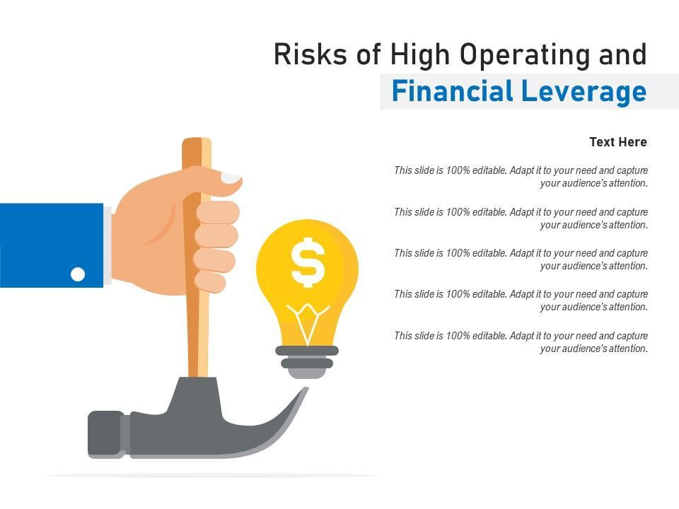

In today's dynamic financial landscape, understanding the nuances of leverage and risk management is crucial for both companies and investors. Leveraging in finance involves using borrowed capital to increase the potential return of an investment, which can be a powerful tool for growth but also raises the stakes of financial risk. Financial and operating leverage are two key strategies employed to maximize profitability; financial leverage utilizes debt to expand investment opportunities, while operating leverage focuses on the cost structure of a company's operations. Both strategies, however, carry inherent risks that can lead to significant consequences if not properly managed.

Algorithmic trading introduces additional complexities, making robust risk management frameworks indispensable. As financial markets become increasingly sophisticated, automated trading systems execute transactions at high speeds based on pre-set criteria, amplifying both the potential for profit and the risk of loss. This context places greater emphasis on understanding how financial leverage, operating leverage, and risk management intersect, particularly when incorporating algorithmic trading strategies.

This article explores the interplay between these elements, offering insights into how they collectively impact investment outcomes and resilience in variable market conditions. Through this exploration, the goal is to highlight the importance of informed decision-making and strategic risk management to harness leverage effectively, ensuring sustainable growth and stability for stakeholders.

## Table of Contents

## Understanding Financial Leverage

Financial leverage involves the strategic use of borrowed funds to enhance the potential returns on investments. This approach allows companies to acquire additional assets and expand operations without needing to raise new equity capital. By opting for debt, companies aim to generate a higher return on equity, thereby enhancing shareholder value. However, the use of financial leverage carries inherent financial risks, primarily associated with the obligation to meet fixed debt payments regardless of business performance.

Two key metrics to assess a company's financial leverage are the leverage ratio and the debt-to-equity ratio. The leverage ratio measures the proportion of a company's assets that are financed by debt. It is calculated as:

$$
\text{Leverage Ratio} = \frac{\text{Total Debt}}{\text{Total Assets}}
$$

On the other hand, the debt-to-equity ratio compares a company's total liabilities to its shareholder equity, serving as an indicator of financial health and balance:

$$
\text{Debt-to-Equity Ratio} = \frac{\text{Total Liabilities}}{\text{Shareholders' Equity}}
$$

A higher debt-to-equity ratio indicates a higher degree of financial leverage. Companies that effectively manage their leverage ratios can benefit from increased profitability. For example, taking on debt at a lower [interest rate](/wiki/interest-rate-trading-strategies) and investing in projects with a higher rate of return can amplify profits. This is often referred to as the positive leverage effect.

However, excessive financial leverage can lead to significant risks, including the potential for default or bankruptcy. High levels of debt increase a company's fixed expenses in the form of interest payments, which can strain cash flow, especially during economic downturns or periods of reduced sales. The risk of financial distress is heightened when the leverage used does not align with the company's ability to generate sufficient returns on the investment.

Therefore, it is crucial for businesses to align their financial leverage strategies with their overall business goals and the expectations of their investors. This alignment ensures that the use of debt enhances rather than jeopardizes shareholder value. Companies must conduct thorough financial analysis and scenario planning to ensure leverage levels are sustainable. This includes considering the impact of potential interest rate changes, fluctuating market conditions, and business cycle dynamics on their financial obligations. By doing so, businesses can strategically use financial leverage to maximize benefits while mitigating inherent risks.

## Decoding Operating Leverage

Operating leverage is a fundamental concept in financial analysis, reflecting how revenue variations impact a company's operating income. It quantifies the proportion of fixed costs in a company's cost structure compared to variable costs. High operating leverage indicates a company has significant fixed costs, such as salaries, rent, and equipment maintenance, relative to its variable costs. This cost structure implies that as sales increase, operating income increases at a higher rate, potentially leading to significantly greater profits. Conversely, if sales decrease, the fixed costs remain constant, potentially leading to substantial losses.

To compute operating leverage, the degree of operating leverage (DOL) is used, which can be expressed as:

$$
\text{DOL} = \frac{\text{Percentage Change in EBIT}}{\text{Percentage Change in Sales}}
$$

where EBIT stands for Earnings Before Interest and Taxes. A higher DOL signifies greater operating leverage.

In volatile markets, a high operating leverage carries inherent risks. For instance, a small decrease in sales can cause a sharp decline in operating income, affecting the company's financial stability. Consequently, the management needs to understand the cost structure deeply to use operating leverage advantageously without exposing the company to excessive risk.

The distinction between fixed and variable costs becomes crucial when evaluating a company’s resilience. Companies with high operating leverage are more susceptible to economic downturns, as they must meet their fixed commitments regardless of revenue fluctuations. Conversely, during economic upswings, such companies can benefit from the rapid growth in operating income, as their fixed costs leverage sales to higher profitability.

In strategically employing operating leverage, businesses assess their cost structure's impact on profitability and risk. Adjusting this leverage involves changing the proportion of fixed to variable costs, often through outsourcing, leasing, or automating processes to convert fixed costs into variable ones where feasible.

Effectively managing operating leverage allows firms to prepare and strategize for various economic conditions. Those that harness the power of operating leverage while maintaining prudent risk management practices can more adeptly navigate economic shifts and position themselves for long-term success.

## The Role of Risk Management in Leveraged Strategies

In finance, leveraging strategies can significantly enhance investment returns by utilizing borrowed funds. However, these strategies also amplify risks, necessitating effective risk management to ensure sustainability and protect capital, particularly in volatile markets. Risk management identifies, analyzes, and mitigates threats, converting potential adverse impacts into manageable challenges.

One fundamental aspect of risk management is determining potential risks and measuring the impact of leveraging. This requires a constant process of assessment, including the use of sophisticated financial models to predict potential outcomes under various scenarios. By thoroughly evaluating the risk-to-reward ratio, investors can make informed decisions regarding the extent of leverage they are willing to employ.

Key strategies for managing risk in leveraged investments include setting stop-loss limits, which automatically trigger asset liquidation when prices fall to a predetermined level. This approach helps cap losses and preserve capital, acting as a proactive measure against unexpected market downturns. Additionally, diversification is a pivotal strategy, allowing investors to spread their investments across different asset classes or sectors, thereby reducing exposure to any single market fluctuation.

Continuous monitoring of investments is another critical component. With the advent of technology, real-time analytics and monitoring systems have become increasingly accessible, providing constant updates on market conditions and enabling quick responses to changes. Such systems are particularly useful in [algorithmic trading](/wiki/algorithmic-trading), where decisions must be executed rapidly to capitalize on market opportunities or avoid potential losses.

Balancing leverage with risk also involves adapting to evolving market conditions. This requires a flexible approach whereby leverage levels are continuously aligned with current economic indicators and market trends. A dynamic strategy ensures that investors can recalibrate their portfolio leverage to manage risks effectively, maintaining an optimal risk-return balance.

Robust risk management practices are especially crucial in algorithmic trading and other leverage-intensive sectors. Algorithmic trading, characterized by high-speed transactions and complex data analysis, inherently carries heightened operational and market risks. Implementing fail-safes, ensuring adherence to regulatory standards, and building flexibility into trading algorithms are essential measures to minimize risks in such environments. By employing robust risk management frameworks, traders and investors can mitigate the adverse effects of leverage and maintain stability across their investments.

## Algorithmic Trading and Risk Management

Algorithmic trading stands as a pivotal innovation in modern financial markets, leveraging the power of automated systems to execute pre-defined trading strategies with remarkable speed and precision. Such systems utilize algorithms—sets of defined rules and instructions—to make trading decisions, often in milliseconds or microseconds, allowing for the rapid processing of large volumes of data and execution of trades at optimal prices. While algorithmic trading offers significant efficiencies, it inevitably exacerbates both market and operational risks.

**Market Risks and Operational Risks**

Algorithmic trading inherently amplifies market risks due to its ability to execute vast quantities of transactions in very short timeframes. This rapidity can contribute to market [volatility](/wiki/volatility-trading-strategies), particularly in events where algorithms react to the same signals or news. As noted during instances of market flash crashes, small errors or unexpected market conditions can lead to significant disruptions.

Additionally, operational risks are pronounced in algorithmic trading. These pertain to the technical failures or errors in the automated systems, such as glitches in the algorithm, connectivity issues, or inadequate system responses to atypical market conditions. Such operational failures can result in substantial financial loses and undermine market integrity.

**Risk Management Strategies**

Effective risk management in algorithmic trading is paramount to mitigating these risks. Key components of a robust risk management framework include:

1. **Real-Time Monitoring**: Continuous surveillance of trading activities and market conditions is essential. Real-time data analytics can provide insights into system performance and allow for instantaneous identification of anomalies. Monitoring tools can also ensure compliance with regulatory requirements and help in swiftly addressing erroneous trades.

2. **Fail-Safes**: Implementing fail-safes, such as circuit breakers and automated halt mechanisms, can prevent escalation of errors. These systems automatically stop trading when predefined conditions are breached, thereby limiting potential losses and further market turmoil.

3. **Regulatory Compliance**: Adherence to regulatory requirements is crucial. Rules often stipulate capital requirements, risk disclosures, and trading limitations that must be incorporated into the algorithmic framework to ensure both compliance and market integrity.

**Flexibility and Technology Usage**

Algorithmic trading strategies must be inherently flexible to accommodate the ever-changing dynamics of global financial markets. Algorithms should be adaptable, with models regularly updated to reflect new data, market sentiment, and emerging trends. Advanced [machine learning](/wiki/machine-learning) techniques can enhance the adaptability of trading algorithms, allowing systems to learn from past data and improve decision-making processes.

The effective use of state-of-the-art technology and analytics plays a critical role in risk management. High-performance computing systems and distributed computing platforms can process complex calculations and data analysis rapidly. Furthermore, utilizing robust data encryption and cybersecurity measures protects sensitive trading data from cyber threats, which are increasingly prevalent.

In summary, while algorithmic trading offers substantial advantages in terms of speed and efficiency, it necessitates a comprehensive risk management framework. By addressing market and operational risks through real-time monitoring, implementing fail-safes, ensuring regulatory adherence, and leveraging advanced technology, stakeholders can safeguard their investments and contribute to the stability of financial markets.

## Conclusion

Understanding and managing the risks associated with financial and operating leverage is essential for success in modern finance. Both forms of leverage can amplify profits, but they also increase the potential for significant losses. Therefore, deploying these strategies requires a comprehensive approach that balances the risks with potential rewards.

Aligning leverage strategies with robust risk management helps secure sustainable growth and business continuity. Effective risk management involves continuous monitoring and the implementation of protective measures such as diversification, setting stop-loss limits, and hedging. These practices are crucial to navigate the complexities and volatilities of financial markets.

Algorithmic trading, while advantageous for its speed and efficiency, demands sophisticated risk assessment and control mechanisms. Real-time data analysis, combined with automated systems, can mitigate operational risks but also require fail-safes and adherence to regulatory compliance. Traders and firms must ensure that their systems are agile and capable of adapting to rapid market changes to prevent potential financial pitfalls.

Investors and companies must stay informed and continuously adapt to technological advancements and market developments. This proactive stance ensures that they are well-positioned to capitalize on opportunities while effectively managing risks associated with leveraged strategies. Awareness of the latest tools and methodologies in risk management and leveraging financial technologies is crucial for maintaining a competitive edge.

Through informed decision-making and strategic risk management, stakeholders can effectively harness leverage for optimal outcomes. By understanding the interplay between financial and operational leverage within dynamic markets, businesses and investors can enhance their resilience and capability to generate sustainable returns. These efforts underscore the importance of maintaining a delicate balance between seeking returns and safeguarding against potential downturns.

## References & Further Reading

[1]: Modigliani, F., & Miller, M. H. (1958). ["The Cost of Capital, Corporation Finance and the Theory of Investment."](https://www.semanticscholar.org/paper/The-Cost-of-Capital%2C-Corporation-Finance-and-the-of-Miller/81c84afa78c3445b783db0b9dbec3b70f2cb3a19) American Economic Review, 48(3), 261-297.

[2]: Graham, B., & Dodd, D. L. (1934). ["Security Analysis."](https://books.google.com/books/about/Security_Analysis_The_Classic_1934_Editi.html?id=wXlrnZ1uqK0C) Whittlesey House.

[3]: Lintner, J. (1965). ["The Valuation of Risk Assets and the Selection of Risky Investments in Stock Portfolios and Capital Budgets."](https://www.sciencedirect.com/science/article/pii/B9780127808505500186) The Review of Economics and Statistics, 47(1), 13-37.

[4]: Hull, J. C. (2018). ["Risk Management and Financial Institutions."](https://books.google.com/books/about/Risk_Management_and_Financial_Institutio.html?id=1J1QDwAAQBAJ) Wiley.

[5]: Fabozzi, F. J., & Drake, P. P. (2009). ["Finance: Capital Markets, Financial Management, and Investment Management."](https://books.google.com/books/about/Finance.html?id=mUBsAwAAQBAJ) Wiley.

[6]: Chan, E. P. (2009). ["Quantitative Trading: How to Build Your Own Algorithmic Trading Business."](https://github.com/ftvision/quant_trading_echan_book) Wiley.