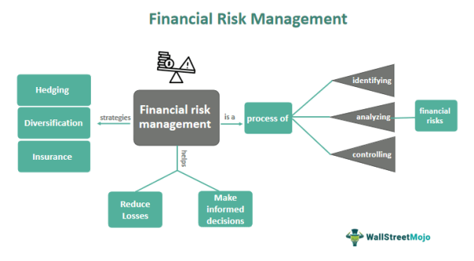

In today's fast-paced financial markets, effectively managing market risks is essential, particularly with the growing prevalence of algorithmic trading. This article focuses on the intrinsic challenges posed by market risk within the context of algorithmic trading. The significance of understanding different risk categories—systemic, non-systemic, and operational—has never been more critical. As algorithms increasingly influence trading practices, the mastery of risk management strategies becomes indispensable for both traders and investors.

Systemic risk, which impacts entire sectors or financial systems, and non-systemic risk, specific to individual companies or industries, require differentiated approaches for mitigation. The rise of algorithmic trading necessitates an acute awareness of risk typologies. Volatility, often perceived as a risk indicator, can profoundly affect portfolios, driving the need for strategies that not only manage spikes but, when possible, exploit them. The understanding of counterparty risk, especially in derivative transactions, is crucial to preventing significant financial losses.

This article will also uncover how systematic methodologies in algorithmic trading, such as hedging and diversification, can act as buffers against potential financial calamities. By integrating comprehensive risk management frameworks, traders and investors can better balance potential returns with the inherent risks associated with financial markets powered by automation. By the conclusion of this piece, readers will gain insightful perspectives on aligning trading strategies with broader market safety and achieving optimal financial performance through automation.

## Table of Contents

## Understanding Financial Market Risks

Financial markets are characterized by a diverse set of risks that necessitate comprehensive understanding and strategic management. These risks include default risk, counterparty risk, interest rate risk, and systemic risk, each posing unique challenges to traders and investors.

**Default Risk:** This refers to the likelihood that a borrower will fail to meet its obligations in accordance with agreed terms. Default risk is particularly pertinent in bond markets and credit derivatives, where the anticipation of a borrower default can significantly affect investment returns. Credit ratings provided by agencies like Moody’s and Standard & Poor’s offer insights into the default risk associated with specific securities.

**Counterparty Risk:** This type of risk is especially relevant in derivative trading and occurs when one party in a financial transaction may not fulfill their contractual obligations. Counterparty risk can result in considerable financial loss if not adequately managed. Strategies such as netting (offsetting positions) and collateralization (requiring security for transactions) are common approaches to mitigate this risk.

**Interest Rate Risk:** Fluctuations in interest rates can affect the value of financial instruments. For instance, rising interest rates can lead to declining bond prices, impacting fixed-income portfolios. To manage interest rate risk, traders might implement hedging strategies using interest rate derivatives such as swaps and options.

**Systemic Risk:** Systemic risk pertains to the potential collapse of an entire financial system or market, often triggered by the failure of a major entity or a significant economic disturbance. Such risk is more difficult to predict and manage due to its broader implications. It necessitates macroprudential supervision and regulatory interventions to ensure financial stability.

**Volatility:** Volatility is commonly used as a proxy for risk in financial markets, reflecting the degree of variation in the price of a financial instrument over time. High volatility can result in substantial gains or losses, making it essential for investors to adopt strategies like diversification or options trading to either capitalize on or protect against volatility spikes.

The formula to calculate [volatility](/wiki/volatility-trading-strategies) typically employs the standard deviation of returns:

$$

\sigma = \sqrt{\frac{1}{N-1} \sum_{i=1}^{N} (R_i - \bar{R})^2} 
$$

where $\sigma$ represents the volatility, $N$ is the number of observations, $R_i$ is the return of the i-th period, and $\bar{R}$ is the mean return.

**Non-Systemic Risk (Specific Risk):** Unlike systemic risk, non-systemic risk affects specific companies or industries. This type of risk can be alleviated through diversification, where investments are spread across various assets to reduce the impact of any single asset's poor performance.

In managing these risks, understanding their nature and employing targeted strategies are crucial for market participants seeking to safeguard their investments against potential financial damage. By adopting proactive measures, investors can better navigate the complexities and uncertainties inherent in financial markets.

## Algorithmic Trading and Systemic Risks

Algorithmic trading, often referred to as algo trading, is characterized by the use of sophisticated algorithms to execute trades at high velocities. This method, while optimizing trading efficiency and execution, inadvertently contributes to systemic risks in financial markets. Systemic risk refers to the potential collapse or serious harm to an entire financial system or market, as opposed to risks associated with individual entities. Algo trading, due to its nature of executing large volumes of transactions at extraordinary speeds, can amplify such risks if not properly managed.

One major incident that illustrates the amplification of systemic risks by [algorithmic trading](/wiki/algorithmic-trading) is the "Flash Crash" of May 6, 2010. During this event, the Dow Jones Industrial Average plummeted by nearly 1,000 points within a very short timeframe, only to recover those losses minutes later. The crash was later attributed to a high-frequency trading algorithm executing a massive sell order, which created a domino effect on trading algorithms throughout the market. The incident showcased how lapses in algorithm design or execution strategies can lead to market-wide disturbances.

The core issue in such scenarios often stems from the feedback loops generated by trading algorithms. Algorithms typically react to market data, and if multiple algorithms respond to the same data or price movements in similar ways, this can lead to exponential increases in market volatility. 

To mitigate the risks associated with algorithmic trading, robust risk management strategies must be implemented. These strategies include regular stress testing of algorithms under various market conditions, implementing circuit breakers to temporarily halt trading in cases of extreme volatility, and monitoring for abnormal trading patterns that could indicate malfunctioning algorithms.

Algorithm control mechanisms, such as dynamic re-calibration of parameters, play a crucial role in this risk management approach. For example, algorithms can be programmed to adjust their trading intensity based on real-time market [liquidity](/wiki/liquidity-risk-premium) to prevent them from overwhelming the market. These measures help ensure that the algorithms adapt to prevailing market conditions, minimizing the risk of exacerbating systemic market events.

In conclusion, while algorithmic trading offers numerous benefits such as increased market efficiency and liquidity, it also poses significant systemic risks. By employing robust and adaptive risk management strategies, traders and investors can mitigate these risks, ensuring that the advantages of high-speed trading do not come at the expense of market stability.

## Mitigating Market Risks Through Algo Trading

In algorithmic trading, risk management is crucial for navigating the complex and unpredictable financial markets. Several strategies exist to mitigate market risks, including hedging, diversification, and setting stop-loss and take-profit orders.

Hedging involves taking opposing positions in related markets to offset potential losses. For example, a trader might invest in a stock and also purchase a put option to hedge against declines in that stock's price. This strategy helps protect against volatility and unforeseen market movements.

Diversification is another fundamental strategy, which involves spreading investments across various asset classes to reduce exposure to any single asset's risk. By diversifying, traders can mitigate the impact of a negative event affecting a particular sector or asset.

Implementing stop-loss and take-profit orders ensures that trades [exit](/wiki/exit-strategy) at predetermined price points, limiting losses and securing profits. These orders act as safety nets, providing automatic execution based on market conditions, thus reducing emotional bias in decision-making.

Effective risk management also requires setting clear investment goals and regularly monitoring trading strategies. Traders should assess their risk tolerance and tailor their algorithms accordingly. Continuous evaluation and adaptation of strategies to current market conditions are necessary for maintaining effective risk management. Algorithms must be adjusted smartly to capitalize on market trends and avoid potential pitfalls.

Several tools are available to aid in mitigating risks. Trailing stops, for instance, allow a stop-loss order to move with the market price, locking in profits while reducing downside exposure. Dynamic position sizing adjusts the amount invested in a trade based on predetermined risk levels, optimizing capital allocation. Additionally, portfolio rebalancing ensures asset allocations remain aligned with risk management objectives, preventing overexposure to any single asset.

In conclusion, mitigating market risks through algorithmic trading involves a comprehensive approach combining strategic planning with advanced tools to navigate market complexities. By employing these techniques, traders can better manage their investments, balancing potential returns against inherent market risks.

## Operational and Behavioral Risks in Algo Trading

Algorithmic trading, a cornerstone of modern financial markets, is not without its vulnerabilities, particularly when assessing operational and behavioral risks. Understanding these risks is critical for maintaining the integrity and efficiency of trading systems.

Operational risks in algorithmic trading encompass a wide array of potential failures, predominantly stemming from technological issues. These can include hardware malfunctions, software bugs, data inaccuracies, and network disruptions. Each of these elements plays a critical role in executing trades correctly and timely. For instance, a delay in data feeds can lead to trading on outdated information, resulting in significant financial losses. To mitigate such risks, traders employ robust technology frameworks that ensure system resilience and reliability. Regular system updates and stress testing are essential practices to address potential vulnerabilities. Furthermore, redundancy mechanisms—such as backup servers and failover systems—are crucial for minimizing downtime and ensuring continuous availability.

Behavioral risks in algorithmic trading are primarily linked to cognitive biases and emotional influences, which can lead to irrational decision-making. Despite the ostensibly objective nature of algorithmic systems, the design and oversight process is susceptible to human biases. For example, overconfidence in a trading algorithm's predictive power can result in excessive risk-taking. To counteract this, a disciplined trading approach is necessary, one that includes setting predefined risk limits and adhering to systematic, rules-based strategies. Traders should also employ algorithmic adjustment protocols that recalibrate models based on market conditions, thereby reducing the impact of behavioral bias.

Overall, managing operational and behavioral risks necessitates a comprehensive strategy that combines technological rigor with disciplined oversight. By implementing robust risk management measures, traders can enhance the reliability of their algorithmic systems and align their trading practices with prudent financial management objectives.

## The Importance of Regulatory Compliance and Market Integrity

With increasing regulatory scrutiny, algorithmic trading firms are compelled to prioritize compliance to avoid potential legal and financial ramifications. Regulatory bodies worldwide, including the U.S. Securities and Exchange Commission (SEC) and the European Securities and Markets Authority (ESMA), have implemented stringent measures aimed at overseeing algorithmic trading activities. Compliance with these regulations ensures that trading practices are transparent, fair, and aligned with the broader objectives of market stability.

Maintaining market integrity is essential for sustaining investor confidence, especially in the context of the occasional volatility introduced by algorithmic trades. Incidents like the Flash Crash of 2010, where rapid high-frequency trading led to a temporary market collapse, highlight the need for robust compliance frameworks. By adhering to regulatory standards, trading firms can mitigate the risks associated with such incidents, thereby preserving the structural integrity of financial markets.

Compliance in the context of algorithmic trading involves several key components. These include adhering to guidelines on transparency, which mandate clear and thorough reporting of trading activities. This transparency helps regulators and other market participants understand the impact of algorithmic strategies and transactions on market dynamics. Moreover, reporting standards are crucial for ensuring that trading firms provide accurate and timely information, allowing for effective monitoring and intervention if necessary.

Ethical trading practices are another cornerstone of regulatory compliance. Firms are expected to avoid activities that could manipulate market conditions or harm other investors. Implementing strong internal controls to enforce ethical trading is critical, encompassing areas such as preventing market abuse and conflicts of interest.

In summary, for algorithmic trading firms, a commitment to regulatory compliance is not just a legal obligation but a fundamental business strategy. By respecting and adhering to regulatory guidelines, these firms not only safeguard themselves against legal consequences but also contribute to a fair, orderly, and transparent financial marketplace. Adopting responsible trading practices enhances the trust investors place in electronic trading environments, thereby fostering a secure and robust market infrastructure.

## Conclusion

In today's rapidly evolving financial markets, risk management has become an indispensable aspect of harnessing the full potential of algorithmic trading. The rise of automated trading systems underscores the necessity for robust frameworks that can effectively manage the multitude of risks associated with these technologies. Comprehensive risk management frameworks are vital as they equip traders and investors with the tools needed to confidently navigate the complexities inherent in modern financial landscapes.

Algorithmic trading, with its inherent speed and efficiency, offers significant advantages in executing trades. However, these benefits are accompanied by a proportionate increase in risk exposure, particularly concerning systemic, operational, and behavioral risks. To mitigate these potential downsides, traders must integrate sophisticated risk management strategies that are both proactive and adaptive. This includes employing techniques such as diversification, hedging, and the strategic use of protective trading orders like stop-loss and take-profit limits. 

Furthermore, implementing rigorous monitoring and periodic adjustment of trading algorithms ensures that these systems align with real-time market conditions, thereby safeguarding against unforeseen market events and anomalies. The use of advanced analytics and [machine learning](/wiki/machine-learning) models can also offer predictive insights, enabling preemptive risk mitigation. For instance, algorithms could be designed to dynamically adjust trading parameters based on volatility forecasts or market sentiment analysis, allowing for a more responsive risk management approach.

Additionally, regulatory compliance and maintaining market integrity are critical elements that support the secure deployment of algorithmic strategies. Adhering to established guidelines and ethical standards not only protects traders from legal repercussions but also upholds the trust and stability within financial systems. 

Mathematically, optimizing a trading strategy could involve risk functions $R(x)$, where $x$ represents the trade parameters subject to optimization under constraints reflecting market conditions and regulatory requirements. Through iterative processes, such as Monte Carlo simulations or optimization algorithms like gradient descent, traders can fine-tune $x$ to achieve an optimal balance between risk and reward.

In conclusion, the effective integration of comprehensive risk management frameworks in algorithmic trading not only mitigates potential risks but also ensures that trading activities are conducted with an alignment towards broader market safety objectives. As financial technologies and markets continue to evolve, these frameworks provide the foundation for sustained success and confidence in trading activities.

## References & Further Reading

[1]: Hull, J. C. (2018). ["Options, Futures, and Other Derivatives."](https://www.semanticscholar.org/paper/Options%2C-Futures%2C-and-Other-Derivatives-Hull/89bdee500c8623864fc9eb7a471546aa713acc44) Pearson Education.

[2]: Lopez de Prado, M. (2018). ["Advances in Financial Machine Learning."](https://www.amazon.com/Advances-Financial-Machine-Learning-Marcos/dp/1119482089) Wiley.

[3]: Chan, E. (2009). ["Quantitative Trading: How to Build Your Own Algorithmic Trading Business."](https://github.com/ftvision/quant_trading_echan_book) Wiley.

[4]: Aldridge, I. (2013). ["High-Frequency Trading: A Practical Guide to Algorithmic Strategies and Trading Systems."](https://www.amazon.com/High-Frequency-Trading-Practical-Algorithmic-Strategies/dp/1118343506) Wiley.

[5]: Aronson, D. R. (2007). ["Evidence-Based Technical Analysis: Applying the Scientific Method and Statistical Inference to Trading Signals."](https://onlinelibrary.wiley.com/doi/book/10.1002/9781118268315) Wiley.