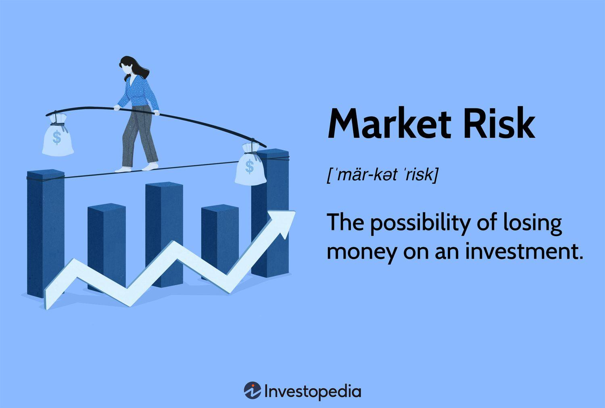

## Table of Contents

## What are financial markets and why are they important?

Financial markets are places where people and businesses can buy and sell things like stocks, bonds, and other financial products. They help connect people who have money to invest with those who need money to start or grow their businesses. Think of it like a big marketplace where money moves around to help the economy grow.

These markets are important because they help the economy run smoothly. They make it easier for companies to get the money they need to expand, which can lead to more jobs and better products for everyone. They also give people a way to save and invest their money, which can help them plan for the future, like buying a house or retiring. Without financial markets, it would be much harder for the economy to grow and for people to achieve their financial goals.

## What is risk in the context of financial markets?

Risk in financial markets is the chance that you might lose some or all of your money when you invest. When you put your money into stocks, bonds, or other investments, there's no guarantee that you'll get it back. The value of these investments can go up or down because of many things, like how well a company is doing, changes in the economy, or even big events around the world.

To understand risk, think of it like playing a game. If you bet on a team to win, there's a risk they might lose, and you could lose your bet. In the same way, when you invest, you're betting on a company or an asset to do well. The more risk you take, the bigger the potential reward can be, but there's also a bigger chance you could lose money. That's why it's important to think carefully about how much risk you're willing to take before you invest.

## Can you explain the difference between systematic and unsystematic risk?

Systematic risk is the kind of risk that affects the whole market or a big part of it. It's also called market risk. This type of risk comes from things that are hard to control, like changes in the economy, interest rates, or big events like a global crisis. Because it affects everything, you can't get rid of systematic risk by just choosing different investments. It's like a storm that hits all boats in the ocean, no matter where they are.

Unsystematic risk, on the other hand, is the risk that comes from a specific company or industry. It's also called specific risk. This type of risk can come from things like bad management, a product failing, or a company getting sued. The good thing about unsystematic risk is that you can reduce it by spreading your investments across different companies and industries. It's like having several boats in different parts of the ocean; if one boat sinks, the others might still be okay.

## What are some common types of financial risks beginners should know about?

When you start investing, it's good to know about different types of financial risks. One common type is market risk, which is when the whole market goes down and affects all your investments. This can happen because of big events like a recession or changes in interest rates. Another type is credit risk, which is the chance that a company you've invested in might not be able to pay back its debts. This can happen if the company is not doing well financially.

Another important risk to know about is [liquidity](/wiki/liquidity-risk-premium) risk. This is when you can't easily sell your investment without losing money. For example, if you need to sell a stock quickly but no one wants to buy it, you might have to sell it for less than you paid. Lastly, there's inflation risk, which is when the value of money goes down over time. If the prices of things go up faster than your investments grow, your money won't be worth as much in the future. Understanding these risks can help you make better choices when you invest.

## How does market volatility affect investment risk?

Market volatility means how much and how quickly the prices in the financial market can change. When the market is volatile, it can go up and down a lot in a short time. This can make investing riskier because the value of your investments can change a lot, too. If you need to sell your investments during a time when the market is going down, you might lose money. So, high volatility can make the risk of losing money bigger.

But market volatility isn't always bad. Sometimes, it can give you chances to buy investments at lower prices when the market goes down. If you can wait and don't need to sell right away, you might be able to make more money when the market goes back up. The key is to understand that volatility can affect your investments and to think about how much risk you're okay with before you invest.

## What role do interest rates play in financial market risks?

Interest rates are really important in financial markets because they can change how much risk there is. When interest rates go up, it usually means that borrowing money gets more expensive. This can slow down the economy because businesses might not want to borrow as much to grow. If the economy slows down, the value of stocks and other investments might go down, which increases the risk for investors. On the other hand, when interest rates go down, borrowing money becomes cheaper, and this can make the economy grow faster. But if rates are too low for a long time, it can lead to too much borrowing and create a bubble that might burst later, adding more risk.

Another way interest rates affect risk is through bonds. When interest rates go up, the value of existing bonds usually goes down because new bonds will pay more interest. This means if you own bonds and need to sell them when rates are up, you might get less money than you expected, which is a type of risk called [interest rate](/wiki/interest-rate-trading-strategies) risk. Also, if rates are low, people might look for riskier investments to get a better return, which can make the whole market more risky. So, interest rates are a big part of the puzzle when it comes to understanding and managing financial market risks.

## How can inflation impact the risks in financial markets?

Inflation is when the prices of things go up over time. It can make the money you have worth less. In financial markets, inflation can be a big risk because it can change how much your investments are worth. If the prices of things go up faster than your investments grow, you might not be able to buy as much with your money in the future. This is called inflation risk. For example, if you save money in a bank account that doesn't pay much interest, and inflation goes up a lot, the money you saved won't buy as much later.

Inflation can also make other types of risks worse. When inflation is high, central banks might raise interest rates to try to slow it down. Higher interest rates can make borrowing more expensive, which can slow down the economy. If the economy slows down, the value of stocks and other investments might go down, which increases the risk for investors. On the other hand, if inflation is very low or even negative, it can make people less willing to spend and invest, which can also hurt the economy and increase risk in different ways. So, inflation is something investors need to keep an eye on because it can affect many parts of the financial markets.

## What are derivatives and how do they contribute to financial market risks?

Derivatives are financial products that get their value from something else, like stocks, bonds, or even things like oil or gold. They can be used to bet on whether the price of these things will go up or down. For example, you might buy a derivative that pays you if the price of oil goes up, without actually owning any oil. Derivatives can be useful because they let people manage risk. If you're worried that the price of something you own might go down, you can use a derivative to protect yourself.

But derivatives can also make financial market risks bigger. Because they're based on the price of other things, they can be really complicated and hard to understand. If lots of people are betting on the same thing with derivatives, and they're wrong, it can cause big problems. For example, if everyone thinks the price of oil will go up and it doesn't, a lot of people could lose money at the same time. This can make the whole market go down and create more risk for everyone. So while derivatives can help manage risk, they can also make things more risky if they're not used carefully.

## How do global economic events influence risk in financial markets?

Global economic events can have a big impact on the risks in financial markets. When something big happens in one part of the world, like a country having a financial crisis or a war breaking out, it can make people worried about their money everywhere. This worry can make stock prices go down and cause more ups and downs in the market. For example, if a big country like the United States has a problem with its economy, it can affect other countries that do a lot of business with it. This can make the whole world's economy feel the effects, and investors might see their money go down in value.

Another way global events can change risk is by making it harder for companies to do business. If there's a big event that disrupts trade, like new rules that make it harder to sell things to other countries, companies might make less money. This can make their stock prices go down, which increases the risk for people who own those stocks. Also, events like natural disasters or pandemics can stop businesses from working normally, which can make the whole economy less stable. So, keeping an eye on what's happening around the world is important for understanding and managing the risks in financial markets.

## What are some advanced risk management strategies used by experts in financial markets?

Experts in financial markets often use a strategy called diversification to manage risk. This means they spread their money across different types of investments, like stocks, bonds, and real estate, so that if one investment goes down, the others might still do well. It's like not putting all your eggs in one basket. They also look at how different investments move together, called correlation. If they find investments that don't move in the same way, they can mix them to make their overall risk lower. This way, they can protect their money from big losses.

Another advanced strategy is hedging, which is like buying insurance for your investments. Experts might use financial products called derivatives to hedge their risks. For example, if they own a stock and they're worried its price might go down, they can buy a derivative that pays them if the stock price does fall. This can help them limit their losses. They also use something called [value at risk](/wiki/var-value-at-risk) (VaR) to figure out how much money they might lose in a bad situation. By knowing this, they can plan better and make smarter choices about where to put their money.

## Can you discuss the concept of risk-adjusted returns and its importance?

Risk-adjusted returns are a way to see how well an investment is doing when you think about the risk involved. It's like looking at how much money you made, but also thinking about how much you could have lost. This is important because two investments might make the same amount of money, but one might be a lot riskier. By looking at risk-adjusted returns, you can see which investment is really better because it gives you more reward for the risk you're taking.

Understanding risk-adjusted returns helps investors make smarter choices. If you only look at how much money an investment made, you might pick something that's too risky. But if you look at the risk-adjusted return, you can find investments that give you a good reward without taking too much risk. This can help you build a portfolio that grows over time while keeping your money safe.

## How has technology, such as AI and machine learning, changed the approach to managing risks in financial markets?

Technology, like AI and [machine learning](/wiki/machine-learning), has changed how people manage risks in financial markets by making it easier and faster to look at a lot of information. Before, people had to go through piles of data by hand, which took a lot of time and could miss important details. Now, AI can quickly find patterns and make predictions based on huge amounts of data. This helps investors see risks they might not have noticed before and make better choices about where to put their money.

AI and machine learning also help by making trading and risk management more automatic. For example, AI can keep an eye on the market all the time and make trades to protect investments if it sees a risk coming. This can happen much faster than a person could do it. Also, these technologies can learn from past mistakes and get better over time, which means they can keep improving how they manage risks. So, technology has made managing risks in financial markets more accurate and efficient, helping investors protect their money better.

## What is the key to understanding financial market risks?

Financial markets are characterized by a diverse set of risks that necessitate comprehensive understanding and strategic management. These risks include default risk, counterparty risk, interest rate risk, and systemic risk, each posing unique challenges to traders and investors.

**Default Risk:** This refers to the likelihood that a borrower will fail to meet its obligations in accordance with agreed terms. Default risk is particularly pertinent in bond markets and credit derivatives, where the anticipation of a borrower default can significantly affect investment returns. Credit ratings provided by agencies like Moody’s and Standard & Poor’s offer insights into the default risk associated with specific securities.

**Counterparty Risk:** This type of risk is especially relevant in derivative trading and occurs when one party in a financial transaction may not fulfill their contractual obligations. Counterparty risk can result in considerable financial loss if not adequately managed. Strategies such as netting (offsetting positions) and collateralization (requiring security for transactions) are common approaches to mitigate this risk.

**Interest Rate Risk:** Fluctuations in interest rates can affect the value of financial instruments. For instance, rising interest rates can lead to declining bond prices, impacting fixed-income portfolios. To manage interest rate risk, traders might implement hedging strategies using interest rate derivatives such as swaps and options.

**Systemic Risk:** Systemic risk pertains to the potential collapse of an entire financial system or market, often triggered by the failure of a major entity or a significant economic disturbance. Such risk is more difficult to predict and manage due to its broader implications. It necessitates macroprudential supervision and regulatory interventions to ensure financial stability.

**Volatility:** Volatility is commonly used as a proxy for risk in financial markets, reflecting the degree of variation in the price of a financial instrument over time. High volatility can result in substantial gains or losses, making it essential for investors to adopt strategies like diversification or options trading to either capitalize on or protect against volatility spikes.

The formula to calculate [volatility](/wiki/volatility-trading-strategies) typically employs the standard deviation of returns:

$$

\sigma = \sqrt{\frac{1}{N-1} \sum_{i=1}^{N} (R_i - \bar{R})^2} 
$$

where $\sigma$ represents the volatility, $N$ is the number of observations, $R_i$ is the return of the i-th period, and $\bar{R}$ is the mean return.

**Non-Systemic Risk (Specific Risk):** Unlike systemic risk, non-systemic risk affects specific companies or industries. This type of risk can be alleviated through diversification, where investments are spread across various assets to reduce the impact of any single asset's poor performance.

In managing these risks, understanding their nature and employing targeted strategies are crucial for market participants seeking to safeguard their investments against potential financial damage. By adopting proactive measures, investors can better navigate the complexities and uncertainties inherent in financial markets.

## References & Further Reading

[1]: Hull, J. C. (2018). ["Options, Futures, and Other Derivatives."](https://www.semanticscholar.org/paper/Options%2C-Futures%2C-and-Other-Derivatives-Hull/89bdee500c8623864fc9eb7a471546aa713acc44) Pearson Education.

[2]: Lopez de Prado, M. (2018). ["Advances in Financial Machine Learning."](https://www.amazon.com/Advances-Financial-Machine-Learning-Marcos/dp/1119482089) Wiley.

[3]: Chan, E. (2009). ["Quantitative Trading: How to Build Your Own Algorithmic Trading Business."](https://github.com/ftvision/quant_trading_echan_book) Wiley.

[4]: Aldridge, I. (2013). ["High-Frequency Trading: A Practical Guide to Algorithmic Strategies and Trading Systems."](https://www.amazon.com/High-Frequency-Trading-Practical-Algorithmic-Strategies/dp/1118343506) Wiley.

[5]: Aronson, D. R. (2007). ["Evidence-Based Technical Analysis: Applying the Scientific Method and Statistical Inference to Trading Signals."](https://onlinelibrary.wiley.com/doi/book/10.1002/9781118268315) Wiley.