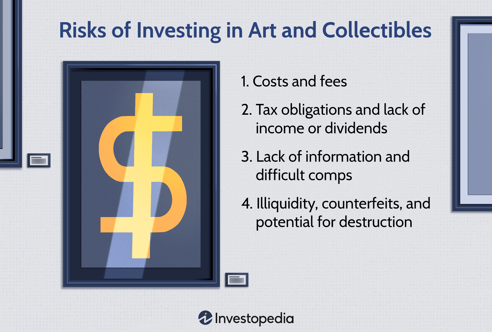

## Table of Contents

## What are art and collectibles as investment options?

Art and collectibles can be good investment options for people who enjoy them. These items include paintings, sculptures, old coins, stamps, and more. When you invest in art or collectibles, you are buying something you like and hoping its value will go up over time. Many people find it fun to collect things they love, and if the items become more valuable, that's a bonus.

However, investing in art and collectibles can be risky. It's hard to know if the value of an item will go up or down. The art market can be unpredictable, and what's popular now might not be popular in the future. Also, it can be hard to sell these items quickly if you need money fast. You might need to wait a long time to find someone willing to buy your art or collectibles at the price you want.

It's important to do a lot of research before investing in art and collectibles. You should learn about the artists, the history of the items, and what makes them valuable. Talking to experts and going to auctions can help you make better decisions. Remember, while art and collectibles can be a fun and potentially profitable investment, they are not as straightforward as stocks or bonds.

## What are the basic risks involved in investing in art and collectibles?

Investing in art and collectibles can be risky because it's hard to predict if the value of these items will go up or down. The art market can change a lot, and what people like now might not be popular later. This means you might buy something thinking it will be worth more in the future, but it could end up being worth less. It's also hard to know if you're paying a fair price for an item because there's no set price like with stocks.

Another risk is that it can be difficult to sell art and collectibles quickly. If you need money fast, you might have to wait a long time to find someone who wants to buy your items at the price you want. This is different from other investments like stocks, where you can usually sell them quickly. Also, you might need to spend money on keeping your art and collectibles safe and in good condition, which adds to the cost of your investment.

Lastly, there's always a chance that you might buy a fake or a forgery. Even experts can sometimes be tricked, so it's important to do a lot of research and maybe even get help from professionals to make sure you're buying something real. All these risks mean that while art and collectibles can be fun to invest in, they're not as simple or safe as other types of investments.

## How does the lack of liquidity affect investments in art and collectibles?

The lack of [liquidity](/wiki/liquidity-risk-premium) in art and collectibles means it can be hard to turn these items into cash quickly. If you need money fast, you might have to wait a long time to find someone who wants to buy your art or collectibles at the price you want. This is different from other investments like stocks, where you can usually sell them quickly and easily. Because of this, art and collectibles are not good choices if you might need your money back soon.

This lack of liquidity can also affect the value of your investment. If you need to sell your art or collectibles quickly, you might have to accept a lower price than you wanted. This can make your investment less profitable or even result in a loss. So, when you invest in art and collectibles, it's important to be ready to hold onto them for a long time and not count on being able to sell them quickly if you need money.

## What role does market volatility play in the art and collectibles market?

Market [volatility](/wiki/volatility-trading-strategies) means that the prices of art and collectibles can change a lot and quickly. This makes it hard to know if your investment will be worth more or less in the future. The art market can be very unpredictable because what people like changes over time. A piece of art that is very popular now might not be as popular in a few years, which can make its value go down. This unpredictability can make investing in art and collectibles risky.

Because of this volatility, it's important to think carefully before buying art or collectibles as an investment. You might buy something thinking it will go up in value, but if the market changes, you could lose money. It's a good idea to only invest in art and collectibles if you really like them and are okay with the chance that they might not be worth more later. This way, even if the market goes down, you still have something you enjoy.

## How can authenticity and provenance issues impact the value of art and collectibles?

Authenticity and provenance are very important when it comes to art and collectibles. If you buy something that turns out to be a fake, it can lose all its value. Even if you paid a lot of money for it, a fake piece of art or collectible is worth much less than a real one. This is why it's important to make sure that what you're buying is real. You might need to get help from experts to check if an item is authentic.

Provenance is the history of who owned an item before you. If an item has a good provenance, it can be worth more money. People like to know where an item came from and who owned it before. If the provenance is not clear or if there are questions about it, the value of the item can go down. It's a good idea to do a lot of research and maybe even get help from professionals to make sure the provenance is good before you buy something.

## What are the costs associated with buying, storing, and insuring art and collectibles?

When you buy art and collectibles, you need to think about the costs that come with them. The first cost is the price you pay to buy the item. This can be a lot of money, especially if the art or collectible is rare or made by a famous artist. But the cost doesn't stop there. You also need to pay for storing your items. This might mean renting a special space or buying equipment to keep them safe. If you have a lot of items, the cost of storage can add up quickly.

Another important cost is insurance. Art and collectibles can be very valuable, so you need to make sure they are protected. Insurance can help you get money back if your items are damaged, lost, or stolen. But insurance can be expensive, especially for very valuable items. You might need to pay a lot every year to keep your art and collectibles insured. All these costs together can make investing in art and collectibles more expensive than you might think at first.

## How do economic conditions influence the art and collectibles market?

Economic conditions can have a big impact on the art and collectibles market. When the economy is doing well, people often have more money to spend on things like art and collectibles. They might be more willing to buy expensive items because they feel confident about their financial future. This can drive up the prices of art and collectibles because there is more demand for them. On the other hand, when the economy is not doing well, people might be more careful with their money. They might not want to spend a lot on art and collectibles because they are worried about their financial situation. This can cause the prices of art and collectibles to go down because there is less demand.

Another way economic conditions can affect the art and collectibles market is through interest rates and investment choices. When interest rates are low, people might look for other places to put their money, like art and collectibles, because they can't get a good return from saving in the bank. This can increase the demand for art and collectibles and push their prices up. But when interest rates are high, people might prefer to keep their money in the bank where they can earn more interest. This can lower the demand for art and collectibles and cause their prices to fall. So, the health of the economy and the choices people make about where to invest their money can really change the art and collectibles market.

## What are the tax implications of investing in art and collectibles?

When you invest in art and collectibles, you need to think about taxes. If you sell your art or collectibles for more money than you paid for them, you have to pay capital gains tax on the profit. This tax can be different depending on how long you owned the item. If you owned it for less than a year, it's a short-term capital gain, and you pay regular income tax on it. If you owned it for more than a year, it's a long-term capital gain, and the tax rate is usually lower. But, if you donate your art or collectibles to a charity, you might be able to get a tax deduction. This can help lower the amount of taxes you have to pay.

Another thing to know is that you can't use art and collectibles to shelter other income from taxes like you can with some other investments. This means you can't use losses from selling art and collectibles to reduce taxes on other income. Also, if you keep your art and collectibles in a retirement account like an IRA, you might have to pay extra taxes and penalties if you take them out before you're old enough. So, it's a good idea to talk to a tax professional to understand all the tax rules and how they can affect your investment in art and collectibles.

## How can one assess the potential for appreciation in art and collectibles?

To assess the potential for appreciation in art and collectibles, you need to look at a few important things. First, think about the artist or the item's history. If the artist is becoming more popular or if the item has a good story behind it, it might go up in value. Also, check what similar items have sold for in the past. This can give you an idea of what people are willing to pay and if the price is going up or down. Talking to experts and going to auctions can help you learn more about what might happen to the value of your art or collectibles.

Another thing to consider is how rare the item is. If there are only a few of them, it might be worth more because it's hard to find. Also, think about what people like right now. Trends in the art world can change, so something that's popular now might not be as popular later. It's a good idea to keep up with what's happening in the art and collectibles market. Remember, it's hard to know for sure if something will go up in value, but by doing your research and thinking about these things, you can make a better guess.

## What strategies can be used to mitigate risks when investing in art and collectibles?

One way to lower the risks when investing in art and collectibles is to do a lot of research. Learn about the artist or the item's history, and check what similar items have sold for in the past. This can help you understand if the item might go up in value. Talking to experts and going to auctions can also give you good information. Another strategy is to only buy things you really like. That way, even if the item doesn't go up in value, you still have something you enjoy.

Another important thing is to think about how long you can keep your investment. Art and collectibles can be hard to sell quickly, so make sure you're okay with holding onto them for a long time. Also, be careful about how much you spend. Don't put all your money into art and collectibles because they can be risky. It's a good idea to spread your money out among different types of investments. This can help protect you if the value of your art or collectibles goes down.

## How do trends and fads affect the long-term value of art and collectibles?

Trends and fads can really change the value of art and collectibles over time. When something becomes very popular, lots of people want to buy it, which can make the price go up a lot. But if the trend changes and people start liking something else, the value of the old trend can go down. For example, if a certain type of art becomes really popular, people might pay a lot for it. But if that style goes out of fashion, it might not be worth as much later on.

Because of this, it's important to think about whether you're buying something because it's a trend or because you really like it. If you buy something just because it's popular right now, you might be disappointed if the trend changes. But if you buy something you love, you won't mind as much if its value goes down because you still have something you enjoy. So, while trends can make art and collectibles more valuable in the short term, they can also make them less valuable in the long term if the trend doesn't last.

## What advanced techniques can be used to analyze and predict the art and collectibles market?

One advanced way to analyze and predict the art and collectibles market is by using data analytics. This means looking at a lot of information about past sales, prices, and trends to find patterns. Special computer programs can help with this. They can look at things like how often certain artists' works are sold, what prices they get, and how those prices change over time. By studying this data, you can make better guesses about which art and collectibles might go up in value in the future. It's like looking at a big puzzle and trying to see where the pieces might fit next.

Another technique is using [artificial intelligence](/wiki/ai-artificial-intelligence) (AI). AI can learn from a lot of information and make predictions based on that. For example, AI can look at pictures of art and compare them to other pictures to see if they are similar. It can also read news and social media to see what people are talking about and what might be the next big thing. This can help you know which artists or types of collectibles are becoming more popular. But even with these advanced techniques, it's still hard to predict the future of the art and collectibles market because it can change a lot.

## What are the differences between traditional and alternative investments in a comparative analysis?

Traditional investments, such as stocks and bonds, have long been regarded as the bedrock of investment portfolios due to their relatively stable nature and potential for reliable returns. Stocks represent ownership in a company and offer dividends and capital appreciation, while bonds are debt securities that pay interest over time. These attributes make traditional investments appealing to risk-averse investors seeking steady income and capital preservation.

In contrast, alternative investments, which include assets like collectibles, art, and [algorithmic trading](/wiki/algorithmic-trading), are characterized by their unpredictability and speculative nature. These investments often lack the historical data available for traditional assets, making their future performance harder to predict. The prices of alternative investments can fluctuate significantly due to factors such as market demand, rarity, and trends, leading to a higher risk profile. For instance, the art market is notably susceptible to trends and economic cycles, which can result in volatile pricing [1].

Understanding the risk-reward profile of each investment is essential for effective diversification. Traditional investments, with their historical track record and data-backed models, generally offer a lower risk-return ratio. Mathematically, this can be expressed using the Sharpe Ratio:

$$
\text{Sharpe Ratio} = \frac{E[R] - R_f}{\sigma}
$$

where $E[R]$ is the expected return, $R_f$ is the risk-free rate, and $\sigma$ is the standard deviation of the portfolio’s excess return. Traditional investments often yield higher Sharpe Ratios due to their lower volatility. In contrast, alternative investments may offer higher potential returns but are associated with greater risks, often resulting in lower Sharpe Ratios.

Investors must carefully evaluate their risk tolerance and financial goals when deciding on traditional versus alternative investments. Risk tolerance reflects an investor's ability to endure market fluctuations, while financial goals pertain to objectives like wealth accumulation or income generation. A young investor may prioritize growth and consider a higher allocation to alternative investments, while a retiree might focus on preservation with a bias toward traditional assets.

In summary, while traditional and alternative investments each present unique opportunities, understanding their distinct characteristics is crucial. A prudent investment strategy often involves a blend of both, tailored to the investor's risk profile and long-term objectives.

**References:**
1. Art Basel and UBS Report. "The Art Market", 2020.
2. Bodie, Zvi, et al. "Investments", McGraw-Hill Education.

## References & Further Reading

[1]: Art Basel and UBS Report. "The Art Market", 2020.

[2]: Bodie, Zvi, et al. "Investments", McGraw-Hill Education.

[3]: Bergstra, J., Bardenet, R., Bengio, Y., & Kégl, B. (2011). ["Algorithms for Hyper-Parameter Optimization."](https://proceedings.neurips.cc/paper/2011/file/86e8f7ab32cfd12577bc2619bc635690-Paper.pdf) Advances in Neural Information Processing Systems 24.

[4]: ["Advances in Financial Machine Learning"](https://www.amazon.com/Advances-Financial-Machine-Learning-Marcos/dp/1119482089) by Marcos Lopez de Prado

[5]: ["Evidence-Based Technical Analysis: Applying the Scientific Method and Statistical Inference to Trading Signals"](https://www.amazon.com/Evidence-Based-Technical-Analysis-Scientific-Statistical/dp/0470008741) by David Aronson

[6]: ["Machine Learning for Algorithmic Trading"](https://github.com/stefan-jansen/machine-learning-for-trading) by Stefan Jansen

[7]: ["Quantitative Trading: How to Build Your Own Algorithmic Trading Business"](https://www.amazon.com/Quantitative-Trading-Build-Algorithmic-Business/dp/1119800064) by Ernest P. Chan