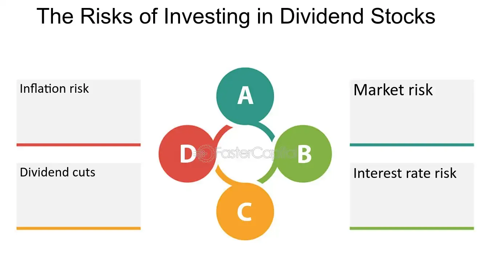

## Table of Contents

## What are high dividend stocks?

High dividend stocks are shares in companies that pay out a larger-than-average portion of their profits as dividends to shareholders. These dividends are typically paid out quarterly and can provide investors with a steady stream of income. Companies that offer high dividend stocks are often well-established and financially stable, as they need to have consistent earnings to support the regular dividend payments.

Investors might choose high dividend stocks for a few reasons. One reason is to generate income, especially if they are retired or looking for a more passive investment strategy. Another reason is that high dividend stocks can help reduce the overall risk in an investment portfolio, since they tend to be less volatile than growth stocks. However, it's important to remember that high dividend stocks might not offer as much potential for price appreciation as other types of stocks, so they might not be suitable for everyone's investment goals.

## Why do investors choose high dividend stocks?

Investors choose high dividend stocks mainly to get a regular income from their investments. These stocks pay out a bigger part of the company's profits to shareholders, usually every three months. This can be really helpful for people who are retired or just want to earn some money without having to sell their stocks. It's like getting a paycheck from your investments.

Another reason people pick high dividend stocks is to make their investment portfolio safer. These stocks often come from big, stable companies that make steady profits. This means they're less likely to lose value quickly, which can help balance out riskier investments. But, it's worth knowing that while high dividend stocks give you regular income, they might not grow in value as much as other stocks. So, they might not be the best choice for everyone, depending on what you want from your investments.

## What are the basic risks associated with investing in high dividend stocks?

One risk of investing in high dividend stocks is that the company might cut or stop paying dividends. This can happen if the company runs into financial trouble or decides to use its money for other things, like growing the business. When dividends get cut, the stock price can drop too, which means you lose money on both the dividends and the value of your stock.

Another risk is that high dividend stocks might not grow as much as other stocks. If you're looking for your investments to increase in value over time, high dividend stocks might not be the best choice. They often come from companies that aren't growing quickly, so the stock price might stay the same or only go up a little bit. This can be a problem if you need your investments to grow to meet your financial goals.

Also, high dividend stocks can be sensitive to interest rates. When interest rates go up, other investments like bonds might start looking more attractive because they offer similar income with less risk. This can cause people to sell their high dividend stocks, which can make the stock price go down. So, it's important to keep an eye on what's happening with interest rates when you're thinking about investing in high dividend stocks.

## How can high dividend stocks affect my overall investment portfolio?

High dividend stocks can add a steady stream of income to your investment portfolio. This is great if you want to get regular payments without selling your stocks. These stocks are often from big, stable companies, so they can make your portfolio less risky. When you have high dividend stocks, you might feel more secure because you know you'll get some money regularly, even if the stock market goes up and down.

But, high dividend stocks can also affect your portfolio in other ways. They might not grow as much as other stocks, so if you want your investments to increase a lot in value, these stocks might not help as much. Also, if interest rates go up, people might start buying bonds instead of high dividend stocks because bonds can be safer and still give good income. This could make the price of your high dividend stocks go down. So, it's important to think about how these stocks fit with your overall investment goals and the other investments you have.

## What is the relationship between dividend yield and stock price volatility?

The relationship between dividend yield and stock price volatility is important to understand. Dividend yield is the amount of money a company pays out in dividends each year divided by the stock's price. When a stock's price goes down, the dividend yield goes up if the dividend payment stays the same. This means that stocks with high dividend yields might be more volatile. If investors think a company might have trouble paying its dividends, they might sell the stock, which can make the price drop and the yield go up even more.

On the other hand, stocks with high dividend yields can also be less volatile in some cases. This is because companies that pay high dividends are often big and stable. Investors might see these stocks as safer, so they hold onto them even when the market goes up and down. This can make the stock price less likely to swing wildly. But, it's important to remember that even though these stocks might be less risky, they can still go up and down with the market and other factors.

## Can high dividend stocks lead to a false sense of security for investors?

Yes, high dividend stocks can lead to a false sense of security for investors. People might think that because they get regular dividend payments, the stock is safe and they don't need to worry about it. But, even if a company pays high dividends, it can still have problems. If the company runs into financial trouble, it might cut or stop paying dividends, which can make the stock price drop a lot.

Also, investors might focus too much on the income from dividends and not pay attention to other important things, like how the stock's price is doing or what's happening with the company. If the stock price goes down a lot, the total value of their investment can still go down, even with the dividends. So, it's important for investors to look at the whole picture and not just rely on the dividends for a feeling of safety.

## How do interest rate changes impact high dividend stocks?

When interest rates go up, it can make high dividend stocks less attractive to investors. This is because other investments, like bonds, start to look better. Bonds can give you a steady income too, but they're often seen as safer than stocks. So, when interest rates rise, people might sell their high dividend stocks to buy bonds instead. This selling can make the price of high dividend stocks go down.

But, it's not always bad news for high dividend stocks when interest rates change. If a company is strong and keeps paying good dividends, some investors might still want to hold onto these stocks. They might see the high dividends as a good reason to keep their money in these stocks, even if interest rates go up. So, while interest rate changes can affect high dividend stocks, it depends a lot on what investors think and how the company is doing.

## What are the tax implications of investing in high dividend stocks?

When you invest in high dividend stocks, you need to think about taxes. The money you get from dividends is usually taxed as income. How much you pay in taxes depends on your income and the tax laws where you live. In the U.S., dividends can be taxed at a lower rate if they are "qualified dividends," which means the company has to meet certain rules. But if they are not qualified, you'll pay your normal income tax rate on them.

It's also important to think about how selling high dividend stocks can affect your taxes. If you sell your stocks for more money than you paid for them, you might have to pay capital gains tax. This tax can be different depending on how long you held the stocks. If you held them for more than a year, you might pay a lower long-term capital gains tax rate. But if you sold them in less than a year, you'll pay a higher short-term capital gains tax rate, which is the same as your regular income tax rate. So, it's good to think about these tax things when you're planning your investments in high dividend stocks.

## How do company-specific factors influence the sustainability of high dividends?

Company-specific factors play a big role in whether a company can keep paying high dividends. One important factor is how much money the company makes. If a company is doing well and making a lot of profit, it can afford to pay high dividends. But if the company starts losing money or making less profit, it might have to cut back on dividends. Another factor is how much debt the company has. If a company has a lot of debt, it might need to use its money to pay off that debt instead of paying dividends. So, the financial health of the company is really important for keeping dividends high.

Another thing to think about is what the company plans to do in the future. If a company wants to grow a lot, it might decide to use its money to build new things or buy other companies instead of paying dividends. This can make the dividends less sustainable. Also, the industry the company is in can affect its dividends. Some industries, like utilities or consumer goods, are more stable and can keep paying high dividends. But industries like technology or energy can be more up and down, which can make it harder to keep dividends high. So, understanding the company's plans and the industry it's in can help you figure out if the high dividends will last.

## What role does sector concentration play in the risks of high dividend stocks?

Sector concentration means having a lot of your money in stocks from the same industry. When you invest in high dividend stocks, you might end up with many stocks from just a few sectors, like utilities or real estate. These sectors are known for paying high dividends, but if something bad happens to that whole sector, like new laws or a drop in demand, all your stocks could lose value at the same time. This makes your investment riskier because you're not spreading your money across different types of businesses.

To lower this risk, it's a good idea to mix your investments across different sectors. By doing this, if one sector has problems, the other sectors might still do well and help balance out your losses. This way, you can still enjoy the benefits of high dividend stocks without putting all your eggs in one basket.

## How can macroeconomic factors increase the risks of high dividend stocks?

Macroeconomic factors, like the overall health of the economy, can make high dividend stocks riskier. When the economy is doing badly, companies might make less money. If they make less money, they might not be able to keep paying high dividends. This can make investors worried, and they might start selling their stocks, which can make the stock price go down. Also, if there's a lot of inflation, the money you get from dividends might not be worth as much as before. This can make high dividend stocks less attractive to investors.

Another big macroeconomic factor is interest rates. When interest rates go up, other investments like bonds start looking better because they can give you a steady income with less risk. This can make people sell their high dividend stocks to buy bonds instead, which can make the stock price drop. Also, if the economy is not doing well, the government might change laws or rules that can affect how much money companies can make. This can make it harder for companies to keep paying high dividends, which adds more risk to your investment in high dividend stocks.

## What advanced strategies can be used to mitigate risks when investing in high dividend stocks?

One advanced strategy to lower the risks when investing in high dividend stocks is to use something called dividend capture. This means you buy a stock just before it pays its dividend and then sell it right after. This way, you get the dividend without holding the stock for a long time. But, you need to be careful because the stock price might drop by the amount of the dividend after it's paid, so you need to think about if the dividend is worth the risk of the stock price going down.

Another strategy is to use options to protect your investment. You can buy put options on your high dividend stocks. A put option gives you the right to sell your stock at a certain price, even if the stock price goes down a lot. This can help you limit how much money you could lose if the stock price drops. But, options can be tricky and cost money, so you need to learn how they work and think about if they are worth it for you.

Also, you can use a strategy called sector rotation. This means you move your money from one sector to another based on what's happening in the economy. If you think a sector that pays high dividends might have problems, you can move your money to a different sector that might do better. This can help you avoid big losses if the sector with high dividend stocks runs into trouble. But, you need to keep an eye on the economy and know which sectors are doing well to make this work.

## What is the key to understanding high dividend stocks?

High dividend stocks are characterized by their ability to provide investors with a substantial income relative to their share price. This specification is often quantified using the dividend yield, which is calculated as follows:

$$
\text{Dividend Yield} = \left( \frac{\text{Annual Dividends Per Share}}{\text{Price Per Share}} \right) \times 100
$$

A higher dividend yield might seem attractive to investors seeking a steady income stream. However, caution is advised, as an unusually high yield can sometimes signal financial instability within the company. A yield that is significantly higher than the industry average may indicate that a company is using dividends to attract or retain investors amidst declining stock prices or operating struggles. This scenario may result from deteriorating financial health or decreased future growth prospects.

Before investing in high dividend stocks, it is crucial for investors to assess the sustainability of the dividend payouts. This involves examining the company's financial statements and key metrics such as the dividend payout ratio, which measures the proportion of earnings distributed as dividends:

$$
\text{Dividend Payout Ratio} = \left( \frac{\text{Total Dividends Paid}}{\text{Net Income}} \right) \times 100
$$

A payout ratio that is too high could indicate that the company is prioritizing dividend payments over business expansion or debt reduction, potentially compromising its long-term financial stability. It is also important to evaluate the company's free cash flow, which indicates how much cash the company generates after accounting for capital expenditures necessary to maintain or expand its asset base.

Investors should exercise due diligence by considering both quantitative and qualitative factors when analyzing high dividend stocks. Understanding the business model, competitive position, and overall industry conditions can provide additional context to the company's financial metrics, helping to identify whether the dividend is likely to be sustained in the future. By scrutinizing these aspects, investors can make more informed decisions and avoid potential pitfalls associated with high dividend stocks.

## What are some Dividend Investing Strategies?

Diversifying investments across various sectors and industries is a crucial strategy for mitigating the risks associated with high dividend stocks. By spreading investments, investors can reduce the impact of poor performance in one sector on their entire portfolio. This strategy not only minimizes potential losses but also capitalizes on market opportunities across different economic conditions.

Key financial metrics such as the dividend payout ratio and free cash flow are essential in assessing the sustainability of dividends. The dividend payout ratio, calculated as:

$$
\text{Dividend Payout Ratio} = \frac{\text{Dividends Per Share}}{\text{Earnings Per Share}}
$$

measures the proportion of earnings paid out as dividends. A high ratio may indicate that a company is not reinvesting enough into its growth, which can be a red flag if the company’s earnings are not stable. On the other hand, a very low ratio may suggest that the company has room to increase its dividends or invest in growth opportunities.

Free cash flow, calculated as:

$$
\text{Free Cash Flow} = \text{Operating Cash Flow} - \text{Capital Expenditures}
$$

is another crucial metric, representing the cash a company generates after accounting for capital expenditures necessary to maintain or expand its asset base. Consistent and positive free cash flow indicates that a company can sustain its dividend payments, invest in its operations, and survive economic downturns without relying heavily on debt.

Prioritizing companies with stable financials and a history of consistent dividend payments is vital. Companies with such characteristics are often better positioned to weather economic uncertainties, ensuring a reliable income stream for investors. Historical data can provide insights into a company's resilience during market downturns and its commitment to shareholders by maintaining or increasing dividend payments over time.

In conclusion, effective dividend investing necessitates a multifaceted approach that includes diversification, rigorous analysis of financial health, and a focus on stability in dividend policies. This comprehensive strategy can enhance an investor’s ability to achieve sustainable income from high dividend stocks while minimizing risk.

## References & Further Reading

[1]: Damodaran, A. (2012). ["Investment Valuation: Tools and Techniques for Determining the Value of Any Asset"](https://books.google.com/books/about/Investment_Valuation.html?id=5SRHAAAAQBAJ). John Wiley & Sons.

[2]: Malkiel, B.G. (2015). ["A Random Walk Down Wall Street: The Time-Tested Strategy for Successful Investing"](https://www.amazon.com/Random-Walk-Down-Wall-Street/dp/0393358380). W. W. Norton & Company.

[3]: Graham, B. (2006). ["The Intelligent Investor: The Definitive Book on Value Investing. A Book of Practical Counsel"](https://www.amazon.com/Intelligent-Investor-Definitive-Investing-Essentials/dp/0060555661). Harper Business.

[4]: Jacobs, B.I. & Levy, K.N. (2004). ["Investing in Dividends: Revenue Enhancement Through First Elements"](https://jlem.com/documents/FG/jlem/articles/580175_LawOneAlpha.pdf). Financial Analysts Journal.

[5]: Fabozzi, F. J., Focardi, S. M., & Rachev, S. T. (2008). ["Robust Portfolio Optimization and Management"](https://onlinelibrary.wiley.com/doi/book/10.1002/9781118856406). John Wiley & Sons.

[6]: Mauboussin, M.J. (2006). ["Expectations Investing: Reading Stock Prices for Better Returns"](https://operators.macro-ops.com/wp-content/uploads/2017/09/Expectations-Investing.pdf). Harvard Business School Press.