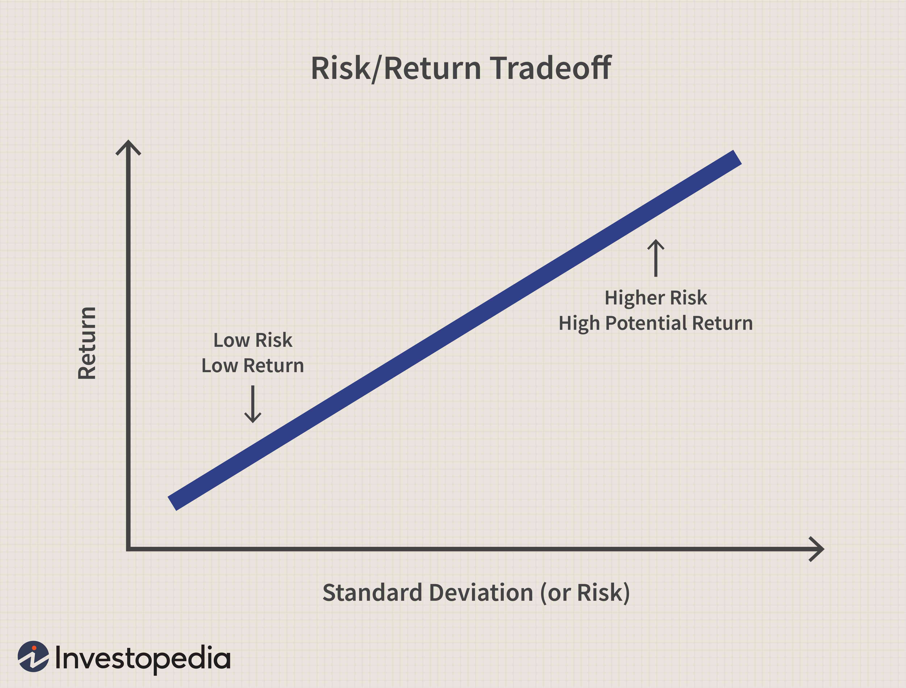

High dividend stocks are a significant part of the investment landscape, offering both enticing opportunities and notable risks for income-focused investors. These stocks often appeal to those attracted by the prospect of steady income streams through regular dividend payouts. However, the lure of high dividends can sometimes mask underlying challenges, making it essential to approach dividend investing with a critical eye.

Dividend investing, primarily characterized by the pursuit of regular income from stock investments, can serve as a reliable source of passive income. Yet, it is important to recognize the potential pitfalls inherent in this investment strategy. High dividend stocks may sometimes indicate strong financial health and stability, but they can also signify a company’s struggles, especially when high yields are the result of declining stock prices.



This article aims to shed light on the various risks associated with high dividend stocks, such as the potential for yield traps, interest rate risks, and market volatility. Additionally, it will discuss strategies for mitigating these risks through informed dividend investing. A key component of this mitigation is the use of financial analysis to assess the sustainability of dividend payouts, ensuring a balance between income and long-term growth potential.

Furthermore, the article will examine the role of algorithmic trading in enhancing investment decisions. By leveraging technology, algorithmic trading can process vast amounts of data to identify trends that are not immediately apparent to human investors. This approach not only aids in more efficient portfolio management but also helps in reducing emotional biases that often lead to suboptimal investment outcomes.

In conclusion, while the pursuit of high dividend stocks offers promising income opportunities, it requires a well-considered strategy to navigate the associated risks effectively. Through a combination of strategic investing practices and technological advancements like algorithmic trading, investors can better position themselves for sustainable success in the dividend investing landscape.

## Table of Contents

## Understanding High Dividend Stocks

High dividend stocks are characterized by their ability to provide investors with a substantial income relative to their share price. This specification is often quantified using the dividend yield, which is calculated as follows:

$$
\text{Dividend Yield} = \left( \frac{\text{Annual Dividends Per Share}}{\text{Price Per Share}} \right) \times 100
$$

A higher dividend yield might seem attractive to investors seeking a steady income stream. However, caution is advised, as an unusually high yield can sometimes signal financial instability within the company. A yield that is significantly higher than the industry average may indicate that a company is using dividends to attract or retain investors amidst declining stock prices or operating struggles. This scenario may result from deteriorating financial health or decreased future growth prospects.

Before investing in high dividend stocks, it is crucial for investors to assess the sustainability of the dividend payouts. This involves examining the company's financial statements and key metrics such as the dividend payout ratio, which measures the proportion of earnings distributed as dividends:

$$
\text{Dividend Payout Ratio} = \left( \frac{\text{Total Dividends Paid}}{\text{Net Income}} \right) \times 100
$$

A payout ratio that is too high could indicate that the company is prioritizing dividend payments over business expansion or debt reduction, potentially compromising its long-term financial stability. It is also important to evaluate the company's free cash flow, which indicates how much cash the company generates after accounting for capital expenditures necessary to maintain or expand its asset base.

Investors should exercise due diligence by considering both quantitative and qualitative factors when analyzing high dividend stocks. Understanding the business model, competitive position, and overall industry conditions can provide additional context to the company's financial metrics, helping to identify whether the dividend is likely to be sustained in the future. By scrutinizing these aspects, investors can make more informed decisions and avoid potential pitfalls associated with high dividend stocks.

## Risks of Investing in High Dividend Stocks

High dividend stocks, which often appear enticing due to their potential for providing significant income in the form of dividends, come with a set of risks that investors must navigate carefully. One notable risk associated with these stocks is the "yield trap." Yield traps occur when a company's stock yields appear unusually high, often as a result of a steep decline in its stock price. This decline could be due to underlying financial or operational issues facing the company. For instance, if a company cuts its dividend due to financial distress, the yield—calculated as $\text{Yield} = \frac{\text{Dividend per Share}}{\text{Price per Share}}$—may initially seem attractive but reflects an unsustainable payout.

Interest rate risks represent another challenge for investors in high dividend stocks. Rising interest rates tend to make fixed-income securities, such as government bonds, more attractive due to their lower risk profile in comparison to stocks. This situation can lead to a shift in investor preference away from dividend-paying stocks towards bonds, driving down the stock prices and subsequently affecting the dividend yields. Investors need to remain vigilant about the macroeconomic indicators that might indicate changes in interest rates which could influence the attractiveness of dividend stocks.

Market [volatility](/wiki/volatility-trading-strategies) also poses a significant risk by impacting both the stock price and the dividend yield, ultimately affecting the total return on investment. Stock prices can be highly volatile due to economic events, industry-specific changes, or shifts in investor sentiment. The volatility can lead to fluctuations in dividend yields, causing uncertainty about the income stream from these stocks. For example, economic downturns or poor market conditions might prompt companies to reduce or suspend dividend payments, impacting investors who rely heavily on dividend income.

Investors must perform thorough analyses and continuously monitor the financial health of companies to mitigate these risks associated with high dividend stocks. By understanding these inherent risks, investors can make better-informed decisions and adopt strategies to protect their investments.

## Dividend Investing Strategies

Diversifying investments across various sectors and industries is a crucial strategy for mitigating the risks associated with high dividend stocks. By spreading investments, investors can reduce the impact of poor performance in one sector on their entire portfolio. This strategy not only minimizes potential losses but also capitalizes on market opportunities across different economic conditions.

Key financial metrics such as the dividend payout ratio and free cash flow are essential in assessing the sustainability of dividends. The dividend payout ratio, calculated as:

$$
\text{Dividend Payout Ratio} = \frac{\text{Dividends Per Share}}{\text{Earnings Per Share}}
$$

measures the proportion of earnings paid out as dividends. A high ratio may indicate that a company is not reinvesting enough into its growth, which can be a red flag if the company’s earnings are not stable. On the other hand, a very low ratio may suggest that the company has room to increase its dividends or invest in growth opportunities.

Free cash flow, calculated as:

$$
\text{Free Cash Flow} = \text{Operating Cash Flow} - \text{Capital Expenditures}
$$

is another crucial metric, representing the cash a company generates after accounting for capital expenditures necessary to maintain or expand its asset base. Consistent and positive free cash flow indicates that a company can sustain its dividend payments, invest in its operations, and survive economic downturns without relying heavily on debt.

Prioritizing companies with stable financials and a history of consistent dividend payments is vital. Companies with such characteristics are often better positioned to weather economic uncertainties, ensuring a reliable income stream for investors. Historical data can provide insights into a company's resilience during market downturns and its commitment to shareholders by maintaining or increasing dividend payments over time.

In conclusion, effective dividend investing necessitates a multifaceted approach that includes diversification, rigorous analysis of financial health, and a focus on stability in dividend policies. This comprehensive strategy can enhance an investor’s ability to achieve sustainable income from high dividend stocks while minimizing risk.

## Algorithmic Trading in Dividend Investing

Algorithmic trading in dividend investing involves leveraging computer algorithms to analyze large datasets, execute trades, and manage portfolios with increased efficiency and reduced emotional bias. This approach allows investors to uncover patterns and trends in data that would be difficult for humans to discern manually. By using algorithms, investors can respond swiftly to market changes and optimize their investment strategies.

One of the primary benefits of [algorithmic trading](/wiki/algorithmic-trading) is its ability to enhance risk management. Algorithms can be designed with predetermined criteria, enabling automatic adjustments to portfolio allocations based on real-time data. For example, an algorithm may increase exposure to lower-risk assets if market volatility rises or interest rates change, thereby protecting the portfolio's overall yield and value.

Moreover, algorithmic trading can automate the buying and selling process, which minimizes the emotional biases that often influence human investors, such as fear and greed. This automation ensures that investment decisions are made based on data-driven insights rather than psychological impulses. For instance, an algorithm could be programmed to sell a stock if its dividend yield falls below a certain threshold, reflecting a potentially risky investment.

The following Python example demonstrates a simple rule-based algorithm that adjusts stock holdings based on dividend yield thresholds:

```python
class DividendPortfolio:
    def __init__(self, stocks):
        self.stocks = stocks

    def adjust_portfolio(self):
        for stock in self.stocks:
            if stock['dividend_yield'] < 2:
                self.sell_stock(stock['ticker'])
            elif stock['dividend_yield'] > 5:
                self.buy_stock(stock['ticker'])

    def sell_stock(self, ticker):
        print(f"Selling stock: {ticker}")

    def buy_stock(self, ticker):
        print(f"Buying stock: {ticker}")

portfolio = DividendPortfolio([
    {'ticker': 'AAPL', 'dividend_yield': 1.5},
    {'ticker': 'T', 'dividend_yield': 6.2},
])

portfolio.adjust_portfolio()
```

In this example, stocks with a dividend yield below 2% are flagged for selling, while those with a yield above 5% are considered for purchasing. Such rule-based systems can be part of a broader algorithmic trading strategy that dynamically responds to market conditions.

In essence, algorithmic trading offers a robust framework for making informed investment decisions in dividend stocks. By systematically managing risks and minimizing emotional impact, this technology aids investors in maintaining a disciplined approach to achieving their financial objectives.

## Conclusion

High dividend stocks offer investors the promise of attractive yields, making them a compelling choice for those seeking a steady income stream. However, these investments are not devoid of risks such as yield traps, [interest rate](/wiki/interest-rate-trading-strategies) fluctuations, and market volatility. The allure of high dividends may sometimes mask underlying financial distress within companies, underscoring the importance of thorough risk assessments before committing capital.

Strategic dividend investing practices are essential to navigate these potential pitfalls. Diversification across sectors and a rigorous analysis of key financial indicators, like the dividend payout ratio and free cash flow, can significantly enhance the sustainability of dividend portfolios. Examining historical consistency in dividend payments is another vital step in the assessment process, ensuring that the chosen companies have resilient financial underpinnings.

Leveraging algorithmic trading adds a sophisticated tool to the investor's arsenal. Algorithmic models excel in processing vast datasets to detect trends and anomalies, enabling timely and informed investment decisions. By automatically adjusting portfolios based on set criteria, algorithms help mitigate emotional biases and enhance precision in buying and selling actions. This systematic approach not only enhances risk management but also optimizes portfolio performance in alignment with evolving market conditions.

Performing due diligence remains paramount; understanding the financial health and stability of high dividend stocks is crucial for sustained success. Continuous monitoring of investments, leveraging both strategic insights and technological advancements, fortifies long-term investment outcomes. Ultimately, a balanced, informed approach empowers investors to harness the benefits of high dividend stocks while safeguarding against inherent risks.

## References & Further Reading

[1]: Damodaran, A. (2012). ["Investment Valuation: Tools and Techniques for Determining the Value of Any Asset"](https://books.google.com/books/about/Investment_Valuation.html?id=5SRHAAAAQBAJ). John Wiley & Sons.

[2]: Malkiel, B.G. (2015). ["A Random Walk Down Wall Street: The Time-Tested Strategy for Successful Investing"](https://www.amazon.com/Random-Walk-Down-Wall-Street/dp/0393358380). W. W. Norton & Company.

[3]: Graham, B. (2006). ["The Intelligent Investor: The Definitive Book on Value Investing. A Book of Practical Counsel"](https://www.amazon.com/Intelligent-Investor-Definitive-Investing-Essentials/dp/0060555661). Harper Business.

[4]: Jacobs, B.I. & Levy, K.N. (2004). ["Investing in Dividends: Revenue Enhancement Through First Elements"](https://jlem.com/documents/FG/jlem/articles/580175_LawOneAlpha.pdf). Financial Analysts Journal.

[5]: Fabozzi, F. J., Focardi, S. M., & Rachev, S. T. (2008). ["Robust Portfolio Optimization and Management"](https://onlinelibrary.wiley.com/doi/book/10.1002/9781118856406). John Wiley & Sons.

[6]: Mauboussin, M.J. (2006). ["Expectations Investing: Reading Stock Prices for Better Returns"](https://operators.macro-ops.com/wp-content/uploads/2017/09/Expectations-Investing.pdf). Harvard Business School Press.