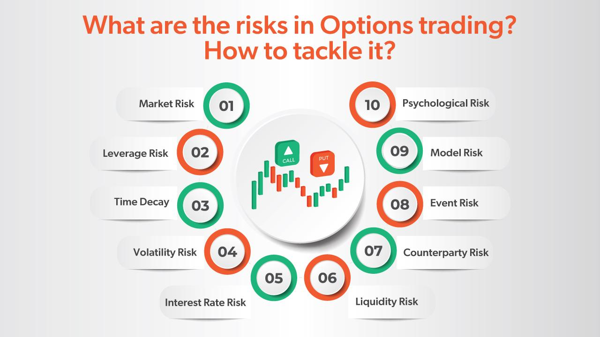

## Table of Contents

## What are options and how do they work?

Options are financial contracts that give you the right, but not the obligation, to buy or sell an asset at a specific price before a certain date. They are like tickets that let you decide if you want to make a trade later. There are two types of options: calls and puts. A call option lets you buy an asset, while a put option lets you sell it. The price at which you can buy or sell is called the strike price, and the date by which you must decide is the expiration date.

When you buy an option, you pay a fee called a premium. This premium is the cost of having the right to make the trade later. If the asset's price moves in your favor, you can use the option to make a profit. For example, if you have a call option and the asset's price goes up above the strike price, you can buy the asset at the lower strike price and then sell it at the higher market price. If the price doesn't move in your favor, you can just let the option expire and only lose the premium you paid. This makes options a way to bet on price movements with limited risk.

## What are the basic types of options and their characteristics?

There are two basic types of options: call options and put options. A call option gives you the right to buy an asset at a set price, called the strike price, before a certain date, known as the expiration date. If you think the price of the asset will go up, you might buy a call option. For example, if you buy a call option for a stock with a strike price of $50 and the stock price rises to $60, you can buy the stock at $50 and then sell it at $60, making a profit.

A put option gives you the right to sell an asset at the strike price before the expiration date. If you think the price of the asset will go down, you might buy a put option. For instance, if you buy a put option for a stock with a strike price of $50 and the stock price falls to $40, you can buy the stock at the lower market price of $40 and then sell it at the higher strike price of $50, making a profit. Both call and put options require you to pay a premium upfront, which is the cost of the option. If the price doesn't move in your favor, you can let the option expire and only lose the premium you paid.

## What are the potential financial risks associated with investing in options?

Investing in options can be risky. One big risk is losing the money you paid for the option, called the premium. If the price of the asset doesn't move the way you hoped by the expiration date, your option becomes worthless, and you lose the premium. This is the most you can lose if you're buying options, but it's still a risk because you could lose all the money you spent on the option.

Another risk is that options can be very complicated. They have many factors like time decay, [volatility](/wiki/volatility-trading-strategies), and interest rates that can affect their value. If you don't understand these factors well, you might make bad decisions and lose money. Also, options can be very sensitive to price changes in the underlying asset. Small changes can lead to big wins or losses, making them a high-risk investment.

Lastly, if you're selling options, the risks can be even higher. When you sell an option, you get the premium, but you might have to buy or sell the asset at the strike price if the buyer uses the option. This can lead to big losses if the price moves a lot against you. For example, if you sell a call option and the price of the asset goes way up, you might have to sell the asset at a much lower price than its market value, leading to a significant loss.

## How does leverage in options trading increase risk?

Leverage in options trading means you can control a big amount of an asset for a small amount of money. This is because when you buy an option, you only pay the premium, which is much less than the cost of buying the asset itself. But this can make things riskier. If the price of the asset moves against you, you can lose the whole premium you paid, which might be a lot compared to what you would have lost if you had just bought the asset directly.

For example, if you buy a call option for a stock, you can control 100 shares of that stock for just the price of the option. If the stock price goes up, you can make a lot of money compared to what you paid. But if the stock price goes down, you lose the premium, and that loss can be big compared to what you would have lost if you had just bought the stock. So, leverage can make your potential profits bigger, but it also makes your potential losses bigger, which is why it increases the risk in options trading.

## What is the impact of time decay on options and how does it affect investment risk?

Time decay, also called theta, is a big deal when it comes to options. It means that the value of an option goes down as time goes by, especially as it gets closer to the expiration date. This happens because the less time there is until the option expires, the less chance there is for the price of the asset to move in a way that makes the option worth something. So, if you're holding an option, time decay can make it lose value even if the price of the asset stays the same.

Because of time decay, options can be riskier. If you buy an option, you're not just betting on the price of the asset going up or down; you're also racing against time. If the price doesn't move in your favor quickly enough, the option can lose value just because time is passing. This means you have to be right about the direction the price will move and also right about when it will happen. If you're wrong, you could lose the money you paid for the option, making it a riskier investment.

## How can volatility affect the risk of options investments?

Volatility is like how much the price of an asset jumps around. It can make options more risky because it affects how much an option is worth. When an asset's price is bouncing around a lot, options can be worth more because there's a bigger chance the price will hit the strike price before the option expires. This means you might pay more for the option, which is riskier because you could lose that bigger amount if the price doesn't move the way you hope.

But high volatility isn't always bad. If you think the price will move a lot and you're right, you could make more money with options than if you just bought the asset. But it's also a double-edged sword. If the price moves a lot but in the wrong direction, you could lose more money than if the price stayed calm. So, volatility can make options more exciting and potentially more profitable, but it also makes them riskier because the price swings can be hard to predict.

## What are common mistakes beginners make when investing in options?

One common mistake beginners make when investing in options is not understanding how they work. Options are complicated, and if you don't know about things like time decay, volatility, and leverage, you might make bad choices. For example, some people buy options without realizing that the value of the option can go down even if the price of the asset stays the same, just because time is passing. This can lead to losing money even if you were right about the direction the price would move.

Another mistake is not managing risk well. Options can be risky because they use leverage, which means you can lose a lot of money quickly if the price moves against you. Beginners might not set limits on how much they're willing to lose or might not have a plan for what to do if things go wrong. This can lead to big losses if the market doesn't go the way they expected.

Lastly, beginners often get too excited about the potential for big profits and forget about the risks. They might buy options without doing enough research or without a clear strategy. This can lead to making impulsive decisions based on emotions rather than careful planning. It's important to approach options trading with a clear head and a solid understanding of the risks involved.

## How can an investor assess their risk tolerance before investing in options?

Before diving into options, it's smart for an investor to figure out how much risk they can handle. This means thinking about how much money they can afford to lose without it messing up their life. They should ask themselves if they're okay with the chance of losing all the money they put into options. It's also good to think about how they feel about big ups and downs in their investments. Some people can stay calm when their money is going up and down a lot, but others might get too stressed out and make bad choices because of it.

To really understand their risk tolerance, an investor should look at their whole financial situation. This includes things like how much money they have saved, how much they earn, and what their long-term goals are. If they're young and have a steady job, they might be okay with taking on more risk because they have time to recover from losses. But if they're close to retiring or have a lot of debt, they might want to be more careful. Talking to a financial advisor can also help them figure out how much risk is right for them before they start trading options.

## What are advanced strategies for managing risk in options trading?

One advanced strategy for managing risk in options trading is using stop-loss orders. A stop-loss order is like a safety net that automatically sells your option if the price drops to a certain level. This helps limit how much money you can lose. Another strategy is called hedging. Hedging means you buy or sell other options or assets to protect yourself from big losses. For example, if you own a stock and you're worried the price might go down, you can buy a put option on that stock. If the stock price does fall, the put option can help cover your losses.

Another way to manage risk is by using spreads. A spread involves buying and selling multiple options at the same time to reduce your risk. For instance, a bull call spread means you buy a call option at a lower strike price and sell another call option at a higher strike price. This limits your potential loss to the difference between the premiums you paid and received. Lastly, diversifying your options portfolio can also help manage risk. Instead of putting all your money into options on one asset, you spread it out across different assets. This way, if one option loses value, the others might still do well, balancing out your overall risk.

## How do market conditions influence the risks of options investments?

Market conditions can really change the risks of investing in options. When the market is going up and down a lot, it's called high volatility. This can make options more risky because their prices can change a lot too. If you buy an option when the market is calm and then it starts to move wildly, you might lose money faster than you thought. Also, if the overall market is doing badly, like during a recession, options can be riskier because the chances of the price moving the way you want might be lower. This means you could lose the money you spent on the option more easily.

On the other hand, if the market is stable and growing slowly, options might be less risky. In a calm market, the price of the asset might not move as much, so the value of your option might not change as quickly. But even in a good market, there's still risk because options have time decay, which means they lose value as time goes by. So, even if the market is doing well, you need to be careful about when you buy and sell options to manage your risk.

## What regulatory risks should be considered when investing in options?

When you invest in options, you need to think about regulatory risks. This means the rules that the government and other groups set for trading options. These rules can change and might affect how you can trade or what you need to do to trade. For example, some countries have strict rules about who can trade options, and you might need to pass a test or have a certain amount of money before you can start. If you don't follow these rules, you could get in trouble or not be allowed to trade at all.

Another thing to consider is that regulators can change the rules at any time. If new rules come out, they might make options more expensive or harder to trade. This can add more risk to your investments because you might not be able to do what you planned. So, it's important to keep up with any changes in the rules and understand how they might affect your options trading.

## How can options be used to hedge other investments and what are the associated risks?

Options can be used to hedge other investments by acting like a safety net. If you own a stock and you're worried its price might go down, you can buy a put option on that stock. The put option gives you the right to sell the stock at a certain price, even if the market price drops lower. This means if the stock price does fall, you can use the put option to sell it at a higher price than the market, helping to limit your losses. It's like buying insurance for your stock, giving you peace of mind that you won't lose as much money if things go wrong.

But using options to hedge also comes with risks. First, you have to pay for the option, which is called the premium. If the stock price doesn't go down like you thought, you lose the money you spent on the option. This can add up if you're hedging a lot of different investments. Also, options have time decay, which means their value goes down as time passes. If the stock price doesn't move quickly enough, the option might become worthless before you can use it, leaving you with nothing to show for the premium you paid. So, while hedging with options can protect you from big losses, it's important to weigh these risks and costs against the potential benefits.

## References & Further Reading

[1]: Black, F., & Scholes, M. (1973). ["The Pricing of Options and Corporate Liabilities."](https://www.cs.princeton.edu/courses/archive/fall09/cos323/papers/black_scholes73.pdf) Journal of Political Economy, 81(3), 637-654.

[2]: Hull, J.C. (2021). ["Options, Futures, and Other Derivatives,"](https://www.pearson.com/en-us/subject-catalog/p/options-futures-and-other-derivatives/P200000005938/9780136939917) 10th Edition. Pearson.

[3]: Murphy, J.J. (1999). ["Technical Analysis of the Financial Markets: A Comprehensive Guide to Trading Methods and Applications."](https://archive.org/details/technicalanalysi0000murp) New York Institute of Finance.

[4]: Lopez de Prado, M. (2018). ["Advances in Financial Machine Learning."](https://www.amazon.com/Advances-Financial-Machine-Learning-Marcos/dp/1119482089) Wiley.

[5]: Aldridge, I. (2013). ["High-Frequency Trading: A Practical Guide to Algorithmic Strategies and Trading Systems."](https://books.google.com/books/about/High_Frequency_Trading.html?id=6l0DDQAAQBAJ) Wiley.

[6]: Fabozzi, F.J., Kolm, P.N., & Pachamanova, D.A. (2010). ["Robust Portfolio Optimization and Management."](https://onlinelibrary.wiley.com/doi/book/10.1002/9781119202172) Wiley.