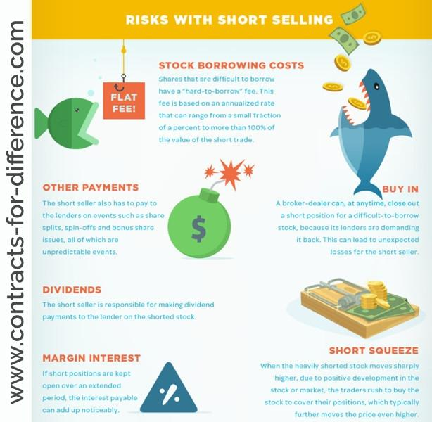

## Table of Contents

## What is stock shorting and how does it work?

Stock shorting, or short selling, is when someone bets that a stock's price will go down. Instead of buying a stock and hoping it goes up, a person borrows shares of a stock from someone else and sells them right away. They hope to buy the shares back later at a lower price, return the borrowed shares, and keep the difference as profit.

Here's how it works: Imagine you think the price of a stock that is currently $50 will drop. You borrow 10 shares from a broker and sell them for $500. If the price drops to $40, you can buy back those 10 shares for $400. You return the 10 shares to the broker, and you make a $100 profit. But, if the stock price goes up instead, you lose money because you have to buy the shares back at a higher price to return them.

## Can you explain the concept of 'losing more than invested' in stock shorting?

When you short a stock, you borrow shares and sell them, hoping to buy them back cheaper later. But if the stock price goes up instead of down, you lose money. The tricky part is, there's no limit to how much the stock price can go up. So, if you borrowed and sold a stock at $50, and it goes up to $100, you have to buy it back at $100 to return it. That means you lose $50 per share, which is more than you made when you sold it.

This is different from buying a stock, where the most you can lose is what you paid for it. With short selling, your losses can keep growing as long as the stock price keeps going up. That's why short selling can be riskier - you could end up owing a lot more money than what you started with if the stock price rises a lot.

## What are the basic risks associated with short selling stocks?

Short selling stocks can be risky because if the stock price goes up instead of down, you lose money. When you short a stock, you borrow shares and sell them, hoping to buy them back later at a lower price. But if the price goes up, you have to buy the shares back at the higher price to return them, and that can cost you more than you made when you sold them. There's no limit to how high a stock price can go, so your losses can keep growing if the stock keeps going up.

Another risk is that the company might do something unexpected, like announce good news that makes the stock price jump. If a lot of people are shorting the stock, this can lead to a "short squeeze," where everyone tries to buy back the shares at the same time, pushing the price even higher. Also, you have to pay fees to borrow the shares, and these fees can add up, eating into any profits you might make or making your losses even bigger.

## How does a short squeeze affect the potential losses in short selling?

A short squeeze can make losses from short selling much worse. It happens when a lot of people have shorted a stock, betting that its price will go down. But if the stock price starts to go up instead, maybe because of good news about the company, the people who shorted the stock start to panic. They all rush to buy back the shares they borrowed and sold, so they can return them and stop losing money. This rush to buy back the shares pushes the stock price up even more, because there are more people wanting to buy than there are shares available.

This can turn into a vicious cycle. As the stock price goes up, the short sellers lose more money, which makes them even more eager to buy back the shares and get out of their losing positions. This buying pressure keeps pushing the price higher, and short sellers can end up losing a lot more than they expected. So, a short squeeze can make the already high risks of short selling even worse, turning what might have been a small loss into a big one very quickly.

## What role does margin trading play in the risks of short selling?

Margin trading can make short selling even riskier. When you short a stock, you usually need to use margin, which means you're borrowing money from your broker to buy the shares you need to short. This lets you short more shares than you could if you were just using your own money. But if the stock price goes up, you lose money on the shares you shorted, and you also have to pay interest on the money you borrowed. This can make your losses bigger and faster.

If the stock price keeps going up, your broker might ask for more money to cover the losses. This is called a margin call. If you can't add more money to your account, the broker can sell your assets to cover the losses, and you could end up losing more than you put in. So, margin trading can turn the already high risks of short selling into even bigger risks, because you're not just losing on the stock price, but also dealing with borrowed money and interest.

## Can you discuss the impact of market volatility on short selling?

Market [volatility](/wiki/volatility-trading-strategies) can make short selling a lot riskier. When the market is volatile, stock prices can go up and down a lot in a short time. If you've shorted a stock and its price suddenly jumps because of this volatility, you could lose a lot of money very quickly. You might have to buy back the shares at a much higher price than you sold them for, which means bigger losses for you.

Also, when the market is volatile, it can be harder to predict what will happen next. Stocks might go up for no clear reason, and this can lead to a short squeeze. If a lot of people have shorted the same stock and it starts going up, everyone might rush to buy back their shares at the same time. This can make the stock price go up even more, and your losses can get a lot worse because of this. So, market volatility can make short selling more unpredictable and increase the chances of big losses.

## How do regulatory changes influence the risks of short selling?

Regulatory changes can make short selling more or less risky. If the rules get stricter, it might be harder to short stocks. For example, if the government makes new rules that limit how many shares you can borrow or how long you can keep them, this could make it tougher to short a stock. Also, if the rules change to make it easier for companies to find out who is shorting their stock, that could lead to more short squeezes. When companies know who is betting against them, they might do things to make their stock price go up on purpose, which can hurt short sellers.

On the other hand, if the rules get looser, it might be easier to short stocks, but that can also bring new risks. If more people can short sell because of less strict rules, there might be more short sellers out there. This can make the market more volatile because a lot of people selling at the same time can push stock prices down fast. Also, if the rules change suddenly, it can make the market unpredictable, and short sellers might lose money if they can't adjust to the new rules fast enough.

## What are the differences in risk between short selling individual stocks versus short selling ETFs or indices?

When you short sell individual stocks, you are betting that the price of one specific company will go down. This can be very risky because a lot of things can make the price of a single stock go up or down quickly. For example, news about the company, like a new product or a change in leadership, can make the stock price jump. If a lot of people are betting against the stock and it goes up, you could get caught in a short squeeze, which can make your losses a lot bigger. So, short selling individual stocks can be more unpredictable and risky because you are focused on just one company.

On the other hand, short selling ETFs or indices is usually less risky because you are betting against a whole group of stocks or the market as a whole. ETFs and indices are made up of many different stocks, so they tend to be more stable than individual stocks. If you short an [ETF](/wiki/etf-trading-strategies) or an index, a big jump in one stock won't affect it as much because it's spread out over many stocks. But it's still risky because the whole market can go up or down because of things like economic news or changes in interest rates. So, while short selling ETFs or indices can be less risky than short selling individual stocks, you still need to be careful and understand what can make the market move.

## How can an investor use stop-loss orders to manage risk in short selling?

When you short sell a stock, you hope its price will go down. But if it goes up instead, you can lose a lot of money. A stop-loss order can help you manage this risk. A stop-loss order is like a safety net that you set up ahead of time. You tell your broker to buy back the stock you shorted if it reaches a certain price. This way, if the stock price starts going up, the stop-loss order can kick in and limit how much money you lose.

For example, if you short a stock at $50 and set a stop-loss order at $55, your broker will buy the stock back for you if it hits $55. This means your loss is limited to $5 per share, plus any fees or interest. Stop-loss orders are not perfect, though. Sometimes, if the stock price jumps a lot very quickly, your order might not get filled at exactly $55. It could be a bit higher, but it still helps to stop big losses. So, using stop-loss orders can be a smart way to manage the risks of short selling.

## What advanced strategies can be employed to mitigate the risks of losing more than invested in short selling?

One advanced strategy to mitigate the risks of losing more than invested in short selling is to use options. Options give you the right, but not the obligation, to buy or sell a stock at a certain price. You can buy a call option on the stock you shorted. This call option acts like insurance. If the stock price goes up a lot, you can use the call option to buy the stock at a lower price than it's trading at, which can help limit your losses. It costs money to buy options, but it can be worth it if it keeps you from losing a lot more.

Another strategy is to use a strategy called "hedging." Hedging means you take another position in the market that can help offset any losses from your short sale. For example, you could buy shares in a similar company or an ETF that moves in the opposite direction of the stock you shorted. If the stock you shorted goes up, the other investment might go down, which can help balance out your losses. Hedging can be complicated and it might not always work perfectly, but it's another way to try to protect yourself from big losses when short selling.

Lastly, you can use a strategy called "pairs trading." This involves shorting one stock and buying another stock that is similar but expected to perform differently. The idea is that if the stock you shorted goes up, the stock you bought might go up even more, or at least not go down as much. This can help reduce your overall risk. Pairs trading requires a good understanding of how different stocks move relative to each other, but it can be a useful way to manage the risks of short selling.

## How do global economic events impact the risks associated with short selling?

Global economic events can make short selling a lot riskier. When something big happens, like a country's economy getting worse or a big change in interest rates, it can make stock prices move a lot. If you've shorted a stock and the price goes up because of these events, you could lose a lot of money. For example, if there's good economic news and the market goes up, the stocks you shorted might go up too, and you'll have to buy them back at a higher price. This can turn a small loss into a big one very quickly.

Also, global events can lead to more market volatility. When the market is volatile, stock prices can go up and down a lot in a short time. This can make it hard to predict what will happen next, and if you've shorted a stock, a sudden jump in its price can hurt you a lot. For example, if there's a big political event or a natural disaster that affects the economy, it can cause stocks to move in ways you didn't expect. So, when you're short selling, you need to be extra careful during times of global economic uncertainty because the risks can be much higher.

## What are the long-term implications of consistently engaging in short selling on an investor's portfolio?

Consistently engaging in short selling can have big effects on an investor's portfolio over time. Short selling is risky because if the stock price goes up instead of down, you can lose a lot more money than you put in. If you keep short selling and the market goes up, your losses can add up and hurt your portfolio a lot. Also, short selling can make your portfolio more volatile. This means your portfolio's value can go up and down a lot, which can be stressful and hard to handle over the long term.

On the other hand, if you're good at [picking](/wiki/asset-class-picking) stocks that will go down, short selling can help you make money when the market is going down. But it's hard to keep doing this well over a long time. Most of the time, the market goes up, so short selling can be like swimming against the current. If you focus too much on short selling, you might miss out on the gains that come from buying and holding stocks that go up over time. So, while short selling can be a useful tool, using it too much can make your portfolio riskier and might not be the best way to grow your money over the long term.

## References & Further Reading

[1]: Hendershott, T., Jones, C. M., & Menkveld, A. J. (2011). ["Does Algorithmic Trading Improve Liquidity?"](https://onlinelibrary.wiley.com/doi/full/10.1111/j.1540-6261.2010.01624.x) The Journal of Finance, 66(1), 1-33.

[2]: Kirilenko, A. A., Kyle, A. S., Samadi, M., & Tuzun, T. (2017). ["The Flash Crash: The Impact of High-Frequency Trading on an Electronic Market."](https://www.jstor.org/stable/26652722) The Journal of Finance, 72(3), 967-998.

[3]: ["Advances in Financial Machine Learning"](https://www.amazon.com/Advances-Financial-Machine-Learning-Marcos/dp/1119482089) by Marcos Lopez de Prado

[4]: ["Quantitative Trading: How to Build Your Own Algorithmic Trading Business"](https://www.amazon.com/Quantitative-Trading-Build-Algorithmic-Business/dp/1119800064) by Ernest P. Chan

[5]: ["Algorithmic Trading and DMA: An Introduction to Direct Access Trading Strategies"](https://www.amazon.com/Algorithmic-Trading-DMA-introduction-strategies/dp/0956399207) by Barry Johnson