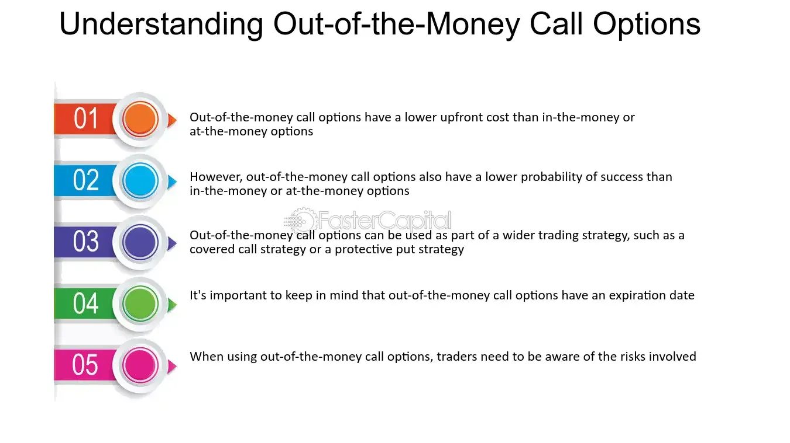

## Table of Contents

## What are out-of-the-money options?

Out-of-the-money options are a type of option contract that has no intrinsic value. This means that if you were to exercise the option right away, you wouldn't make any money. For a call option, it's out-of-the-money when the current price of the stock is lower than the strike price of the option. For a put option, it's out-of-the-money when the current price of the stock is higher than the strike price.

People buy out-of-the-money options because they are cheaper than in-the-money options. They hope that the price of the stock will move in their favor before the option expires. If it does, the option could become in-the-money and they could make a profit. However, there's also a bigger risk because the option might expire worthless if the stock price doesn't move enough.

## How do low-cost out-of-the-money options work?

Low-cost out-of-the-money options are options that you can buy for less money because they are less likely to make a profit right away. These options are called "out-of-the-money" because the price of the stock is not in the range where the option would be profitable if you used it right now. For a call option, this means the stock price is lower than the option's strike price. For a put option, it means the stock price is higher than the strike price. Because these options are less likely to be profitable immediately, they cost less to buy.

People buy these low-cost out-of-the-money options because they hope the stock price will move in their favor before the option expires. If the stock price moves a lot, the option could become profitable, or "in-the-money," and the buyer could make money. However, there's a bigger risk with these options because if the stock price doesn't move enough by the time the option expires, the option will be worthless and the buyer will lose the money they spent on it. So, while they are cheaper to buy, they also have a higher chance of not making any money.

## What are the basic risks associated with trading options?

Trading options can be risky because they can lose all their value quickly. If you buy an option and the price of the stock doesn't move in the way you hoped before the option expires, you could lose all the money you spent on the option. This is called the risk of the option expiring worthless. Options also have something called time decay, which means the value of the option goes down as it gets closer to the expiration date, even if the stock price stays the same. This can make it harder to make money from options, especially if you hold them for a long time.

Another risk is that options can be very volatile, meaning their prices can change a lot in a short time. This can lead to big losses if the market moves against you. Also, when you trade options, you might need to use a lot of money to cover your positions, which is called margin. If the market moves against you, you might get a margin call, which means you have to put more money into your account quickly or your positions could be closed out at a loss. So, it's important to understand these risks and be ready for them before you start trading options.

## Why might someone choose to buy low-cost out-of-the-money options?

Someone might choose to buy low-cost out-of-the-money options because they are cheaper than other options. These options are less expensive because they are less likely to make money right away. The stock price has to move a lot for these options to become profitable. People who buy them are hoping for a big move in the stock price that will make their options valuable. They are willing to take a bigger risk for the chance of a bigger reward.

Another reason someone might buy these options is to bet on a big change in the market without spending a lot of money upfront. If they think a stock is going to go up or down a lot, they can buy these options to try to make money from that move. But they need to be careful because if the stock doesn't move enough, they could lose all the money they spent on the options. So, it's a way to try to make a lot of money with a small investment, but it comes with a high risk of losing that investment.

## What is the probability of low-cost out-of-the-money options expiring worthless?

Low-cost out-of-the-money options have a high chance of expiring worthless. This is because they are less likely to be profitable right away. For a call option, the stock price needs to go above the strike price before the option expires. For a put option, the stock price needs to fall below the strike price. Since these options are cheaper, it means the stock has to move a lot to make them worth something. If the stock doesn't move enough, the option will expire without any value, and the buyer will lose all the money they spent on it.

The exact probability of these options expiring worthless depends on how far the strike price is from the current stock price and how much time is left until the option expires. The further out-of-the-money the option is, the higher the chance it will expire worthless. Also, the less time left until expiration, the higher the risk. Time decay works against the option's value, making it even less likely to become profitable as the expiration date gets closer. So, while these options are cheap to buy, the chances of losing the entire investment are quite high.

## How does time decay affect low-cost out-of-the-money options?

Time decay, also called theta, is how the value of an option goes down as it gets closer to the day it expires. For low-cost out-of-the-money options, time decay can be a big problem. These options are cheaper because they are less likely to make money right away. The stock price has to move a lot for them to become worth something. As time passes, the chance of the stock moving enough gets smaller, so the option loses value faster.

This means that if you buy a low-cost out-of-the-money option, the clock is working against you. Every day that goes by without the stock moving in your favor, the option becomes less valuable. This is why these options can expire worthless if the stock doesn't move enough before the expiration date. So, time decay makes it harder for these options to become profitable, and it's something you need to think about when you're trading them.

## What impact does volatility have on the pricing of out-of-the-money options?

Volatility is how much the price of a stock goes up and down. It has a big effect on the price of out-of-the-money options. When a stock is more volatile, it means the price can change a lot in a short time. This makes out-of-the-money options more valuable because there's a bigger chance the stock price will move enough to make the option worth something. So, when volatility goes up, the price of out-of-the-money options also goes up.

On the other hand, when a stock is less volatile, it means the price doesn't change as much. This makes out-of-the-money options less valuable because there's a smaller chance the stock price will move enough to make the option profitable. So, when volatility goes down, the price of out-of-the-money options goes down too. This is why traders pay close attention to volatility when they are deciding whether to buy or sell these options.

## How can leverage amplify the risks of low-cost out-of-the-money options?

Leverage means using borrowed money to try to make more money. When you buy low-cost out-of-the-money options, you're using leverage because you're spending a little money to control a bigger position in a stock. This can make your gains bigger if the stock price moves in the right way. But it also makes your losses bigger if the stock price doesn't move enough. If the option expires worthless, you lose all the money you spent on it, and because you used leverage, that loss can feel even bigger compared to what you spent.

The risk of losing money is higher with low-cost out-of-the-money options because they are less likely to be profitable right away. The stock has to move a lot for these options to make money. If it doesn't, the option becomes worthless, and you lose your investment. Leverage makes this risk worse because you're betting a small amount of money on a big move in the stock price. If that big move doesn't happen, the leverage can turn a small investment into a big loss very quickly.

## What are some advanced strategies for managing the risks of low-cost out-of-the-money options?

One way to manage the risks of low-cost out-of-the-money options is by using a strategy called spreading. This means you buy and sell different options at the same time to balance out your risk. For example, you might buy a low-cost out-of-the-money call option and sell another call option with a higher strike price. This way, if the stock price goes up a lot, you can still make money, but you also limit how much you could lose if the stock price doesn't move enough. It's like having a safety net that helps protect you from big losses.

Another strategy is to keep an eye on the stock's volatility and adjust your options positions accordingly. If you see that the stock is becoming more volatile, you might decide to buy more low-cost out-of-the-money options because they could become more valuable. But if the stock is becoming less volatile, you might want to sell some of your options or buy fewer new ones because the chances of them becoming profitable go down. By staying on top of volatility, you can make smarter decisions about when to buy or sell your options and manage your risk better.

Lastly, setting stop-loss orders can help manage the risks of low-cost out-of-the-money options. A stop-loss order is a way to tell your broker to sell your option if it loses a certain amount of value. This can help you limit your losses if the stock price doesn't move in your favor. By using stop-loss orders, you can make sure you don't lose more money than you're willing to risk, even if the option ends up expiring worthless.

## How does the bid-ask spread affect the cost and potential profitability of trading low-cost out-of-the-money options?

The bid-ask spread is the difference between the price someone is willing to pay for an option (the bid) and the price someone is willing to sell it for (the ask). For low-cost out-of-the-money options, this spread can be pretty wide because these options are less popular and don't trade as often. When you buy these options, you usually have to pay the ask price, which is higher than the bid price. When you want to sell them, you usually get the bid price, which is lower. This means that right away, you're losing some money because of the difference between these two prices. So, the wider the bid-ask spread, the more it costs you to trade these options.

This spread can also affect how much money you might make from trading low-cost out-of-the-money options. Because you're starting with a loss due to the spread, the stock price has to move even more for you to break even or make a profit. If the spread is really wide, it can be harder to make money because the stock has to move a lot just to cover the cost of the spread. So, when you're thinking about trading these options, it's important to look at the bid-ask spread and think about how it might affect your chances of making money.

## What are the tax implications of trading low-cost out-of-the-money options?

When you trade low-cost out-of-the-money options, you need to think about taxes. If you make money from these options, you have to pay taxes on your gains. In the United States, if you hold the option for less than a year before you sell it, the profit is taxed as short-term capital gains. This means you pay your regular income tax rate on the money you made. If you hold the option for more than a year, the profit is taxed as long-term capital gains, which usually means a lower tax rate. But most people who trade options don't hold them for a year, so they usually pay the higher short-term rate.

If you lose money on your options, you can use those losses to lower your taxes. You can take the losses off your gains from other investments, which can help you pay less in taxes. This is called tax loss harvesting. But there are rules about how much you can deduct and how you report it on your taxes. It's a good idea to talk to a tax professional to make sure you're doing everything right and taking advantage of all the tax benefits you can.

## How can institutional trading practices influence the risks associated with low-cost out-of-the-money options?

Institutional trading practices can make the risks of trading low-cost out-of-the-money options even bigger. Big investors, like banks and hedge funds, have a lot of money to spend on options. When they buy or sell a lot of these options, it can change the prices a lot. If they think a stock is going to go up or down a lot, they might buy a bunch of low-cost out-of-the-money options. This can make the prices of these options go up, even if the stock hasn't moved yet. If you're a small investor and you buy these options after the price has gone up, you might pay more than you should. Then, if the stock doesn't move as much as the big investors thought, the price of the options can drop fast, and you could lose a lot of money.

Also, these big investors can use their money to move the market in ways that small investors can't. They might use strategies like hedging or spreading to manage their risks, but these actions can make the market more unpredictable. For example, if they start selling a lot of options to protect their other investments, it can push the prices of low-cost out-of-the-money options down. This can happen quickly and without warning, making it hard for small investors to know when to buy or sell. So, the actions of big investors can add more risk to trading these options, making it important for small investors to be careful and stay informed about what's happening in the market.

## What are the financial risks in options trading?

Options trading involves a variety of risks inherent to financial markets, which can significantly impact the outcome of trading strategies. Among these, market risk, volatility risk, and time decay stand out as primary concerns for traders seeking to optimize their returns while minimizing potential losses.

**Market Risk:** This risk stems from the possibility of adverse price movements in the underlying asset. Such fluctuations can result from economic events, geopolitical tensions, or market sentiment. In options trading, market risk is critical as it directly influences the strategies employed and the options' performance.

**Volatility Risk:** Volatility plays a pivotal role in options pricing. It represents the degree of variation in the price of the underlying asset over a specific period. Options contracts are more valuable when the market expects higher volatility since the chance of significant price changes increases, offering opportunities for profit. However, unexpected drops in volatility can negatively affect option prices, particularly impacting strategies like straddles and strangles that benefit from high volatility.

To illustrate volatility in options, the Black-Scholes model is often used, where the option price ($C$ for call options or $P$ for put options) is a function of the underlying asset's price ($S$), the strike price ($K$), the risk-free [interest rate](/wiki/interest-rate-trading-strategies) ($r$), the time to expiration ($T$), and the asset's volatility ($\sigma$):

$$
C = S_0N(d_1) - Ke^{-rT}N(d_2)
$$

Where:
$$
d_1 = \frac{\ln(S_0/K) + (r + \sigma^2/2)T}{\sigma\sqrt{T}}
$$
$$
d_2 = d_1 - \sigma\sqrt{T}
$$

Volatility ($\sigma$) is a crucial input, illustrating its impact on option values.

**Time Decay:** Also known as theta, this refers to the reduction in an option's value as it approaches expiration. The rate of time decay is faster for options with shorter durations, making it a significant risk for traders who hold options contracts for an extended period. The impact of time decay necessitates careful timing and strategy adjustment to preserve option value or realize profits before expiration.

**Risk Management Strategies:** To mitigate these risks, traders employ various strategies. Diversification involves spreading investments across different asset classes or types of positions to reduce exposure to any single risk factor. Additionally, setting stop-loss orders helps manage losses automatically by selling a security when it reaches a specified price. This can prevent catastrophic losses in volatile or declining markets.

By understanding and managing these financial risks, traders can better navigate the complexities of options trading, aiming to capitalize on the opportunities while minimizing potential downsides.

## References & Further Reading

[1]: Black, F., & Scholes, M. (1973). ["The Pricing of Options and Corporate Liabilities."](https://www.cs.princeton.edu/courses/archive/fall09/cos323/papers/black_scholes73.pdf) Journal of Political Economy, 81(3), 637-654.

[2]: Hull, J. C. (2017). ["Options, Futures, and Other Derivatives."](https://www.semanticscholar.org/paper/Options%2C-Futures%2C-and-Other-Derivatives-Hull/89bdee500c8623864fc9eb7a471546aa713acc44) Pearson Education.

[3]: Lopez de Prado, M. (2018). ["Advances in Financial Machine Learning."](https://www.amazon.com/Advances-Financial-Machine-Learning-Marcos/dp/1119482089) Wiley.

[4]: Jansen, S. (2020). ["Machine Learning for Algorithmic Trading - Second Edition."](https://github.com/stefan-jansen/machine-learning-for-trading) Packt Publishing.

[5]: Chan, E. P. (2008). ["Quantitative Trading: How to Build Your Own Algorithmic Trading Business."](https://github.com/ftvision/quant_trading_echan_book) Wiley.

[6]: McMillan, L. G. (2004). ["Options as a Strategic Investment."](https://www.amazon.com/Options-Strategic-Investment-Lawrence-McMillan/dp/0735201978) New York Institute of Finance.