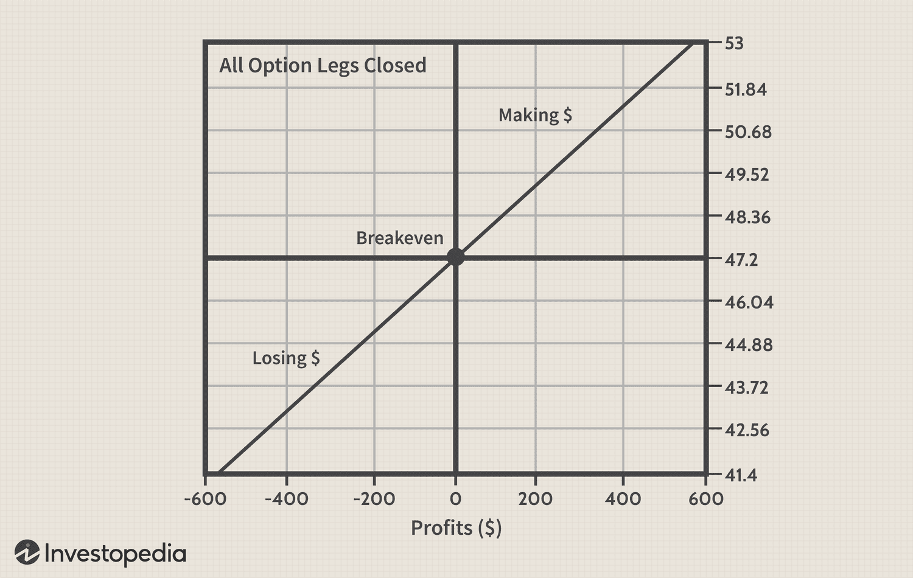

Options trading has become an integral component of the financial markets, offering traders the potential for significant gains due to its inherent leverage. This leverage provides an opportunity to control a sizeable position in an asset with a relatively smaller capital outlay, presenting both opportunities and risks. Among the varied strategies within options trading, 'out-of-the-money' (OTM) options are particularly appealing to some traders due to their lower cost. OTM options have strike prices that are less favorable compared to the asset's current market price. While they tantalize traders with the possibility of high returns, they also come with a heightened risk of expiring worthless.

In recent years, the development of algorithmic trading has significantly influenced the landscape of options trading. By utilizing sophisticated algorithms, traders are able to optimize their trades by executing them with accuracy and speed potentially unattainable by manual methods. Algorithms assess vast amounts of data to predict market movements, refine strategies, and perform trades at high frequencies. Thus, they can manage risks associated with options trading more effectively.



This article examines the intersection of options trading, especially focusing on the risks and opportunities associated with OTM options and the influence of algorithmic trading. It will address how financial risks manifest within options trading environments and present strategies that traders can employ to navigate these risks effectively. Understanding these dynamics is essential for traders looking to harness the full potential of options while mitigating associated risks.

## Table of Contents

## Understanding Options Trading

Options trading is a prominent component of the financial markets, offering a different approach compared to traditional stock trading. At its core, an option is a financial derivative that provides the holder with the right, but not the obligation, to either purchase (call option) or sell (put option) an underlying asset at a predetermined price, known as the strike price, before or at a specific expiration date. This flexibility differentiates options from binding contracts and allows traders to engage in various strategic plays aimed at capitalizing on market movements.

There are two primary types of options in trading: call options and put options. A call option grants the buyer the right to buy an underlying asset, making it valuable in bullish market conditions when an increase in the asset's price is anticipated. Conversely, a put option gives the holder the right to sell an underlying asset, proving beneficial in bearish markets where a price decline is expected. These instruments afford traders the opportunity to execute strategies based on their market outlook, such as hedging against losses or speculating on price changes.

Options trading is distinguished by its characteristic feature of leverage. Leverage in options trading allows investors to control a relatively large position of the underlying asset with a modest capital outlay. This means that the percentage returns can be significantly magnified compared to trading the underlying asset directly. For instance, purchasing an option requires only the payment of the premium, a small fraction of the asset's cost, thus effectively maximizing potential returns. However, this leverage also entails increased financial risk. Traders could potentially lose the entire premium paid for the option if the market does not move as anticipated, highlighting the importance of understanding market dynamics thoroughly.

Several key concepts are intrinsic to comprehending options trading, particularly with respect to options pricing. The intrinsic value of an option refers to the actual value that the option would have if it were exercised immediately. It is calculated as the difference between the current price of the underlying asset and the strike price of the option, for in-the-money options. Time decay, represented by the Greek letter Theta (Θ), is another crucial aspect, signifying the erosion of an option's value as it approaches expiration. The passage of time is generally detrimental to option holders, as the window of opportunity decreases for the underlying asset to move favorably.

Volatility is yet another pivotal [factor](/wiki/factor-investing) influencing options pricing. It refers to the extent of price fluctuations in the asset and is typically expressed as a percentage. Higher [volatility](/wiki/volatility-trading-strategies) usually increases the potential profitability of an option, leading to higher option premiums. The Black-Scholes model and its variants incorporate these factors to evaluate option prices by considering variables such as the current stock price, the strike price, the time until expiration, interest rates, and the volatility of the underlying asset.

In summary, understanding the mechanics of options trading, including the leverage it offers and the essential pricing factors like intrinsic value, time decay, and volatility, is fundamental for navigating this intricate market effectively. Traders who grasp these concepts can develop informed strategies that balance potential returns with the inherent risks involved.

## Out-of-the-Money Options: Risks and Opportunities

Out-of-the-money (OTM) options are a key area of interest for many traders due to their unique risk-reward profile. By definition, OTM options have a strike price that is less favorable compared to the current market price of the underlying asset. For call options, this means the strike price is higher than the current market price, while for put options, it is lower.

These options are typically cheaper to purchase than their in-the-money (ITM) counterparts, making them an attractive proposition for traders with limited capital seeking high returns. The low cost of OTM options enables traders to potentially leverage a larger number of contracts or diversify their positions more broadly across different assets or strike prices. This low entry cost, however, comes with increased risk, primarily due to the higher likelihood of expiring worthless. 

The probability of OTM options finishing in-the-money at expiration is generally lower compared to ITM options. As a result, traders must weigh this low probability of success against the potential for high returns. Successful trading of OTM options requires careful consideration and skillful timing. Traders must not only anticipate favorable market movements that will move the option into the money but also ensure that this occurs within the option's lifespan. Factors such as underlying asset volatility, time to expiration, and prevailing market conditions are critical in decision-making.

Mathematically, the risk-reward dynamics of OTM options can be evaluated using the Black-Scholes model, which helps in determining the theoretical value of options. Here is a simple Python code to compute the value of an OTM call option using this model:

```python
from scipy.stats import norm
import numpy as np

def black_scholes(S, K, T, r, sigma, option_type="call"):
    d1 = (np.log(S / K) + (r + 0.5 * sigma**2) * T) / (sigma * np.sqrt(T))
    d2 = d1 - sigma * np.sqrt(T)

    if option_type == "call":
        return S * norm.cdf(d1) - K * np.exp(-r * T) * norm.cdf(d2)
    elif option_type == "put":
        return K * np.exp(-r * T) * norm.cdf(-d2) - S * norm.cdf(-d1)

# Example parameters
S = 50  # Current stock price
K = 55  # Strike price
T = 1   # Time to expiration (1 year)
r = 0.05  # Risk-free rate (5%)
sigma = 0.2  # Volatility (20%)

call_price = black_scholes(S, K, T, r, sigma, "call")
print(f"OTM Call Option Price: {call_price}")
```

Prudent selection and timing are crucial to effectively leverage OTM options. Traders often utilize various strategies, such as spread strategies or protective puts, to mitigate risks and manage exposure. By combining analytical tools with market insight, traders can better navigate the complexities associated with OTM options, capitalizing on their potential for substantial gains while managing inherent risks effectively.

## Financial Risks in Options Trading

Options trading involves a variety of risks inherent to financial markets, which can significantly impact the outcome of trading strategies. Among these, market risk, volatility risk, and time decay stand out as primary concerns for traders seeking to optimize their returns while minimizing potential losses.

**Market Risk:** This risk stems from the possibility of adverse price movements in the underlying asset. Such fluctuations can result from economic events, geopolitical tensions, or market sentiment. In options trading, market risk is critical as it directly influences the strategies employed and the options' performance.

**Volatility Risk:** Volatility plays a pivotal role in options pricing. It represents the degree of variation in the price of the underlying asset over a specific period. Options contracts are more valuable when the market expects higher volatility since the chance of significant price changes increases, offering opportunities for profit. However, unexpected drops in volatility can negatively affect option prices, particularly impacting strategies like straddles and strangles that benefit from high volatility.

To illustrate volatility in options, the Black-Scholes model is often used, where the option price ($C$ for call options or $P$ for put options) is a function of the underlying asset's price ($S$), the strike price ($K$), the risk-free [interest rate](/wiki/interest-rate-trading-strategies) ($r$), the time to expiration ($T$), and the asset's volatility ($\sigma$):

$$
C = S_0N(d_1) - Ke^{-rT}N(d_2)
$$

Where:
$$
d_1 = \frac{\ln(S_0/K) + (r + \sigma^2/2)T}{\sigma\sqrt{T}}
$$
$$
d_2 = d_1 - \sigma\sqrt{T}
$$

Volatility ($\sigma$) is a crucial input, illustrating its impact on option values.

**Time Decay:** Also known as theta, this refers to the reduction in an option's value as it approaches expiration. The rate of time decay is faster for options with shorter durations, making it a significant risk for traders who hold options contracts for an extended period. The impact of time decay necessitates careful timing and strategy adjustment to preserve option value or realize profits before expiration.

**Risk Management Strategies:** To mitigate these risks, traders employ various strategies. Diversification involves spreading investments across different asset classes or types of positions to reduce exposure to any single risk factor. Additionally, setting stop-loss orders helps manage losses automatically by selling a security when it reaches a specified price. This can prevent catastrophic losses in volatile or declining markets.

By understanding and managing these financial risks, traders can better navigate the complexities of options trading, aiming to capitalize on the opportunities while minimizing potential downsides.

## The Role of Algorithmic Trading in Managing Risks

Algorithmic trading has revolutionized the landscape of options trading by employing computer algorithms to execute trades with precision and speed, attributes that are crucial in the fast-paced markets. These algorithms are programmed to analyze and process vast volumes of data to predict market trends and optimize the timing of trades, making them essential tools for managing financial risks associated with options trading.

In the context of options trading, algorithms can efficiently evaluate market data encompassing historical prices, volatility indices, and other relevant indicators. This allows traders to navigate through complex market scenarios and execute trades based on a comprehensive analysis that considers multiple variables simultaneously. By processing this data instantaneously, algorithms can identify favorable trading opportunities that might be missed by human traders.

The core advantage of [algorithmic trading](/wiki/algorithmic-trading) lies in its ability to execute orders at unrivaled speed. This rapid execution can be particularly beneficial in options trading, where market conditions can change in fractions of a second, affecting pricing and potential returns. Computer algorithms can manage a multitude of trades concurrently, assessing each with precision to ensure optimal execution that human traders cannot match.

However, the development and maintenance of trading algorithms require careful consideration of several factors. Market fluctuations, [liquidity](/wiki/liquidity-risk-premium) constraints, and execution speed are critical elements that need to be addressed to simplify complexity and enhance robustness. Algorithms must be meticulously tested and optimized to handle variations in market conditions, ensuring they can operate effectively even during periods of high volatility.

Despite the significant advantages provided by algorithmic trading, there are inherent risks involved. Technical failures, such as software bugs or hardware malfunctions, can lead to substantial financial losses. Moreover, market anomalies, which may not have been accounted for in the algorithm's design, can result in unintended trading outcomes. It is crucial for developers to implement rigorous testing protocols and build fail-safes to mitigate the possible risks associated with algorithmic trading.

To summarize, algorithmic trading plays a crucial role in managing risks in options trading by executing trades with precision and speed. However, the reliance on technology necessitates a thorough understanding of both its capabilities and limitations to prevent potential pitfalls. Traders must weigh the benefits of using algorithms with the potential risks to optimize their trading strategies in a dynamic market environment.

## Conclusion

Options trading, particularly when engaging with out-of-the-money (OTM) options, is characterized by its intrinsic high-risk and high-reward potential, which naturally draws a broad spectrum of traders. These financial instruments, while enticing due to their relatively low cost, present a synthesis of opportunities and challenges that require a keen understanding of market intricacies. 

Recognizing and managing the financial risks inherent in options trading is vital. The volatility of financial markets can rapidly alter the landscape of potential gains and losses. Algorithmic trading emerges as a powerful ally in this context, offering traders enhanced capabilities through the analysis and execution of trades at speeds far exceeding human capacity. By leveraging advanced predictive algorithms, traders can gain an advantage, optimizing trade timing and capitalizing on transient market conditions.

Despite the robust tools provided by technological innovations, traders must remain proactive and continuously informed about market developments. The financial environment is inherently dynamic, necessitating regular adjustments to strategies and positions to manage risk effectively. Relying solely on technology without a sound understanding of fundamental and technical strategies may leave traders vulnerable to market surprises.

Success in options trading is contingent upon a comprehensive strategy that harmonizes timing and technological tools. An integrated approach that encompasses strategic execution and precise timing, supported by agile technology, can effectively mitigate risks and enhance the potential for achieving substantial financial returns. To excel in this volatile domain, traders must strike a balance between embracing technological advancements and remaining adaptable to ongoing market shifts.

## References & Further Reading

[1]: Black, F., & Scholes, M. (1973). ["The Pricing of Options and Corporate Liabilities."](https://www.cs.princeton.edu/courses/archive/fall09/cos323/papers/black_scholes73.pdf) Journal of Political Economy, 81(3), 637-654.

[2]: Hull, J. C. (2017). ["Options, Futures, and Other Derivatives."](https://www.semanticscholar.org/paper/Options%2C-Futures%2C-and-Other-Derivatives-Hull/89bdee500c8623864fc9eb7a471546aa713acc44) Pearson Education.

[3]: Lopez de Prado, M. (2018). ["Advances in Financial Machine Learning."](https://www.amazon.com/Advances-Financial-Machine-Learning-Marcos/dp/1119482089) Wiley.

[4]: Jansen, S. (2020). ["Machine Learning for Algorithmic Trading - Second Edition."](https://github.com/stefan-jansen/machine-learning-for-trading) Packt Publishing.

[5]: Chan, E. P. (2008). ["Quantitative Trading: How to Build Your Own Algorithmic Trading Business."](https://github.com/ftvision/quant_trading_echan_book) Wiley.

[6]: McMillan, L. G. (2004). ["Options as a Strategic Investment."](https://www.amazon.com/Options-Strategic-Investment-Lawrence-McMillan/dp/0735201978) New York Institute of Finance.