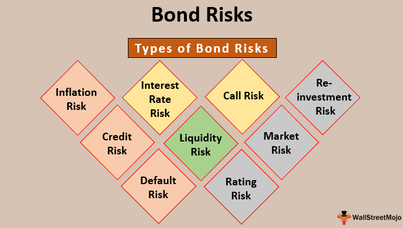

The bond market plays an integral role in the global financial system, offering opportunities for both stability and income. Investors often turn to bonds when seeking to diversify their portfolios, given their reputation for being a safer alternative to equities. Bonds serve as a crucial counterbalance to the volatility associated with stocks, providing predictable income streams through interest payments.

Despite their perceived safety, bond investments come with inherent risks that investors need to understand in order to make informed choices. Key risks include interest rate fluctuations, credit risk, and inflation, each of which can impact the return on investment. Evaluating these risks is essential for any bond investor aiming to maximize returns while safeguarding their capital.



Algorithmic trading has transformed bond investment strategies, adding new dimensions to traditional approaches. By leveraging computer algorithms, traders can optimize the timing and execution of bond trades. This technological innovation enables investors to analyze large datasets, identify patterns, and execute trades with precision and speed. Such capabilities are crucial in navigating the complex landscape of the bond market, where conditions can change rapidly.

This article focuses on exploring the diverse risks associated with bond investments and examining how algorithmic trading can be effectively employed to manage these uncertainties. As technological advancements continue to reshape the financial markets, the need for investors to stay informed and adaptable becomes increasingly important. Understanding the interplay between risk and technology in bond investing is essential for maintaining a competitive edge and achieving financial goals.

## Table of Contents

## Understanding Bonds and Their Types

Bonds are financial instruments that represent a loan made by an investor to a borrower, typically corporate entities or governmental bodies. These instruments are issued to raise capital and come with an obligation to repay the principal along with periodic interest payments, known as coupon payments, over a specified period. Bonds are structured with specific maturity dates at which the borrowers agree to return the principal amount to the bondholder.

There are several types of bonds, each offering distinct risk profiles and returns, tailored to the varying investment objectives of individuals. Among the most prominent categories are U.S. Treasury Bonds, Corporate Bonds, and Municipal Bonds.

U.S. Treasury Bonds are issued by the federal government of the United States and are renowned for their security, backed by the full faith and credit of the U.S. government. These bonds are popular among risk-averse investors because they [carry](/wiki/carry-trading) lower default risk, essentially being considered risk-free with regard to credit risk. However, the trade-off for this safety is a lower yield compared to other bond types. U.S. Treasury Bonds come in various maturities, ranging from short-term Treasury bills to long-term Treasury bonds with maturities up to 30 years.

Corporate Bonds are issued by corporations seeking to raise funds for various purposes, such as expanding operations or financing mergers and acquisitions. These bonds typically offer higher yields than government bonds to compensate for the increased risk of default associated with corporate issuers. The credit quality of Corporate Bonds can vary significantly depending on the issuer's financial health, with higher-rated corporations offering lower yields and lower-rated (often referred to as 'junk' bonds) offering higher yields. Credit rating agencies assess and rate the creditworthiness of corporations, helping investors make informed decisions about the investment risks involved.

Municipal Bonds, often referred to as "munis," are securities issued by states, municipalities, or counties to finance public projects such as infrastructure development. A notable feature of Municipal Bonds is the tax advantage they offer; the interest income from these bonds is typically exempt from federal income taxes and, in some cases, state and local taxes as well. This tax exemption makes them particularly attractive for investors in higher tax brackets. However, like Corporate Bonds, the risk associated with Municipal Bonds can vary, with default risk influenced by the issuing entity's financial stability and revenue-generating capacity.

For investors, comprehending the differences between these bond types is critical to developing a well-rounded investment portfolio. Factors such as yield, tax implications, credit risk, and [liquidity](/wiki/liquidity-risk-premium) should be weighed against one's financial objectives and risk tolerance.

## Investment Risks in the Bond Market

Bond investments, while often considered safer than equities, are not without risks. Various factors can impact the performance and value of bonds, making it essential for investors to understand these risks in depth. Here, we explore some of the primary risks associated with bond investments, namely [interest rate](/wiki/interest-rate-trading-strategies) risk, reinvestment risk, call risk, default risk, and inflation risk.

Interest rate risk is one of the most significant types of risks affecting bond investments. It arises from the inverse relationship between bond prices and interest rates. When interest rates rise, the prices of existing bonds typically decline, as newer bonds offer higher yields, making them more attractive to investors. Therefore, the market value of existing bonds falls to align their yields with those of new issues. This risk is more pronounced for bonds with longer maturities and lower coupon rates. The sensitivity of a bond's price to changes in interest rates can be measured using duration, a concept central to fixed-income analysis. The longer a bond's duration, the more sensitive it is to interest rate changes.

Reinvestment risk emerges when the proceeds from bond repayments or interest payments are reinvested at lower interest rates. This is particularly pertinent when interest rates are declining, reducing the potential yield that investors can earn on their subsequent investments. Reinvestment risk affects callable bonds, as these bonds may be repurchased by the issuer before maturity during periods of falling interest rates, forcing investors to reinvest at lower rates. For instance, an investor holding a 5-year bond with a yield of 5% might face reinvestment risk if, upon the bond's call, prevailing rates have fallen to 3%.

Call risk is associated with the possibility that a bond issuer may redeem a bond before its maturity date, often in scenarios where interest rates have dropped. Issuers have an incentive to refinance debt at lower rates, akin to how homeowners might refinance a mortgage. Callable bonds include a clause that allows issuers to exercise this option. When a bond is called, investors receive the face value of the bond, potentially eliminating the opportunity to enjoy future interest payments at the bond's original higher rate. Thus, while callable bonds can offer higher yields to compensate for this risk, they expose the holder to the uncertainty of receiving lower reinvestment returns.

Default risk, or credit risk, is the risk that a bond's issuer will be unable to meet its financial obligations, including making scheduled interest payments or repaying the principal at maturity. This risk is particularly relevant for corporate bonds, where issuers face varied financial challenges. Ratings agencies, like Moody's and Standard & Poor's, assess and provide credit ratings that indicate the issuer’s creditworthiness. Bonds rated below investment grade, often referred to as high-yield or junk bonds, carry higher default risks compared to investment-grade bonds. Investors must therefore meticulously assess such bonds before inclusion in a portfolio, balancing the potential for higher returns against the increased risk of default.

Inflation risk, also known as purchasing power risk, affects the real returns on bond investments. If the rate of inflation exceeds the bond’s nominal yield, the real value of the investment diminishes over time. This risk is particularly significant for fixed-rate bonds which do not adjust for inflation. For instance, a bond yielding 3% in a 2% inflation environment offers a real return of 1%. However, if inflation rises to 4%, the real return becomes negative, eroding the investor’s purchasing power. Inflation-linked bonds, such as Treasury Inflation-Protected Securities (TIPS) in the United States, provide a mechanism to mitigate this risk, as their principal adjusts in line with inflation rates.

In summary, while bonds are generally perceived as less volatile than equities, they are not devoid of risks. A nuanced understanding of these risks is essential for effective bond investment and risk management strategies.

## The Role of Economic Indicators

Economic indicators such as inflation and interest rates are critical in influencing bond valuations and associated risks. These indicators provide insights into the current and anticipated state of the economy, guiding investors in forming strategies that match prevailing market conditions.

Inflation, which measures the rate at which the general level of prices for goods and services rises, can significantly affect bond investments. Higher inflation typically leads to an increase in interest rates as central banks attempt to curb inflationary pressures. This, in turn, affects bond prices negatively as there is an inverse relationship between bond prices and interest rates. For instance, when interest rates rise, newly issued bonds offer higher yields, making existing bonds with lower yields less attractive, leading to a drop in their market price.

An important consideration for bond investors is managing the erosion of real returns due to inflation. Real return is calculated as the nominal return minus the inflation rate. For example, if a bond provides a nominal yield of 3% and the inflation rate is 2%, the real return is only 1%. To mitigate inflation risk, investors might consider Treasury Inflation-Protected Securities (TIPS), which adjust the principal based on changes in the Consumer Price Index (CPI), thereby maintaining purchasing power.

Interest rates directly influence how bonds are valued. In a rising interest rate environment, bond prices generally decrease because the opportunity cost of holding existing bonds with lower yields increases. Investors may strategically choose short-term bonds in such environments to reduce the portfolio's interest rate sensitivity and [volatility](/wiki/volatility-trading-strategies). Short-term bonds mature quicker, allowing for reinvestment at current, potentially higher rates compared to long-term bonds.

For investors managing bond portfolios, understanding the relationship between economic indicators and bond markets is pivotal. Economic data releases, such as employment figures, GDP growth rates, and CPI reports, can signal changes in inflation and interest rates. By interpreting these indicators, investors can anticipate market shifts and adjust their bond strategies accordingly.

In conclusion, incorporating economic indicators such as inflation and interest rates into bond investment decisions allows for more informed strategy development, enhancing the likelihood of achieving desired financial outcomes. As these indicators fluctuate, so do the valuations and risks associated with bond investments, necessitating ongoing analysis and adaptation from investors.

## Algorithmic Trading in Bond Investments

Algorithmic trading, commonly referred to as algo trading, leverages computer algorithms to execute trades with high precision and speed. In the context of bond investments, [algorithmic trading](/wiki/algorithmic-trading) enhances the timing of investments by employing advanced algorithms to analyze vast datasets, uncover patterns, and identify favorable conditions for trading. This data-driven approach reduces the influence of cognitive biases on investment decisions, ensuring that trades are conducted based on objective analysis rather than subjective judgment.

The primary advantage of algorithmic trading in the bond market is its capacity to process large volumes of information more efficiently than human traders. By swiftly interpreting economic indicators, market trends, and price movements, algorithms can execute trades at optimal times, thereby maximizing profit potential and minimizing risk. For instance, a trading algorithm might be programmed to analyze interest rate fluctuations, detect trends, and adjust portfolio allocations accordingly within milliseconds, far quicker than any human analyst could achieve.

Algorithmic trading also enables the [backtesting](/wiki/backtesting) of strategies using historical data. This capability allows traders to evaluate potential strategies under past market conditions, iterating on these strategies to refine their effectiveness before applying them to real-world scenarios. By using programming languages such as Python, traders can write scripts to simulate trades and measure outcomes against historical benchmarks.

Here's a simple Python example demonstrating an algorithm for analyzing bond price trends and executing trades based on moving averages:

```python
import pandas as pd
import numpy as np

# Dummy dataset: dates and bond prices
data = {'date': pd.date_range(start='1/1/2022', periods=100),
        'price': np.random.normal(loc=100, scale=2, size=100)}
df = pd.DataFrame(data).set_index('date')

# Calculate moving averages
df['short_mavg'] = df['price'].rolling(window=5).mean()
df['long_mavg'] = df['price'].rolling(window=20).mean()

# Generate trading signals
df['signal'] = 0
df.loc[df['short_mavg'] > df['long_mavg'], 'signal'] = 1  # Buy
df.loc[df['short_mavg'] < df['long_mavg'], 'signal'] = -1 # Sell

# Execute trades based on signal
def execute_trades(df):
    for i in range(1, len(df)):
        if df['signal'].iloc[i] == 1 and df['signal'].iloc[i-1] != 1:
            print(f"Buying on {df.index[i]} at price {df['price'].iloc[i]}")
        elif df['signal'].iloc[i] == -1 and df['signal'].iloc[i-1] != -1:
            print(f"Selling on {df.index[i]} at price {df['price'].iloc[i]}")

execute_trades(df)
```

In this script, moving averages are used as a simple strategy to identify buy and sell signals. Whenever the short-term moving average surpasses the long-term moving average, a signal to buy is generated, whereas a crossover in the opposite direction generates a sell signal. This kind of setup reflects the logic behind many trading algorithms that utilize technical indicators to determine market entry and [exit](/wiki/exit-strategy) points.

Algorithmic trading is indispensable for investors aiming to enhance their portfolio performance and maintain a competitive edge in modern financial markets. As the bond market continues to evolve with technological advancements, the use of sophisticated algorithms will likely become even more integral in the strategic arsenal of investors.

## Strategies for Bond Investment

Strategies for bond investment are crucial for balancing risk and optimizing returns. Among the common strategies are laddering and barbell approaches, each offering distinct methods to manage bond maturities and respond to interest rate fluctuations.

Laddering is a strategy that entails purchasing bonds with varying maturities. This approach provides a consistent stream of income by staggering bond maturity dates, ensuring that the investor always has bonds reaching maturity at regular intervals. This enhances liquidity and reduces interest rate risk, as maturing bonds can be reinvested at current rates, capturing future interest rate movements. For instance, an investor may buy bonds maturing in one, two, and three years. As the one-year bond matures, it is reinvested in another three-year bond, maintaining the ladder's structure. This strategy effectively smoothens returns over different interest rate environments and helps in managing the risk of fluctuating interest rates.

The barbell strategy, on the other hand, focuses on investing in short- and long-term bonds while avoiding those with intermediate maturities. This method aims to balance the need for immediate liquidity (via short-term bonds) with the higher yields typically associated with long-term bonds. Short-term bonds provide flexibility, enabling quick adjustments to the portfolio, while long-term bonds offer potential for higher returns if interest rates decrease. This strategy can be particularly effective when interest rate movements are uncertain, allowing the investor to adjust quickly if short-term opportunities present themselves or to hold onto long-term investments if they prove advantageous over time.

Implementing these strategies effectively requires integrating market timing with robust risk management. Investors need to assess their financial goals and risk tolerance, tailoring their bond investments to align with these parameters. For example, a conservative investor may prefer a laddering strategy that emphasizes consistent income, while a more aggressive investor might opt for a barbell approach to exploit potential rate shifts. Both strategies require regular portfolio reviews and adjustments to ensure they continue to meet the investor’s objectives, especially in changing economic conditions.

Understanding the nuances of laddering and barbell strategies allows investors to craft bond portfolios that not only mitigate risks but also capitalize on opportunities presented by market dynamics. As economic conditions evolve, adapting these strategies can aid in achieving desired financial outcomes, while maintaining a steady risk-return balance.

## Conclusion

Investing in the bond market requires a careful balance between risks and potential returns through strategic planning. The integration of algorithmic trading in bond investments offers significant advantages, as it enhances efficiency and accuracy, providing investors with a competitive edge. By employing complex algorithms to manage trades, investors can better capture opportunities and mitigate risks associated with market volatility. These algorithms analyze large datasets to identify trends and optimal entry and exit points, which can be critical for enhancing portfolio performance.

Moreover, a comprehensive understanding of economic indicators such as interest rates and inflation is crucial for making informed decisions in bond investments. These indicators have a direct impact on bond valuations and can significantly influence investment outcomes. For instance, a rise in interest rates typically leads to a decrease in bond prices, while inflation can erode the purchasing power of fixed-income returns. Consequently, investors must continually assess these variables to align their bond investment strategies with current market conditions.

As the financial landscape evolves with technological innovations, staying informed and adaptable becomes paramount for bond investors. Embracing technology and continuously updating knowledge on market dynamics and economic indicators can help investors maintain an edge. Therefore, incorporating algorithmic trading and leveraging economic insights are essential components of a robust bond investment strategy, enabling investors to navigate the complexities of the bond market effectively.

## References & Further Reading

[1]: ["Algorithms for Hyper-Parameter Optimization."](https://dl.acm.org/doi/10.5555/2986459.2986743) Advances in Neural Information Processing Systems 24, Bergstra, J., Bardenet, R., Bengio, Y., & Kégl, B. (2011).

[2]: ["Advances in Financial Machine Learning"](https://www.amazon.com/Advances-Financial-Machine-Learning-Marcos/dp/1119482089) by Marcos Lopez de Prado

[3]: ["Evidence-Based Technical Analysis: Applying the Scientific Method and Statistical Inference to Trading Signals"](https://www.amazon.com/Evidence-Based-Technical-Analysis-Scientific-Statistical/dp/0470008741) by David Aronson

[4]: ["Machine Learning for Algorithmic Trading"](https://github.com/stefan-jansen/machine-learning-for-trading) by Stefan Jansen

[5]: ["Quantitative Trading: How to Build Your Own Algorithmic Trading Business"](https://www.amazon.com/Quantitative-Trading-Build-Algorithmic-Business/dp/1119800064) by Ernest P. Chan

[6]: ["Fixed Income Analysis"](https://en.wikipedia.org/wiki/Fixed_income_analysis) by Barbara S. Petitt, Jerald E. Pinto, and Wendy L. Pirie

[7]: ["The Bond Book: Everything You Need to Know About Treasuries, Municipals, GNMAs, Corporates, Zeros, Bond Funds, Money Market Funds, and More"](https://www.amazon.com/Bond-Book-Everything-Treasuries-Corporates/dp/0071541057) by Annette Thau

[8]: ["Bond Markets, Analysis, and Strategies"](https://books.google.com/books/about/Bond_Markets_Analysis_and_Strategies_ten.html?id=bQpNEAAAQBAJ) by Frank J. Fabozzi