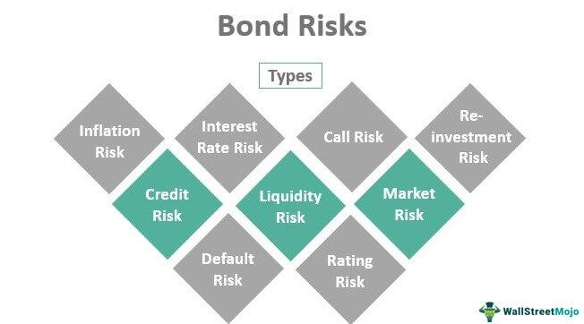

## Table of Contents

## What are bonds and how do they work?

Bonds are like IOUs that governments or companies issue when they need to borrow money. When you buy a bond, you are lending money to the issuer. In return, the issuer promises to pay you back the amount you lent, called the principal, on a specific date, known as the maturity date. They also agree to pay you interest regularly, usually every six months, until the bond matures. This interest is called the coupon.

Think of a bond like a loan agreement. For example, if you buy a $1,000 bond with a 5% annual coupon rate that matures in 10 years, the issuer will pay you $50 every year (or $25 every six months) as interest. At the end of the 10 years, they will give you back your $1,000. Bonds can be a safe way to invest your money because they provide a steady income stream and the return of your principal at maturity, but they also come with risks, like the possibility that the issuer might not be able to pay you back.

## What is the relationship between interest rates and bond prices?

When interest rates go up, bond prices go down. This happens because new bonds that are issued will have higher coupon rates to match the new, higher interest rates. If you have an old bond with a lower coupon rate, it becomes less attractive to investors because they can get a better deal with the new bonds. So, to sell your old bond, you have to lower its price.

On the other hand, when interest rates go down, bond prices go up. This is because new bonds will have lower coupon rates. Your old bond with a higher coupon rate becomes more attractive to investors because it pays more interest than the new bonds. So, you can sell your old bond for a higher price.

This relationship between interest rates and bond prices is important for investors to understand because it affects the value of their bond investments. If you think interest rates will rise, you might want to avoid buying bonds or sell the ones you have. If you think interest rates will fall, buying bonds could be a good idea.

## What is credit risk and how does it affect bond investments?

Credit risk is the chance that the issuer of a bond might not be able to pay back the money they borrowed from you. This is also called default risk. If a company or government is having money problems, they might not be able to make the interest payments or return your principal when the bond matures. This risk is higher with bonds from companies that are not doing well financially, or from countries that have unstable economies.

When you invest in bonds, credit risk can affect how much money you make and how safe your investment is. Bonds with higher credit risk usually offer higher interest rates to attract investors, because people want more reward for taking on more risk. If the issuer does default, you could lose some or all of your investment. To help manage this risk, investors can look at credit ratings from agencies like Moody's or Standard & Poor's, which give a grade to bonds based on how likely the issuer is to pay back the money.

## What is interest rate risk and how can it impact bond portfolios?

Interest rate risk is the chance that changes in interest rates will affect the value of your bond investments. When interest rates go up, the prices of existing bonds go down. This happens because new bonds will be issued with higher interest rates, making your old bonds with lower rates less attractive to buyers. If you need to sell your bonds before they mature, you might have to sell them for less than what you paid.

This risk can really affect bond portfolios because it changes how much your bonds are worth. If you're planning to hold onto your bonds until they mature, you don't have to worry as much about interest rate changes. But if you might need to sell your bonds early, you need to think about how interest rates might change. To manage this risk, some investors spread out their investments across different types of bonds or use strategies like laddering, where they buy bonds that mature at different times.

## How does inflation affect the returns on bond investments?

Inflation can make the money you earn from bonds worth less over time. When inflation goes up, the prices of things you buy, like food and gas, also go up. If the interest you get from your bonds doesn't keep up with inflation, you'll be able to buy less with that money than you could before. For example, if you get $50 in interest from your bond but inflation is at 3%, the real value of that $50 drops because everything costs more.

To protect against inflation, some bonds, like Treasury Inflation-Protected Securities (TIPS), adjust their principal based on inflation rates. This means the interest payments and the amount you get back at maturity can go up with inflation, helping to keep the real value of your investment. But not all bonds do this, so it's important to think about inflation when you're choosing which bonds to buy. If inflation is high or expected to go up, bonds with fixed interest rates might not be the best choice because their returns won't keep up with rising prices.

## What are the liquidity risks associated with investing in bonds?

Liquidity risk in bond investing means you might not be able to sell your bonds quickly or at a good price. Some bonds, like those from big companies or the government, are easy to sell because lots of people want to buy them. But other bonds, like those from smaller companies, might be harder to sell because fewer people are interested. If you need to sell these bonds fast, you might have to accept a lower price than what you paid.

This risk can affect how much money you make from your bond investments. If the market for a certain bond is not very active, you might have to wait a long time to find a buyer, or you might have to sell at a lower price than you wanted. It's important to think about how easy it will be to sell your bonds if you need your money back quickly. Choosing bonds that are more popular and easier to sell can help reduce this risk.

## How does reinvestment risk play a role in bond investing?

Reinvestment risk is about what happens when you get money back from your bonds, like interest payments or the principal when the bond matures. If interest rates have gone down since you bought the bond, you might have to put that money into new bonds that pay less interest. This means you won't earn as much money as you did before, even though you still have the same amount of money to invest.

This risk can make a big difference in how much money you make from your bond investments over time. If you were counting on the same level of income from your bonds, lower interest rates could mean you get less money than you planned. To manage this risk, some investors try to match the timing of their bond maturities with when they'll need the money, or they might choose bonds that let them reinvest at the same rate.

## What are the tax implications of investing in bonds?

When you invest in bonds, you need to think about taxes. The interest you earn from most bonds is usually taxed as regular income. This means you'll pay taxes on that interest every year, just like you do with your salary. The tax rate you pay depends on your income and the tax laws where you live. Some bonds, like municipal bonds, can be tax-free if you buy them from your own state. This can be a big advantage because you get to keep more of the interest you earn.

Another tax thing to know about bonds is what happens when you sell them. If you sell a bond for more than you paid for it, you might have to pay capital gains tax on the profit. If you sell it for less than you paid, you might be able to claim a loss on your taxes, which can help lower what you owe. It's important to keep track of how much you paid for your bonds and what you sell them for, so you can figure out your taxes correctly. Talking to a tax advisor can help you understand all the tax rules and plan your bond investments better.

## How can currency risk impact international bond investments?

When you invest in bonds from other countries, you have to think about currency risk. This is the chance that changes in the value of different currencies can affect how much money you make. If the currency of the country where you bought the bond goes down compared to your own currency, the money you get back when you sell the bond or get interest payments will be worth less. For example, if you buy a bond in euros and the euro gets weaker against the dollar, you'll get fewer dollars back when you convert your earnings.

To manage this risk, some investors use strategies like hedging, which means they do something to protect against currency changes. But hedging can be complicated and might cost extra money. If you're thinking about buying bonds from other countries, it's important to understand how currency changes could affect your investment and decide if the extra risk is worth it for the potential rewards.

## What is duration and how does it measure a bond's sensitivity to interest rate changes?

Duration is a way to measure how sensitive a bond is to changes in interest rates. It tells you how much the price of a bond will go up or down when interest rates change. Duration is measured in years, and a bond with a higher duration is more sensitive to interest rate changes. For example, if a bond has a duration of 5 years, its price might go up or down about 5% for every 1% change in interest rates.

This measure is really useful for investors because it helps them understand how their bond investments might be affected by interest rate changes. If you think interest rates will go up, you might want to avoid bonds with long durations because their prices could drop a lot. On the other hand, if you think interest rates will go down, bonds with longer durations could be a good choice because their prices could go up more. By knowing the duration of your bonds, you can make better decisions about which bonds to buy or sell.

## What are callable bonds and what are the risks associated with them?

Callable bonds are special types of bonds that the issuer can decide to pay back before they are supposed to mature. They do this if interest rates go down, so they can borrow money again at a lower rate. When a bond is called, you get your money back earlier than you planned, but you might not get to keep earning the interest you were expecting. This means you have to find a new place to invest your money, maybe at a lower interest rate.

The main risk with callable bonds is that you might lose out on future interest payments. If interest rates drop and the bond gets called, you'll get your principal back, but then you have to reinvest that money. If the new interest rates are lower, you'll earn less money than you would have with the original bond. This is called reinvestment risk. It's important to think about this risk when you're deciding whether to buy callable bonds, because it can affect how much money you make over time.

## How can an investor use diversification to mitigate risks in a bond portfolio?

Diversification is a smart way to lower the risks in your bond portfolio. It means you spread your money across different types of bonds. Instead of putting all your money into one bond or one type of bond, you buy a mix. This way, if one bond doesn't do well, you won't lose all your money because you have other bonds that might do better. For example, you could buy bonds from different companies, from different countries, or with different maturity dates. This helps protect you from things like credit risk, where a company might not pay you back, or interest rate risk, where bond prices might go down.

By diversifying, you can also reduce the impact of inflation and currency risks. If you only buy bonds from one country, changes in that country's currency could hurt your investment. But if you buy bonds from different countries, the good performance of one currency might balance out the bad performance of another. Also, mixing in bonds that adjust for inflation, like TIPS, can help keep the value of your investment steady even when prices go up. Diversification doesn't get rid of all risks, but it can make your bond portfolio safer and more likely to give you steady returns over time.

## References & Further Reading

[1]: ["Algorithms for Hyper-Parameter Optimization."](https://dl.acm.org/doi/10.5555/2986459.2986743) Advances in Neural Information Processing Systems 24, Bergstra, J., Bardenet, R., Bengio, Y., & Kégl, B. (2011).

[2]: ["Advances in Financial Machine Learning"](https://www.amazon.com/Advances-Financial-Machine-Learning-Marcos/dp/1119482089) by Marcos Lopez de Prado

[3]: ["Evidence-Based Technical Analysis: Applying the Scientific Method and Statistical Inference to Trading Signals"](https://www.amazon.com/Evidence-Based-Technical-Analysis-Scientific-Statistical/dp/0470008741) by David Aronson

[4]: ["Machine Learning for Algorithmic Trading"](https://github.com/stefan-jansen/machine-learning-for-trading) by Stefan Jansen

[5]: ["Quantitative Trading: How to Build Your Own Algorithmic Trading Business"](https://www.amazon.com/Quantitative-Trading-Build-Algorithmic-Business/dp/1119800064) by Ernest P. Chan

[6]: ["Fixed Income Analysis"](https://en.wikipedia.org/wiki/Fixed_income_analysis) by Barbara S. Petitt, Jerald E. Pinto, and Wendy L. Pirie

[7]: ["The Bond Book: Everything You Need to Know About Treasuries, Municipals, GNMAs, Corporates, Zeros, Bond Funds, Money Market Funds, and More"](https://www.amazon.com/Bond-Book-Everything-Treasuries-Corporates/dp/0071541057) by Annette Thau

[8]: ["Bond Markets, Analysis, and Strategies"](https://books.google.com/books/about/Bond_Markets_Analysis_and_Strategies_ten.html?id=bQpNEAAAQBAJ) by Frank J. Fabozzi