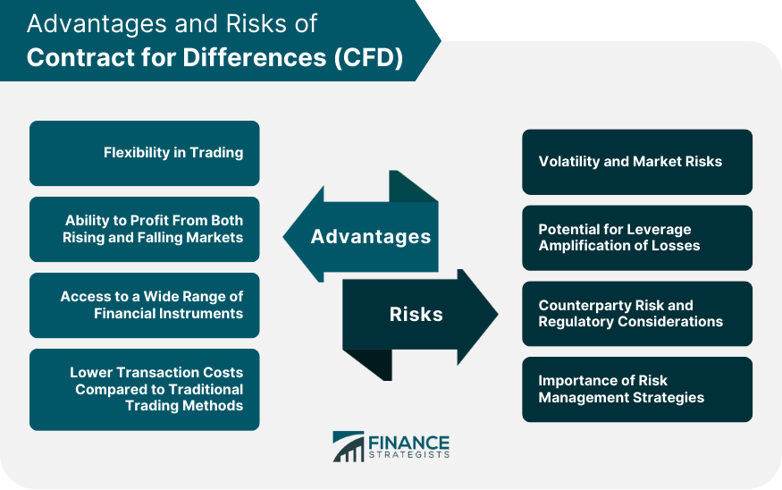

## Table of Contents

## What is a Contract for Difference (CFD)?

A Contract for Difference, or CFD, is a type of financial agreement between two parties. It allows traders to bet on the price movement of an asset without actually owning it. For example, you can trade CFDs on stocks, commodities, or currencies. The main idea is that you agree to exchange the difference in the price of an asset from when the contract opens to when it closes.

If the price of the asset goes up, the seller pays the buyer the difference. If the price goes down, the buyer pays the seller. This means you can make money if the price goes up or down, but it also means you can lose money. CFDs are popular because they let you use leverage, which means you can trade with more money than you actually have. However, this can also increase your risk of losing money.

## How does a CFD work?

A CFD works by letting you bet on whether the price of an asset, like a stock or commodity, will go up or down. You don't actually own the asset. Instead, you enter into an agreement with another party. If you think the price will go up, you "buy" the CFD. If you think it will go down, you "sell" the CFD. When the contract ends, the difference between the opening and closing prices is settled between you and the other party.

If the price goes up and you bought the CFD, the seller pays you the difference. If the price goes down and you bought the CFD, you pay the seller the difference. The same thing happens in reverse if you sold the CFD. The key thing is that you can make or lose money based on how the price changes, without ever owning the actual asset. This makes CFDs a way to speculate on price movements, but it also means you can lose more than you invest if the market moves against you.

## What are the basic risks associated with CFD trading?

CFD trading can be risky because it uses leverage. Leverage means you can trade with more money than you actually have. This can make your profits bigger, but it can also make your losses bigger. If the market moves against you, you might lose more money than you put in. This is called a margin call, where you have to add more money to your account or your position will be closed.

Another risk is that CFD prices can be different from the actual market prices. This is called a spread, and it's how brokers make money. If the spread is big, it can eat into your profits or make your losses worse. Also, CFD trading can be fast and emotional, which can lead to bad decisions. It's easy to get caught up in the excitement and make trades that you might regret later.

## Can you explain the concept of leverage in CFDs and its risks?

Leverage in CFD trading means you can control a big amount of money with a small amount of your own money. It's like borrowing money from your broker to trade. If you put in $100 and use leverage, you might be able to trade with $1000 or even more. This can make your profits bigger if the market moves the way you want. But it can also make your losses bigger if the market moves against you.

The big risk with leverage is that you can lose more money than you put in. If the market goes the wrong way, you might get a margin call. This means you have to put more money into your account or your trade will be closed. If you can't add more money, you might lose everything you put in, and sometimes even more. So, while leverage can help you make more money, it also makes trading riskier.

## What is margin call and how does it impact CFD trading?

A margin call happens when the money in your trading account gets too low. When you use leverage to trade CFDs, you only need to put down a small amount of money, called the margin, to open a trade. If the market moves against you and your losses start to eat into your margin, your broker might ask you to add more money to your account. This is called a margin call.

If you can't add more money when you get a margin call, your broker might close your trade to stop you from losing even more money. This can be a big problem because you could lose all the money you put in, and sometimes even more. So, margin calls are a big risk in CFD trading because they can force you to close trades at bad times and lose a lot of money.

## How does market volatility affect CFD trading?

Market [volatility](/wiki/volatility-trading-strategies) means that prices can change a lot and very quickly. This can be good and bad for CFD trading. If you are good at guessing which way the market will go, you can make a lot of money when prices move a lot. But if you guess wrong, you can lose a lot of money very fast. Because CFDs use leverage, even small changes in the market can have a big effect on your account.

When the market is very volatile, you might get margin calls more often. This is because the big price swings can make your losses bigger, and you might need to add more money to your account to keep your trades open. If you can't add more money, your broker might close your trades at a bad time, and you could lose a lot of money. So, market volatility can make CFD trading more exciting, but it also makes it riskier.

## What are the tax implications of trading CFDs?

When you trade CFDs, you need to think about taxes. In many places, the money you make from CFD trading is seen as income. This means you have to pay taxes on your profits, just like you would with money from a job. The rules can be different depending on where you live, so it's a good idea to check the tax laws in your country. Sometimes, you can also take away the money you lose from your taxes, which can help lower what you owe.

Another thing to think about is if your country has special taxes for financial trading. Some places might have a tax just for trading things like CFDs. This could be a small amount you pay every time you make a trade. It's important to know about these extra taxes because they can change how much money you make from trading. Always talk to a tax expert to make sure you're doing everything right and not missing any tax breaks you might be able to use.

## What are the regulatory risks involved in CFD trading?

When you trade CFDs, you need to be aware of the rules set by regulators in different countries. These rules can change, and sometimes they can make it harder to trade or even stop you from trading CFDs. For example, some countries might decide that CFDs are too risky for regular people, so they might limit how much you can trade or how much leverage you can use. If you don't follow these rules, you could get into trouble with the law or lose money if your trades get canceled.

Another thing to think about is that not all CFD brokers are the same. Some might be regulated by strict rules, while others might not be regulated at all. If you trade with a broker that isn't properly regulated, you might not be protected if something goes wrong. This means you could lose your money if the broker goes out of business or if they do something shady. So, it's important to check if your broker is regulated and to understand the rules in your country before you start trading CFDs.

## How do liquidity risks impact CFD trading?

Liquidity in CFD trading means how easy it is to buy or sell a CFD without changing its price too much. If a market is very liquid, you can trade a lot without worrying about big price changes. But if the market isn't very liquid, it can be hard to get in or out of a trade quickly. This can be a problem because if you need to close your trade fast, you might not be able to do it at the price you want. This can make your losses bigger or stop you from making as much money as you hoped.

When trading CFDs, low [liquidity](/wiki/liquidity-risk-premium) can also make the price move in big jumps. If there aren't many people trading, even a small trade can push the price up or down a lot. This can be risky because it makes it harder to predict how much money you might make or lose. So, it's important to know how liquid the market is before you start trading CFDs, because it can affect your trades a lot.

## What are the psychological risks and challenges of CFD trading?

Trading CFDs can be really hard on your mind. It's easy to get caught up in the excitement and make quick decisions that you might regret later. When you see prices moving fast, you might feel a lot of pressure to act right away. This can lead to stress and bad choices, like holding onto a losing trade too long because you hope it will turn around, or jumping into a trade without thinking it through. It's important to stay calm and stick to a plan, but that can be tough when you're watching your money go up and down.

Another challenge is dealing with losses. Losing money can make you feel bad and might make you want to trade more to win it back. This can lead to a cycle of risky trading where you take bigger and bigger chances to make up for what you lost. It's hard to accept that losing is part of trading, and it can mess with your head if you don't handle it well. So, it's really important to have a good mindset and know how to manage your emotions when you're trading CFDs.

## How can one effectively manage and mitigate risks in CFD trading?

To manage and mitigate risks in CFD trading, it's important to start with a solid trading plan. This means setting clear goals, deciding how much money you're willing to risk on each trade, and sticking to a strategy that you've thought through. Using stop-loss orders can help limit your losses by automatically closing a trade if the price moves against you by a certain amount. It's also a good idea to only risk a small part of your total money on any single trade, usually no more than 1-2%. This way, even if you lose, you won't lose everything at once.

Another key part of managing risks is understanding and using leverage carefully. While leverage can make your profits bigger, it can also make your losses bigger. So, it's important to use less leverage than what's available to you. Keeping an eye on your account balance and being ready for margin calls can help you avoid big losses. It's also helpful to stay informed about market news and events that could affect the prices of the assets you're trading. By staying calm and sticking to your plan, you can better handle the ups and downs of CFD trading and protect your money.

## What advanced strategies can experienced traders use to handle the risks of CFDs?

Experienced traders can use hedging to manage risks in CFD trading. Hedging means taking another trade that can help protect your main trade. For example, if you think the price of a stock will go up, you might buy a CFD on that stock. But to hedge, you could also buy a CFD that will make money if the price goes down. This way, if the price goes down instead of up, your hedge can help cover some of your losses. Hedging can be tricky because it can also lower your profits, but it's a smart way to manage risk if you know what you're doing.

Another advanced strategy is using technical analysis to make better trading decisions. This means looking at charts and patterns to guess where the price might go next. Experienced traders might use things like moving averages, support and resistance levels, and other tools to find good times to buy or sell. By understanding these patterns, they can set up trades that have a better chance of making money and also know when it's time to get out of a trade to avoid big losses. This can help them handle the ups and downs of the market and keep their risks under control.

## What are Contracts for Difference (CFDs) and how do they work?

Contracts for Difference (CFDs) are financial derivatives that allow traders to speculate on price movements of various underlying assets without owning them. When participating in a CFD contract, the trader takes a position on the future price direction of an underlying asset, which can include stocks, commodities, indices, or foreign exchange. The difference between the opening and closing prices of the contract results in a profit or loss for the trader, depending on the accuracy of the prediction. Importantly, CFDs are settled in cash, with no delivery of physical goods or securities involved.

One prominent feature that distinguishes CFDs from other financial instruments is leverage. Leverage in CFDs enables traders to control a larger position in the market with a relatively small initial investment, known as a margin. This can potentially amplify returns, but it also comes with increased risk, as losses can exceed the initial margin if trades do not go as anticipated. This makes CFDs highly appealing to traders seeking significant returns from modest capital bases. The leverage formula can be expressed as:

$$
\text{Leverage} = \frac{\text{Total Position Size}}{\text{Initial Margin}}
$$

CFDs offer flexibility and access to various markets. They are popular among retail and institutional traders alike due to their broad market coverage. Some of the most common markets where CFDs are traded include:

1. **Forex (Foreign Exchange):** CFDs in forex allow traders to speculate on currency pair movements without physically exchanging currencies.

2. **Commodities:** Traders can engage in CFDs based on the price movements of gold, silver, oil, and other raw materials.

3. **Indices:** CFDs on indices provide exposure to a whole market index, such as the S&P 500 or the FTSE 100, allowing traders to speculate on the overall market direction.

4. **Equities:** Traders can enter CFD contracts on individual stocks to predict their price changes without buying the actual shares.

In conclusion, CFDs offer a versatile trading instrument with advantages such as leverage and broad market accessibility. However, they also come with inherent risks, primarily due to the leveraged nature of trading. As such, it's vital for traders to understand both the mechanics and the risks associated with CFDs to make informed trading decisions.

## References & Further Reading

[1]: ["Contracts for Difference (CFD) Explained,"](https://www.investopedia.com/terms/c/contractfordifferences.asp) Investopedia

[2]: ["Understanding Algorithmic Trading,"](https://www.investopedia.com/terms/a/algorithmictrading.asp) The Balance

[3]: Lopez de Prado, M. (2018). ["Advances in Financial Machine Learning,"](https://www.amazon.com/Advances-Financial-Machine-Learning-Marcos/dp/1119482089) Wiley.

[4]: Chan, E. P. (2009). ["Quantitative Trading: How to Build Your Own Algorithmic Trading Business,"](https://github.com/ftvision/quant_trading_echan_book) Wiley.

[5]: Gomber, P., Arndt, B., Lutat, M., & Uhle, T. (2011). ["High-Frequency Trading,"](https://www.researchgate.net/publication/271631628_High-Frequency-Trading) in Z. Gal and P. Schmalenbach (Eds.), Advances in Algorithmic Trading and Quantitative Strategies, Springer.

[6]: Financial Conduct Authority (FCA). (2019). ["Guidance on Contracts for Difference products and the risks they pose."](https://www.fca.org.uk/firms/contract-for-differences)

[7]: Aronson, D. R. (2007). ["Evidence-Based Technical Analysis: Applying the Scientific Method and Statistical Inference to Trading Signals,"](https://onlinelibrary.wiley.com/doi/book/10.1002/9781118268315) Wiley.