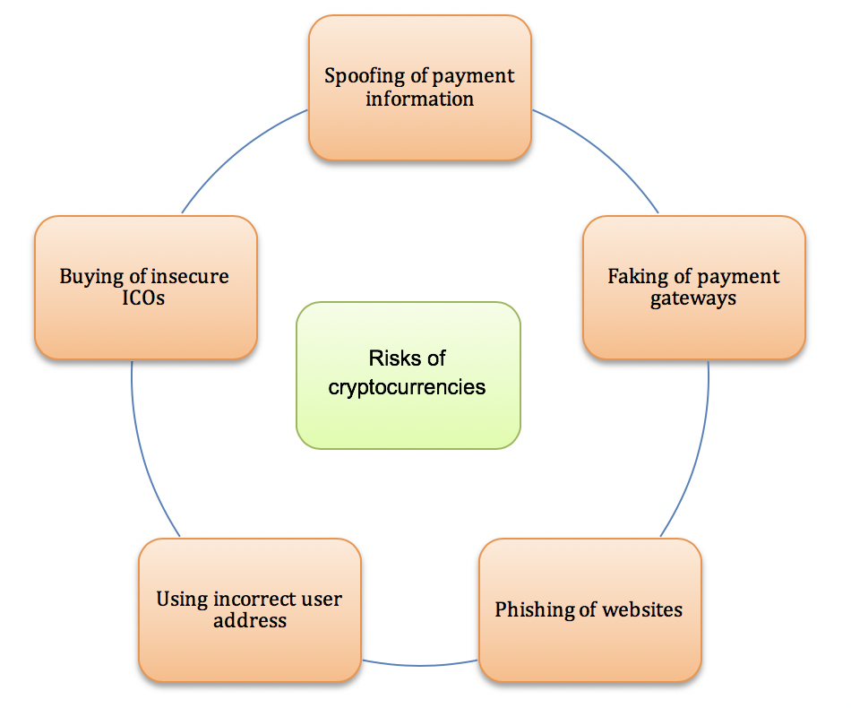

## Table of Contents

## What is corporate cryptocurrency?

Corporate cryptocurrency is a type of digital money that companies create and use for their business activities. It's different from regular money because it's made and managed by a company, not a government. Companies might use it to make their transactions faster and cheaper, or to reward their customers and employees in new ways. For example, a company could give out its own cryptocurrency as a bonus to employees or as a discount to customers.

These cryptocurrencies work on blockchain technology, which is a secure way to keep track of transactions. This means that every time someone uses the corporate cryptocurrency, the transaction is recorded in a way that can't be changed or faked. This makes it safe for companies to use. However, since it's not backed by a government, it can be riskier than using regular money. People need to understand how it works and the risks involved before they start using it.

## Why do companies use cryptocurrencies?

Companies use cryptocurrencies because they can make transactions faster and cheaper. When a company sends money to another country, it usually takes a few days and costs a lot in fees. With cryptocurrencies, the money can move in minutes and the fees are much lower. This is because cryptocurrencies use blockchain technology, which is like a digital ledger that everyone can see but no one can change. This makes it easier and cheaper for companies to do business around the world.

Another reason companies use cryptocurrencies is to attract new customers and keep the ones they have. By giving out their own [cryptocurrency](/wiki/cryptocurrency), companies can offer special deals or rewards that people can't get with regular money. For example, a company might give its cryptocurrency to customers as a discount or to employees as a bonus. This can make people more interested in the company and what it sells. However, using cryptocurrencies can also be risky because they are not backed by a government and their value can go up and down a lot.

## What are the basic risks associated with using cryptocurrencies in a corporate setting?

Using cryptocurrencies in a corporate setting can be risky because their value can change a lot. One day, a cryptocurrency might be worth a lot of money, but the next day, it could be worth much less. This can be a big problem for companies that keep a lot of their money in cryptocurrencies. If the value goes down, the company could lose a lot of money. Also, because cryptocurrencies are not backed by a government, there's no one to help if something goes wrong.

Another risk is that cryptocurrencies can be hard to use. They work on blockchain technology, which is different from regular money. This means that companies need to learn how to use them properly. If they don't, they could make mistakes that cost them money. Also, if a company's cryptocurrency gets stolen by hackers, there's no way to get it back because there's no bank to help. This makes it really important for companies to keep their cryptocurrencies safe.

## How can cryptocurrency volatility affect a company's financial stability?

Cryptocurrency [volatility](/wiki/volatility-trading-strategies) can really shake up a company's financial stability. If a company keeps a lot of its money in cryptocurrencies, and the value of those cryptocurrencies goes down a lot, the company could lose a lot of money. This is a big problem because it can make it hard for the company to pay its bills or invest in new projects. It's like putting all your eggs in one basket, and if that basket falls, you lose everything.

Also, if customers or investors see that a company is losing money because of cryptocurrency volatility, they might lose trust in the company. This can make it harder for the company to get new customers or investors. Without new money coming in, the company might struggle even more. So, it's important for companies to be careful about how much they rely on cryptocurrencies and to have a plan for what to do if the value goes up and down a lot.

## What are the regulatory risks of using corporate cryptocurrencies?

Using corporate cryptocurrencies can be risky because the rules about them are not clear in many places. Governments around the world are still trying to figure out how to regulate cryptocurrencies. This means that a company might be doing something that is okay today, but could be against the rules tomorrow. If the rules change, the company could get in trouble or have to pay big fines. This makes it hard for companies to plan for the future because they don't know what the rules will be.

Another problem is that different countries have different rules about cryptocurrencies. If a company wants to use its cryptocurrency in different countries, it has to follow all those different rules. This can be really hard and expensive. If the company makes a mistake and breaks the rules in one country, it could be banned from doing business there. So, companies need to be very careful and keep up with the rules in every country they want to work in.

## How does the lack of widespread adoption impact corporate use of cryptocurrencies?

The lack of widespread adoption of cryptocurrencies makes it harder for companies to use them. If not many people or businesses use cryptocurrencies, it's tough for a company to find others to trade with. Imagine trying to use a special kind of money that only a few people accept. It's like trying to spend a coin that only works in one store. This can limit how useful cryptocurrencies are for a company, especially if they want to do business with lots of different people.

Also, because not many people use cryptocurrencies, it can be harder for companies to explain them to their customers and employees. If people don't understand how cryptocurrencies work, they might not want to use them. This can make it harder for a company to get people interested in their cryptocurrency. It's like trying to teach everyone a new game when most people are happy playing the old one. So, until more people start using cryptocurrencies, companies might find it tricky to make them a big part of their business.

## What cybersecurity threats are specific to corporate cryptocurrency transactions?

One big cybersecurity threat to corporate cryptocurrency transactions is hacking. Hackers can try to steal the company's cryptocurrency by breaking into their computer systems. Because cryptocurrencies use blockchain technology, once the money is stolen, it's very hard to get it back. There's no bank to help, so companies need to be extra careful to keep their systems safe. They need strong passwords, up-to-date security software, and good ways to check who is trying to use their cryptocurrency.

Another threat is phishing attacks. In these attacks, hackers pretend to be someone the company trusts, like a partner or an employee. They might send fake emails or messages asking for the company's cryptocurrency or the keys to access it. If someone in the company falls for the trick, the hackers can steal the cryptocurrency. Companies need to train their employees to spot these tricks and be careful about who they share information with.

A third threat is insider threats. Sometimes, people who work for the company might try to steal the cryptocurrency. They already know how the company's systems work and where the cryptocurrency is kept. This makes it easier for them to take it without getting caught. Companies need to watch their employees closely and have strong rules about who can access the cryptocurrency and how they can use it.

## How can the anonymity of cryptocurrencies lead to fraud and money laundering risks?

The anonymity of cryptocurrencies can make it easier for people to commit fraud. When someone uses cryptocurrencies, it's hard to know who they really are. They can use fake names or hide behind different accounts. This makes it easier for them to trick companies into sending them money or goods. For example, a person might pretend to be a real customer and order something, but then use a fake cryptocurrency account to pay. By the time the company finds out, the person is gone and the money is hard to trace.

Cryptocurrencies can also be used for money laundering because they are hard to track. People who want to hide where their money comes from can use cryptocurrencies to move it around without anyone knowing. They can take dirty money, turn it into cryptocurrencies, and then turn it back into regular money in a different place. This makes it look like the money came from somewhere else. Companies need to be careful and check where their cryptocurrency is coming from to avoid getting into trouble with the law.

## What are the tax implications for companies using cryptocurrencies?

When companies use cryptocurrencies, they have to think about taxes. The rules can be different depending on where the company is. In some places, using cryptocurrencies can mean the company has to pay taxes on any money they make from it. For example, if a company sells its cryptocurrency for more money than it paid, that extra money might be taxed as a capital gain. This can be tricky because the value of cryptocurrencies can change a lot, so it's hard to know how much tax the company will have to pay.

Another thing to think about is that some countries might see cryptocurrencies as property, not money. This means that if a company uses its cryptocurrency to buy things, it might have to pay taxes on that too. It's like trading one thing for another, and that can be taxed. Companies need to keep good records of all their cryptocurrency transactions to make sure they are following the tax rules. If they don't, they could get in trouble and have to pay big fines.

## How do accounting standards apply to cryptocurrencies in corporate financial statements?

When companies use cryptocurrencies, they have to show them on their financial statements. But the rules for how to do this can be different depending on the country and the accounting standards they use. In some places, they might treat cryptocurrencies like other kinds of money or assets. This means they have to write down how much the cryptocurrencies are worth at the end of each year. If the value goes up or down, they have to show that change on their financial statements too.

It can be tricky to keep track of cryptocurrencies because their value can change a lot. Companies need to make sure they are using the right rules and keeping good records. If they don't, they might make mistakes on their financial statements. This can be a big problem because it can make it hard for people to trust the company's numbers. So, it's really important for companies to understand the accounting rules for cryptocurrencies and follow them carefully.

## What strategies can companies implement to mitigate the risks of using cryptocurrencies?

Companies can reduce the risks of using cryptocurrencies by being careful about how much they use them. Instead of keeping all their money in cryptocurrencies, they can keep only a small part of it there. This way, if the value of the cryptocurrencies goes down, the company won't lose too much money. They can also use different kinds of cryptocurrencies instead of just one. This is like not putting all their eggs in one basket. If one cryptocurrency goes down in value, the others might still be okay.

Another way to lower the risks is to keep up with the rules about cryptocurrencies. Companies need to know what the laws are in the places where they do business. They should also have good security to protect their cryptocurrencies from hackers. This means using strong passwords, keeping their computer systems safe, and teaching their employees about the dangers of phishing attacks. By doing these things, companies can make sure they are using cryptocurrencies in a safe and smart way.

## How might future technological advancements influence the risks associated with corporate cryptocurrencies?

Future technological advancements could make corporate cryptocurrencies safer and easier to use. As blockchain technology gets better, it might become harder for hackers to steal cryptocurrencies. New tools could help companies keep their cryptocurrencies safe and make it easier to spot and stop fraud. Also, as more people start using cryptocurrencies, there might be new ways to make transactions faster and cheaper. This could make it easier for companies to use cryptocurrencies without worrying as much about losing money or getting hacked.

On the other hand, new technology could also bring new risks. As cryptocurrencies become more popular, hackers might find new ways to steal them. Also, as governments learn more about cryptocurrencies, they might make new rules that could make it harder for companies to use them. Companies will need to keep up with these changes and be ready to change how they use cryptocurrencies. By staying on top of new technology and rules, companies can keep using cryptocurrencies in a safe and smart way.

## References & Further Reading

[1]: Yermack, D. (2015). ["Is Bitcoin a Real Currency? An Economic Appraisal."](https://www.sciencedirect.com/science/article/pii/B9780128021170000023) National Bureau of Economic Research.

[2]: Narayanan, A., Bonneau, J., Felten, E., Miller, A., & Goldfeder, S. (2016). ["Bitcoin and Cryptocurrency Technologies: A Comprehensive Introduction."](https://press.princeton.edu/books/hardcover/9780691171692/bitcoin-and-cryptocurrency-technologies) Princeton University Press.

[3]: Vigna, P., & Casey, M. J. (2016). ["The Age of Cryptocurrency: How Bitcoin and Digital Money Are Challenging the Global Economic Order."](https://archive.org/details/ageofcryptocurre0000vign) St. Martin's Griffin.

[4]: Burniske, C., & Tatar, J. (2017). ["Cryptoassets: The Innovative Investor's Guide to Bitcoin and Beyond."](https://www.amazon.com/Cryptoassets-Innovative-Investors-Bitcoin-Beyond/dp/1260026671) McGraw-Hill Education.

[5]: Antonopoulos, A. M. (2017). ["Mastering Bitcoin: Unlocking Digital Cryptocurrencies."](https://books.google.com/books/about/Mastering_Bitcoin.html?id=IXmrBQAAQBAJ) O'Reilly Media.