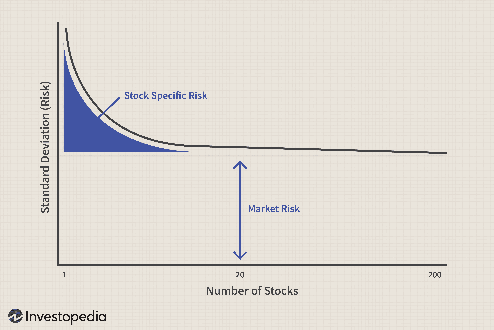

Understanding the complex world of financial risk and investment strategies is crucial for today's investors. The global financial landscape is characterized by uncertainty and rapid changes, making the management of financial risk a vital skill for investors aiming to safeguard their portfolios and achieve optimal returns. Financial risk encompasses various types, including market risk, credit risk, liquidity risk, and operational risk, all of which can significantly impact investment outcomes.

In response to these challenges, portfolio diversification and algorithmic trading have emerged as effective tools to manage risk and enhance returns. Portfolio diversification involves spreading investments across a variety of assets, sectors, and geographies to reduce exposure to any single source of risk. This approach minimizes unsystematic risk, which is specific to individual companies or industries, thereby stabilizing investment performance even during periods of market volatility.



Algorithmic trading, on the other hand, leverages advanced computational techniques and programming to execute trades with high speed and precision. By utilizing sophisticated mathematical models, algorithmic trading can optimize trade execution, reduce human biases, and identify profitable opportunities in the market that might otherwise be missed. This method enhances traditional investment strategies by bringing in a level of precision and efficiency that is difficult to achieve manually.

This article explores the intersection of financial risk management, portfolio diversification, investment strategies, and algorithmic trading. These components, when combined, constitute a robust investment strategy that balances risk and reward effectively. The following sections will elaborate on the nature of financial risk, the significance of diversification, various investment strategies, the role of algorithmic trading, and the synergies between these elements in crafting resilient and dynamic investment portfolios. Through an understanding of these concepts, investors can better navigate the complexities of modern financial markets and make informed decisions that align with their financial goals.

## Table of Contents

## Understanding Financial Risk

Financial risk is a fundamental aspect of investing, representing the potential for financial loss associated with an investment or business decision. The complexity and variability in financial markets necessitate a comprehensive understanding and management of multiple types of risk to protect investment portfolios and ensure long-term financial stability. 

Investors encounter several primary types of financial risk:

1. **Market Risk**: This refers to the risk of losses due to factors that affect the overall performance of financial markets. It can be broken down into several categories, including equity risk (the risk of price changes in stocks), interest rate risk (fluctuations in interest rates affecting bond prices), and currency risk (the risk associated with foreign exchange rate movements).

2. **Credit Risk**: Credit risk is the possibility that a borrower will default on a financial obligation. This type of risk is predominant in lending and bond investing, where investors or institutions face the possibility of not receiving the owed interest or principal.

3. **Liquidity Risk**: Liquidity risk arises when an investor cannot easily exit their position without significant price changes. It reflects the lack of market participants or insufficient demand for certain assets, potentially leading to unfavorable selling conditions and price concessions.

4. **Operational Risk**: Operational risk refers to potential losses resulting from inadequate or failed internal processes, people, systems, or external events. This risk encompasses a wide range of possibilities, from internal fraud and technology failures to natural disasters.

Effective financial risk management seeks to proactively mitigate these risks through methods such as diversification and strategic investment planning. Diversification reduces unsystematic risk by spreading investments across various asset classes, industries, and geographic regions. This strategy ensures that the negative performance of one asset does not disproportionately affect the entire portfolio.

**Strategic Investment**: Implementing strategic investments tailored to the investor's risk tolerance and financial goals can significantly reduce the impact of financial risks. By aligning investment choices with an appropriate risk-reward balance, investors can navigate uncertain financial landscapes more effectively.

Mathematical and statistical methods are also employed to quantify and manage financial risk. For example, the Value at Risk (VaR) model estimates the maximum potential loss of a portfolio over a specific period for a given confidence interval. Such quantitative tools assist investors in understanding potential risks and making informed decisions. 

By comprehensively understanding financial risk and employing robust risk management practices, investors can optimize their investment strategies, effectively enhancing their ability to withstand market fluctuations and unforeseen financial events.

## The Role of Portfolio Diversification

Diversification involves allocating investment capital to different financial instruments, industries, and other categories to minimize the impact of adverse events associated with a specific asset or market segment. The primary purpose of diversification is to reduce unsystematic risk, which refers to risks unique to a particular company or industry. This is distinct from systematic risk, which affects the entire market and cannot be diversified away.

The cornerstone of a diversified portfolio is the inclusion of a wide array of asset classes, such as stocks, bonds, and commodities. By holding a variety of asset classes, investors can mitigate the adverse effects that a downturn in any single sector might have. For example, while equities might perform poorly during a recession, commodities like gold tend to retain value or even appreciate, providing a buffer against losses.

Beyond mixing asset classes, diversification also involves spreading investments across different geographies and sectors. Geographic diversification reduces the risk associated with economic or political instability in a particular region. For instance, European investments might balance the risks of U.S. markets, where localized events like changes in interest rates or monetary policy can have significant impacts. Similarly, within the equities asset class, the inclusion of companies across various sectors like healthcare, technology, and finance helps manage sector-specific risks, such as regulatory changes affecting the pharmaceutical industry or technological obsolescence in the tech sector.

The mathematical foundation of diversification is rooted in Modern Portfolio Theory (MPT), which suggests that an investor can construct a diversified portfolio that will provide the maximum expected return for a given level of risk. The expected return of a portfolio is a weighted sum of the expected returns of the individual assets:

$$
E(R_p) = \sum_{i=1}^{n} w_i E(R_i)
$$

where $E(R_p)$ is the expected return of the portfolio, $w_i$ is the weight of asset i in the portfolio, and $E(R_i)$ is the expected return of asset i.

The risk (or standard deviation) of a portfolio is not simply the weighted sum of the individual risks due to the correlation between asset returns. Instead, it can be calculated using:

$$
\sigma_p = \sqrt{\sum_{i=1}^{n} \sum_{j=1}^{n} w_i w_j \sigma_{i} \sigma_{j} \rho_{ij} }
$$

where $\sigma_p$ is the standard deviation of the portfolio, $\sigma_i$ is the standard deviation of asset i, and $\rho_{ij}$ is the correlation coefficient between asset i and j.

Computational tools and algorithms have further refined the practice of diversification. For instance, using Python, investors can employ libraries like NumPy and pandas to efficiently calculate the expected returns and covariances of assets to more effectively structure diversified portfolios. These computational methods allow investors to quickly adapt their diversified portfolios in response to market changes by leveraging real-time data and analytics.

In summary, portfolio diversification is a critical strategy for reducing unsystematic risks by spreading investments across various asset classes, geographies, and sectors. Its foundation rests on both theoretical principles, such as those espoused by MPT, and modern computational techniques that enhance its application.

## Investment Strategies and Their Importance

Different investment strategies serve as the backbone of effective portfolio management, each catering to distinct investment goals and risk appetites. Growth investing focuses on capital appreciation, with investors seeking companies that exhibit potential for above-average growth. These companies typically reinvest earnings into expansion projects, research, and development, which can lead to higher stock prices. Notable sectors for growth investors include technology and biotechnology, where innovation drives substantial gains. 

On the other hand, value investing involves identifying undervalued stocks, which are believed to be trading below their intrinsic value. Investors employing this strategy aim to capitalize on market inefficiencies, waiting for the true value of these stocks to be recognized. Metrics such as the Price-to-Earnings (P/E) ratio, Price-to-Book (P/B) ratio, and dividend yield play critical roles in evaluating potential value investments.

Income investing targets generating steady income through dividends or interest payments. This strategy is suitable for investors seeking regular cash flow, often incorporating assets like dividend-paying stocks, bonds, and real estate investment trusts (REITs). The focus here is stability and consistent returns rather than rapid growth.

Algorithmic models have revolutionized investment strategies by enabling the combination of these distinct approaches, optimizing returns, and managing risk more effectively. Algorithms can analyze vast datasets to identify patterns, correlations, and trends that might not be evident through traditional analysis. This computational power facilitates the integration of growth, value, and income strategies within a single portfolio, allowing for dynamic allocation based on evolving market conditions.

Moreover, understanding economic indicators and market trends is vital for developing sound investment strategies. Indicators like GDP growth, unemployment rates, and consumer confidence indices provide insights into economic health and potential market movements. Investors leverage this information to anticipate shifts in demand, [interest rate](/wiki/interest-rate-trading-strategies) changes, and other economic factors that can impact asset performance.

In conclusion, the synthesis of different investment strategies through algorithmic models enables investors to enhance portfolio resilience, adapt to market changes, and optimize returns. By assessing economic indicators and trends, investors can refine their strategic approach, ensuring alignment with broader economic shifts and individual financial goals.

 to Algorithmic Trading

Algorithmic trading refers to the use of computer programs to execute trades in financial markets at high speeds and with significant frequency. This approach has transformed traditional trading practices by introducing advanced mathematical models and automated processes that are designed to identify trading opportunities and execute them with minimal human intervention. By doing so, [algorithmic trading](/wiki/algorithmic-trading) seeks to minimize human bias and improve the efficiency and precision of trading operations.

The core advantage of algorithmic trading lies in its ability to process vast amounts of market data quickly and to react to market conditions almost instantaneously. Traditional trading strategies, which are heavily reliant on human decision-making, are often limited by the speed and accuracy with which traders can process information and place trades. Algorithms, on the other hand, can be programmed to follow strict pre-defined criteria, allowing them to execute trades with a consistency and speed that are unattainable for human traders.

Moreover, algorithmic trading incorporates various sophisticated strategies, such as [arbitrage](/wiki/arbitrage), [trend following](/wiki/trend-following), and [market making](/wiki/market-making), each designed to capitalize on different types of market movements. For instance, an arbitrage strategy might be implemented to exploit price discrepancies across different markets or financial instruments, while a trend-following strategy could be used to identify and trade in the direction of prevailing market trends.

The integration of [machine learning](/wiki/machine-learning) techniques further enhances the capabilities of algorithmic trading systems. Machine learning models can be trained to recognize patterns in historical data, allowing algorithms to adapt to evolving market dynamics and predict future price movements with increased accuracy. This adaptability is particularly valuable in rapidly changing or highly volatile market environments.

Algorithmic trading systems can be constructed using various programming languages, with Python being a popular choice due to its extensive libraries and ease of use. Python's pandas library, for instance, is often employed for data manipulation and analysis, while libraries like TensorFlow and scikit-learn are used for implementing machine learning algorithms. An example of a simple trading algorithm in Python might involve using historical price data to generate buy or sell signals based on moving average crossovers. Here is a basic implementation:

```python
import pandas as pd

def moving_average_strategy(data, short_window=40, long_window=100):
    signals = pd.DataFrame(index=data.index)
    signals['price'] = data['close']
    signals['short_mavg'] = data['close'].rolling(window=short_window, min_periods=1).mean()
    signals['long_mavg'] = data['close'].rolling(window=long_window, min_periods=1).mean()
    signals['signal'] = 0.0
    signals['signal'][short_window:] = \
        np.where(signals['short_mavg'][short_window:] > signals['long_mavg'][short_window:], 1.0, 0.0)
    signals['positions'] = signals['signal'].diff()
    return signals

# Example usage with a DataFrame `df` containing historical price data
signals = moving_average_strategy(df)
```

While the potential benefits of algorithmic trading are substantial, it is not without challenges. Factors such as overfitting, where algorithms are too tightly fitted to historical data and fail to perform well in live trading, and technical vulnerabilities, like software bugs or connectivity issues, can pose significant risks. Hence, rigorous testing, continuous monitoring, and prudent risk management are essential components of a successful algorithmic trading strategy.

## How Algorithmic Trading Enhances Portfolio Diversification

Algorithmic trading provides a sophisticated mechanism to achieve portfolio diversification, offering the advantage of real-time adjustments to optimize the diverse composition of assets. By employing advanced algorithms, traders can swiftly reshuffle portfolio components based on current market conditions, which traditional trading might not handle efficiently.

One significant strategy facilitated by algorithmic trading is [statistical arbitrage](/wiki/statistical-arbitrage). This approach involves the use of statistical models to identify and exploit pricing inefficiencies between different financial instruments, allowing portfolios to leverage small price differentials to generate returns. Statistical arbitrage often relies on high-frequency trading capabilities, where algorithms execute numerous trades at a fraction of a second, capitalizing on short-lived market discrepancies.

Another strategy, [momentum](/wiki/momentum) trading, involves algorithms designed to follow market trends and price momentum. This method hinges on the assumption that assets experiencing high returns will continue to perform strongly in the short term. Algorithms are employed to detect these trends and allocate resources dynamically, thus enhancing portfolio diversification by investing in assets that display favorable momentum.

Mean reversion is yet another technique used within algorithmic trading to enhance diversification. This strategy is based on the concept that asset prices and historical returns eventually revert to their respective long-term means. Algorithms can automatically buy undervalued assets and sell overvalued ones, ensuring that the portfolio constantly rebalances to maintain optimal asset distribution.

The incorporation of machine learning models further augments the effectiveness of algorithmic trading. Machine learning allows for the continuous adaptation of trading strategies to changing market conditions. By analyzing vast datasets, machine learning algorithms learn to predict market trends and generate trading insights that can be translated into actionable trades. This adaptive quality of machine learning ensures that a portfolio remains diversified, resilient, and responsive to market dynamics. For instance, a Python script employing machine learning techniques might look like this:

```python
from sklearn.ensemble import RandomForestRegressor
import numpy as np

# Simulated data for asset prices
prices = np.random.rand(100, 10)  # 100 time periods, 10 different assets

# Training a model to predict future price movements
model = RandomForestRegressor()
X_train = prices[:-1]
y_train = prices[1:]
model.fit(X_train, y_train)

# Use the model to predict and adjust portfolio
predicted_prices = model.predict(prices[-1].reshape(1, -1))

# Adjustments to maintain diversification
portfolio_weights = predicted_prices / np.sum(predicted_prices)
```

This script exemplifies how machine learning can be employed to predict asset movements based on historical price data, providing a framework for adjusting portfolio weights dynamically.

Algorithmic trading, when integrated with smart strategies like statistical arbitrage, momentum trading, and mean reversion, backed by the strengths of machine learning, becomes an indispensable tool for enhancing portfolio diversification. This strategic approach allows investors to respond to market fluctuations with greater agility and precision, optimizing the balance of risk and return in their investment portfolios.

## Challenges and Considerations in Algorithmic Trading

Algorithmic trading, while beneficial, is fraught with specific challenges that investors and traders must address to ensure effective and responsible trading. One significant issue is overfitting, which occurs when an algorithm is trained so closely to historical data that it fails to generalize to unseen data. In trading, this can result in models that appear accurate during [backtesting](/wiki/backtesting) but underperform in live markets. Preventing overfitting requires the use of robust validation techniques, such as cross-validation or the use of separate test datasets to evaluate algorithm performance. Another preventative measure is the application of regularization methods, such as Lasso or Ridge regression, which impose penalties on overly complex models to promote generalization.

Technical glitches present another considerable challenge. These can occur due to software bugs, inadequate testing, or network failures, leading to incorrect trades or even system crashes. To minimize these risks, rigorous testing protocols, including unit and integration tests, are essential. Additionally, simulation environments can be employed to evaluate the real-world performance of algorithms prior to deployment.

Market [volatility](/wiki/volatility-trading-strategies) also poses a major obstacle for algorithmic traders. Highly volatile markets can result in rapid price changes that exceed the anticipatory capacity of certain algorithms. To mitigate this, algorithms can incorporate volatility prediction models or dynamic hedging strategies, which adjust positions in real-time based on market conditions. Furthermore, implementing stop-loss orders and other risk management techniques can help contain potential losses during unforeseen volatile periods.

Regulatory compliance is crucial in algorithmic trading, where adherence to laws and ethical standards is mandatory. Different regions have specific regulations governing trading practices, and non-compliance can lead to severe penalties. Algorithmic traders must ensure their systems are designed to meet all applicable regulatory requirements, which may include implementing mechanisms to prevent market manipulation or actions that could disrupt market integrity.

High-frequency trading ([HFT](/wiki/high-frequency-trading-strategies)), characterized by trading millions of orders at incredibly high speeds, introduces unique challenges. HFT systems require incredibly low-latency connections and optimized algorithms to capitalize on ephemeral market opportunities. However, they also risk contributing to market instability, as demonstrated during events like the 2010 Flash Crash. Thus, HFT operations should incorporate measures like circuit breakers and throttle mechanisms to avoid overwhelming market systems and to maintain market stability.

In conclusion, while algorithmic trading offers substantial advantages through enhanced precision and efficiency, it is accompanied by challenges necessitating careful consideration and robust solutions. Addressing these challenges involves a blend of rigorous technical, regulatory, and ethical considerations to ensure trading systems are both effective and responsible.

## Conclusion

Financial risk management, portfolio diversification, strategic investing, and algorithmic trading together establish a comprehensive investment framework. This integration is essential in navigating the complexities of modern financial markets. By carefully implementing these components, investors can effectively balance risk and reward. Continuous monitoring is vital to ensure that investment strategies remain aligned with evolving market conditions. 

The harmonious blend of human strategy formulation and algorithmic execution significantly enhances this approach. Human expertise is crucial in interpreting economic indicators and setting strategic objectives, while algorithmic trading excels in executing these strategies with precision and speed. For instance, deploying a Python-based algorithm to manage portfolio adjustments in real-time ensures efficiency in executing trades, minimizing human error and emotional bias.

Incorporating algorithms into investment processes also facilitates the implementation of sophisticated strategies, such as statistical arbitrage or momentum trading, which can be mathematically expressed and back-tested for robust outcomes. The combined approach leverages the strengths of both human intuition and machine efficiency, creating a dynamic and adaptable investment strategy poised to thrive in diverse market environments.

Overall, this synergy paves the way for a potent investment approach that optimally manages risk while pursuing enhanced returns in an ever-evolving financial landscape.

## References & Further Reading

[1]: Bergstra, J., Bardenet, R., Bengio, Y., & Kégl, B. (2011). ["Algorithms for Hyper-Parameter Optimization."](https://dl.acm.org/doi/10.5555/2986459.2986743) Advances in Neural Information Processing Systems 24.

[2]: ["Advances in Financial Machine Learning"](https://www.amazon.com/Advances-Financial-Machine-Learning-Marcos/dp/1119482089) by Marcos Lopez de Prado

[3]: ["Evidence-Based Technical Analysis: Applying the Scientific Method and Statistical Inference to Trading Signals"](https://www.amazon.com/Evidence-Based-Technical-Analysis-Scientific-Statistical/dp/0470008741) by David Aronson

[4]: ["Machine Learning for Algorithmic Trading"](https://github.com/stefan-jansen/machine-learning-for-trading) by Stefan Jansen

[5]: ["Quantitative Trading: How to Build Your Own Algorithmic Trading Business"](https://github.com/LucindaYa/quant-resources/blob/master/Quantitative%20Trading%20How%20to%20Build%20Your%20Own%20Algorithmic%20Trading%20Business.pdf) by Ernest P. Chan