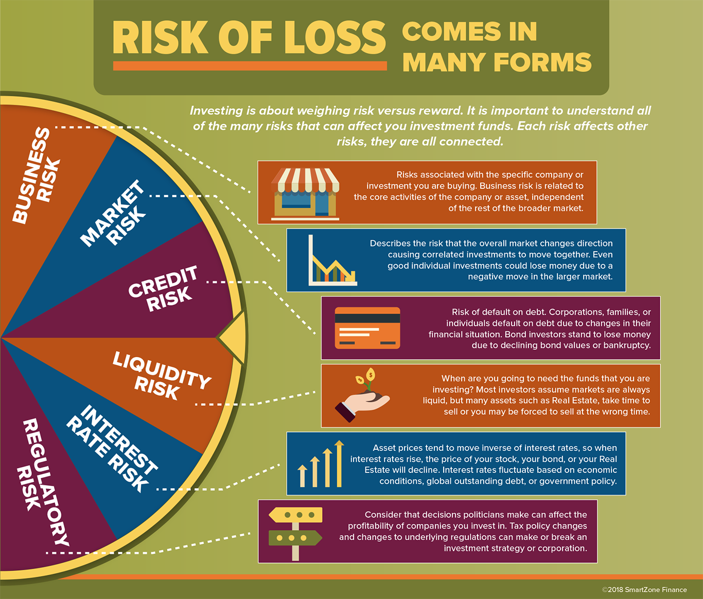

## Table of Contents

## What does it mean to invest in familiar companies?

Investing in familiar companies means putting your money into businesses that you know well. These could be companies whose products or services you use every day, like a favorite restaurant chain or a tech company whose apps you enjoy. When you invest in familiar companies, you might feel more confident because you understand how they work and what they offer. This familiarity can make you feel more comfortable with your investment choices.

However, just because a company is familiar doesn't mean it's always a good investment. You should still do your research to make sure the company is financially healthy and has a good future outlook. Sometimes, familiar companies can be overvalued, meaning their stock price is too high compared to what the company is actually worth. So, while investing in companies you know can be a good starting point, it's important to look at the bigger picture and not just rely on familiarity alone.

## Why do people often prefer investing in companies they are familiar with?

People often prefer investing in companies they are familiar with because it makes them feel more comfortable. When you know a company's products or services well, you might trust them more. For example, if you love using a certain smartphone, you might feel good about investing in the company that makes it. This familiarity can make the whole idea of investing seem less scary and more like something you can understand.

Another reason is that people tend to feel more confident in their decisions when they know the company. If you've seen a company grow and do well over time, you might think it's a safe bet. This confidence can make you more likely to invest your money in that company rather than in a company you don't know much about. However, it's still important to do some research because just knowing a company doesn't always mean it's a good investment.

## What are the basic risks associated with investing in any company?

Investing in any company comes with risks. One big risk is that the company might not do well. If the company loses money or goes out of business, the value of your investment can go down. This means you could lose some or all of the money you put in. Another risk is that the stock market can be unpredictable. Even if a company is doing well, the price of its stock can go up and down because of things like economic changes or news events.

Another risk is that you might not know everything about the company. Even if you think you understand it, there could be problems you don't see. For example, the company might have hidden debts or face new competition that could hurt its business. It's also important to remember that past performance doesn't guarantee future results. Just because a company did well before doesn't mean it will keep doing well.

These risks are part of investing, and they can affect any company, no matter how big or small. That's why it's a good idea to spread your money across different investments. This way, if one company doesn't do well, you won't lose all your money. It's also smart to do your homework and keep learning about the companies you invest in.

## How can familiarity with a company lead to a false sense of security?

When people know a company well, they might feel too safe about investing in it. They think, "I use their products all the time, so they must be a good investment." But just because you like a company's products doesn't mean it's a good investment. The company could have problems you don't see, like big debts or new competitors that could hurt its business.

This false sense of security can make people ignore important signs that the company might not be a good investment. They might not do enough research or look at the company's financial health. Just because a company is familiar doesn't mean it's a safe bet. It's important to look at all the facts and not just rely on how well you know the company.

## What is the 'home bias' in investing and how does it relate to familiar companies?

Home bias in investing means that people tend to invest more in companies from their own country. They feel more comfortable with companies they know and see every day. This is a lot like investing in familiar companies. When you invest in companies you know well, you might feel safer because you understand them better. But this can lead to missing out on good investments from other countries.

This home bias can make your investments less diverse. If you only invest in companies from your own country, you might miss out on opportunities in other places. It's good to spread your investments around to lower your risk. Just like with familiar companies, it's important to do research and not just invest in what you know. Even though it feels safe, it might not always be the best choice for your money.

## Can you explain the concept of overconfidence bias in relation to familiar company investments?

Overconfidence bias happens when people think they know more than they actually do. When it comes to investing in familiar companies, this can make people feel too sure about their choices. They might think, "I know this company really well, so it must be a good investment." But just knowing a company doesn't mean you know everything about its future. People might not look at all the facts or do enough research because they feel so confident.

This overconfidence can lead to big mistakes. If people don't look at the company's financial health or other important details, they might lose money. Even if you use a company's products every day, there could be problems you don't see, like debts or new competition. So, it's important to stay humble and do your homework, even with companies you think you know well.

## What are some examples of well-known companies that have failed, and how could this impact an investor's portfolio?

Some well-known companies that have failed include Blockbuster, which was once a big name in video rentals but couldn't keep up with new technology like streaming services. Another example is Toys "R" Us, a famous toy store that went bankrupt because it had a lot of debt and couldn't compete with online shopping. These companies were familiar to many people, but they still failed, showing that just knowing a company doesn't mean it's a safe investment.

If an investor had a lot of money in these companies, their portfolio could have been hurt a lot. When Blockbuster or Toys "R" Us failed, the value of their stocks went down to almost nothing. This means an investor could have lost a big part of their money. It's a good reminder that even if you know a company well, you should still look at other things like its debts and how it's doing compared to other companies. Spreading your money across different investments can help protect you if one company doesn't do well.

## How does the lack of diversification affect the risk when investing in familiar companies?

When you invest only in familiar companies, you might not spread your money around enough. This is called not diversifying your investments. If you put all your money into just a few companies you know well, you could be in big trouble if those companies don't do well. Imagine if you had all your money in a company that suddenly goes bankrupt. You could lose a lot of money because you didn't have other investments to help balance things out.

Diversification means putting your money into different kinds of investments. This can help lower your risk because if one company or type of investment doesn't do well, you still have others that might be doing okay. When you only invest in familiar companies, you might miss out on other good opportunities. So, even though it feels safe to invest in what you know, it's smart to look at other options too and spread your money around to protect yourself.

## What are the psychological traps investors might fall into when investing in companies they know well?

When people invest in companies they know well, they might fall into a trap called overconfidence bias. This means they think they know more than they really do. They might feel too sure about their choices because they use the company's products every day. But just because you know a company doesn't mean you know everything about its future. This overconfidence can make people not do enough research. They might not look at important things like the company's debts or how it's doing compared to other companies. This can lead to big mistakes and losing money.

Another trap is called the familiarity bias. This happens when people feel safer investing in what they know. They might think, "I see this company all the time, so it must be a good investment." But just because a company is familiar doesn't mean it's a safe bet. People might ignore other good investment opportunities because they feel too comfortable with what they know. This can make their investments less diverse, which means they're taking on more risk. If the familiar company doesn't do well, they could lose a lot of money because they didn't spread their investments around.

## How can an investor assess the true financial health of a familiar company beyond surface-level familiarity?

To really understand how healthy a company you know well is, you need to look at more than just what you see every day. Start by checking the company's financial statements. These are reports that show how much money the company is making, how much it's spending, and how much it owes. You can find these in the company's annual report or on financial websites. Look at things like the company's revenue, which is the money it makes from selling its products or services, and its net income, which is what's left after all the bills are paid. Also, check the company's debt. If a company has a lot of debt, it might have trouble paying it back, even if it seems to be doing well on the outside.

Another important thing to do is compare the company to others in the same industry. See how it's doing compared to its competitors. Are its profits growing faster or slower? Is it making more money per product than other companies? This can give you a better idea of how well the company is doing. Also, pay attention to what experts are saying. Financial analysts often write reports about companies, and these can give you insights that you might not get from just looking at the numbers. By doing all this, you can get a clearer picture of the company's true financial health and make a smarter investment decision.

## What advanced metrics should an expert investor look at to evaluate the risk of investing in a familiar company?

An expert investor should look at advanced metrics like the price-to-earnings (P/E) ratio to evaluate the risk of investing in a familiar company. The P/E ratio tells you how much you're paying for each dollar of the company's earnings. A high P/E ratio might mean the stock is overvalued, which could be risky. Another important metric is the debt-to-equity ratio, which shows how much debt the company has compared to its equity. A high debt-to-equity ratio can mean the company might have trouble paying back its loans, increasing the risk for investors.

Another useful metric is the return on equity (ROE), which measures how well the company is using the money shareholders have invested to generate profits. A high ROE can be a good sign that the company is managing its money well. Additionally, looking at the beta of the stock can help understand its [volatility](/wiki/volatility-trading-strategies). A high beta means the stock's price moves more than the overall market, which can be riskier. By considering these advanced metrics, an expert investor can get a better sense of the true risks involved with investing in a familiar company, beyond just knowing its products or services.

## How can an investor mitigate the risks associated with investing in familiar companies while still capitalizing on their knowledge?

An investor can mitigate the risks of investing in familiar companies by diversifying their portfolio. This means not putting all their money into just one or two companies they know well. Instead, they should spread their money across different kinds of investments, like stocks from different industries, bonds, and maybe even some international companies. This way, if one familiar company doesn't do well, the investor won't lose all their money because other investments might still be doing okay.

Another way to reduce risk is by doing thorough research on the company, even if it feels familiar. This means looking at the company's financial statements, checking its debt levels, and comparing it to other companies in the same industry. Investors should also pay attention to what financial analysts are saying about the company. By understanding the company's true financial health and not just relying on how well they know its products, an investor can make smarter decisions and lower their risk while still using their knowledge of the company to their advantage.

## References & Further Reading

[1]: Lintner, J. (1965). ["The Valuation of Risk Assets and the Selection of Risky Investments in Stock Portfolios and Capital Budgets."](https://www.sciencedirect.com/science/article/pii/B9780127808505500186) The Review of Economics and Statistics.

[2]: ["Advances in Financial Machine Learning"](https://www.amazon.com/Advances-Financial-Machine-Learning-Marcos/dp/1119482089) by Marcos Lopez de Prado

[3]: ["Quantitative Trading: How to Build Your Own Algorithmic Trading Business"](https://www.amazon.com/Quantitative-Trading-Build-Algorithmic-Business/dp/1119800064) by Ernest P. Chan

[4]: Hendershott, T., Jones, C. M., & Menkveld, A. J. (2011). ["Does Algorithmic Trading Improve Liquidity?"](https://onlinelibrary.wiley.com/doi/full/10.1111/j.1540-6261.2010.01624.x) The Journal of Finance.

[5]: Kirilenko, A. A., Kyle, A. S., Samadi, M., & Tuzun, T. (2017). ["The Flash Crash: High-Frequency Trading in an Electronic Market."](https://www.jstor.org/stable/26652722) The Journal of Finance.