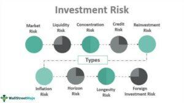

The world of investments offers myriad opportunities for growth, but it's not without its risks. Navigating the financial landscape requires a thorough understanding of investment risks, which can arise from market volatility, economic factors, or specific strategies. Traditional investment strategies, such as investing in well-known companies, have long been popular among investors seeking safety and familiarity. Companies with established business models present an intuitive choice, giving investors a sense of predictability and security.

However, relying solely on familiar investments may not always provide optimal returns. Investments in recognized companies, while generally stable, might miss out on potentially high-growth opportunities that less-known ventures could offer. Furthermore, concentrating investments in well-known companies can lead to over-reliance, reducing portfolio diversification and increasing susceptibility to sector-specific downturns.

On the other hand, cutting-edge techniques like algorithmic trading have emerged as disruptors in financial markets. Algorithmic trading leverages computational algorithms to execute trades at speeds significantly exceeding human capability, thereby maximizing efficiency and reducing emotional biases in decision-making. Yet, this advanced strategy comes with its own challenges, as it introduces risks associated with technology, such as system glitches or security breaches.

Within this complex landscape, it is crucial for investors to assess how these differing strategies—investing in familiar companies and utilizing algorithmic trading—can influence portfolio growth and risk management. By understanding both the advantages and associated pitfalls, investors can make informed decisions tailored to their risk tolerance and financial objectives.

This article will provide a comprehensive analysis of these investment strategies. Our goal is to equip investors with the knowledge necessary to navigate complex financial markets with confidence, ensuring their portfolios are well-balanced to adapt to ever-changing market dynamics. Through informed decision-making, investors can enhance their ability to achieve long-term financial success.

## Table of Contents

## The Allure and Risks of Investing in Familiar Companies

Investing in familiar companies is a well-regarded strategy supported by many experienced investors, with Warren Buffett being one of its staunchest advocates. The rationale behind this approach is the belief that understanding a company's business model, coupled with its market position and historical performance, can offer investors a degree of comfort and predictability. By leveraging this intrinsic familiarity, investors can potentially align their investments with companies whose trajectories they believe they understand.

However, this strategy is not foolproof. Familiarity can create a false sense of security, leading investors to overlook inherent risks or market shifts impacting these companies. While familiarity can suggest stability, it often results in missed growth opportunities by overly concentrating funds in well-known entities that may not provide the highest returns. Many of these well-established companies tend to have slower growth rates compared to emerging businesses in rapidly evolving sectors.

One of the central risks associated with investing predominantly in familiar companies is over-reliance on these entities, potentially limiting the diversification of one's investment portfolio. Diversification is critical to managing risk, as it spreads exposure across various sectors and geographies, reducing the impact of poor performance by any single asset. John Lintner, in his pioneering work on modern portfolio theory, demonstrated mathematically how diversification can lead to an efficient frontier, where investors can achieve the highest expected return for a given level of risk.

Recognizing under-the-radar opportunities is important for enhancing portfolio diversification and capitalizing on high-growth potential. Emerging sectors, such as technology and biotechnology, may offer superior returns as they develop and capture larger market shares. Careful analysis and research into these burgeoning industries can unveil companies with robust growth prospects that are less visible to the general public.

Thus, while investing in familiar companies might offer stability through a perceived understanding of their inner workings, it can inadvertently incur opportunity costs. By focusing solely on well-known brands, investors may miss out on significant gains from lesser-known companies poised for rapid expansion. Investors must, therefore, strike a careful balance between the comfort of familiar investments and the potential for substantial returns through less conventional avenues.

In summary, while investing in familiar companies can align with certain investment goals, the strategy necessitates awareness of its limitations. Broadening one's investment approach to include a mix of familiar and lesser-known entities can potentially enhance both portfolio growth and diversity, effectively managing risk while leveraging opportunities in emerging markets.

## Algorithmic Trading: A Double-Edged Sword

Algorithmic trading has become a cornerstone of modern financial markets by utilizing computer algorithms to execute a large [volume](/wiki/volume-trading-strategy) of trades at speeds and frequencies that are impossible for human traders. The primary advantage of [algorithmic trading](/wiki/algorithmic-trading) lies in its ability to process large datasets rapidly and execute orders with precision, thus minimizing the latency that often accompanies human decision-making. This technological advancement offers multiple benefits including enhanced market efficiency and the reduction of emotional bias in trading decisions.

However, the dependency on technology presents significant risks. A key concern is that algorithmic trading systems can lead to situations where technical glitches result in substantial financial losses. For example, the infamous "Flash Crash" of May 6, 2010, highlighted how algorithmic trades can cause market disruptions within minutes. During this event, the Dow Jones Industrial Average plunged nearly 1,000 points only to recover those losses shortly after, epitomizing the potential [volatility](/wiki/volatility-trading-strategies) introduced by algorithmic systems.

Another critical risk associated with algorithmic trading is overfitting. This occurs when a trading model is excessively complex, capturing noise rather than useful data from past trends. As a consequence, such models may produce misleading results when deployed in live markets. Traders can mitigate overfitting by employing techniques such as cross-validation and regularization, which help in creating models that generalize well to new data.

Data errors are yet another risk [factor](/wiki/factor-investing). Inaccurate or corrupted data can lead to erroneous trades that disrupt both the algorithm's performance and the market. Regular data quality checks and real-time monitoring systems are crucial in preventing such issues.

Furthermore, algorithmic trading systems often lack human oversight, which can result in situations where the algorithms behave unpredictably. While speed is an asset, it is vital to ensure that algorithms are monitored by human experts who can intervene when anomalies are detected. This can be implemented through the integration of automated alerts and circuit breakers that pause trading activities when abnormal patterns are detected.

Cybersecurity threats also pose a substantial risk to algorithmic trading. With financial markets becoming increasingly digital, trading platforms are attractive targets for cyber-attacks, which could result in unauthorized access or manipulation of trading systems. Implementing robust cybersecurity measures, such as encryption and two-factor authentication, is essential to safeguard trading infrastructure.

In conclusion, while algorithmic trading offers substantial advantages through speed and precision, it also introduces complexities and risks that require vigilant management. Effective risk mitigation involves a combination of technical and operational strategies, ensuring that the benefits of algorithmic trading are maximized while minimizing potential downsides.

## Balancing Growth Opportunities and Risks

Investors are perpetually engaged in the quest to strike a harmonious balance between potential returns and the risks inherent in various investment avenues. Maintaining stability in investments often involves allocating capital to familiar companies, which are typically characterized by established track records and predictable performance metrics. These household names are less likely to experience erratic shifts, providing a buffer against market volatility.

However, the potential for significant growth often lies with lesser-known or emerging companies, particularly within burgeoning sectors like technology and biotechnology. These sectors are fertile ground for innovation, frequently yielding groundbreaking products and services that can translate into exponential growth opportunities. Investors seeking long-term capital appreciation may find it lucrative to explore these areas, albeit with an understanding of the increased risk profile these investments typically [carry](/wiki/carry-trading). An example of this is the rapid rise of companies involved in renewable energy technologies, which can offer substantial returns but are subject to regulatory and market risks.

Algorithmic trading stands as a tool with the potential to optimize trading strategies by executing orders with speed and precision beyond human capabilities. When used judiciously, it can identify market trends and capitalize on fleeting opportunities that might otherwise go unnoticed. However, to efficiently leverage algorithmic trading, investors must thoroughly comprehend its intricacies and associated risks. The reliance on algorithms introduces vulnerabilities such as overfitting, data inaccuracies, and systemic failures, which can lead to unintended financial exposure. Thus, incorporating algorithmic trading into an investment strategy necessitates robust risk management frameworks and constant monitoring.

An effective approach to balancing traditional investments in renowned names with novel strategies, such as algorithmic trading, involves diversifying the investment portfolio. Diversification can mitigate risks by spreading investments across various asset classes, sectors, and geographies, thereby reducing the impact of adverse movements in any single market segment. Embracing a dynamic asset allocation strategy, which periodically reassesses and rebalances the portfolio according to current market conditions, can also help in aligning risk tolerance with growth objectives.

Algorithmic risk management solutions, such as stress testing and scenario analysis, are useful to evaluate how different strategies perform under various market conditions. Utilizing these techniques alongside traditional methods provides a comprehensive overview of potential risks and returns.

In conclusion, investors aiming to maximize growth while managing risk should adopt a multifaceted approach. This involves balancing the stability offered by established companies with the growth potential of emerging markets, all while leveraging technological advancements like algorithmic trading with a clear understanding of its risks. A well-informed strategy, rich in diversification and vigilant in management, equips investors to navigate the complexities of modern financial markets effectively.

## Conclusion: Informed Investment Decision-Making

Investment strategies should be flexible enough to accommodate both familiar and novel opportunities. Diversifying investments by understanding the risks and rewards associated with both well-known companies and innovative technologies like algorithmic trading can significantly enhance financial outcomes. Investing in familiar companies provides a level of stability and predictability, which can be beneficial for risk-averse investors. However, the potential for substantial growth often comes from exploring emerging markets and technologies.

Effective risk management is crucial in navigating these opportunities. This involves staying vigilant about market changes, continuously educating oneself about new investment trends, and adapting strategies accordingly. For instance, the unpredictability and rapid evolution of algorithmic trading necessitate a strong emphasis on technical and cybersecurity measures to mitigate risks such as data breaches or software malfunctions.

Ultimately, successful investing requires striking a balance between existing knowledge and embracing innovation. Investors should remain open to new methodologies and be willing to adapt their strategies to include both traditional and cutting-edge approaches. This adaptability not only aids in optimizing portfolio performance but also ensures resilience against market fluctuations and technological shifts.

In conclusion, informed decision-making is vital for achieving long-term financial success. By maintaining a flexible approach and integrating diverse investment strategies, investors can better manage risks while capitalizing on growth opportunities. Being well-informed and prepared for market dynamics allows for the strategic allocation of resources, which is fundamental for sustaining and enhancing financial health over time.

## References & Further Reading

[1]: Lintner, J. (1965). ["The Valuation of Risk Assets and the Selection of Risky Investments in Stock Portfolios and Capital Budgets."](https://www.sciencedirect.com/science/article/pii/B9780127808505500186) The Review of Economics and Statistics.

[2]: ["Advances in Financial Machine Learning"](https://www.amazon.com/Advances-Financial-Machine-Learning-Marcos/dp/1119482089) by Marcos Lopez de Prado

[3]: ["Quantitative Trading: How to Build Your Own Algorithmic Trading Business"](https://www.amazon.com/Quantitative-Trading-Build-Algorithmic-Business/dp/1119800064) by Ernest P. Chan

[4]: Hendershott, T., Jones, C. M., & Menkveld, A. J. (2011). ["Does Algorithmic Trading Improve Liquidity?"](https://onlinelibrary.wiley.com/doi/full/10.1111/j.1540-6261.2010.01624.x) The Journal of Finance.

[5]: Kirilenko, A. A., Kyle, A. S., Samadi, M., & Tuzun, T. (2017). ["The Flash Crash: High-Frequency Trading in an Electronic Market."](https://www.jstor.org/stable/26652722) The Journal of Finance.