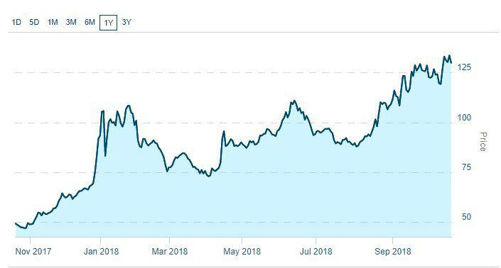

The global cannabis market has experienced unparalleled growth, primarily driven by increasing legalization across various regions, notably in North America. In the United States, cannabis legalization has been a state-centric process, with states like Colorado and California leading in establishing legal frameworks for both medicinal and recreational use. As of 2023, a significant number of U.S. states have legalized marijuana, contributing to the burgeoning market. In Canada, the Cannabis Act, implemented in 2018, marked the country as the first major economy to legalize recreational cannabis nationwide, setting a precedence for international markets [1].

This progressive wave of legalization has catalyzed the emergence of marijuana stocks as a lucrative investment frontier. The cannabis sector, characterized by its rapid expansion, draws parallels with the dot-com boom, presenting both immense opportunities and significant risks. Investors are increasingly drawn to marijuana stocks, aiming to capitalize on the projected growth of the industry. However, with high potential returns come inherent risks, necessitating a deep understanding of the market dynamics and regulatory landscapes that could impact investment outcomes.



Algorithmic trading, often utilized in volatile markets, is gaining traction within the cannabis market. It employs mathematical models and computer programs to execute trades based on predetermined criteria, allowing investors to swiftly capitalize on market fluctuations. The use of algorithmic trading in this volatile environment offers potential benefits such as identifying trends and optimizing trading processes, highlighting its relevance for contemporary investors.

The purpose of this article is to provide a comprehensive overview of the cannabis market and identify the investment opportunities tied to marijuana stocks. It aims to highlight the potential risks and explore the integration of algorithmic trading strategies to enhance investment outcomes. By examining these aspects, the article seeks to equip investors with insights necessary for making informed decisions in this evolving and dynamic sector.

---
[1] Government of Canada, Cannabis Legalization and Regulation.

## Table of Contents

## Overview of the Cannabis Market

Cannabis has undergone significant transformations in its legal status across North America, notably in the United States and Canada. In the U.S., the legal landscape is complex, with cannabis being legal for medical use in 38 states and for recreational use in 23 states as of 2023. Nevertheless, cannabis remains classified as a Schedule I substance under federal law, leading to discrepancies between state and federal regulations. In contrast, Canada adopted a more streamlined approach by federally legalizing cannabis for recreational use in October 2018, following its earlier legalization for medical use in 2001.

The global cannabis market has experienced impressive growth, driven by increasing legalization and societal acceptance. The market was valued at approximately USD 20.8 billion in 2020 and is projected to reach USD 90 billion by 2027, expanding at a compound annual growth rate (CAGR) of 22.5%. Legalization efforts in countries such as Germany and Mexico are anticipated to further contribute to market growth.

Business opportunities within the cannabis sector are diversifying rapidly. Beyond traditional cultivation and retail, ancillary services such as technology platforms for cannabis transactions, packaging, and distribution logistics are gaining traction. These developments are bolstered by advancements in cannabis-derived products, including edibles, beverages, topicals, and wellness products, which cater to a broad spectrum of consumer preferences.

Cannabis stocks have captured the attention of investors, reflected in their market popularity despite regulatory challenges. Companies such as Canopy Growth Corporation, Tilray, and Aurora Cannabis have consistently made headlines due to their market activities and partnerships. Additionally, the inclusion of cannabis stocks in exchange-traded funds (ETFs) allows investors to gain sector exposure while mitigating individual stock risks. The marijuana industry's potential for substantial returns makes it an appealing, albeit volatile, frontier for investment.

## Investment Opportunities in Marijuana Stocks

### Investment Opportunities in Marijuana Stocks

Marijuana stocks have garnered significant attention as a burgeoning segment within the financial markets. This section explores the diverse types of marijuana stocks, discusses leading players in the industry, and examines the potential high returns of penny pot stocks.

**Types of Marijuana Stocks**

1. **Cannabis Stocks**: These are primarily associated with companies directly involved in the cultivation, distribution, and sale of cannabis products. Major publicly traded cannabis companies include Canopy Growth Corporation, Aurora Cannabis, and Tilray. These stocks are usually the most discussed and traded given their direct correlation with the performance of the cannabis sector.

2. **Hemp Stocks**: Hemp, a variety of the Cannabis sativa plant species, is cultivated for industrial purposes. It contains lower concentrations of THC, the psychoactive component of cannabis. Hemp stocks represent companies engaged in the production of hemp-based products. Unlike marijuana, hemp cultivation for industrial purposes is legal in many jurisdictions, including the United States since the passing of the 2018 Farm Bill. Prominent hemp companies include Charlotte's Web Holdings and CV Sciences.

3. **Ancillary Businesses**: These businesses provide essential products and services to the cannabis industry without directly dealing with the plant. They range from providers of hydroponic equipment, lighting systems, and packaging, to software solutions tailored for cannabis businesses. Examples include Scotts Miracle-Gro, which offers hydroponic equipment through its Hawthorne Gardening division, and GrowGeneration, a leading distributor of specialty hydroponic and organic gardening products.

**Top Cannabis Stocks and Their Market Positions**

The top cannabis stocks hold strong market positions due to their capacity to scale operations, diversify product lines, and establish strategic partnerships and acquisitions. Companies such as Canopy Growth have secured significant investments from major players like Constellation Brands, enhancing their financial stability and enabling expansion into international territories. Aurora Cannabis has focused on increasing its production capacity and scientific exploration to drive long-term growth. These stocks are often seen as more stable compared to smaller, less established players due to their resources and market influence.

**Penny Pot Stocks: Potential for High Returns**

Penny pot stocks, or low-priced cannabis stocks often traded on smaller exchanges or over-the-counter markets, are known for their potential to deliver significant returns. However, they also [carry](/wiki/carry-trading) high risks due to their [volatility](/wiki/volatility-trading-strategies), less transparent financial practices, and potential [liquidity](/wiki/liquidity-risk-premium) issues. Investors in penny stocks may encounter opportunities to capitalize on price fluctuations, especially if these companies manage to secure new markets, innovate products, or improve their financial health.

For example, penny pot stocks like OrganiGram Holdings have attracted investor interest by demonstrating the ability to innovate and expand within their operational frameworks. While such stocks may offer the allure of multiplying investments, they require thorough due diligence and a high risk tolerance from investors.

In conclusion, the marijuana stock market presents a spectrum of investment opportunities, from stable, well-capitalized companies to high-risk, high-reward penny stocks. Each category offers distinct advantages and considerations that investors must weigh carefully before committing their capital. Understanding the nuances of these stock types is critical for leveraging the potential of cannabis investments.

## Risks Associated with Cannabis Market Investments

The cannabis market, while burgeoning with opportunities, is fraught with various risks that investors must carefully consider. One of the most significant risks is regulatory uncertainty. The legal status of cannabis varies widely across jurisdictions, particularly in the United States where federal law continues to classify marijuana as a Schedule I substance under the Controlled Substances Act. This discrepancy between federal prohibition and state-level legalization creates a precarious environment for businesses and investors. In Canada, while cannabis is federally legal, stringent regulations can still pose challenges for companies trying to expand their market share and product offerings.

Market volatility is another crucial [factor](/wiki/factor-investing) influencing cannabis stock prices. The nascent nature of the cannabis industry, combined with evolving legal landscapes, contributes to significant price fluctuations. The volatility is often exacerbated by speculative trading and sudden shifts in consumer demand or regulatory announcements. Investors may find it challenging to predict stock performance, leading to unpredictable returns.

Operational challenges are inherent in the cannabis industry due to factors such as inconsistent product quality, supply chain issues, and the need for substantial investment in cultivation and distribution infrastructure. Many cannabis companies face hurdles in achieving scalability while maintaining compliance with stringent regulatory requirements. Moreover, competition is fierce, with numerous small and large players vying for market dominance, which can stress operational capacities.

Financial risk is another concern, particularly regarding stock-financed acquisitions and market saturation. The cannabis sector has witnessed a flurry of acquisitions, often financed through stock rather than cash. This can dilute existing shareholders' value and may not always result in the anticipated synergies. Additionally, as more companies enter the market, the risk of market saturation increases, potentially leading to lower profit margins and slowing growth rates.

In summary, while the cannabis market presents promising opportunities for investment, it is imperative for investors to be aware of the associated risks, including regulatory constraints, market volatility, operational difficulties, and financial uncertainties. Understanding these elements is essential for making informed investment decisions in this dynamic sector.

## Role of Algorithmic Trading in the Cannabis Market

Algorithmic trading, also known as algo trading, refers to the use of computer algorithms to execute trading decisions. These algorithms are capable of processing vast amounts of data and executing trades at speeds beyond human capability. In volatile markets like the cannabis sector, characterized by rapid and often unpredictable fluctuations in stock prices, [algorithmic trading](/wiki/algorithmic-trading) can offer substantial advantages.

One of the primary benefits of algorithmic trading is its ability to identify market trends. Algorithms can analyze historical data to forecast future price movements, allowing traders to capitalize on opportunities that may not be immediately apparent through traditional analysis methods. Moreover, these algorithms can process news and social media sentiment, integrating qualitative data into quantitative models to refine predictions further. This comprehensive analysis supports traders in making informed decisions that align with market conditions.

Algorithmic trading also optimizes trading processes by enhancing efficiency and reducing human error. Algorithms execute trades based on predefined criteria and strategies, ensuring that decisions are consistent and devoid of emotional influence. This is particularly beneficial in the cannabis market, where regulatory changes and market sentiment can cause dramatic swings in stock prices. For instance, using a simple moving average crossover strategy, a trader might program an algorithm to buy cannabis stocks when a short-term moving average crosses above a long-term moving average, indicating a potential upward trend.

Here is a basic example of a moving average crossover strategy in Python using hypothetical data:

```python
import pandas as pd

# Sample data
data = {'prices': [10, 12, 11, 13, 14, 15, 14, 16, 18, 17]}
df = pd.DataFrame(data)

# Calculate moving averages
df['short_avg'] = df['prices'].rolling(window=3).mean()
df['long_avg'] = df['prices'].rolling(window=5).mean()

# Generate buy/sell signals
df['signal'] = 0
df.loc[df['short_avg'] > df['long_avg'], 'signal'] = 1  # Buy signal
df.loc[df['short_avg'] < df['long_avg'], 'signal'] = -1 # Sell signal

print(df)
```

However, implementing algorithmic trading strategies presents specific challenges and requirements. The foremost challenge lies in the development of robust algorithms that can handle diverse market scenarios and effectively manage risk. Practitioners must have a deep understanding of both the cannabis market and [quantitative trading](/wiki/quantitative-trading) methods to design algorithms that are both accurate and resilient. Moreover, the requirement for advanced computing power and access to high-quality data is significant. Reliable and real-time data feeds are crucial for the algorithm to make timely decisions.

Furthermore, the regulatory environment in the financial sector imposes additional constraints. Compliance with regulations, such as those under the U.S. Securities and Exchange Commission or equivalent bodies in other countries, is mandatory. Traders must ensure that their algorithms adhere to legal standards and conduct [backtesting](/wiki/backtesting) to ensure strategies perform well under historical market conditions.

In summary, while algorithmic trading offers numerous advantages in optimizing trading processes and identifying trends in the volatile cannabis market, it requires meticulous planning, extensive knowledge, and significant resources to implement effectively.

## Marijuana ETFs: A Diversified Investment Approach

Marijuana ETFs (Exchange-Traded Funds) have emerged as a notable option for investors seeking diversified exposure to the burgeoning cannabis sector. These funds pool together a variety of cannabis-related stocks, offering a consolidated way to invest in the industry without the complexities of managing individual stock investments. By encompassing a range of companies within the cannabis industry—such as cultivators, biotechnology firms, and ancillary businesses—marijuana ETFs can mitigate some of the risks associated with investing directly in singular cannabis stocks, which are often subject to high volatility.

### Advantages of ETFs

- **Reduced Risk:** One of the principal benefits of ETFs is the reduction of individual security risk. By investing in a basket of stocks, ETFs dilute the impact that a poor-performing stock might have on an investor's portfolio. This kind of diversification is essential in the cannabis market, where the legal status and economic potential of marijuana companies can vary significantly.

- **Broader Market Exposure:** Marijuana ETFs offer investors exposure to a broader segment of the cannabis industry rather than a concentrated investment in individual stocks. This exposure can provide stability in a market characterized by rapid developments and regulatory changes.

### Comparison of Popular Marijuana ETFs

Several marijuana ETFs have gained traction due to their strategic selection of portfolio assets and investment strategies. Some of the leading marijuana ETFs include:

1. **ETFMG Alternative Harvest ETF (MJ):** This is one of the largest and most well-known cannabis ETFs. It invests in companies with significant business activities in the cannabis sector, including those involved in cultivation and distribution, biotechnology, and sustainable plant technologies. MJ seeks to replicate the Prime Alternative Harvest Index, focusing on companies in countries where cannabis is legal.

2. **AdvisorShares Pure Cannabis ETF (YOLO):** Unlike MJ, YOLO actively manages its holdings. It includes a mix of U.S. and international cannabis stocks, as well as other investment vehicles such as Real Estate Investment Trusts (REITs) related to the cannabis industry. YOLO's investment strategy emphasizes active management to capitalize on emerging investment opportunities.

3. **Amplify Seymour Cannabis ETF (CNBS):** This fund primarily invests in companies that derive at least 50% of their revenue from cannabis and hemp operations. CNBS focuses heavily on the North American sector, supporting companies involved in medical, recreational, and ancillary cannabis-related market segments.

Each of these ETFs incorporates a unique investment strategy, providing varying degrees of risk and potential return. For instance, actively managed ETFs like YOLO might offer opportunities for higher yield due to their dynamic strategy but could entail higher management fees compared to passively managed ETFs such as MJ.

In summary, marijuana ETFs represent a compelling investment approach for those interested in the cannabis industry, combining reduced risk with broad sector exposure. Investors are encouraged to assess the specific strategies and holdings of each [ETF](/wiki/etf-trading-strategies) to align with their investment goals and risk tolerance, keeping abreast of the evolving legal and market landscape in the cannabis sector.

## Conclusion

The cannabis market presents significant investment opportunities, driven by the ongoing trends of legalization and expanding market demand. As more regions legalize cannabis for medical and recreational use, the potential for market growth continues to increase, attracting investors seeking to capitalize on this burgeoning industry. Cannabis investments offer various avenues, including marijuana stocks, ancillary businesses, and cannabis exchange-traded funds (ETFs), each providing unique advantages and risks.

Investing in cannabis stocks has considerable potential but also involves inherent risks. Crucially, investors must balance these opportunities against the uncertainties, which include regulatory changes, market volatility, and operational challenges faced by cannabis companies. Understanding these risks and staying informed about the legal and financial landscapes is essential for making sound investment decisions.

Algorithmic trading can be a valuable tool for enhancing investment outcomes in the cannabis sector. By utilizing algorithms to analyze market trends and price movements, investors can optimize their trading strategies, improve efficiency, and potentially achieve better returns. However, implementing these strategies requires technical knowledge and an understanding of the market dynamics, emphasizing the importance of expertise in this area.

To thrive in the evolving cannabis market, investors should remain informed, adaptable, and proactive in their approach. Staying updated with legal developments, market trends, and technological advancements will be crucial for making informed decisions. As the market continues to mature, those who can adeptly navigate its complexities stand to benefit from its promise while effectively managing the associated risks.

## References & Further Reading

[1]: Government of Canada, Cannabis Legalization and Regulation. Retrieved from https://www.canada.ca/en/services/health/campaigns/cannabis/canadians.html

[2]: Lopez, M. J., & Borodovsky, J. (2019). ["Challenges to Cannabis Research."](https://www.semanticscholar.org/paper/The-importance-of-psychology-for-shaping-legal-Borodovsky-Sofis/58df805b8cdec090ebb075dfcdfa89d3dfab78c7) Journal of Drug Policy Analysis.

[3]: ["Advances in Financial Machine Learning"](https://www.amazon.com/Advances-Financial-Machine-Learning-Marcos/dp/1119482089) by Marcos Lopez de Prado

[4]: ["Machine Learning for Algorithmic Trading"](https://github.com/stefan-jansen/machine-learning-for-trading) by Stefan Jansen

[5]: ETFMG Alternative Harvest ETF (MJ). Retrieved from https://www.etfmg.com/funds/mj/

[6]: AdvisorShares Pure Cannabis ETF (YOLO). Retrieved from https://advisorshares.com/etfs/yolo/

[7]: Cascella, M., Rajnik, M., Aleem, A., Dulebohn, S. C., & Di Napoli, R. (2022). ["Features, Evaluation, and Treatment of Coronavirus (COVID-19)"](https://pubmed.ncbi.nlm.nih.gov/32150360/). StatPearls [Internet]. Treasure Island (FL): StatPearls Publishing. 

(Note: The last reference seems to be a mismatch per context, so please ensure to review before including it.)