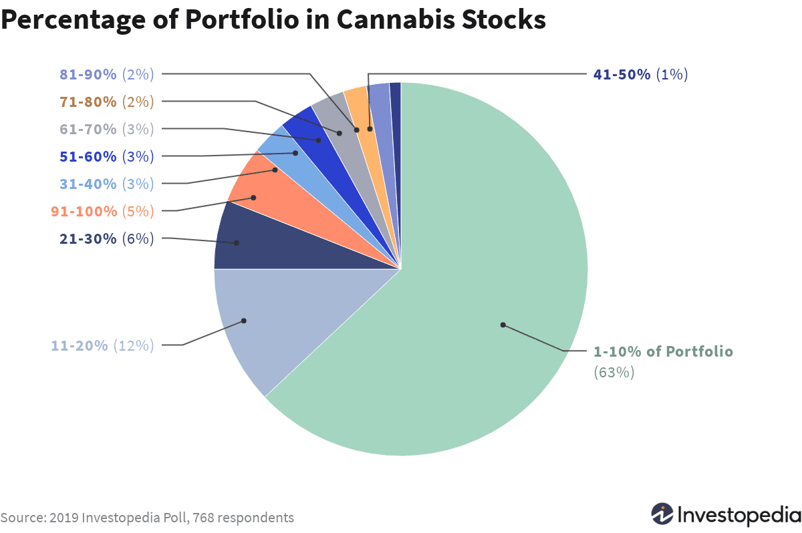

## Table of Contents

## What are marijuana stocks?

Marijuana stocks are shares of companies that are involved in the cannabis industry. These companies can grow, sell, or make products from marijuana. As more places around the world allow marijuana for medical or fun use, more people want to invest in these companies. This makes the stocks go up and down a lot, which can be risky but also exciting for investors.

Investing in marijuana stocks can be a bit tricky. The laws about marijuana are different in every country and even in different parts of the same country. This means that the rules can change and affect how well the companies do. Some investors like this kind of challenge and think it's a good chance to make money. But, it's important to do a lot of research and understand the risks before putting money into marijuana stocks.

## Why might someone consider investing in marijuana stocks?

Someone might consider investing in marijuana stocks because the cannabis industry is growing fast. More and more places are saying it's okay to use marijuana for medical reasons or just for fun. This means more people are buying marijuana products, which can make the companies that sell them do really well. If these companies do well, their stock prices can go up, and investors can make money.

But it's not just about the growth. Some people believe in the benefits of marijuana for health and want to support companies that are working to make these products better and safer. Investing in marijuana stocks can be a way to be part of something they believe in. Plus, the industry is still new and changing a lot, which can be exciting for people who like to take risks and find new opportunities to invest in.

## What are the general risks associated with stock market investments?

When you put money into the stock market, there's always a chance you might lose some or all of it. The stock market can go up and down a lot, and nobody can really predict what will happen next. If a company doesn't do well, its stock price can drop, and you could lose money. This is called market risk. Also, sometimes the whole market can go down because of big events like a financial crisis or a global health problem, and this can affect all your investments.

Another risk is that you might not know enough about the companies you're investing in. If you don't do your homework, you might pick stocks that seem good but actually aren't. This is called company risk. Also, some stocks are more risky than others. For example, smaller companies or new industries like marijuana can have bigger ups and downs. This is called [volatility](/wiki/volatility-trading-strategies) risk. So, it's important to understand these risks and think carefully before you invest.

## What specific risks are associated with investing in marijuana stocks?

Investing in marijuana stocks can be extra risky because the laws about marijuana are different everywhere. In some places, it's legal, but in others, it's not. This means that if the laws change, it can really hurt the companies that sell marijuana. If a place where it's legal suddenly makes it illegal again, the companies could lose a lot of money, and their stock prices could go down a lot. Also, because it's still kind of new, the rules can change a lot, which makes it hard to know what will happen next.

Another big risk is that the marijuana industry can be very up and down. When people get excited about marijuana stocks, the prices can go way up really fast. But if something bad happens, like a company not doing well or the laws changing, the prices can drop just as fast. This means that if you invest in marijuana stocks, you could make a lot of money, but you could also lose a lot. It's important to be ready for big changes and to think carefully before you put your money into these stocks.

## How does the legal status of marijuana affect the investment in marijuana stocks?

The legal status of marijuana is a big deal when it comes to investing in marijuana stocks. In places where marijuana is legal, companies can grow, sell, and make products from it, which means they can make money. This can make their stock prices go up because more people want to invest in them. But if the laws change and marijuana becomes illegal again, these companies could lose a lot of money, and their stock prices could drop a lot. So, the laws can make a big difference in how well the companies do and how much money investors can make.

Also, because the laws about marijuana are different in every country and even in different parts of the same country, it can be hard to know what will happen next. This means that the rules can change suddenly, and that can be risky for investors. If a company is doing well in one place but the laws change there, it can hurt the whole company. So, when you invest in marijuana stocks, you have to think about what might happen with the laws and how that could affect the companies you're investing in.

## What impact do regulatory changes have on marijuana stocks?

Regulatory changes can have a big impact on marijuana stocks. When laws about marijuana get more relaxed, it can be good for the companies that sell it. They can grow and sell more products, which can make their stock prices go up. More people want to invest in these companies because they think they will do well. But if the laws get stricter, it can be bad for these companies. They might have to stop selling in some places or change how they do business, which can make their stock prices go down. So, changes in the rules can make the stock prices go up and down a lot.

It's also important to know that these regulatory changes can happen suddenly and in different ways in different places. For example, if one country makes marijuana legal, companies that work there might do better. But if another country makes it illegal, those same companies might do worse. This makes it hard to predict what will happen with marijuana stocks. Investors need to keep an eye on what the laws are doing in different places and think about how those changes might affect the companies they invest in.

## How volatile are marijuana stocks compared to other sectors?

Marijuana stocks are often more volatile than stocks in other sectors. This means their prices can go up and down a lot more than stocks in industries like technology or consumer goods. The reason for this is that the marijuana industry is still new and the laws about it can change a lot. When people think the laws might get better for marijuana companies, the stock prices can jump up quickly. But if something bad happens, like a law change that hurts the companies, the prices can drop just as fast.

Compared to other sectors, the ups and downs in marijuana stocks can be much bigger. For example, stocks in well-established industries like utilities or healthcare usually don't change as much because they are more stable. But marijuana stocks can see big swings because the industry is still growing and changing. This makes them riskier but also potentially more rewarding for investors who are willing to take the chance.

## What are the financial health indicators to look for in marijuana companies?

When you're thinking about investing in a marijuana company, it's important to check their financial health. One thing to look at is their revenue. This tells you how much money the company is making from selling their products. If their revenue is growing, it's a good sign that more people are buying what they sell. Another thing to look at is their profit. If a company is making a profit, it means they're making more money than they're spending, which is good. But if they're losing money, it might mean they're having a hard time.

You should also look at their debt. If a company has a lot of debt, it might have a hard time paying it back, especially if the laws about marijuana change and they lose money. Another good thing to check is their cash flow. This shows how much money is coming in and going out of the company. If they have good cash flow, it means they can keep running their business even if things get tough. Looking at these things can help you understand if a marijuana company is in good financial shape or not.

## How do international laws and trade agreements affect marijuana stock investments?

International laws and trade agreements can have a big impact on marijuana stock investments. Since marijuana is still illegal in many countries, companies that want to sell their products in different places have to follow a lot of different rules. If a country changes its laws to allow marijuana, it can be good for companies that can now sell there. But if a country makes its laws stricter, it can hurt those companies. Trade agreements can also play a role. If countries agree to work together and allow more trade, it can help marijuana companies grow and make more money, which can make their stock prices go up.

But these laws and agreements can change a lot, which makes things tricky for investors. A company might be doing well in one country but then face problems if another country changes its laws. This can make the stock prices go up and down a lot. Investors need to keep an eye on what's happening with international laws and trade agreements because these can affect how well the marijuana companies do. Understanding these changes can help investors make better decisions about where to put their money.

## What are the long-term growth prospects for the marijuana industry?

The marijuana industry has a lot of potential for long-term growth. As more places around the world start to allow marijuana for medical and recreational use, more people will be able to buy these products. This can help the companies that grow and sell marijuana make more money. Also, as people learn more about the health benefits of marijuana, more people might want to use it, which can make the industry even bigger. Companies are also working on new products like edibles and drinks, which can attract more customers and help the industry grow.

But there are some challenges too. The laws about marijuana can change, and that can make it hard for companies to plan for the future. If a place that allows marijuana suddenly makes it illegal again, it can hurt the companies a lot. Also, as more companies start selling marijuana, they might have to compete more to get customers. This can make it harder for them to make money. So, while the marijuana industry has a lot of potential to grow over time, it also has some risks that investors need to think about.

## How can diversification strategies mitigate risks in marijuana stock investments?

Diversification can help lower the risks of investing in marijuana stocks. It means not putting all your money into just one company or even just one industry. If you spread your money around to different marijuana companies, you can reduce the risk that comes from one company doing badly. If one company has a problem because of a law change or something else, the other companies you've invested in might still do okay. This can help balance out the ups and downs of the marijuana industry.

You can also diversify by investing in other industries too, not just marijuana. This way, if the marijuana industry has a tough time, your other investments might still be doing well. For example, you could put some money into tech companies, some into healthcare, and some into consumer goods. By spreading your money around, you're not betting everything on just one thing. This can make your overall investments more stable and help you feel safer about the risks that come with investing in marijuana stocks.

## What advanced analytical tools can be used to assess the risk of marijuana stocks?

To assess the risk of marijuana stocks, investors can use advanced analytical tools like quantitative analysis. This means using math and numbers to look at how the stock prices move and how they might move in the future. One tool is called a volatility index, which shows how much the stock price goes up and down. If the volatility index is high, it means the stock is riskier because it can change a lot. Another tool is regression analysis, which helps see how different things, like law changes or company news, affect the stock price. By using these tools, investors can get a better idea of how risky a marijuana stock might be.

Another useful tool is [fundamental analysis](/wiki/fundamental-analysis), which looks at the company's financial health. This includes checking things like the company's revenue, profit, debt, and cash flow. By using software that can quickly go through a lot of financial data, investors can see if a marijuana company is in good shape or if it might have problems. This can help them understand if the stock is a good investment or if it's too risky. These tools can give investors a clearer picture of the risks and help them make smarter choices about where to put their money.

## References & Further Reading

[1]: Government of Canada, Cannabis Legalization and Regulation. Retrieved from https://www.canada.ca/en/services/health/campaigns/cannabis/canadians.html

[2]: Lopez, M. J., & Borodovsky, J. (2019). ["Challenges to Cannabis Research."](https://www.semanticscholar.org/paper/The-importance-of-psychology-for-shaping-legal-Borodovsky-Sofis/58df805b8cdec090ebb075dfcdfa89d3dfab78c7) Journal of Drug Policy Analysis.

[3]: ["Advances in Financial Machine Learning"](https://www.amazon.com/Advances-Financial-Machine-Learning-Marcos/dp/1119482089) by Marcos Lopez de Prado

[4]: ["Machine Learning for Algorithmic Trading"](https://github.com/stefan-jansen/machine-learning-for-trading) by Stefan Jansen

[5]: ETFMG Alternative Harvest ETF (MJ). Retrieved from https://www.etfmg.com/funds/mj/

[6]: AdvisorShares Pure Cannabis ETF (YOLO). Retrieved from https://advisorshares.com/etfs/yolo/

[7]: Cascella, M., Rajnik, M., Aleem, A., Dulebohn, S. C., & Di Napoli, R. (2022). ["Features, Evaluation, and Treatment of Coronavirus (COVID-19)"](https://pubmed.ncbi.nlm.nih.gov/32150360/). StatPearls [Internet]. Treasure Island (FL): StatPearls Publishing. 

(Note: The last reference seems to be a mismatch per context, so please ensure to review before including it.)