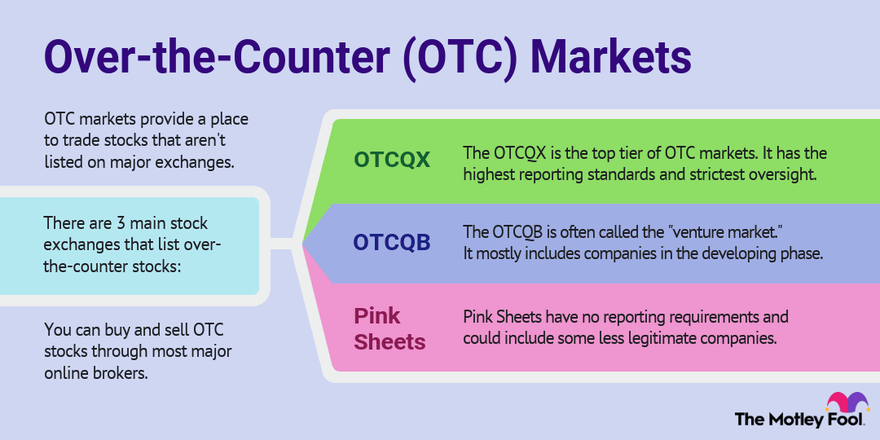

## Table of Contents

## What is over-the-counter (OTC) trading?

Over-the-counter (OTC) trading is when people buy and sell things like stocks, bonds, or other financial products directly with each other, instead of using a big stock exchange like the New York Stock Exchange. These trades happen through a network of dealers who talk to each other by phone or computer to make deals. OTC trading is good for smaller companies that might not meet the rules to be on a big stock exchange, or for special types of investments that don't fit the usual rules.

OTC markets can be riskier than big stock exchanges because they are less regulated. This means there's a bigger chance that the price of what you're buying could change a lot, or that it might be harder to find someone to buy it from you later. But, OTC trading also lets investors find unique opportunities that they might not find on bigger exchanges. So, while it can be riskier, it also opens up more choices for people looking to invest their money.

## How does OTC trading differ from trading on a stock exchange?

OTC trading and trading on a stock exchange are different in a few key ways. When you trade on a stock exchange, like the New York Stock Exchange, you're using a big, organized marketplace where lots of people come together to buy and sell stocks. These exchanges have strict rules and are watched closely by government agencies to make sure everything is fair and transparent. On the other hand, OTC trading happens away from these big exchanges. Instead, it's more like a network where dealers talk to each other directly to make deals. This means OTC markets can include smaller companies or special investments that don't fit the rules of big exchanges.

Another big difference is how much risk is involved. Trading on a stock exchange is usually safer because it's more regulated. You can see the prices of stocks easily, and there are lots of buyers and sellers, which makes it easier to buy or sell your stocks. OTC trading can be riskier because it's less regulated. The prices might not be as clear, and it can be harder to find someone to buy your investment if you want to sell it. But, OTC trading also lets you find unique investment opportunities that you might not see on a big exchange, so it can be a good choice for some investors who are okay with taking on more risk.

## What are the common types of securities traded over-the-counter?

Over-the-counter (OTC) markets trade many different types of securities that you won't usually find on big stock exchanges. One common type is stocks from smaller companies that are not big enough or don't meet the rules to be listed on a major exchange. These are often called penny stocks because they can be bought for just a few cents or dollars. Another type is bonds, which are like loans that investors give to companies or governments. OTC markets also trade foreign currencies, which is called [forex](/wiki/forex-system) trading, where people buy and sell different countries' money.

Another group of securities traded OTC includes derivatives, which are financial contracts that get their value from something else, like a stock or a commodity. Options and futures are examples of derivatives that you might find in OTC markets. Additionally, there are securities like American Depositary Receipts (ADRs), which let U.S. investors buy shares in foreign companies without dealing with the foreign stock market directly. OTC markets are also home to many types of debt securities, like municipal bonds issued by local governments, and corporate bonds from companies that might not be big enough for major exchanges.

## What are the basic risks associated with OTC trading for beginners?

OTC trading can be riskier than trading on big stock exchanges. One big risk is that it's less regulated. This means there's less oversight to make sure everything is fair and safe. Because of this, you might run into fraud or scams more easily. Also, the prices of what you're buying and selling can change a lot more because they're not as stable as on big exchanges. This can lead to big losses if you're not careful.

Another risk is that it can be harder to sell what you've bought. On big exchanges, there are lots of people buying and selling, so it's easier to find someone to take your investment off your hands. But in OTC markets, there might not be as many people looking to buy, so you might get stuck with something you can't sell. This is called low [liquidity](/wiki/liquidity-risk-premium), and it can be a big problem if you need your money back quickly. So, while OTC trading can offer unique opportunities, it's important for beginners to understand these risks and be ready for them.

## How can liquidity issues in OTC markets affect trading?

Liquidity issues in OTC markets can make trading harder and riskier. Liquidity means how easy it is to buy or sell something without changing its price too much. In OTC markets, there might not be many people wanting to buy or sell at any given time. This means if you want to sell your investment, you might have to wait a long time to find someone to buy it. Or, you might have to sell it for less money than you wanted, just to get rid of it quickly. This can be a big problem if you need your money back in a hurry.

Because of these liquidity issues, the prices in OTC markets can be more unpredictable. If there are only a few people trading, a small trade can make the price go up or down a lot. This can be good if you're buying and the price goes down, but it can also be bad if you're selling and the price drops before you can get rid of your investment. So, when you're thinking about trading in OTC markets, you need to be ready for these ups and downs and think about how long you can wait to get your money back.

## What role does transparency play in OTC trading, and what risks does a lack of transparency pose?

Transparency is really important in OTC trading. It means that everyone can see the prices and details about what they're buying and selling. In big stock exchanges, there are lots of rules to make sure everything is clear and fair. But in OTC markets, there are fewer rules, so it can be harder to know if you're getting a good deal. If you can't see all the information, you might end up paying more than you should or buying something that's not as good as it seems.

A lack of transparency in OTC markets can lead to big risks. Without clear information, it's easier for people to trick you or hide important details about what you're buying. This can lead to fraud or scams where you lose money. Also, if you don't know the real value of what you're trading, you might make bad choices and lose money that way too. So, it's really important to be careful and do your homework before trading in OTC markets.

## How do counterparty risks manifest in OTC trading?

Counterparty risks in OTC trading happen when the person or company you're trading with can't or won't finish the deal. In OTC markets, you're dealing directly with other people or dealers, not through a big stock exchange. So, if the person you're trading with runs into money problems or decides not to go through with the trade, you could lose money. This risk is bigger in OTC markets because there's less oversight to make sure everyone can pay up.

These risks can show up in different ways. For example, if you agree to buy something from someone and they can't deliver it, you might be stuck without the investment you wanted. Or, if you're supposed to get paid for something you sold and the buyer can't pay, you might not get your money. Because OTC markets are less regulated, it's harder to check if the people you're dealing with are trustworthy. So, it's important to be careful and do your research before making any trades.

## What are the regulatory differences between OTC markets and formal exchanges, and how do these impact risk?

OTC markets and formal exchanges have different rules that affect how safe they are for trading. Formal exchanges, like the New York Stock Exchange, have strict rules set by government agencies like the SEC. These rules make sure that everyone follows the same guidelines, and there's a lot of information available about what's being traded. This helps keep things fair and transparent, so investors know what they're getting into. On the other hand, OTC markets have fewer rules. They're not watched as closely, so there's less information available, and it's easier for things to go wrong.

Because OTC markets are less regulated, they can be riskier. Without strict rules, it's harder to know if the people you're trading with are trustworthy, and there's a bigger chance of fraud or scams. Also, the prices in OTC markets can change a lot more because there's less information to help keep them stable. This means you might lose money more easily if you're not careful. So, while OTC markets can offer unique opportunities, the lack of regulation means you need to be more cautious and do more research before trading.

## How can price manipulation occur in OTC markets, and what are the signs to watch for?

Price manipulation in OTC markets can happen because there are fewer rules and less oversight. Some people might try to trick others by buying or selling a lot of something quickly to make the price go up or down. They might do this to make their own investments worth more or to make others buy or sell at bad prices. Since OTC markets don't have as many people watching and checking, it's easier for these tricks to work.

To spot price manipulation, you should watch for big, sudden changes in price that don't seem to match what's happening in the market. If the price of something goes up or down a lot in a short time without any clear reason, it might be a sign of manipulation. Also, if you see the same people or companies trading a lot of the same thing back and forth, it could be an attempt to control the price. Being careful and doing your research can help you avoid falling for these tricks.

## What advanced strategies can be used to mitigate risks in OTC trading?

To lower the risks in OTC trading, one good strategy is to do a lot of research before you start. This means checking the background of the people or companies you're trading with to make sure they're trustworthy. You can also look at the history of the investment you're thinking about buying to see how its price has changed over time. This can help you understand if the price movements seem normal or if they might be manipulated. Another part of this strategy is to keep up with news and events that could affect the investment, so you're not caught off guard by big changes.

Another strategy is to spread out your money across different investments. Instead of putting all your money into one thing, you can buy a little bit of several different things. This way, if one investment goes down in value, you won't lose everything. It's like not putting all your eggs in one basket. Also, using stop-loss orders can help. These are orders that automatically sell your investment if the price drops to a certain level, so you don't lose too much money. By using these strategies, you can make OTC trading safer and more manageable.

## How do global economic factors influence the risks in OTC trading?

Global economic factors can make OTC trading riskier. Things like changes in interest rates, inflation, and big events like wars or natural disasters can shake up the whole world's economy. When this happens, the prices of investments in OTC markets can go up and down a lot. Since OTC markets are less regulated, they can feel these changes more strongly. For example, if a big country's economy starts to struggle, it can make people everywhere more nervous about investing, and they might pull their money out of OTC markets, causing prices to drop.

Also, different countries' money, or currencies, can affect OTC trading. If one country's money gets weaker compared to another, it can change the value of investments that are traded in OTC markets. This is especially true for things like foreign currencies and bonds that are bought and sold in OTC markets. Traders need to keep an eye on what's happening around the world because these global changes can make it harder to predict what will happen to their investments. So, understanding these big economic factors can help traders be more prepared and make better choices.

## What are the long-term implications of engaging in OTC trading for an expert investor's portfolio?

Engaging in OTC trading can have both positive and negative long-term implications for an expert investor's portfolio. On the positive side, OTC markets can offer unique investment opportunities that are not available on major stock exchanges. This can help an expert investor diversify their portfolio and potentially achieve higher returns by tapping into niche markets or smaller companies with high growth potential. Over time, successful investments in OTC markets can significantly enhance the overall performance of an expert's portfolio, especially if they have the skills and resources to carefully select and manage these investments.

However, the risks associated with OTC trading can also impact an expert investor's portfolio in the long run. The lack of regulation and transparency in OTC markets can lead to higher [volatility](/wiki/volatility-trading-strategies) and the potential for fraud or price manipulation. If an expert investor is not careful, these risks can result in substantial losses, which could negatively affect the long-term growth and stability of their portfolio. Therefore, while OTC trading can offer unique opportunities, it requires a high level of due diligence and risk management to ensure that the long-term implications are beneficial rather than detrimental.

## References & Further Reading

[1]: Barker, M, Berkman, H, & Lee, M. (2014). ["The Effect of Algorithmic Trading on Liquidity: Evidence from the London Stock Exchange"](https://www.sciencedirect.com/science/article/pii/S0927538X16300956) Journal of Asset Management, 15(4), 201-213.

[2]: Almonds, G. (2013). ["Understanding the Market Structure of Over-the-Counter Derivatives and Securities"](https://www.academia.edu/89803028/27_Understanding_Derivatives_Markets_and_Infrastructure_Federal_Reserve_Bank_of_Chicago_2014_Over_the_Counter_OTC_Derivatives) CFA Institute.

[3]: Kearns, M., & Nevmyvaka, Y. (2013). ["Machine Learning for Market Microstructure and High Frequency Trading"](https://www.cis.upenn.edu/~mkearns/papers/KearnsNevmyvakaHFTRiskBooks.pdf) In High Frequency Trading: New Realities for Traders, Markets, and Regulators.

[4]: Deprado, M. L. (2018). ["Advances in Financial Machine Learning"](https://www.amazon.com/Advances-Financial-Machine-Learning-Marcos/dp/1119482089) John Wiley & Sons.

[5]: Easley, D., López de Prado, M. M., & O'Hara, M. (2012). ["The Volume Clock: Insights into the High-Frequency Paradigm"](https://papers.ssrn.com/sol3/papers.cfm?abstract_id=2034858) The Journal of Portfolio Management.