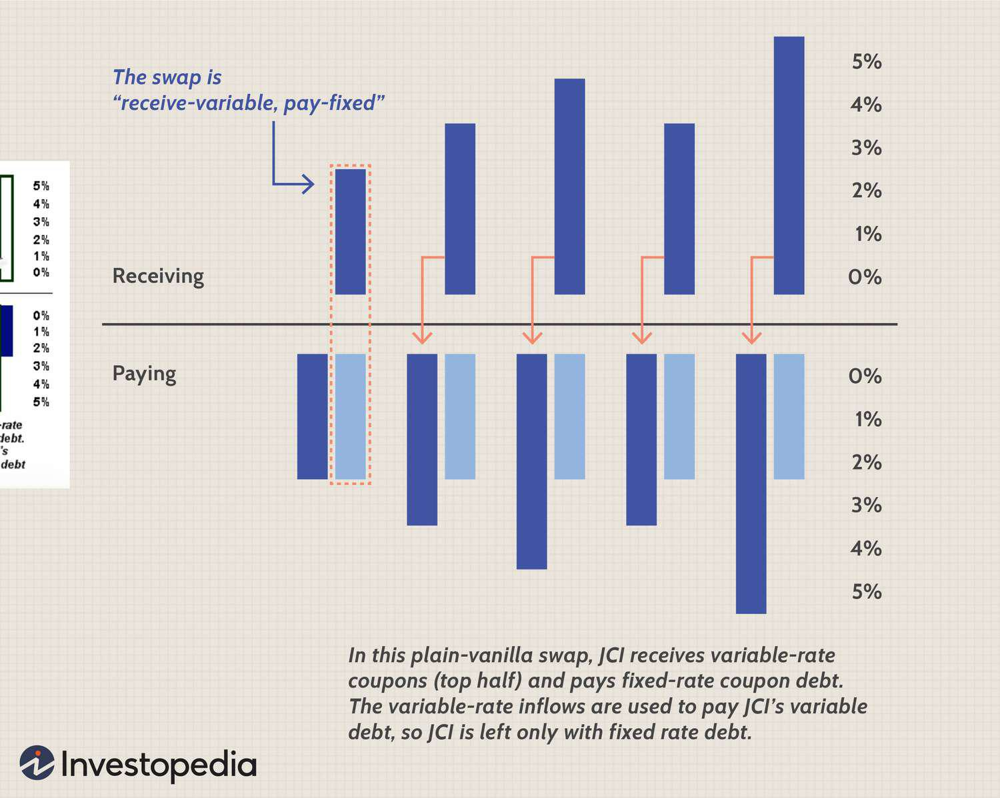

In the world of finance, trading in financial instruments such as derivatives and utilizing algorithmic trading have become increasingly prevalent. These methods, while offering exciting opportunities for profit, also bring forth significant risks that traders and investors need to be mindful of. Understanding these risks is essential for navigating the complexities of modern financial markets successfully.

The trading of derivatives, which derive their value from underlying assets like stocks, bonds, commodities, or currencies, has expanded significantly in recent years. These instruments allow investors to speculate on price movements, hedge against potential losses, and improve their portfolio management. However, they are also accompanied by considerable risks, including market, counterparty, liquidity, and interconnection risks.



Moreover, algorithmic trading, which utilizes high-speed, computer-driven algorithms to execute trades, has transformed the dynamics of financial markets. While these algorithms offer enhanced efficiency and the ability to handle large volumes of trades, they also pose unique challenges. Technical glitches can lead to market disruptions, as evidenced by events like the Flash Crash of 2010, highlighting potential systemic risks.

This article explores the inherent risks associated with trading derivatives and the usage of algorithmic trading, emphasizing the importance of risk management strategies. It discusses various types of trading risks, including market risk, which arises from fluctuations in asset prices; counterparty risk, which is the possibility of a party in a financial contract defaulting; liquidity risk, concerning the difficulty of executing trades without impacting prices significantly; and interconnection risk, which can cause cascading failures in interconnected financial systems.

By understanding and managing these risks effectively, traders and investors can optimize their investment strategies and enhance their chances of success in the competitive financial landscape.

## Table of Contents

## Understanding Financial Instruments

Financial instruments encompass a wide array of products, from traditional assets like stocks and bonds to more sophisticated constructs such as derivatives and algorithmic trading systems. 

Stocks represent ownership in a company and typically provide dividends, while bonds are debt instruments that pay interest over time. Both are extensively traded in financial markets and provide foundational assets for more complex instruments.

Derivatives are contracts whose value is based on an underlying asset. This category includes futures, options, and swaps. Futures contracts obligate the buyer to purchase, or the seller to sell, an asset at a predetermined future date and price. Options provide the right, but not the obligation, to buy (call option) or sell (put option) an asset at a specified price before expiration. Swaps involve the exchange of cash flows or other financial instruments between parties. The pricing and trading of derivatives involve understanding the underlying asset’s behavior and involve substantial risk, including market [volatility](/wiki/volatility-trading-strategies) and counterparty default.

Algorithmic trading employs complex algorithms to execute high-speed trades in financial markets. These algorithms analyze vast datasets and can make split-second trade decisions, often leveraging statistical models and [machine learning](/wiki/machine-learning) techniques. Python, a versatile programming language, is frequently used for [algorithmic trading](/wiki/algorithmic-trading) due to libraries like NumPy, pandas, and scikit-learn that facilitate data manipulation, statistical analysis, and model development. For instance, an algorithm might be designed in Python to identify [arbitrage](/wiki/arbitrage) opportunities as follows:

```python
import numpy as np
import pandas as pd

# Assuming df is a DataFrame with historical price data
def identify_arbitrage_opportunities(df):
    # Calculate simple moving averages
    df['SMA_short'] = df['price'].rolling(window=5).mean()
    df['SMA_long'] = df['price'].rolling(window=20).mean()

    # Find crossover points
    df['Signal'] = 0
    df['Signal'][df['SMA_short'] > df['SMA_long']] = 1
    df['Position'] = df['Signal'].diff()

    return df[df['Position'] == 1]  # Return the points where crossover occurs

# Example usage
# arbitrage_opportunities = identify_arbitrage_opportunities(historical_prices_df)
```

Each financial instrument presents distinct opportunities and challenges. Stocks and bonds are relatively straightforward but subject to market conditions. Derivatives involve leverage and require a profound comprehension of the related risks and the underlying asset dynamics. Algorithmic trading systems require rigorous testing and validation to ensure reliability and profitability, often confronting challenges such as data quality and market [liquidity](/wiki/liquidity-risk-premium).

Understanding these financial instruments involves mastering their mechanisms, risks, and the technologies pivotal for trading them effectively. This knowledge enables investors and traders to make informed decisions and adapt strategies to evolving market conditions.

## Risks in Derivative Trading

Trading derivatives involves substantial risks primarily associated with the volatility of underlying assets, making it a complex area of finance. Key risks include market, counterparty, liquidity, and interconnection risks. Understanding these risks is essential for effectively managing a derivatives trading portfolio.

**Market Risk:** The primary risk in derivative trading is market risk, stemming from the volatility and price fluctuations of the underlying asset. Since derivatives derive their value from such assets as equities, commodities, or interest rates, any market alteration affecting these assets directly influences the derivative's price. For instance, a sudden drop in commodity prices can significantly affect futures contracts, leading to potential losses for traders who are long on those positions. Market risk is typically quantified using metrics such as Value at Risk (VaR) and stress testing to gauge potential losses under adverse conditions.

**Counterparty Risk:** This type of risk becomes evident when one of the parties involved in a derivative contract fails to fulfill their contractual obligations. Counterparty risk is particularly pronounced in over-the-counter (OTC) markets, where transactions are privately negotiated rather than conducted through a centralized exchange. To mitigate this risk, parties often use collateral agreements and netting arrangements, and employ clearinghouses for certain standardized contracts. Nonetheless, the financial stability and creditworthiness of counterparties remain a critical concern.

**Liquidity Risk:** Liquidity risk in derivatives trading arises when traders are unable to execute trades promptly at desirable prices due to a lack of market participants or low trading volumes. This can be particularly concerning in the OTC market, where specific derivative contracts may not have as many buyers or sellers. A liquid market allows for smooth transaction completion without substantial price concessions. Illiquidity can force traders to accept unfavorable prices, leading to potential financial losses. This risk is often managed by maintaining a diversified portfolio and focusing on liquid instruments.

**Interconnection Risk:** The interconnected nature of financial derivatives can cause cascading effects across markets, amplifying systemic risk. When one derivative position defaults, it can trigger a ripple effect, affecting other interconnected positions and counterparties globally. This interconnectedness became evident during the 2007-2008 financial crisis, where the failure of complex derivatives like credit default swaps contributed to a broader economic collapse. Regulation plays a key role in mitigating these risks, with authorities imposing measures such as increased transparency and capital requirements to reduce potential domino effects in financial markets.

Analyzing and managing these risks require a comprehensive approach, combining quantitative tools, regulatory oversight, and strategic risk management practices to protect against potential financial vulnerabilities in derivative trading.

## Algorithmic Trading and Its Risks

Algorithmic trading employs sophisticated algorithms for rapid trade execution, revolutionizing modern financial markets. These techniques leverage patterns within data to execute trades at speeds and frequencies impractical for human traders. However, while algorithmic trading offers efficiencies and opportunities, it introduces substantial systemic risks.

One significant risk is the amplification of market volatility. Algorithms can react to market indicators nearly instantaneously, which, during specific conditions, can trigger a cascade of automated responses across trading systems, exacerbating price swings. An illustrative example is the Flash Crash on May 6, 2010, when the Dow Jones Industrial Average plunged about 1,000 points in minutes, partially due to high-frequency trading algorithms reacting to large sell orders and leading to further sell-offs [1].

Technical failures present another critical risk. These include glitches in the algorithm's logic that can lead to unintended trades, known as "rogue algorithms," which can have significant financial repercussions. Additionally, if the data fed into these systems are of poor quality or contain inaccuracies, it can lead to erroneous trading decisions. The principle of "garbage in, garbage out" is particularly pertinent, highlighting the need for high-quality, reliable data sources.

A fundamental issue with algorithmic trading is the tendency for algorithms to be overfitted to historical data. Overfitting occurs when a model captures noise rather than the underlying data structure, leading to a predictive model that performs well on past data but poorly on future or unseen data. This is often a consequence of using complex models that are excessively optimized for historical datasets.

Moreover, algorithmic trading systems can be manipulated for profit, a practice known as spoofing. In spoofing, traders use algorithms to place large orders they never intend to execute, creating a false sense of demand or supply to manipulate prices. Such practices undermine market integrity and pose challenges for regulators.

Finally, the digital nature of algorithmic trading makes it a target for cyber threats. Vulnerabilities in trading platforms or algorithms can be exploited by adversaries to conduct unauthorized trades, cause disruptions, or extract sensitive information, posing significant risks to financial stability.

To mitigate these risks, rigorous testing and validation of algorithms are essential. Implementations should involve robust [backtesting](/wiki/backtesting) against diverse historical scenarios, regular updates, and ongoing monitoring. Ensuring that algorithms comply with regulatory requirements and integrating safeguards against market abuse are crucial steps toward reducing the potential for significant financial disruptions.

---
[1] CFTC-SEC. "Findings Regarding the Market Events of May 6, 2010."

## Managing and Mitigating Risks

Managing and mitigating risks in derivative and algorithmic trading is crucial for maintaining financial stability and optimizing portfolio performance. A strategic approach to risk management involves several key practices.

Diversification is a fundamental strategy for managing risk. By spreading investments across various asset classes or derivatives, traders can reduce the impact of adverse movements in any single asset. This approach minimizes the overall portfolio volatility and potential losses. For instance, combining a mix of equities, bonds, futures, and options can offer a balanced exposure and create a hedge against market fluctuations.

Robust algorithm design is essential for algorithmic trading. A well-designed algorithm should accommodate different market conditions and be capable of adjusting its strategies in response to market changes. Ensuring the algorithm is not overfitted to historical data reduces the risk of poor performance in real-time trading. Backtesting and forward testing are critical steps to verify that algorithms perform robustly across various scenarios.

Implementing circuit breakers and kill switches is an important risk mitigation tool. Circuit breakers temporarily halt trading on an exchange to prevent panic selling and excessive market volatility, allowing time for market participants to process information and make informed decisions. Kill switches are designed to immediately stop trading operations if certain predefined conditions are met, ensuring that automated trading systems do not operate unchecked during unusual market conditions.

Advanced risk management tools, such as stress testing and scenario analysis, are crucial for risk preparedness. Stress testing involves simulating extreme market conditions to assess the potential impact on portfolios, helping traders understand vulnerabilities. Scenario analysis considers various hypothetical situations to evaluate how different factors can influence asset performance and portfolio value.

Regular monitoring of the market is vital for successful trading. Traders should continuously track market trends, news, and economic indicators to make timely decisions. Additionally, ensuring high data quality is essential as inaccurate or outdated data can lead to misinformed trades and increased risk exposure. Data validation processes and real-time data feeds can help maintain the integrity and accuracy of trading information.

In summary, managing and mitigating risks in derivative and algorithmic trading requires a combination of diversification, robust algorithm design, and the use of preventive measures such as circuit breakers. Leveraging advanced risk management tools and maintaining vigilant market monitoring are also critical practices that contribute to effective risk management and trading success.

## Conclusion

In contemporary financial markets, possessing a thorough understanding of the risks linked to derivative and algorithmic trading is imperative for effective risk management. Despite the substantial profit potential these financial instruments offer, their intricate nature demands an informed approach to avoid vulnerabilities. Implementing well-established risk management strategies is key for investors aiming to enhance their portfolios and adeptly navigate market complexities. Techniques such as diversification of investments, rigorous algorithm design, and continuous risk evaluation all play pivotal roles in risk mitigation.

To safeguard against systemic threats and market turbulence, applying mechanisms like circuit breakers and kill switches is advisable. These tools act as emergency "off" switches to prevent excessive volatility. Moreover, employing advanced risk management tools like stress testing and scenario analysis provides insights into potential market reactions under diverse conditions, facilitating better preparedness.

Staying abreast of emerging trends and technological advancements within the trading landscape is crucial for maintaining a competitive edge. Continuous education and awareness empower investors to make more informed, strategic decisions that align with shifting market dynamics. By adopting a comprehensive and informed approach, traders can maximize opportunities while minimizing losses, ultimately achieving long-term investment success.

## References & Further Reading

For those looking to deepen their understanding of trading risks associated with derivatives and algorithmic trading, several comprehensive resources are available. Texts such as "Principles of Risk Management and Insurance" provide foundational knowledge on managing diverse financial risks. Similarly, "Advances in Financial Machine Learning" explores the intersection of data science and financial markets, offering insights into algorithmic trading techniques and risk management strategies. 

Analyzing historical market events can provide additional perspective on trading risks. A pivotal study is the examination of the Flash Crash on May 6, 2010, where the Dow Jones Industrial Average plummeted nearly 1,000 points within minutes. Reports and research papers on this event illustrate how algorithmic trading can exacerbate market volatility under certain conditions. Understanding the mechanisms that contributed to such rapid fluctuations offers valuable lessons for risk mitigation in algorithmic strategies.

For those inclined towards a technical approach, exploring algorithmic risk management involves the use of sophisticated tools and programming languages such as Python. Implementing code for stress testing or scenario analysis can enhance preparedness against market unpredictability. An example of a simple risk assessment could involve using Python libraries like NumPy and pandas to model potential market scenarios:

```python
import numpy as np
import pandas as pd

# Simulate market returns
np.random.seed(0)
market_returns = np.random.normal(0.0001, 0.01, 1000)

# Calculate Value at Risk (VaR) at 95% confidence interval
VaR_95 = np.percentile(market_returns, 5)
print(f"95% Value at Risk: {VaR_95:.4f}")
```

This script simulates market conditions and computes the Value at Risk, a crucial metric in assessing potential losses in a given portfolio, informing traders of the extent of risk exposure.

These resources and methodologies not only expand the theoretical basis needed for effective risk assessment but also offer practical insights for implementing robust trading strategies. Engaging with this material will empower investors and traders to navigate the complexities of modern financial markets with greater confidence and strategic foresight.