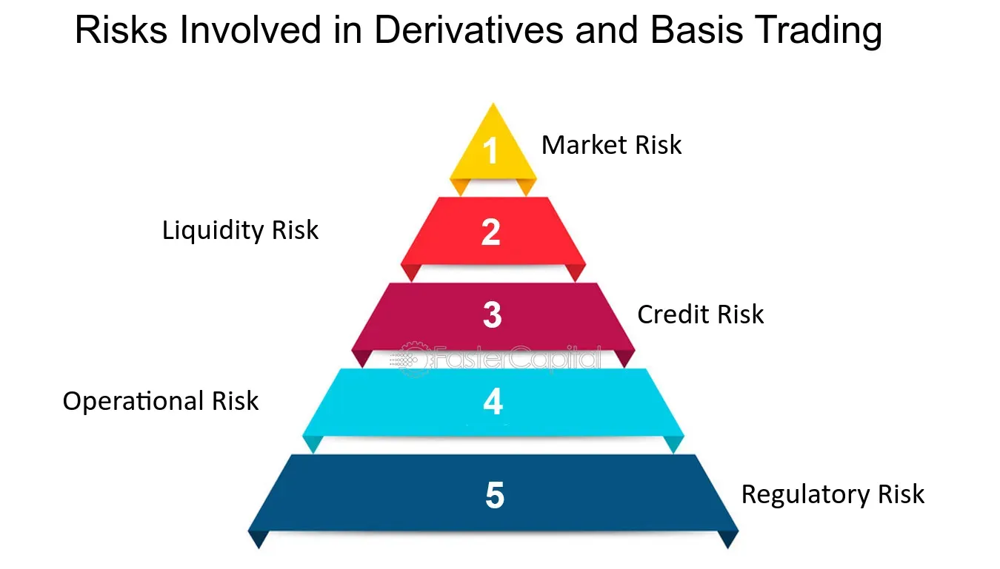

## Table of Contents

## What are derivatives and how do they work?

Derivatives are financial instruments whose value depends on the value of an underlying asset, like stocks, bonds, commodities, or currencies. They are called "derivatives" because their value is derived from something else. People use derivatives to manage risk or to bet on the future price of an asset. For example, a farmer might use a derivative to lock in a price for his crops, ensuring he gets a certain amount of money even if prices drop. On the other hand, someone else might use a derivative to bet that the price of those crops will go up.

There are many types of derivatives, but some common ones are futures, options, and swaps. Futures are contracts to buy or sell an asset at a future date for a price agreed upon today. Options give the buyer the right, but not the obligation, to buy or sell an asset at a set price before a certain date. Swaps are agreements to exchange cash flows or other financial instruments. Derivatives can be very useful for managing risk, but they can also be risky if not used carefully. They are complex and can lead to big losses if the market moves in unexpected ways.

## What are the basic types of derivatives?

The basic types of derivatives are futures, options, and swaps. Futures are agreements to buy or sell something at a future date for a price set today. For example, a farmer might agree to sell his wheat at a set price in six months, no matter what the market price is then. This helps the farmer know how much money he will get, even if prices go down.

Options give you the right, but not the obligation, to buy or sell something at a set price before a certain date. Think of it like a coupon that lets you buy a shirt at a discount, but you don't have to use it if the shirt goes on sale for even less. This can be useful if you think the price of something might go up, but you're not sure.

Swaps are agreements to exchange cash flows or other financial instruments. For example, two companies might agree to swap their interest payments, where one pays a fixed rate and the other pays a variable rate. This can help them manage their costs better. Each type of derivative has its own uses and risks, but they all help people manage uncertainty in the financial world.

## What are the common risks associated with trading derivatives?

Trading derivatives can be risky because their value depends on the price of something else, like a stock or a commodity. If the price of that thing goes down a lot, the derivative can lose value quickly. This means you could lose more money than you put in. It's like betting on a horse race; if your horse doesn't win, you lose your bet. Also, derivatives are often complex and hard to understand, so it's easy to make mistakes or not see all the risks.

Another risk is something called counterparty risk. This means that the person or company you're trading with might not be able to pay you if things go wrong. It's like lending money to a friend; if they can't pay you back, you're out of luck. Also, because derivatives can be used to bet on prices going up or down, they can make the market more volatile. This means prices can swing wildly, making it harder to predict what will happen and increasing the chance of big losses.

## How does leverage in derivatives trading increase risk?

Leverage in derivatives trading means you can control a big amount of money with just a little bit of your own. It's like using a lever to lift a heavy rock; you don't need to be strong, just smart about where you place the lever. In trading, this means you can buy a lot more derivatives than you could if you had to pay the full price upfront. This can be good because if the price goes your way, you can make a lot more money. But it's also risky because if the price goes against you, you can lose a lot more money than you put in.

Because you're using borrowed money, even small changes in the price of the underlying asset can lead to big changes in the value of your derivatives. It's like riding a bike with a really long gear; a small turn of the pedals can make the wheels spin super fast, but if you lose control, you can crash hard. This means that while leverage can make your profits bigger, it can also make your losses bigger, and sometimes those losses can be more than what you originally invested. So, it's important to be careful and understand how leverage works before you start trading derivatives.

## What is counterparty risk in derivatives trading?

Counterparty risk in derivatives trading means the chance that the other person or company you're trading with won't be able to fulfill their part of the deal. When you trade derivatives, you're making an agreement with someone else. If that person or company runs into financial trouble and can't pay you what they owe, you could lose money. It's like lending money to a friend; if they can't pay you back, you're out of luck.

This risk is a big deal in derivatives because these contracts often involve big amounts of money and can last for a long time. If the market moves against your trade, the other side might not have enough money to cover their losses. To manage this risk, traders often use things like clearinghouses, which act like a middleman to make sure both sides can pay up. But even with these protections, counterparty risk is something you always need to think about when trading derivatives.

## How can market volatility affect derivatives trading?

Market volatility means the prices of things like stocks or commodities can change a lot and very quickly. When the market is volatile, it can make derivatives trading more risky. Derivatives are based on the price of something else, so if that price jumps around a lot, the value of the derivative can change a lot too. This can be good if the price moves in the way you expected, but if it goes the other way, you could lose a lot of money fast.

Because derivatives often use leverage, even small changes in the market can have a big effect on your trades. If the market is calm, it's easier to predict what might happen and manage your risks. But when it's volatile, it's harder to know what will happen next, and that can lead to bigger losses. So, traders need to be extra careful and have good plans in place to handle the ups and downs of a volatile market.

## What are the liquidity risks involved in trading derivatives?

Liquidity risk in derivatives trading means it might be hard to buy or sell your derivatives quickly without losing money. When a market is liquid, lots of people are buying and selling, so you can easily trade your derivatives at a fair price. But if the market is not liquid, there might not be many people wanting to trade, so you might have to sell your derivatives for less than they're worth or wait a long time to find someone to trade with.

This can be a big problem if you need to get out of a trade quickly, like if the market is moving against you. If you can't sell your derivatives fast enough, your losses can get bigger. So, it's important to think about how easy it will be to trade your derivatives before you start, especially if you might need to make quick changes to your trades.

## How do regulatory changes impact derivatives trading risks?

Regulatory changes can make derivatives trading safer or riskier. When governments or financial watchdogs make new rules, they often want to stop big problems like the ones that caused the 2008 financial crisis. These rules might make traders report more information, use less leverage, or trade through special organizations called clearinghouses. This can help lower risks like counterparty risk, where the other person in the trade can't pay up. But, these rules can also make trading more complicated and expensive, which might push some traders to less safe places to trade.

On the other hand, if regulations get relaxed, it might be easier and cheaper to trade derivatives, but it can also increase risks. Less strict rules might mean more people can use a lot of leverage, which can lead to bigger losses if things go wrong. Also, fewer rules might mean less information about what's happening in the market, making it harder to see and manage risks. So, traders need to keep an eye on regulatory changes and understand how they might affect the risks they face in derivatives trading.

## What strategies can be used to manage and mitigate risks in derivatives trading?

To manage and mitigate risks in derivatives trading, it's important to start with a solid plan. This means setting clear goals for what you want to achieve and understanding how much risk you're willing to take. One good strategy is to use stop-loss orders, which automatically sell your derivatives if the price drops to a certain level. This can help limit your losses if the market moves against you. Another strategy is diversification, which means not putting all your money into one type of derivative or one market. By spreading your trades across different assets, you can reduce the impact of a bad trade on your overall portfolio.

Another important way to manage risk is to keep an eye on market conditions and be ready to adjust your trades. This means staying informed about things like economic news, market trends, and regulatory changes that could affect your derivatives. Using tools like hedging can also help. Hedging means taking a position that will offset potential losses in another position. For example, if you own a stock, you might buy a put option to protect against a drop in the stock's price. Finally, it's crucial to understand the derivatives you're trading and to use only as much leverage as you can handle. Too much leverage can lead to big losses, so it's important to be careful and not get carried away by the potential for big gains.

## How does one assess the credit risk of derivatives?

Assessing the credit risk of derivatives means figuring out how likely it is that the other person or company you're trading with won't be able to pay you what they owe. To do this, you look at their financial health. This includes checking their credit rating, which is like a score that tells you how good they are at paying back money. You also look at their financial statements to see if they have enough money and assets to cover their debts. If they have a lot of debt or if their business is not doing well, the credit risk is higher.

Another way to assess credit risk is by using credit default swaps (CDS), which are like insurance policies against someone not paying you back. The price of a CDS can tell you a lot about how risky the other person is thought to be. If the price is high, it means the market thinks there's a bigger chance they won't pay. Also, you can use tools like stress testing, where you imagine different bad situations and see how the other person would handle them. This helps you understand how they might react if things go wrong in the market. By combining all these methods, you get a better picture of the credit risk involved in trading derivatives with them.

## What advanced risk management tools are available for expert derivatives traders?

Expert derivatives traders can use advanced risk management tools like Value at Risk (VaR) to help them understand how much money they could lose on a bad day. VaR is a number that tells you the most you could lose over a certain time, like a day or a week, with a certain level of confidence, say 95%. This helps traders see the worst-case scenario and plan accordingly. Another tool is stress testing, where traders imagine different bad situations, like a big drop in the market or a sudden change in interest rates, and see how their trades would do. This helps them prepare for unexpected events and make sure their trading strategy can handle tough times.

There are also tools like risk-adjusted return on capital (RAROC) that help traders see if the money they're making is worth the risk they're taking. RAROC looks at how much profit you're making compared to how much risk you're taking, and it helps you decide if a trade is a good idea. Another advanced tool is scenario analysis, where traders look at different possible futures and see how their trades would perform in each one. This helps them think through different possibilities and make better decisions. By using these tools, expert traders can manage their risks better and make smarter trades.

## How can systemic risks in the derivatives market impact global financial stability?

Systemic risks in the derivatives market can shake up global financial stability because they can spread trouble from one part of the market to the whole world. Imagine the derivatives market as a big spider web. If one part of the web gets a big shake, it can make the whole web move. If a big bank or financial company that trades a lot of derivatives runs into trouble and can't pay its debts, it can cause a chain reaction. Other companies that traded with that bank might also lose money and have trouble paying their own debts. This can spread panic and make more and more people lose trust in the financial system, leading to a global financial crisis.

Regulators and governments try to keep an eye on these risks and put rules in place to stop them from getting out of control. But even with these efforts, it's hard to predict and stop all problems. The 2008 financial crisis showed how dangerous systemic risks can be. It started with problems in the U.S. housing market but quickly spread through derivatives like mortgage-backed securities and credit default swaps, affecting banks and economies all over the world. So, understanding and managing systemic risks in the derivatives market is crucial for keeping the global financial system stable.

## References & Further Reading

For those looking to deepen their understanding of trading risks associated with derivatives and algorithmic trading, several comprehensive resources are available. Texts such as "Principles of Risk Management and Insurance" provide foundational knowledge on managing diverse financial risks. Similarly, "Advances in Financial Machine Learning" explores the intersection of data science and financial markets, offering insights into algorithmic trading techniques and risk management strategies. 

Analyzing historical market events can provide additional perspective on trading risks. A pivotal study is the examination of the Flash Crash on May 6, 2010, where the Dow Jones Industrial Average plummeted nearly 1,000 points within minutes. Reports and research papers on this event illustrate how algorithmic trading can exacerbate market volatility under certain conditions. Understanding the mechanisms that contributed to such rapid fluctuations offers valuable lessons for risk mitigation in algorithmic strategies.

For those inclined towards a technical approach, exploring algorithmic risk management involves the use of sophisticated tools and programming languages such as Python. Implementing code for stress testing or scenario analysis can enhance preparedness against market unpredictability. An example of a simple risk assessment could involve using Python libraries like NumPy and pandas to model potential market scenarios:

```python
import numpy as np
import pandas as pd

# Simulate market returns
np.random.seed(0)
market_returns = np.random.normal(0.0001, 0.01, 1000)

# Calculate Value at Risk (VaR) at 95% confidence interval
VaR_95 = np.percentile(market_returns, 5)
print(f"95% Value at Risk: {VaR_95:.4f}")
```

This script simulates market conditions and computes the Value at Risk, a crucial metric in assessing potential losses in a given portfolio, informing traders of the extent of risk exposure.

These resources and methodologies not only expand the theoretical basis needed for effective risk assessment but also offer practical insights for implementing robust trading strategies. Engaging with this material will empower investors and traders to navigate the complexities of modern financial markets with greater confidence and strategic foresight.

