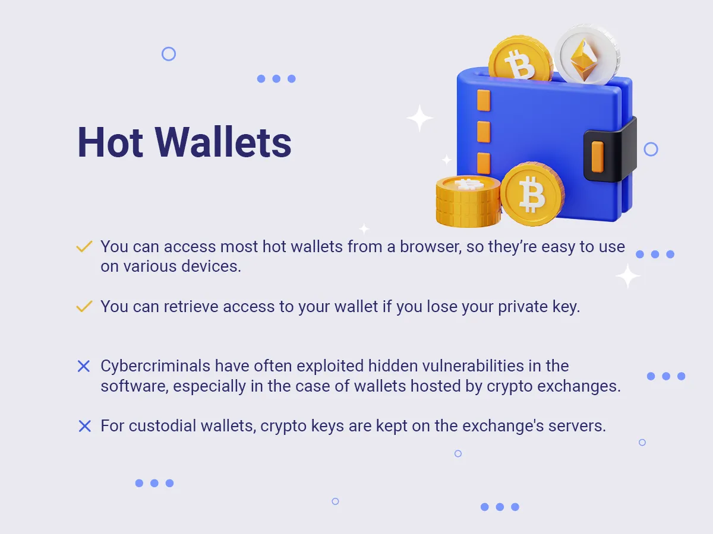

## Table of Contents

## What is a Bitcoin wallet?

A Bitcoin wallet is like a digital bank account for your Bitcoin. It's a place where you can store, send, and receive Bitcoin. You can think of it as a special app or website that helps you manage your Bitcoin. Each wallet has a unique address, kind of like an email address, that you use to send and receive Bitcoin.

There are different types of Bitcoin wallets. Some are stored on your computer or phone, called software wallets. Others are kept on a special device that looks like a USB stick, called hardware wallets. There are also online wallets, which are managed by a company on the internet. Each type has its own pros and cons, so it's important to choose the one that best fits your needs.

## Why might someone store all their Bitcoin in a single wallet?

Someone might store all their Bitcoin in a single wallet for simplicity. Managing one wallet is easier than keeping track of many. It's like having all your money in one bank account instead of spreading it out. This way, you only need to remember one set of passwords and security measures, making it less complicated.

Another reason could be security. Some people might feel that a single, well-protected wallet is safer than multiple wallets. If they use a hardware wallet, which is very secure, they might feel more comfortable keeping everything in one place. This way, they can focus on protecting just one wallet instead of worrying about several.

## What are the basic risks of keeping all your Bitcoin in one wallet?

Keeping all your Bitcoin in one wallet can be risky because if something goes wrong, you could lose everything at once. For example, if someone hacks into your wallet or if you lose your private keys, all your Bitcoin could be gone. It's like putting all your eggs in one basket; if the basket breaks, you lose all your eggs.

Another risk is that having all your Bitcoin in one place can make you a bigger target for thieves. If someone finds out you have a lot of Bitcoin in one wallet, they might try harder to steal it. It's similar to how a thief might be more interested in robbing a house they know has a lot of valuable stuff inside.

## How can a single point of failure affect Bitcoin stored in one wallet?

A single point of failure means that if something goes wrong with your wallet, you could lose all your Bitcoin at once. Imagine if your wallet is on your computer and the computer breaks or gets a virus. If you don't have a backup, all your Bitcoin could be gone. It's like if you keep all your money in one safe and the safe breaks; you lose everything inside.

Also, if someone finds out you have a lot of Bitcoin in one wallet, they might try to steal it. It's like having a big sign on your house saying you have a lot of valuable stuff inside. Thieves might work harder to break in. So, keeping all your Bitcoin in one place can make you a bigger target for hackers or thieves.

## What are the security implications of using just one wallet for all your Bitcoin?

Using just one wallet for all your Bitcoin can be risky because if that one wallet gets hacked or if you lose the private keys, you could lose all your Bitcoin at once. It's like putting all your money in one place; if something bad happens to that place, you lose everything. If someone knows you have a lot of Bitcoin in one wallet, they might try harder to steal it, making you a bigger target for thieves.

On the other hand, if you use a very secure wallet, like a hardware wallet, keeping all your Bitcoin in one place might feel safer. You only need to protect one wallet instead of many. But even with a secure wallet, there's still a chance something could go wrong, like losing the wallet or forgetting the password. So, it's important to think carefully about how you manage your Bitcoin to keep it safe.

## How does the loss or theft of a single wallet impact your Bitcoin holdings?

If you lose or someone steals your single wallet, you could lose all your Bitcoin at once. It's like if you keep all your money in one place and that place gets robbed or lost. You won't have any Bitcoin left because everything was in that one wallet. Losing the wallet could happen if you misplace a hardware wallet or if your computer with a software wallet breaks or gets a virus. Theft could happen if a hacker finds a way into your wallet or if someone steals your hardware wallet.

Having all your Bitcoin in one wallet can make you a bigger target for thieves. If someone knows you have a lot of Bitcoin in one place, they might try harder to steal it. It's like having a big sign on your house saying you have valuable stuff inside. Thieves might work harder to break in. So, even if you use a very secure wallet, like a hardware wallet, there's still a risk that something could go wrong and you could lose everything.

## What are the best practices for managing private keys when using a single wallet?

When you use a single wallet for all your Bitcoin, it's really important to keep your private keys safe. Your private keys are like the secret passwords that let you use your Bitcoin. You should never share them with anyone. It's a good idea to write them down and keep them in a safe place, like a locked drawer or a safe. Don't keep them on your computer or phone because those can be hacked. Also, make sure to make copies of your private keys and keep those copies in different safe places, just in case something happens to the first one.

Another good practice is to use strong passwords for your wallet. Make sure your password is long and has a mix of letters, numbers, and symbols. Don't use easy-to-guess passwords like "1234" or your birthday. It's also smart to use two-[factor](/wiki/factor-investing) authentication if your wallet offers it. This means you need two things to get into your wallet, like a password and a code sent to your phone. This makes it much harder for someone to steal your Bitcoin. By following these simple steps, you can help keep your Bitcoin safe even if you're using just one wallet.

## How can hardware failures or software bugs in a single wallet compromise your Bitcoin?

Hardware failures or software bugs in a single wallet can be a big problem for your Bitcoin. If you use a hardware wallet and it breaks or gets damaged, you might not be able to access your Bitcoin anymore. It's like if your piggy bank broke and you couldn't get your money out. If you don't have a backup of your private keys, all your Bitcoin could be stuck in the broken wallet. Software bugs can also cause trouble. If there's a mistake in the wallet's code, it might let someone else take your Bitcoin or stop you from using it. It's like if a bank's computer had a glitch and someone else could take your money.

To keep your Bitcoin safe, it's important to have backups of your private keys. If your hardware wallet breaks, you can use the backup to get your Bitcoin into a new wallet. Also, always keep your wallet's software up to date. When the people who made the wallet find bugs, they fix them and release updates. By updating your wallet, you can avoid problems from old bugs. Even though using one wallet can be simpler, these steps can help protect your Bitcoin from hardware failures and software bugs.

## What role does wallet diversification play in risk management for Bitcoin storage?

Wallet diversification is like spreading your Bitcoin across different wallets instead of keeping it all in one place. This can help manage the risk of losing all your Bitcoin if something goes wrong with one wallet. If one wallet gets hacked, lost, or has a problem, you won't lose everything because your Bitcoin is spread out. It's like not putting all your eggs in one basket; if one basket breaks, you still have eggs in the other baskets.

Having different types of wallets can also help. You might use a hardware wallet for most of your Bitcoin because it's very secure, but also keep some Bitcoin in a software wallet for everyday use. This way, if you need to spend Bitcoin quickly, you don't have to use your main, secure wallet. It's like keeping some money in your pocket for daily spending and the rest in a safe at home. By diversifying your wallets, you can better protect your Bitcoin and feel more secure.

## How can you mitigate the risks associated with storing Bitcoin in a single wallet?

One way to lower the risks of keeping all your Bitcoin in one wallet is by making sure you have strong security. Use a good password that's hard to guess, and if your wallet allows it, turn on two-factor authentication. This means you need two things to get into your wallet, like a password and a code sent to your phone. It's like having two locks on your door instead of one. Also, keep your private keys safe. Write them down and store them in a safe place, like a locked drawer or a safe. Don't keep them on your computer or phone where they could be stolen by hackers.

Another way to protect your Bitcoin is by always keeping your wallet's software up to date. When the people who made the wallet find problems or bugs, they fix them and release updates. By updating your wallet, you can avoid issues from old bugs. If you use a hardware wallet, make sure to have a backup of your private keys. If your hardware wallet breaks or gets lost, you can use the backup to move your Bitcoin to a new wallet. By following these simple steps, you can help keep your Bitcoin safe even if you're using just one wallet.

## What are the advanced security measures one can implement for a single Bitcoin wallet?

One advanced security measure for a single Bitcoin wallet is using a hardware wallet. A hardware wallet is a special device that keeps your private keys offline, making it very hard for hackers to steal them. It's like keeping your money in a safe that's not connected to the internet. Another good measure is setting up a multi-signature wallet. This means you need more than one private key to spend your Bitcoin. It's like needing two or more people to agree before you can open a safe. This can make your wallet much safer because even if someone steals one key, they can't use your Bitcoin without the others.

Another advanced measure is using cold storage. Cold storage means keeping your Bitcoin on a device that's never connected to the internet, like a USB drive or a piece of paper with your private keys written on it. This is super secure because hackers can't reach it online. You can also use encryption to protect your wallet. Encryption is like putting a secret code on your wallet so only you can read it. It's another layer of protection that makes it harder for thieves to get your Bitcoin. By using these advanced measures, you can make your single wallet much safer.

## How do the risks of using a single wallet change with the increasing value of Bitcoin?

As the value of Bitcoin goes up, the risks of keeping all your Bitcoin in one wallet get bigger. If you have a lot of Bitcoin in one place and its value increases, that wallet becomes a bigger target for thieves. It's like if you had a piggy bank with a few dollars, no one might care, but if it had a lot of money, someone might try to steal it. So, if Bitcoin's value goes up, hackers and thieves might work harder to break into your wallet because it's worth more to them.

Also, if something goes wrong with your wallet, like it gets lost or hacked, you could lose a lot more money if Bitcoin's value is high. It's like if you lost a wallet with a few dollars, it wouldn't be a big deal, but if it had a lot of money, it would be a big problem. So, as Bitcoin's value increases, it's even more important to take extra steps to keep your wallet safe, like using strong passwords, keeping your private keys secure, and maybe even using a hardware wallet.

## What is the importance of diversification?

Diversification is a fundamental strategy in investment management that aims to reduce risk by spreading investments across various asset classes, thereby minimizing the impact of [volatility](/wiki/volatility-trading-strategies). In the context of [cryptocurrency](/wiki/cryptocurrency), diversification is particularly vital due to the market's inherent volatility and unpredictability.

When investors diversify their portfolios, they allocate their funds across different types of investments—cryptocurrencies, stocks, bonds, and other financial instruments. This approach helps to stabilize the portfolio, as gains in one area can offset losses in another. For instance, cryptocurrencies may experience significant price fluctuations, which can be mitigated by the steadier performance of traditional investments such as government bonds or blue-chip stocks.

### Investment Portfolio Model

A well-diversified portfolio can be represented mathematically to optimize the risk-return profile. The expected return ($E(R_p)$) of a diversified portfolio can be calculated as follows:

$$
E(R_p) = \sum_{i=1}^{n} w_i \times E(R_i)
$$

where $w_i$ represents the weight of asset $i$ in the portfolio, and $E(R_i)$ is the expected return of asset $i$. To minimize risk, investors may aim to reduce the portfolio's variance ($\sigma_p^2$):

$$
\sigma_p^2 = \sum_{i=1}^{n} w_i^2 \times \sigma_i^2 + \sum_{i \neq j} w_i \times w_j \times \sigma_{i,j}
$$

where $\sigma_i^2$ is the variance of asset $i$, and $\sigma_{i,j}$ is the covariance between asset $i$ and asset $j$.

### Diversification Strategies

1. **Mixing Asset Classes**: By combining cryptocurrencies with traditional financial assets, investors can achieve a balanced risk profile. Cryptocurrencies like Bitcoin and Ethereum, known for high volatility, can be countered with low-risk assets such as treasury bonds.

2. **Sector Diversification**: Within the cryptocurrency domain, diversifying across various sectors such as decentralized finance (DeFi), gaming, and payment systems can further mitigate concentration risk. For instance, investments in both Ethereum (for DeFi) and Ripple (for international payments) provide exposure to different market drivers.

3. **Geographic Diversification**: By investing in cryptocurrencies and assets from different regions around the world, investors can reduce region-specific risks such as regulatory changes or economic downturns.

### Due Diligence

Investors should perform comprehensive due diligence when selecting platforms and assets for their portfolios. This includes assessing the security practices of cryptocurrency exchanges, evaluating the credibility of the asset issuers, and understanding the underlying technology and market trends. Staying informed about regulatory developments and technological advancements is also crucial for maintaining the security and resiliency of a diversified investment strategy.

By leveraging diversification strategies, investors can not only protect their portfolios against market volatility but also capitalize on potential growth opportunities across different asset classes and sectors.

## References & Further Reading

Explore additional resources on Bitcoin storage security and [algorithmic trading](/wiki/algorithmic-trading) strategies to deepen your understanding and enhance your practices in cryptocurrency. One of the comprehensive guides to Bitcoin is "Mastering Bitcoin" by Andreas M. Antonopoulos, which provides an in-depth exploration of the structure, mechanics, and features of Bitcoin. This book is essential for gaining a technical understanding of how Bitcoin works and securing digital assets comprehensively.

Another notable reference is "Bitcoin and Cryptocurrency Technologies," which offers insights into the broader scope of cryptocurrency technologies, focusing on security protocols, mining, and blockchain mechanics. This text is crucial for understanding how these technologies integrate to form a robust security framework.

To keep up with the ever-evolving cryptocurrency market, it is important to stay updated through reliable sources. Websites like CoinDesk and CoinTelegraph provide regular news updates on market trends, innovations, and security threats in the cryptocurrency world. Forums such as BitcoinTalk and Reddit's r/cryptocurrency can also be valuable for engaging with communities that share practical insights and latest developments.

For algorithmic trading strategies, online platforms like QuantConnect offer tutorials and community-driven discussions for building your own trading algorithms. Technical resources and discussion groups can also be found on GitHub, where developers often share code snippets and collaborative projects related to cryptocurrency.

Finally, attending webinars and conferences focused on cryptocurrency security and trading can be beneficial. Events such as Consensus and the Blockchain Summit provide opportunities to learn from industry leaders and gain insights into future trends, regulations, and technological advancements shaping the Bitcoin security landscape. 

Leveraging these resources and staying informed is crucial for optimizing your approach to Bitcoin storage and trading.

