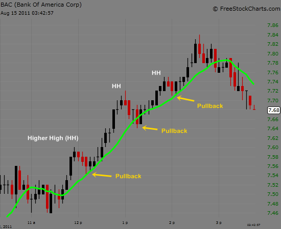

## Table of Contents

## What are low-volume stocks?

Low-volume stocks are stocks that don't have many shares traded each day. They are less popular and usually have fewer buyers and sellers. Because fewer people are trading these stocks, it can be harder to buy or sell them quickly. This can make the price of the stock go up and down a lot in a short time.

These stocks are often from smaller companies that are not well-known. They might be riskier to invest in because it's harder to predict what will happen to their price. If you want to invest in low-volume stocks, it's important to do a lot of research first and understand that they can be more unpredictable than stocks with higher trading volumes.

## Why might someone be interested in trading low-volume stocks?

People might be interested in trading low-volume stocks because they can offer big rewards. Since these stocks don't have many people trading them, their prices can change a lot in a short time. If you buy a low-volume stock at a low price and its value goes up, you could make a lot of money. This chance to make big profits quickly is what attracts some investors to low-volume stocks.

Another reason is that low-volume stocks are often from smaller or newer companies. These companies might be working on new ideas or products that could become very successful. If you believe in a company's future, buying its low-volume stock early could lead to big gains later. However, it's important to remember that these stocks can also be risky because their prices can be hard to predict and they might be harder to sell quickly.

## What is liquidity and how does it relate to low-volume stocks?

Liquidity is how easy it is to buy or sell something without affecting its price too much. If something is very liquid, like a popular stock, you can buy or sell it quickly because many people are trading it. But if something is not very liquid, like a low-volume stock, it can be harder to buy or sell it quickly because fewer people are trading it.

Low-volume stocks have low liquidity. This means that when you want to sell a low-volume stock, you might have to wait longer to find someone who wants to buy it. Also, if you want to buy or sell a lot of shares at once, it might change the price a lot because there aren't many people trading. So, low liquidity can make low-volume stocks riskier to trade.

## What are the basic risks associated with trading low-volume stocks?

Trading low-volume stocks can be risky because they have low liquidity. This means it can be hard to sell these stocks quickly. If you need to sell your shares fast, you might have to wait a long time to find a buyer. Also, if you want to sell a lot of shares at once, it might make the price go down a lot because there aren't many people trading. This can lead to bigger losses if the market moves against you.

Another risk is that low-volume stocks can have big price swings. Because fewer people are trading these stocks, their prices can change a lot in a short time. This can be good if the price goes up, but it can also be bad if the price goes down. It's hard to predict what will happen, so you might lose money if the stock's price drops suddenly.

Lastly, many low-volume stocks come from smaller or newer companies. These companies might not be as stable or well-known as bigger ones. If the company doesn't do well, the stock price can drop a lot. It's important to do a lot of research before investing in these stocks because they can be more unpredictable and risky.

## How can price volatility affect low-volume stocks?

Price volatility means that the price of a stock can change a lot in a short time. For low-volume stocks, this can happen more often because fewer people are trading them. If someone wants to buy or sell a lot of shares quickly, it can make the price go up or down a lot. This is because there aren't many other people trading to balance out the change in price.

This big change in price can be good if the price goes up. If you bought the stock at a low price and it goes up a lot, you could make a lot of money. But it can also be bad if the price goes down. If you need to sell your shares and the price has dropped a lot, you might lose money. Because low-volume stocks can be so unpredictable, they can be riskier to invest in.

## What is the impact of market manipulation on low-volume stocks?

Market manipulation can have a big impact on low-volume stocks. Because fewer people are trading these stocks, it's easier for someone to try to control the price. They might do this by buying a lot of shares to make the price go up, or selling a lot to make the price go down. This can trick other people into thinking the stock is more valuable than it really is, or that it's losing value when it's not.

This kind of manipulation can be really harmful for people who invest in low-volume stocks. If someone is tricked by the manipulated price, they might buy the stock when it's too expensive or sell it when it's too cheap. This can lead to big losses. It's important for investors to be careful and do a lot of research to try to spot when someone might be trying to manipulate the market.

## How does the bid-ask spread influence trading low-volume stocks?

The bid-ask spread is the difference between the highest price someone is willing to pay for a stock (the bid) and the lowest price someone is willing to sell it for (the ask). For low-volume stocks, this spread can be much bigger than for stocks that are traded a lot. This happens because there are fewer people buying and selling, so it's harder to find someone who wants to trade at the price you want. When you want to buy a low-volume stock, you might have to pay more than you would for a popular stock because the ask price is higher. When you want to sell, you might get less money because the bid price is lower.

A bigger bid-ask spread can make trading low-volume stocks more expensive and riskier. If you buy a stock and then want to sell it quickly, you might lose money just because of the spread. For example, if you buy at the ask price and then sell at the bid price, you'll lose the difference between those two prices. This can make it harder to make money from trading low-volume stocks, and it's something to think about before you decide to invest in them.

## What are the challenges of exiting a position in low-volume stocks?

Exiting a position in low-volume stocks can be hard because there aren't many people trading them. When you want to sell your shares, you might have to wait a long time to find someone who wants to buy them. This is because low-volume stocks don't have a lot of buyers and sellers. If you need to sell your shares quickly, you might have to sell them for less money than you wanted. This can be frustrating and can lead to bigger losses if the market is not doing well.

Another challenge is the big difference between the price someone is willing to pay (bid) and the price someone is asking for (ask). This difference, called the bid-ask spread, can be much larger for low-volume stocks. If you bought the stock at the higher ask price and then need to sell it at the lower bid price, you could lose money just because of this spread. It makes trading these stocks riskier and can make it harder to get out of your position without losing money.

## How can slippage affect trades in low-volume stocks?

Slippage happens when the price of a stock changes between the time you decide to buy or sell and when your trade actually happens. For low-volume stocks, slippage can be a big problem. Because there are not many people trading these stocks, it can be hard to buy or sell at the price you want. If you put in an order to buy or sell a low-volume stock, the price might change a lot before your order goes through. This means you might end up paying more to buy the stock or getting less money when you sell it than you planned.

This can make trading low-volume stocks riskier. If the price moves against you because of slippage, it can lead to bigger losses. For example, if you want to sell your shares quickly and the price drops a lot before your order is filled, you might lose more money than you expected. It's important to think about slippage and how it might affect your trades when you're considering investing in low-volume stocks.

## What advanced strategies can be used to mitigate risks when trading low-volume stocks?

One advanced strategy to mitigate risks when trading low-volume stocks is to use limit orders instead of market orders. A limit order lets you set the highest price you're willing to pay to buy a stock or the lowest price you're willing to accept to sell it. This can help you avoid big price changes that can happen with low-volume stocks. By setting a limit order, you have more control over the price you trade at, which can help you avoid slippage and the big bid-ask spread that can make trading these stocks riskier.

Another strategy is to do a lot of research before you invest. Because low-volume stocks can be more unpredictable, it's important to know as much as you can about the company and the market. Look at the company's financials, read news about it, and understand what might affect its stock price. This can help you make better decisions and be ready for big price swings. Also, diversifying your investments by not putting all your money into one stock can help spread out the risk. If one stock does badly, you won't lose all your money.

Lastly, consider using stop-loss orders to limit your losses. A stop-loss order will automatically sell your stock if the price drops to a certain level. This can help you avoid big losses if the price of a low-volume stock falls suddenly. By setting a stop-loss order, you can protect your investment and have a plan in place for what to do if the market moves against you. These strategies can help you manage the risks of trading low-volume stocks and make smarter investment choices.

## How do regulatory considerations differ for low-volume stocks?

When it comes to low-volume stocks, there are some special rules that investors need to know about. These stocks are often from smaller companies, and because they don't trade a lot, they can be more at risk for things like fraud or manipulation. To protect investors, the government has rules that say companies have to share important information about their business. But, some low-volume stocks might not have to follow all these rules, especially if they are traded on smaller stock markets or if they are "penny stocks." This can make it harder for investors to find out if a company is doing well or not.

Because low-volume stocks can be riskier, there are also rules about who can trade them and how they can be sold. For example, some brokers might not let people buy these stocks unless they have a lot of money or trading experience. Also, if someone is trying to sell low-volume stocks, they have to tell buyers about the risks. These rules are there to make sure that people understand what they are getting into when they invest in low-volume stocks. But even with these rules, it's still important for investors to be careful and do their own research.

## What are the long-term performance trends of low-volume stocks compared to high-volume stocks?

Low-volume stocks often have more ups and downs than high-volume stocks. Because fewer people trade them, their prices can change a lot in a short time. This can make them riskier to invest in. Over the long term, low-volume stocks can be hard to predict. They might go up a lot if the company does well, but they can also go down a lot if things don't go as planned. This means that if you invest in low-volume stocks, you need to be ready for big changes and be patient.

On the other hand, high-volume stocks usually have more stable prices because a lot of people are trading them. This makes them less risky in the long run. High-volume stocks often come from bigger, more well-known companies. These companies are usually more stable, so their stock prices don't change as much. Over many years, high-volume stocks might not have the big jumps that low-volume stocks can have, but they can be a safer bet for people who want to grow their money steadily over time.

## What is the context of the financial market?

Low-volume stocks often represent smaller companies with minimal market presence or those facing financial challenges. These stocks are likely to be listed on Over-The-Counter (OTC) markets, where transparency requirements are generally less stringent compared to major stock exchanges like NASDAQ or NYSE. Due to the lower liquidity on OTC markets, traders and investors might witness larger price fluctuations, making it challenging to execute trades at desired prices.

The OTC market offers a platform for these smaller firms that might not meet the listing requirements of the more prominent exchanges, which often include minimum earnings, stock price, and market capitalization. This scenario results in these stocks being more susceptible to volatility and less predictable price movements, hence posing significant risks for traders.

Another critical [factor](/wiki/factor-investing) contributing to lower trading volumes is the reputation of the company. Deterioration in a company's reputation, whether through negative news, declining financial performance, or management issues, can deter investor interest, thereby reducing trading activity. As investor confidence wanes, the stock's marketability diminishes, creating a cycle where low volume begets further low interest.

From a financial metrics perspective, several indicators can quantify the challenges faced by low-volume stocks. For instance, the bid-ask spread, defined as the difference between the highest price a buyer is willing to pay (bid) and the lowest price a seller is willing to accept (ask), is often wider for low-volume stocks. The spread can be expressed as:

$$
\text{Bid-Ask Spread} = \text{Ask Price} - \text{Bid Price}
$$

Wider spreads can result in higher transaction costs, further discouraging trading activity. Additionally, the Low Volume Indicator (LVI), calculated using Python or other programming tools, can help assess the liquidity risk associated with a specific stock by comparing its trading volume to average historical volumes.

Here is a basic Python example to calculate LVI:

```python
def calculate_lvi(current_volume, average_volume):
    if average_volume == 0:
        return None
    return current_volume / average_volume

current_volume = 5000
historical_volumes = [12000, 11000, 11500, 10000, 13000]
average_volume = sum(historical_volumes) / len(historical_volumes)

lvi = calculate_lvi(current_volume, average_volume)
print(f"Low Volume Indicator (LVI): {lvi}")
```

In summary, low-volume stocks are generally associated with smaller firms or those experiencing financial or reputational issues. Their presence on OTC markets and their susceptibility to wider bid-ask spreads and liquidity challenges underscore the importance of careful consideration and analysis.

## References & Further Reading

[1]: Harris, L. (2003). ["Trading and Exchanges: Market Microstructure for Practitioners"](https://www.amazon.com/Trading-Exchanges-Market-Microstructure-Practitioners/dp/0195144708). Oxford University Press.

[2]: Hasbrouck, J. (2007). ["Empirical Market Microstructure: The Institutions, Economics, and Econometrics of Securities Trading"](https://academic.oup.com/book/52241). Oxford University Press.

[3]: Zhang, M. Y., Russell, J. R., & Tsay, R. S. (2001). ["A Nonlinear Autoregressive Conditional Duration Model with Applications to Financial Transaction Data"](https://link.springer.com/chapter/10.1057/9780230244405_21). Journal of Econometrics, 104(1), 179-207.

[4]: Amihud, Y., & Mendelson, H. (1986). ["Asset Pricing and the Bid-Ask Spread"](https://www.sciencedirect.com/science/article/pii/0304405X86900656). Journal of Financial Economics, 17(2), 223-249.

[5]: Aitken, M., & Comerton-Forde, C. (2003). ["How should liquidity be measured?"](https://researchers.mq.edu.au/en/publications/how-should-liquidity-be-measured) Pacific-Basin Finance Journal, 11(1), 45-59.