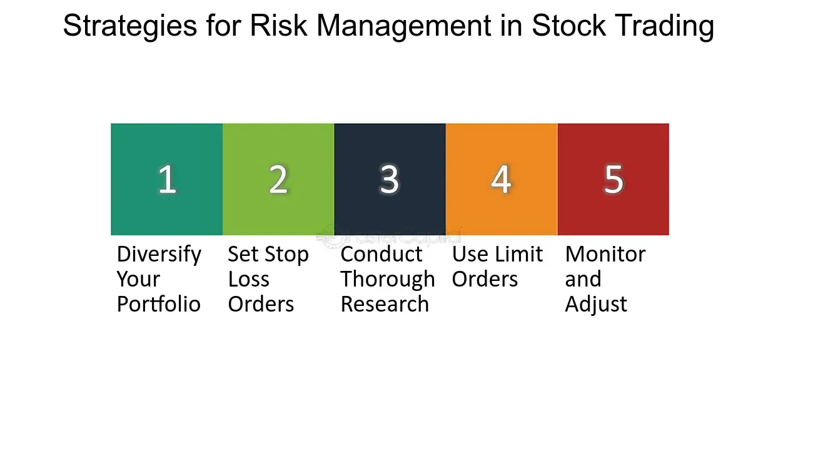

## Table of Contents

## What are the common risky strategies that new investors might encounter?

New investors often come across risky strategies that can be tempting but dangerous. One common risky strategy is investing all their money in a single stock or sector. This is risky because if that stock or sector does poorly, they could lose a lot of money. It's better to spread out investments to lower the risk. Another risky strategy is trading on margin, which means borrowing money to invest. This can lead to big losses if the investments don't go well, because the investor still has to pay back the borrowed money, plus interest.

Another risky strategy that new investors might encounter is trying to time the market. This means trying to buy and sell investments at the perfect times to make the most profit. It's very hard to do this right, and most people end up losing money. Instead of trying to time the market, it's usually better to invest for the long term. Lastly, some new investors might be tempted by get-rich-quick schemes or investments that promise high returns with little risk. These are usually scams, and it's important to be careful and do a lot of research before investing in anything that sounds too good to be true.

## How can new investors identify a risky investment?

New investors can identify a risky investment by looking at a few key signs. First, if an investment promises very high returns in a short amount of time, it's probably risky. High returns usually come with high risk. If someone tells you that you can double your money in a few months, be careful. Also, if the investment is hard to understand or the company selling it can't explain it clearly, that's a red flag. Good investments should be easy to understand.

Another way to spot a risky investment is by checking if it's not regulated or if it's not listed on a well-known stock exchange. Investments that are not regulated by a government agency, like the SEC in the United States, can be more risky because there's less oversight. Also, if you can't find much information about the investment or the company behind it, that's a warning sign. Always do your research and look for reviews or news about the investment before putting your money into it.

Lastly, be wary of investments that pressure you to act quickly. If someone is pushing you to invest right away without giving you time to think or do research, it's likely a risky move. Good investments don't need to be sold with high pressure tactics. Take your time, ask questions, and if something feels off, trust your gut and look for safer options.

## What is the difference between high risk and high reward in investing?

In investing, high risk means there's a big chance you could lose money. When you put your money into something that's high risk, like a new startup company or a stock that goes up and down a lot, you might lose all or most of your money if things don't go well. High risk investments are often things that are new or not well-known, and they can be hard to predict. This is why they're called high risk - because there's a lot of uncertainty and a big chance of losing money.

On the other hand, high reward means there's a chance to make a lot of money. If you invest in something that's high risk and it does well, you could see your money grow a lot more than if you had put it into something safer. For example, if you invest in a startup that becomes very successful, you could make a lot more money than if you had put your money into a big, stable company. The key thing to remember is that high risk and high reward go together - you can't have one without the other. So, if you want the chance to make a lot of money, you have to be ready to take on more risk.

## Can you explain the concept of leverage and its risks for new investors?

Leverage in investing means borrowing money to buy more investments than you could with just your own money. Imagine you have $1,000 to invest. If you use leverage, you might borrow another $1,000, so you can invest $2,000 total. This can be exciting because if your investments go up in value, you make more money than if you had only used your own $1,000. But it's also risky because if your investments go down, you still have to pay back the borrowed money, plus interest.

The big risk with leverage is that it can make losses much bigger. If your investments lose value, not only do you lose your own money, but you also have to pay back the money you borrowed. This can lead to losing more money than you started with. For example, if you borrowed $1,000 and your investments dropped by 20%, you would lose $400 of your own money and still owe the $1,000 you borrowed. This is why leverage is often called a "double-edged sword" - it can help you make more money, but it can also lead to bigger losses.

## What are penny stocks and why are they considered risky?

Penny stocks are stocks that cost very little money, usually less than a dollar per share. They are often from small companies that are just starting out or are not doing well. Because they are cheap, some people think they can buy a lot of them and make a lot of money if the stock price goes up. But penny stocks are very risky because they can go up and down a lot, and it's hard to know what will happen to them.

The main reason penny stocks are risky is because they are not traded on big, well-known stock exchanges like the New York Stock Exchange. Instead, they are often traded on smaller markets with less rules and less information available about the companies. This makes it easier for people to cheat or lie about the company to make the stock price go up. Also, because these companies are small and not doing well, they can go out of business easily, which means you could lose all your money. So, while penny stocks can seem like a good way to make money fast, they are very risky and most people end up losing money on them.

## How does investing in cryptocurrencies pose risks for beginners?

Investing in cryptocurrencies can be very risky for beginners because the prices can go up and down a lot in a short time. This is called high volatility. For example, the price of a [cryptocurrency](/wiki/cryptocurrency) like Bitcoin can change a lot in just one day. This means you could make a lot of money if the price goes up, but you could also lose a lot if the price goes down. Beginners might not know how to handle these big changes and could end up losing money they can't afford to lose.

Another risk is that cryptocurrencies are not backed by any government or bank. This means there's no one to help you if something goes wrong. Also, there are a lot of scams in the world of cryptocurrencies. Some people might try to trick you into buying fake cryptocurrencies or investing in projects that don't exist. It's hard for beginners to tell the difference between a good investment and a scam. So, it's important to do a lot of research and be very careful before investing in cryptocurrencies.

## What are the dangers of following investment trends without research?

Following investment trends without doing your own research can be very risky. When you see a lot of people talking about a certain stock or investment, it might seem like a good idea to jump in and buy it too. But just because something is popular doesn't mean it's a good investment. Trends can be driven by hype or rumors, and the price of the investment might go up because of excitement, not because the company is doing well. If you follow the trend without understanding why the investment is popular, you might buy it at a high price and then lose money when the hype dies down and the price drops.

Another danger of following trends without research is that you might miss important information about the investment. For example, the company might be in a lot of debt or have other problems that could make the stock price go down. If you don't do your own research, you won't know about these risks. Also, trends can change quickly, and what's popular today might not be popular tomorrow. If you invest based on what's trendy without understanding the investment, you could end up losing money when the trend changes. It's always better to take the time to learn about an investment before putting your money into it.

## How can options trading be risky for those new to investing?

Options trading can be very risky for new investors because it's complicated and hard to understand. Options are contracts that give you the right to buy or sell a stock at a certain price before a certain date. If you guess wrong about which way the stock price will go, you can lose all the money you put into the option. It's like betting on a horse race, but the odds are harder to predict and the stakes can be much higher.

Another reason options trading is risky for beginners is that it uses leverage. This means you can control a big amount of stock with just a little bit of money. If the stock price moves in the right direction, you can make a lot of money. But if it moves the wrong way, you can lose more money than you put in. It's like borrowing money to bet on a game – if you win, you win big, but if you lose, you owe more than you started with. For someone new to investing, it's easy to make mistakes and lose a lot of money quickly.

## What is margin trading and what risks does it carry for new investors?

Margin trading is when you borrow money from your broker to buy more stocks than you could with just your own money. It's like using a credit card to buy something you can't afford right now. You use the stocks you buy as a kind of promise to pay back the money you borrowed. If the stocks go up in value, you can make more money than if you had just used your own money. But if the stocks go down, you still have to pay back the borrowed money, plus interest, which can be a lot.

The main risk with margin trading for new investors is that it can make losses much bigger. If the stocks you buy with borrowed money go down in value, not only do you lose your own money, but you also have to pay back the money you borrowed. This can lead to losing more money than you started with. For example, if you borrow money to buy stocks and the stock price drops by 20%, you lose money on your investment and still owe the money you borrowed. This can be really hard for new investors to handle, and it's easy to get into big trouble if things don't go well.

## How can over-diversification lead to risky investment decisions?

Over-diversification happens when you spread your money across too many different investments. It might seem like a good idea to reduce risk by not putting all your eggs in one basket, but having too many investments can actually be risky. When you own a lot of different stocks or funds, it can be hard to keep track of all of them. You might end up with investments that you don't understand well or that don't fit with your goals. Also, if you're spreading your money too thin, you might not have enough in any one investment to make a big difference in your returns.

Another problem with over-diversification is that it can make your portfolio less efficient. When you own too many investments, some of them might cancel each other out. For example, if you own stocks in many different industries, some might go up while others go down, and you might end up with average returns that are not much better than if you had just put your money in a savings account. Plus, managing a lot of different investments can take a lot of time and effort, and you might end up paying more in fees and taxes. So, while diversification is important, overdoing it can lead to risky decisions and lower returns.

## What are the psychological risks associated with risky investment strategies?

When people invest in risky ways, they can feel a lot of stress and worry. Imagine you put your money into something that goes up and down a lot. You might feel excited when it goes up, but scared when it goes down. This can make you feel anxious all the time, and it can be hard to sleep or think about other things. If you lose money, you might feel sad or angry, and it can be hard to make good decisions when you're feeling like that.

Another problem is that people can get too excited about risky investments. When you see your money grow a lot, you might start to think you can't lose, and you might take even bigger risks. This is called getting overconfident. It's like thinking you're really good at a game just because you won a few times. But the truth is, risky investments can still lose money, and if you're not careful, you could lose a lot. So, it's important to stay calm and think clearly, even when things are going well.

## How can new investors mitigate the risks associated with these strategies?

New investors can lower the risks of these strategies by first doing a lot of research before they invest. They should learn about the company or investment they're thinking about, and not just follow what everyone else is doing. It's good to read news, look at financial reports, and understand why the investment might go up or down. This way, they can make better choices and avoid scams or bad investments. Also, they should start small and only invest money they can afford to lose. That way, if things don't go well, they won't be in big trouble.

Another way to reduce risk is by spreading out their money into different types of investments. This is called diversification. Instead of putting all their money into one stock or one type of investment, they can buy a mix of stocks, bonds, and maybe even some safer options like a savings account. This can help balance out the risk because if one investment does badly, the others might still do well. Lastly, new investors should be patient and think long-term. Instead of trying to make quick money, they should focus on growing their money slowly over time. This can help them avoid the stress and bad decisions that come with risky investments.

## What are some financial strategies that beginners should understand?

Financial strategies serve as the foundation of successful investing by providing structured frameworks for decision-making. For beginners, adopting key strategies such as diversification, dollar-cost averaging, and setting clear investment goals is crucial for building a resilient investment portfolio.

Diversification is a fundamental strategy aimed at spreading investment risk across different asset classes. By investing in a variety of assets such as stocks, bonds, and real estate, investors can reduce the impact of a poor-performing asset on the overall portfolio. This strategy is grounded in the principle that not all asset classes will move in the same direction at the same time; thus, gains in one area can offset losses in another. Empirical studies have shown that diversification can lead to more stable returns over time, reducing the [volatility](/wiki/volatility-trading-strategies) of a portfolio. The concept of diversification can be understood through the mathematical formula for portfolio variance:

$$
\sigma^2_p = \sum_{i=1}^{n} w_i^2 \sigma_i^2 + \sum_{i=1}^{n}\sum_{j \neq i}^{n} w_i w_j \sigma_i \sigma_j \rho_{ij}
$$

where $\sigma^2_p$ is the portfolio variance, $w_i$ and $w_j$ are the weights of assets, $\sigma_i$ and $\sigma_j$ are the standard deviations of the assets, and $\rho_{ij}$ is the correlation between assets $i$ and $j$. By minimizing this variance through intelligent asset allocation, investors can achieve a more balanced risk-return profile.

Dollar-cost averaging (DCA) is another strategy that involves making regular, fixed-amount purchases of an investment, irrespective of its price. This method reduces the impact of market volatility by spreading the purchase price over time. It allows investors to buy more shares when prices are low and fewer shares when prices are high, effectively lowering the average cost per share over time. Consider a scenario where an investor commits $100 monthly to purchase shares of a particular stock. If the stock price fluctuates over several months, the average cost per share will differ from the stock's average price due to the varying number of shares purchased each month. This technique can be particularly advantageous in volatile markets where predicting short-term fluctuations is challenging.

Setting clear investment goals is an essential component of any financial strategy. Clarity in goals aids in defining the investment horizon, risk tolerance, and expected returns. Whether saving for retirement, building an emergency fund, or planning for a significant purchase, having well-defined objectives ensures that investment decisions align with personal financial needs.

These foundational financial strategies provide beginners with the tools necessary to navigate market complexities. By employing diversification, dollar-cost averaging, and setting clear goals, novice investors can enhance their investment journey and establish a strong base for future financial growth.

## References & Further Reading

[1]: Bergstra, J., Bardenet, R., Bengio, Y., & Kégl, B. (2011). ["Algorithms for Hyper-Parameter Optimization."](https://dl.acm.org/doi/10.5555/2986459.2986743) Advances in Neural Information Processing Systems 24.

[2]: ["Advances in Financial Machine Learning"](https://www.amazon.com/Advances-Financial-Machine-Learning-Marcos/dp/1119482089) by Marcos Lopez de Prado

[3]: ["Evidence-Based Technical Analysis: Applying the Scientific Method and Statistical Inference to Trading Signals"](https://www.amazon.com/Evidence-Based-Technical-Analysis-Scientific-Statistical/dp/0470008741) by David Aronson

[4]: ["Machine Learning for Algorithmic Trading"](https://github.com/stefan-jansen/machine-learning-for-trading) by Stefan Jansen

[5]: ["Quantitative Trading: How to Build Your Own Algorithmic Trading Business"](https://www.amazon.com/Quantitative-Trading-Build-Algorithmic-Business/dp/1119800064) by Ernest P. Chan