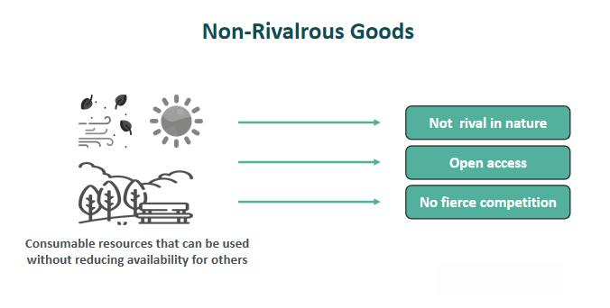

In today's rapidly evolving economic landscape, understanding the fundamental concepts of goods and market interactions is crucial. As markets become increasingly sophisticated, distinguishing between different types of goods—specifically, rival and non-rival goods—offers essential insights into resource allocation and economic behavior. Rival goods, such as tangible items like cars and clothing, can be consumed by only one person or a limited group at a time, making their availability finite. In contrast, non-rival goods, such as internet access and broadcast television, can be consumed simultaneously by multiple individuals without depleting their availability. These basic economic distinctions have profound implications for market dynamics and resource management.

This article investigates the economic examples that highlight the significance of rival and non-rival goods. By examining these examples, we better comprehend how these goods operate within the principles of supply and demand, shaping the economic landscape and offering insights into resource scarcity and management strategies.



Additionally, this article examines the intricate relationship between these concepts and algorithmic trading within financial markets. Algorithmic trading leverages advanced algorithms to automate and execute trades, enabling high-frequency trading and other sophisticated strategies. This process benefits significantly from non-rival technological advancements, which allow for simultaneous exploitation by multiple traders, enhancing efficiencies in processing financial data and executing trades. Understanding how these economic principles apply to modern trading strategies can yield valuable insights.

Ultimately, the goal is to provide a comprehensive overview that links these foundational economic principles to practical trading strategies. These insights will serve as a valuable resource for investors, economists, and financial analysts seeking a deeper understanding of economic dynamics, helping them navigate and optimize their strategies in today's complex financial markets.

## Table of Contents

## Understanding Rival and Non-Rival Goods

In today's economic discourse, a key consideration is the categorization of goods based on their consumption characteristics. Rival goods are defined as those that can be used or consumed by one individual or a limited group at any given time, thereby reducing their availability for others. Common examples of rival goods include tangible commodities such as food, cars, and clothing. These items demonstrate a clear consumption limit; when one person eats an apple, drives a car, or wears a piece of clothing, that consumption precludes others from using the same item simultaneously.

In contrast, non-rival goods can be consumed by multiple people at the same time without any reduction in availability. Unlike rival goods, the consumption of non-rival goods by one individual does not impede usage by others. Typical instances of non-rival goods include internet access and broadcast television. These goods exhibit a characteristic where an infinite number of people can use them without inhibiting others, as the consumption scale does not impact the goods' availability.

The interaction of rival and non-rival goods within the framework of supply and demand is fundamental to economic analysis. For rival goods, supply and demand dynamics imply that increased consumption by one individual typically leads to a decrease in availability, which can drive up prices if demand remains constant or increases. This concept is traditionally represented by the equation $\text{P = f(D, S)}$, where P is the price, D is demand, and S is supply. As demand for a rival good rises with fixed supply, the scarcity increases, pushing the price upwards.

Non-rival goods, however, operate on a different economic premise. Since these goods can be shared by an infinite number of people, the traditional scarcity model does not apply. This unique feature often results in non-rival goods being provided at low or no marginal cost, as the supply is effectively inexhaustible when shared among users. The law of supply and demand applies differently here, where the focus shifts towards the cost of provision rather than the scarcity of the good itself. This economic characteristic challenges traditional pricing models and often requires alternative strategies to manage and monetize such resources.

The potential of non-rival goods to be distributed widely without diminishing their availability introduces discussions around public goods, which are typically non-excludable and non-rival, as well as considerations about intellectual property and digital goods where non-rival aspects are prominent. Understanding these distinctions aids economists, investors, and policymakers in formulating efficient resource allocation and consumption strategies that cater to the inherent properties of the goods involved.

## Economic Examples of Rival and Non-Rival Goods

The distinction between rival and non-rival goods plays a crucial role in the efficient allocation of resources within an economy. Rival goods are characterized by their limited consumption capability; their use by one individual precludes simultaneous consumption by others. A classic example of a rival good is a limited-edition t-shirt. In this case, the exclusivity of the item leads to high consumer rivalry, as only a finite number of these t-shirts are available in the market. The scarcity inherent in rival goods necessitates strategies for their distribution, often resulting in competitive pricing mechanisms.

Conversely, non-rival goods can be consumed by multiple individuals without diminishing their availability or quality. Public roads serve as a prime example of non-rival goods, allowing for concurrent usage by numerous drivers. Non-rival goods typically involve infrastructure or services that can be utilized by an extensive user base without incurring additional costs related to increased consumption.

The economic implications of these categories are observable in various real-world scenarios. For instance, the pricing of airplane seats exemplifies the nature of rivalry. Airlines employ dynamic pricing models, adjusting ticket prices based on demand fluctuations and seat availability—a strategy compelled by the rivalrous nature of a finite number of seats.

In contrast, replays of streamed media content represent non-rival goods. Once digital content is produced, it can be distributed to a vast audience with minimal marginal costs. This non-rival characteristic allows streaming platforms to offer replay services at a lower price point or even without direct cost, as the distribution to additional viewers does not incur significant extra costs.

Understanding these examples aids in grasping fundamental economic theories related to resource management and scarcity. Efficient resource allocation hinges on recognizing the nature of goods involved, whether they are rival or non-rival, and implementing appropriate economic policies and pricing strategies to optimize consumption and distribution. By appreciating the characteristics of rival and non-rival goods, businesses and policymakers can better navigate the complexities of market dynamics and resource utilization.

## Algorithmic Trading and Its Economic Implications

Algorithmic trading represents a significant evolution in financial markets by utilizing complex algorithms to automate and execute trades with [high frequency](/wiki/high-frequency-trading) and precision. This practice relies heavily on technological advancements that are inherently non-rival, meaning that these innovations can be utilized simultaneously by multiple traders without a reduction in resource availability. The efficiency and effectiveness of [algorithmic trading](/wiki/algorithmic-trading) are largely attributed to its ability to process and analyze massive volumes of financial data rapidly, allowing traders to seize favorable opportunities and make informed decisions in real-time markets.

The non-rival characteristics of digital data play a crucial role in enhancing algorithmic trading efficiencies. Digital data, unlike physical goods, can be duplicated and distributed at near-zero marginal cost, enabling multiple participants in the financial market to access and leverage the same information for strategic advantage. For instance, access to historical price data, market trends, and analytical tools can be shared and utilized simultaneously by various traders and institutions. This shared access fosters a competitive environment where each participant can capitalize on technological advancements, ultimately leading to improved market [liquidity](/wiki/liquidity-risk-premium) and reduced transaction costs.

Algorithmic trading systems are designed to execute trades at a speed and frequency that human traders cannot match. These systems utilize a range of strategies based on quantitative models and statistical analyses that identify patterns and trends in market data. Algorithms are coded to perform tasks such as:

```python
import numpy as np
import pandas as pd

# Simple moving average strategy in algorithmic trading
def simple_moving_average_strategy(prices, short_window=40, long_window=100):
    signals = pd.DataFrame(index=prices.index)
    signals['price'] = prices
    signals['short_ma'] = prices.rolling(window=short_window, min_periods=1).mean()
    signals['long_ma'] = prices.rolling(window=long_window, min_periods=1).mean()

    signals['signal'] = 0.0
    signals['signal'][short_window:] = np.where(signals['short_ma'][short_window:] > 
                                                signals['long_ma'][short_window:], 1.0, 0.0)
    signals['positions'] = signals['signal'].diff()

    return signals
```

In this Python example, a simple moving average strategy is implemented to generate buy/sell signals based on short-term (40-day) and long-term (100-day) moving averages. Such strategies are typical in algorithmic trading, as they help traders to systematically identify entry and [exit](/wiki/exit-strategy) points in the market.

The integration of non-rival digital data and sophisticated algorithms allows traders to execute high-frequency trading, where trades are made in fractions of a second based on pre-programmed criteria. This capability not only amplifies the [volume](/wiki/volume-trading-strategy) of trades but also enhances market efficiency by narrowing bid-ask spreads and improving price discovery.

In conclusion, algorithmic trading leverages the non-rival nature of technology and data to create new efficiencies and opportunities in financial markets. By utilizing vast amounts of information and executing trades at unprecedented speeds, algorithmic trading exemplifies how modern economic concepts are applied to optimize trading strategies and outcomes.

## Connecting Rival Goods and Algorithmic Trading

In algorithmic trading, the competition for rival goods, such as commodities and finite stock options, plays a crucial role in shaping trading strategies. The finite nature of these assets means that they cannot be accessed by all market participants simultaneously, influencing demand dynamics and consequently, market prices. Algorithmic trading systems are designed to swiftly adapt to changes in availability and demand for these rival goods, leveraging their computational power to optimize trade execution.

For example, during periods of geopolitical instability, the supply of commodities like oil may fluctuate, impacting their availability and price. Algorithmic systems can analyze large datasets, including news releases, market reports, and other financial indicators, to predict stock market reactions. These systems employ techniques such as [machine learning](/wiki/machine-learning) models to identify patterns and correlations that human traders might overlook. An algorithm might be programmed to increase buying activity when the data indicates an impending supply shortage, thereby capitalizing on anticipated price increases.

Mathematically, this involves the use of predictive models that aim to forecast price movements based on the law of supply and demand. If $P(t)$ is the predicted price at time $t$, the algorithm could utilize a linear regression model expressed as:

$$
P(t) = \beta_0 + \beta_1 X_1(t) + \beta_2 X_2(t) + \ldots + \beta_n X_n(t) + \epsilon(t)
$$

where $X_1, X_2, \ldots, X_n$ are explanatory variables such as inventory levels, geopolitical news, and consumer demand trends, while $\beta_0, \beta_1, \ldots, \beta_n$ are parameters estimated from historical data, and $\epsilon(t)$ represents the error term.

The adaptability of algorithmic trading systems allows them to respond efficiently to competition-driven price fluctuations, making real-time adjustments to trading strategies. When new data indicates a shift in the competitive landscape for a rival good, these algorithms can recalibrate their models to enhance decision-making processes. 

Additionally, large-scale computational abilities mean that algorithms can simulate various market scenarios, providing insights into potential rival-driven price movements. This capacity extends to refining trading strategies by learning from historical market events where the rivalry for goods played a central role, ensuring that future trades are better aligned with anticipated market conditions.

In summary, the competition for rival goods significantly influences algorithmic trading by dictating resource availability and determining market behavior. Traders employing these algorithms gain a substantial edge by harnessing the power of advanced computational techniques to navigate and capitalize on rivalry-induced price volatilities.

## Conclusion

The relationship between rival and non-rival goods and algorithmic trading exhibits complex economic interactions. Understanding these dynamics is crucial for the optimization of resource use and the development of competitive trading strategies. Rival goods, characterized by their limited availability and exclusivity of consumption, present unique challenges in resource allocation and pricing. In financial markets, the competition for such goods is mirrored in the trading of commodities and stocks, where supply limitations can influence market behavior and necessitate strategic adjustments.

Conversely, non-rival goods, which can be consumed simultaneously by multiple parties, parallel the digital innovations that drive algorithmic trading. The non-rival nature of technological assets allows for shared use without resource depletion, enhancing the efficiency and scope of trading operations. This duality between rival and non-rival characteristics informs the algorithm design, where the exploitation of informational advantages and data processing can lead to significant trading insights.

As technology continues its rapid advancement, these distinctions become increasingly integral to modern economic models. The rise of digital trading platforms and data analysis tools underscores the importance of recognizing and leveraging the inherent properties of rival and non-rival goods. The capacity to efficiently manage resources in the face of competing demands and to utilize non-exhaustive digital assets is vital for success in today's financial environment.

Future research and development in algorithmic trading will be shaped by these foundational economic principles, driving further innovations in strategy formulation and execution. By maintaining a keen awareness of the interactions between rival and non-rival dynamics, market participants can enhance their understanding of economic interactions and improve their competitive positioning in the evolving financial landscape.

## References & Further Reading

[1]: Samuelson, P. A. (1954). "The Pure Theory of Public Expenditure." The Review of Economics and Statistics, 36(4), 387-389. [DOI:10.2307/1925895](https://ses.unam.mx/docencia/2007II/Lecturas/Mod3_Samuelson.pdf)

[2]: Frank, R. H., & Bernanke, B. S. (2001). "Principles of Economics". McGraw-Hill.

[3]: Varian, H. R. (2010). "Computer Mediated Transactions." The American Economic Review, 100(2), 1-10. [DOI:10.1257/aer.100.2.1](https://www.aeaweb.org/articles?id=10.1257/aer.100.2.1)

[4]: Shapiro, C., & Varian, H. R. (1999). "Information Rules: A Strategic Guide to the Network Economy." Harvard Business Press.

[5]: Lopez de Prado, M. (2018). "Advances in Financial Machine Learning." Wiley Finance.

[6]: Chan, E. (2017). "Machine Trading: Deploying Computer Algorithms to Conquer the Markets." Wiley.

[7]: Stiglitz, J. E. (1999). "Knowledge as a Global Public Good." In Global Public Goods: International Cooperation in the 21st Century. UNDP.

[8]: Biais, B., & Woolley, P. (2011). "High Frequency Trading." LSE Financial Markets Group Special Paper Series. [Link](https://papers.ssrn.com/sol3/papers.cfm?abstract_id=1834344)

[9]: Jansen, S. (2018). "Machine Learning for Algorithmic Trading: Predictive Models to Extract Signals from Market and Alternative Data for Systematic Trading Strategies with Python." Packt Publishing.