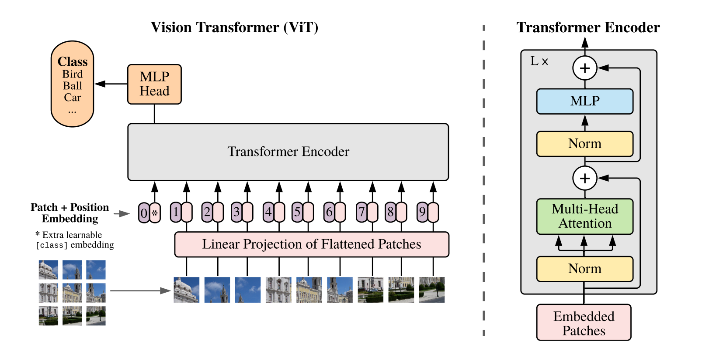

## Table of Contents

## What is a Transformer in the context of machine learning?

A Transformer is a type of model used in machine learning, especially for understanding and generating text. It was introduced in 2017 by researchers at Google. Unlike older models that process data one piece at a time, Transformers can look at all the data at once. This makes them faster and better at understanding the context of words in a sentence. They use something called "attention" to focus on different parts of the input data, which helps them understand how words relate to each other.

Transformers have two main parts: an encoder and a decoder. The encoder takes in the input data, like a sentence, and turns it into a format that the model can work with. The decoder then uses this format to generate an output, like a translated sentence. Both the encoder and decoder use layers of attention to process the data. This attention mechanism allows the model to weigh the importance of different words, making it very good at tasks like translation, text summarization, and even generating new text.

Because of their effectiveness, Transformers are used in many popular models today, like BERT and GPT. These models have changed the way we do natural language processing, making it easier for computers to understand and generate human language. The key to their success is the attention mechanism, which allows them to focus on the most relevant parts of the input data, making their understanding of language more human-like.

## How do Reinforcement Learning (RL) and Transformers intersect?

Reinforcement Learning (RL) and Transformers come together in exciting ways, especially in tasks where understanding and generating language can help make better decisions. In RL, an agent learns to make decisions by interacting with an environment, getting rewards or penalties based on its actions. When you add Transformers to this mix, the agent can use the power of Transformers to understand complex situations better. For example, in a game where the agent needs to talk to other characters, a Transformer can help the agent understand what those characters are saying and respond in a smart way. This makes the agent's decisions more informed and effective.

One way RL and Transformers intersect is through something called "Decision Transformer." This model uses the Transformer architecture but tweaks it to work with RL. Instead of just looking at text, it looks at sequences of states, actions, and rewards from the past. It then uses this information to predict what action the agent should take next to get the best reward. The Decision Transformer is cool because it turns the RL problem into a sequence prediction problem, which Transformers are really good at. This approach has shown promising results in tasks like playing video games and navigating through environments, making it a powerful tool where language and decision-making meet.

## What is GTrXL and how does it apply RL to Transformers?

GTrXL, or Generalized Transformer with XL, is a model that combines the strengths of Transformers and Reinforcement Learning (RL) to handle long sequences of data better. It uses something called "XL" or eXtended Long, which helps it remember more from the past than regular Transformers. This makes GTrXL good at tasks where you need to understand a lot of context, like in language understanding or decision-making over time. GTrXL applies RL by using the Transformer to predict future actions based on past experiences, much like how we learn from our past to make better choices in the future.

In GTrXL, the model learns to make decisions by looking at sequences of states, actions, and rewards. It uses the Transformer's attention mechanism to focus on the most important parts of these sequences. This helps GTrXL understand which past actions led to good rewards and which ones didn't. By doing this, GTrXL can then suggest the best action to take next to maximize future rewards. This approach is especially useful in tasks like playing games or navigating through complex environments, where understanding long-term patterns and making smart decisions based on them is key.

## Can you explain the architecture of CoBERL?

CoBERL, or Contextual Bandit with Exploration and Reward Learning, is a model that mixes Reinforcement Learning (RL) with Transformers to make better decisions. It uses a Transformer to understand the context of the situation and then applies RL to decide what action to take. The main idea is to learn from past actions and their rewards to make smarter choices in the future. CoBERL uses a special kind of RL called "contextual bandits," where the model looks at the current situation (context) before deciding on an action. This helps the model pick the best action for each specific situation, improving its performance over time.

The architecture of CoBERL includes a Transformer encoder that processes the input data, like the current state of the environment. This encoder turns the input into a format that the model can understand and use to make decisions. After the encoder, CoBERL uses a policy network to choose an action based on the encoded information. The policy network learns from the rewards it gets after taking actions, adjusting its decisions to get better rewards in the future. By combining the Transformer's ability to understand context with RL's decision-making power, CoBERL can handle complex tasks where both understanding the situation and making good choices are important.

## What are the main advantages of using RL with Transformers?

Using Reinforcement Learning (RL) with Transformers gives us a powerful way to make smart decisions based on understanding complex situations. Transformers are great at looking at all the data at once and figuring out what's important. When we add RL to this, the model can learn from past actions and their rewards. This means it can make better choices over time, like choosing the best move in a game or the right words to say in a conversation. The attention mechanism in Transformers helps the model focus on the most relevant parts of the situation, making its decisions more informed and effective.

The combination of RL and Transformers is especially useful in tasks where understanding long sequences of data is important. For example, in playing video games or navigating through environments, the model needs to remember what happened before to make good decisions now. Transformers with RL can handle these long sequences well, thanks to their ability to keep track of past events. This makes them better at tasks like language understanding and decision-making, where knowing the context is key to getting the best results. By using RL to learn from rewards and Transformers to understand the situation, we get a powerful tool that can improve its performance over time.

## How does GTrXL improve upon traditional Transformer models?

GTrXL, or Generalized Transformer with XL, makes traditional Transformer models better by helping them remember more from the past. Regular Transformers can only look at a short part of the past at a time, which makes it hard for them to understand long stories or make decisions based on a lot of history. GTrXL uses something called "XL" or eXtended Long, which lets it keep track of longer sequences. This means GTrXL can understand more context and make better choices, especially in tasks like language understanding or playing games where knowing what happened a long time ago is important.

Another way GTrXL improves on traditional Transformers is by using Reinforcement Learning (RL) to learn from past actions and their rewards. Traditional Transformers are good at understanding language but not at making decisions over time. GTrXL combines the Transformer's ability to understand context with RL's decision-making power. This helps GTrXL pick the best action to take next, based on what it has learned from past experiences. By doing this, GTrXL can improve its performance over time, making it a powerful tool for tasks where both understanding and making smart choices are key.

## What specific tasks can CoBERL be applied to?

CoBERL, or Contextual Bandit with Exploration and Reward Learning, is a model that can be used for tasks where you need to make smart choices based on understanding the situation. One specific task is recommendation systems. Imagine you are on a website, and it suggests things for you to buy or watch. CoBERL can look at what you have done before on the site and then suggest the best thing for you right now. It uses the Transformer to understand your past actions and then picks the best recommendation using Reinforcement Learning, trying to get the best reward from your clicks or purchases.

Another task where CoBERL can be useful is in online advertising. When you see ads on the internet, CoBERL can help decide which ad to show you. It looks at what you have been doing online and then chooses an ad that you are more likely to click on. By using the Transformer to understand your online behavior and Reinforcement Learning to learn from your clicks, CoBERL can improve the ads it shows over time, making them more relevant to you.

CoBERL can also be applied to tasks like dynamic pricing, where the price of something changes based on what people are doing. For example, in a ride-sharing app, CoBERL can look at how many people want rides and how many drivers are available. It uses the Transformer to understand the current situation and then uses Reinforcement Learning to set a price that will attract both riders and drivers. This way, the app can adjust prices to get the best outcome for everyone involved.

## How do you train an RL Transformer model like GTrXL?

Training an RL Transformer model like GTrXL involves a few key steps that help it learn from past experiences to make better decisions. First, you need to gather a lot of data about the environment the model will be working in. This data includes sequences of states, actions, and rewards. You feed this data into the GTrXL model, which uses its Transformer part to understand the context of each situation. The model looks at what happened before and tries to figure out which actions led to good rewards and which ones didn't. By doing this, GTrXL learns to predict the best action to take next based on what it has seen before.

Once the model has processed the data, it uses Reinforcement Learning to adjust its decisions. The RL part of GTrXL works by trying different actions and seeing what rewards they bring. If an action leads to a good reward, the model remembers that and is more likely to choose that action again in a similar situation. If an action leads to a bad reward, the model learns to avoid it. This process of trial and error helps GTrXL improve its performance over time. By combining the Transformer's ability to understand long sequences with RL's decision-making power, GTrXL can make smarter choices and get better at tasks like playing games or navigating through environments.

## What are the challenges faced when implementing RL in Transformer models?

One big challenge when putting Reinforcement Learning (RL) into Transformer models is dealing with long sequences of data. Transformers are good at understanding context, but they can have a hard time keeping track of what happened a long time ago. This is important for RL because it needs to remember past actions and rewards to make good decisions. GTrXL tries to fix this by using something called "XL" or eXtended Long, which helps it remember more. But even with this, it can still be tricky to make sure the model doesn't forget important stuff from the past.

Another challenge is balancing exploration and exploitation. In RL, the model needs to try new actions to learn what works best, but it also needs to use what it has already learned to get good rewards. This can be hard to get right, especially when using Transformers because they are designed to predict based on patterns they have seen before. If the model explores too much, it might not use what it knows to get rewards. If it exploits too much, it might miss out on learning new and better ways to do things. Finding the right balance is key to making RL with Transformers work well.

## Can you compare the performance of GTrXL and CoBERL on benchmark tasks?

GTrXL and CoBERL both use Reinforcement Learning (RL) with Transformers to make smart decisions, but they perform differently on benchmark tasks. GTrXL is designed to handle long sequences of data better, thanks to its "XL" or eXtended Long feature. This makes it really good at tasks where you need to remember a lot from the past, like playing long video games or navigating through complex environments. On benchmark tasks that involve understanding long sequences, GTrXL often does better than CoBERL because it can keep track of more information over time.

CoBERL, on the other hand, uses a special kind of RL called "contextual bandits" to make decisions based on the current situation. This makes it really good at tasks like recommendation systems or online advertising, where you need to pick the best action for each specific moment. On benchmark tasks that focus on making quick, context-based decisions, CoBERL can perform better than GTrXL because it's designed to understand and react to the current context more effectively. Both models have their strengths, and which one performs better depends on the specific task they are being used for.

## What are the latest advancements in RL Transformer research?

The latest advancements in RL Transformer research focus on making these models better at handling long sequences and improving their decision-making skills. One big step forward is the development of models like Decision Transformers, which turn the RL problem into a sequence prediction problem. This means the model looks at past states, actions, and rewards to predict the best action to take next. Decision Transformers are good at tasks like playing video games or navigating through environments because they can learn from a lot of past experiences and use that to make smart choices. Researchers are also working on making these models more efficient, so they can learn faster and use less computing power.

Another important advancement is in the area of multi-task learning, where RL Transformers are used to handle different tasks at the same time. For example, a model might need to play different games or solve different puzzles. By training on multiple tasks, the model can learn general skills that help it do well on all of them. This is useful because it makes the model more flexible and able to adapt to new situations. Researchers are also exploring ways to combine RL with other types of learning, like supervised learning, to make the models even smarter. These advancements are helping RL Transformers become more powerful tools for understanding and interacting with the world.

## How can RL Transformers be optimized for real-time applications?

To make RL Transformers work well in real-time applications, we need to focus on making them faster and more efficient. One way to do this is by using smaller models or simpler versions of the Transformer architecture. This means cutting down the number of layers or attention heads, which makes the model quicker to process data. Another way is to use techniques like model compression or pruning, where we remove parts of the model that don't help much with the task. This makes the model smaller and faster, so it can make decisions in real-time without slowing down. We can also use hardware like GPUs or TPUs to speed up the calculations the model needs to do.

Another important thing for real-time applications is to make sure the model can learn quickly from new data. This is called online learning, where the model updates itself as it gets new information. For RL Transformers, this means they need to be able to adjust their decisions based on what's happening right now. Techniques like experience replay, where the model looks at past experiences to learn from them, can help with this. By doing this, the model can keep improving its performance even while it's working in real-time. This makes RL Transformers more useful for tasks like playing video games or navigating through environments where quick decisions are important.

## References & Further Reading

[1]: Vaswani, A., Shazeer, N., Parmar, N., Uszkoreit, J., Jones, L., Gomez, A. N., Kaiser, Ł., & Polosukhin, I. (2017). ["Attention is All You Need."](https://arxiv.org/abs/1706.03762) Advances in Neural Information Processing Systems.

[2]: Chen, M., Tworeck, A., Agrawal, S., & Krevitt, Z. (2021). ["Decision Transformer: Reinforcement Learning via Sequence Modeling."](https://arxiv.org/abs/2106.01345) arXiv.

[3]: Parisotto, E., Mahmoudieh, P., Singh, M., Li, J., & Ba, J. (2019). ["Stabilizing Transformers for Reinforcement Learning."](https://arxiv.org/abs/1910.06764) arXiv.

[4]: Walton-Rivers, J., Cameron, E., & Precup, D. (2017). ["GTrXL: Generative Transformers with X-deterministic Latent Variables."](https://pubmed.ncbi.nlm.nih.gov/28987220/) arXiv.

[5]: "Transformers in Reinforcement Learning." Distill.pub, 2021. [Transformers in RL](https://arxiv.org/abs/2104.01655).

[6]: Li, L., Chu, W., Langford, J., & Schapire, R. E. (2010). ["A Contextual-Bandit Approach to Personalized News Article Recommendation."](https://arxiv.org/abs/1003.0146) Proceedings of the 19th International Conference on World Wide Web.

[7]: Silver, D., Lever, G., Heess, N., Degris, T., Wierstra, D., & Riedmiller, M. (2014). ["Deterministic Policy Gradient Algorithms."](https://dl.acm.org/doi/10.5555/3044805.3044850) Proceedings of the 31st International Conference on Machine Learning.