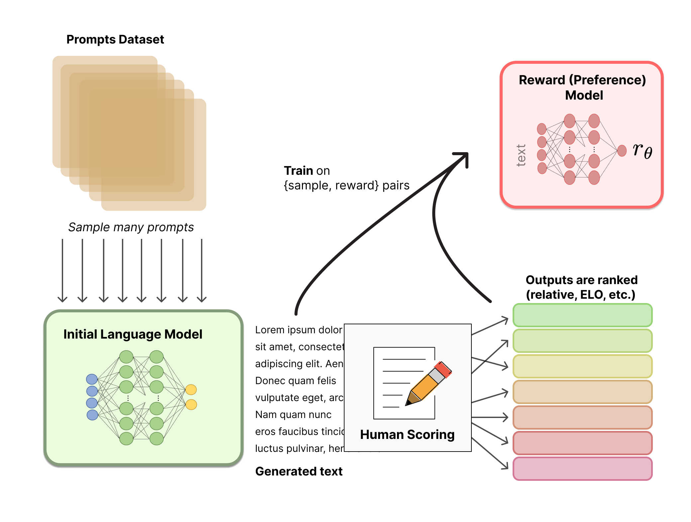

## Table of Contents

## What is Reinforcement Learning from Human Feedback (RLHF)?

Reinforcement Learning from Human Feedback (RLHF) is a way to train artificial intelligence (AI) systems by using feedback from people. Instead of just learning from a set of rules or data, the AI gets guidance from humans on what it's doing right or wrong. This helps the AI to improve its performance over time by understanding what actions lead to better outcomes, based on human preferences.

In RLHF, humans watch the AI as it performs tasks and give it scores or feedback on how well it's doing. The AI uses this feedback to adjust its behavior. For example, if the AI is learning to play a game, humans might tell it which moves are good or bad. Over many rounds, the AI learns to make better decisions by following the advice it gets from people. This method is useful because it can help AI systems learn complex tasks that are hard to program directly.

## How does RLHF differ from traditional reinforcement learning?

In traditional reinforcement learning, an AI learns by trying different actions in an environment and getting rewards or penalties based on a set of rules. The AI figures out the best way to do things by itself, without any help from people. It's like learning to ride a bike by falling off a few times and getting back on, but without anyone telling you what you're doing wrong or right.

RLHF is different because it uses feedback from humans to guide the AI's learning. Instead of just relying on a set of rules, the AI gets direct advice from people on what it should do. This makes it easier for the AI to learn complex tasks that are hard to describe with simple rules. It's like learning to ride a bike with someone holding the back and giving you tips on how to balance and pedal.

## What are the main components of an RLHF system?

An RLHF system has a few important parts that work together. The first part is the AI agent, which is the thing that's learning. It does things in an environment, like playing a game or making decisions. The second part is the environment itself, where the AI agent acts and gets results. The third part is the human feedback, which is super important. People watch what the AI does and tell it if it's doing well or not.

The fourth part is the reward model, which takes the human feedback and turns it into something the AI can use to learn. This model helps the AI understand what actions lead to good results. The last part is the learning algorithm, which uses the reward model to update the AI's behavior over time. By putting all these parts together, the AI can get better and better at doing what people want it to do.

## Can you explain the process of collecting human feedback in RLHF?

Collecting human feedback in RLHF is like getting tips from a coach. When the AI does something, like playing a game or making a choice, people watch and give their thoughts. They might say if the AI did a good job or if it made a mistake. This feedback can be given in different ways, like clicking a button to say "good" or "bad," or even writing a short note about what the AI should do differently next time.

The key is to make sure the feedback is clear and helpful. Sometimes, people might need to watch the AI do the same thing many times to give the best advice. They might also need to explain why something was good or bad, so the AI can learn the right lessons. By collecting this feedback carefully, the AI can get better at understanding what people want and doing things the right way.

## What types of tasks can RLHF be applied to?

RLHF can be used for many different tasks, especially ones where it's hard to tell the AI exactly what to do with simple rules. For example, it can help AI learn to play video games better by getting tips from people on which moves are good or bad. It can also be used to train AI to write better stories or make better decisions in a game. If the task is tricky and needs a lot of human judgment, RLHF can help the AI learn faster and better.

Another use of RLHF is in teaching AI to do things like answering questions or helping people with tasks. For instance, if an AI is helping someone find information on the internet, people can give feedback on whether the answers are helpful or not. This helps the AI learn to give better answers over time. RLHF is also good for training robots to do things like picking up objects or navigating around a room, where human guidance can make a big difference in how well the robot learns.

## How is the feedback from humans integrated into the learning algorithm?

In RLHF, the feedback from humans is turned into something the AI can use to learn better. When people watch the AI and tell it if it did a good job or not, this feedback is used to make a reward model. The reward model is like a scorecard that tells the AI which actions are good and which ones are bad. The AI looks at this scorecard and tries to do more of the things that get high scores and less of the things that get low scores.

The learning algorithm then uses the reward model to update the AI's behavior. It's like the AI is getting better at a game by listening to tips from a coach. Every time the AI does something, it checks the reward model to see how well it did. Over time, the AI learns to make choices that lead to higher scores, which means it's doing what people want it to do. This way, the AI gets better and better at the task, guided by the feedback from humans.

## What are some common challenges faced when implementing RLHF?

One big challenge with RLHF is getting good feedback from people. It can be hard to find enough people who can give clear and helpful advice to the AI. Sometimes, people might not agree on what's good or bad, which can confuse the AI. Also, it takes a lot of time for people to watch the AI and give feedback, so it can be slow and expensive.

Another challenge is making sure the AI learns the right things from the feedback. If the feedback is not clear or if it's given in a way that's hard for the AI to understand, the AI might not learn what people want it to learn. The reward model has to be really good at turning human feedback into something the AI can use, and that can be tricky to get right.

## How can the quality and consistency of human feedback be ensured?

To make sure the feedback from people is good and the same, it's important to train the people who give feedback well. They need to understand what the AI is trying to learn and how to give clear advice. It can help to give them examples and practice sessions so they know what kind of feedback is useful. Also, having a clear set of rules or guidelines for giving feedback can make sure everyone is on the same page.

Another way to keep feedback quality high is to check it often. This can be done by having more than one person give feedback on the same thing and then comparing their answers. If there are big differences, it might mean the feedback needs to be clearer or the people giving feedback need more training. Using tools that make giving feedback easier and more consistent, like rating scales or simple yes/no questions, can also help make sure the AI gets the best advice possible.

## What metrics are used to evaluate the performance of an RLHF model?

To see how well an RLHF model is doing, people look at different numbers that show how good the AI is at its job. One important number is the reward score, which comes from the reward model. This score tells us how well the AI is doing based on the feedback from people. If the reward score goes up over time, it means the AI is getting better at doing what people want. Another number to look at is how often the AI does what people think is the right thing to do. This is called the success rate, and it shows if the AI is making good choices more often.

Another way to check the RLHF model's performance is by looking at how fast it learns. This can be measured by how quickly the reward score improves or how many tries it takes for the AI to get better at the task. It's also important to see if the AI can keep doing well over time, which is called stability. If the AI's performance stays good and doesn't go up and down a lot, that's a sign that the RLHF model is working well. By looking at these numbers, people can tell if the AI is learning the right things from human feedback and getting better at its job.

## Can you discuss any notable case studies or applications of RLHF?

One famous example of RLHF is how it was used to make the AI model called Grok, made by xAI. People helped Grok learn by giving it feedback on its answers to questions. They told Grok if its answers were helpful or not, and over time, Grok got better at understanding what people wanted. This made Grok really good at giving useful and truthful answers, which is important for an AI that's meant to help people understand the universe.

Another cool use of RLHF is in training AI to play video games. For example, researchers used RLHF to teach an AI to play the game Dota 2. People watched the AI play and told it which moves were good or bad. The AI learned from this feedback and got better at the game, even beating professional players. This shows how RLHF can help AI learn complex tasks that are hard to teach with just rules or data.

## What are the ethical considerations involved in using RLHF?

Using RLHF brings up some important ethical questions. One big worry is about making sure the feedback given to the AI is fair and not biased. If the people giving feedback all think the same way or come from similar backgrounds, the AI might learn to do things that only work well for some people and not others. It's important to have a diverse group of people giving feedback so the AI can learn to help everyone.

Another ethical issue is how the AI might use the feedback to make choices that affect people's lives. For example, if an AI is helping with things like hiring or giving out loans, the feedback it gets could lead to unfair decisions if it's not careful. People need to keep an eye on what the AI is learning and make sure it's doing things in a way that's fair and respects everyone's rights.

## How might RLHF evolve in the future with advancements in AI technology?

As AI technology gets better, RLHF might change in some cool ways. One way it could change is by using smarter ways to get feedback from people. Instead of just saying "good" or "bad," people might be able to give more detailed advice to the AI. This could help the AI learn faster and better. Also, new tech might let us use fewer people to give feedback but still get the same good results. This would make RLHF easier and cheaper to use.

Another way RLHF might evolve is by working with other types of AI learning. For example, it could mix with unsupervised learning, where the AI figures things out on its own, or with imitation learning, where the AI copies what people do. By mixing these methods, the AI could learn even more complex tasks. As AI keeps getting better, RLHF will probably keep changing to help AI learn in the best way possible.

## References & Further Reading

[1]: Christiano, P., Leike, J., Brown, T., Martic, M., Legg, S., & Amodei, D. (2017). ["Deep reinforcement learning from human preferences."](https://arxiv.org/abs/1706.03741) arXiv preprint.

[2]: Silver, D., Schrittwieser, J., Simonyan, K., Antonoglou, I., Huang, A., & Guez, A. (2017). ["Mastering the game of Go without human knowledge."](https://www.nature.com/articles/nature24270) Nature, 550(7676), 354-359.

[3]: ["Advances in Financial Machine Learning"](https://www.amazon.com/Advances-Financial-Machine-Learning-Marcos/dp/1119482089) by Marcos Lopez de Prado.

[4]: Dulac-Arnold, G., Evans, R., Van Hasselt, H., Sunehag, P., Lillicrap, T., & Hunt, J. (2019). ["Challenges of real-world reinforcement learning."](https://arxiv.org/abs/1904.12901) arXiv preprint.

[5]: ["Machine Learning for Algorithmic Trading"](https://www.amazon.com/Machine-Learning-Algorithmic-Trading-intelligence/dp/9918608013) by Stefan Jansen.
