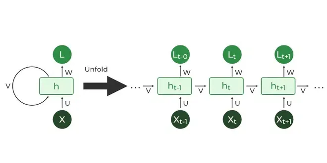

## Table of Contents

## What is a Recurrent Neural Network (RNN)?

A Recurrent Neural Network (RNN) is a type of artificial neural network that is really good at handling data that comes in a sequence, like words in a sentence or stock prices over time. Unlike regular neural networks, which process all inputs at once, RNNs process inputs one at a time and remember what they've seen before. This memory feature makes RNNs great for tasks like language translation, speech recognition, and predicting what might happen next in a sequence.

The way RNNs work is by using a special kind of loop inside them. This loop allows information to persist over time, which is useful for understanding sequences. When an RNN processes a new piece of data, it combines it with the information it remembers from before. This helps the network make better predictions or decisions based on the whole sequence, not just the latest input. However, traditional RNNs can struggle with very long sequences because they might forget the earlier parts, which is why more advanced versions like Long Short-Term Memory (LSTM) networks were developed to handle this issue better.

## How does an RNN differ from other neural networks like CNNs?

Recurrent Neural Networks (RNNs) and Convolutional Neural Networks (CNNs) are both types of neural networks, but they are designed for different kinds of data. RNNs are great for sequences, like sentences or time series data. They have a special way of remembering what they've seen before, which helps them understand the order and context of the data. This makes them really useful for tasks like predicting the next word in a sentence or understanding spoken language. On the other hand, CNNs are designed to work well with grid-like data, like images. They use something called convolutional layers to look for patterns in the data, like edges or shapes in a picture. This makes them perfect for tasks like recognizing objects in photos or classifying images.

The main difference between RNNs and CNNs is how they process data. RNNs process data one piece at a time, using their memory to keep track of what they've seen. This is important for understanding sequences because the order of the data matters. For example, when translating a sentence, the order of the words is crucial. CNNs, however, process data all at once, looking for patterns across the entire input. They use a technique called convolution, where they slide a small window over the data to detect features. This is great for tasks where the spatial arrangement of the data is important, like identifying a cat in a photo. So, while RNNs focus on the temporal aspect of data, CNNs focus on the spatial aspect.

## What are the basic components of an RNN?

The basic components of a Recurrent Neural Network (RNN) include the input layer, the hidden layer, and the output layer. The input layer takes in the data one step at a time, like reading a sentence word by word. This data is then passed to the hidden layer, which is where the magic happens. The hidden layer has neurons that process the input and remember what they've seen before. This memory is what makes RNNs special because it helps them understand sequences. The output from the hidden layer can then be used to make predictions or decisions, which are sent to the output layer.

Another important component of an RNN is the loop or the recurrent connection. This loop allows information to be passed from one step to the next within the hidden layer. Imagine reading a book; as you read each word, you remember the words you read before. The loop in an RNN works the same way, helping the network keep track of the sequence. The way this loop works can be described with a simple formula: $$h_t = f(h_{t-1}, x_t)$$, where $$h_t$$ is the hidden state at time $$t$$, $$h_{t-1}$$ is the hidden state from the previous time step, $$x_t$$ is the input at time $$t$$, and $$f$$ is a function, usually a non-linear one like a sigmoid or tanh. This formula shows how the RNN combines the current input with its memory to produce a new state.

## Can you explain the concept of 'sequence' in the context of RNNs?

In the context of RNNs, a 'sequence' refers to a series of data points that come one after the other, like words in a sentence or stock prices over time. When an RNN processes a sequence, it looks at each data point in the order they come, one at a time. This is different from other types of neural networks that might look at all the data at once. By processing data in sequence, RNNs can remember what they've seen before, which helps them understand the context and make better predictions about what might come next.

For example, when translating a sentence from English to French, the order of the words matters a lot. An RNN would read the English sentence word by word, remembering each word as it goes, and then use that memory to help translate the sentence into French. The way an RNN remembers and processes sequences can be described with a simple formula: $$h_t = f(h_{t-1}, x_t)$$. Here, $$h_t$$ is what the RNN remembers at time step $$t$$, $$h_{t-1}$$ is what it remembered from the previous step, and $$x_t$$ is the new data it's looking at. This formula shows how the RNN combines the new data with its memory to understand the sequence better.

## What is the vanishing gradient problem in RNNs and how does it affect training?

The vanishing gradient problem is a big challenge when training RNNs. It happens when the gradients, which are used to update the weights of the network during training, become very small as they flow through the network's layers. This means that the network has a hard time learning from data that's far away in the sequence. For example, when trying to predict the last word in a long sentence, the RNN might forget the first few words because the gradients from those words become too small to make a difference.

This problem makes it tough for RNNs to handle long sequences. If the gradients vanish, the network can't learn the connections between distant parts of the sequence, like the beginning and the end of a long sentence. To solve this, people came up with better versions of RNNs, like Long Short-Term Memory (LSTM) networks. LSTMs have special parts called gates that help control the flow of information and keep the gradients from vanishing. This way, LSTMs can remember and learn from longer sequences much better than regular RNNs.

## How can Long Short-Term Memory (LSTM) units solve the vanishing gradient problem?

Long Short-Term Memory (LSTM) units help solve the vanishing gradient problem by using special parts called gates. These gates control how information flows through the network. Imagine gates like doors that can open or close to let information pass or block it. There are three main gates in an LSTM: the forget gate, the input gate, and the output gate. The forget gate decides what old information to keep or throw away, the input gate decides what new information to add, and the output gate decides what information to pass on to the next step. By using these gates, LSTMs can keep important information for a long time, even if the sequence is very long.

This ability to control the flow of information helps prevent the gradients from getting too small as they move through the network. In a regular RNN, the gradients might become tiny after going through many steps, making it hard for the network to learn from early parts of the sequence. But in an LSTM, the gates can keep the gradients from vanishing by allowing them to flow more easily through the network. This means that LSTMs can learn from and remember information from much earlier in the sequence, making them much better at handling long sequences than regular RNNs.

## What are Gated Recurrent Units (GRUs) and how do they compare to LSTMs?

Gated Recurrent Units (GRUs) are another type of RNN that helps solve the vanishing gradient problem, similar to LSTMs. GRUs are simpler than LSTMs because they have fewer parts. Instead of three gates like LSTMs, GRUs have two: the update gate and the reset gate. The update gate decides how much of the past information to keep and how much of the new information to add. The reset gate decides how much of the past information to forget. This simpler structure makes GRUs easier to train and faster to run, but they can still handle long sequences well.

Compared to LSTMs, GRUs are a bit less powerful but easier to use. LSTMs have an extra gate, the output gate, which gives them more control over what information gets passed on. This can make LSTMs better at some tasks, especially ones where the sequence is very long or complex. But GRUs are often just as good for many tasks, and they're simpler to set up and run. So, if you need a quick and easy solution, GRUs might be the way to go. But if you need the best performance possible, you might want to try LSTMs.

## Can you describe a practical application of RNNs in natural language processing?

One practical application of RNNs in natural language processing is machine translation. Imagine you want to translate a sentence from English to French. An RNN can read the English sentence word by word, remembering each word as it goes. Using this memory, the RNN can then generate the French translation, taking into account the context and order of the words. For example, if the English sentence is "The cat is on the mat," the RNN can use its memory to translate it to "Le chat est sur le tapis" in French, making sure the translation makes sense and keeps the original meaning.

Another useful application is in text generation, like writing stories or composing emails. An RNN can start with a few words and then predict what words should come next, creating a whole piece of text. It does this by looking at the words it has already written and using its memory to decide what word fits best next. This can be really helpful for things like auto-complete features in email apps or even for generating creative writing. The formula that helps the RNN do this is $$h_t = f(h_{t-1}, x_t)$$, where $$h_t$$ is what the RNN remembers at time step $$t$$, $$h_{t-1}$$ is what it remembered from the previous step, and $$x_t$$ is the new word it's looking at. This simple formula shows how the RNN uses its memory to generate text that makes sense.

## How do you implement an RNN for time series prediction?

To implement an RNN for time series prediction, you start by preparing your data. Time series data is a sequence of numbers over time, like daily temperatures or stock prices. You need to split this data into sequences that the RNN can process. For example, if you want to predict tomorrow's temperature based on the last week's temperatures, you would use the past seven days as input and the next day's temperature as the target. You then normalize the data to make sure all values are on the same scale, which helps the RNN learn better. Once your data is ready, you can set up your RNN model. You might use a simple RNN, but for better performance, you could use an LSTM or GRU, which handle long sequences more effectively.

After setting up your model, you train it on your data. During training, the RNN processes each sequence one step at a time, using the formula $$h_t = f(h_{t-1}, x_t)$$ to update its memory and make predictions. Here, $$h_t$$ is the hidden state at time step $$t$$, $$h_{t-1}$$ is the hidden state from the previous step, and $$x_t$$ is the input at time $$t$$. The model learns by comparing its predictions to the actual values and adjusting its weights to minimize the error. Once trained, you can use the RNN to make predictions on new data. For example, if you want to predict the stock price for the next day, you would feed the model the last week's prices and let it output its prediction for tomorrow.

Here's a simple example of how you might implement an RNN for time series prediction using Python and the Keras library:

```python
import numpy as np
from keras.models import Sequential
from keras.layers import LSTM, Dense

# Sample time series data
data = np.array([...])  # Your time series data here

# Prepare the data
def create_sequences(data, seq_length):
    X, y = [], []
    for i in range(len(data) - seq_length):
        X.append(data[i:(i + seq_length)])
        y.append(data[i + seq_length])
    return np.array(X), np.array(y)

seq_length = 7  # Using the last 7 days to predict the next day
X, y = create_sequences(data, seq_length)

# Reshape X to be [samples, time steps, features]
X = np.reshape(X, (X.shape[0], X.shape[1], 1))

# Build the model
model = Sequential()
model.add(LSTM(50, activation='relu', input_shape=(seq_length, 1)))
model.add(Dense(1))
model.compile(optimizer='adam', loss='mse')

# Train the model
model.fit(X, y, epochs=50, verbose=0)

# Make a prediction
last_sequence = data[-seq_length:]
last_sequence = np.reshape(last_sequence, (1, seq_length, 1))
prediction = model.predict(last_sequence)
print(f"Predicted next value: {prediction[0][0]}")
```

This code sets up an LSTM model to predict the next value in a time series based on the last seven values. You can adjust the sequence length, model architecture, and training parameters to fit your specific needs.

## What are some techniques for optimizing the training of RNNs?

To optimize the training of RNNs, one effective technique is to use learning rate scheduling. This means changing the learning rate over time during training. At first, you might use a bigger learning rate to help the model learn quickly. But as training goes on, you can lower the learning rate to make the model's updates smaller and more precise. This helps the model get closer to the best solution without jumping around too much. Another technique is to use gradient clipping, which stops the gradients from getting too big. If the gradients get too large, they can cause the model to make huge updates that mess up the training. By clipping the gradients, you keep them within a safe range, which makes training more stable.

Using more advanced RNN architectures like LSTMs or GRUs can also help with training. These models have special parts called gates that help them remember important information and forget what's not needed. This makes them better at handling long sequences and helps avoid problems like the vanishing gradient. You can also try using different optimization algorithms like Adam instead of regular gradient descent. Adam adjusts the learning rate for each parameter in the model, which can help the model learn faster and more accurately. By combining these techniques, you can make your RNN training more efficient and get better results.

## How can bidirectional RNNs improve model performance?

Bidirectional RNNs can make models better by looking at the data from both the past and the future at the same time. In a regular RNN, the model only sees the data up to the current point. But with a bidirectional RNN, it can also see what comes after the current point. This is really helpful for tasks like understanding sentences, where knowing what comes next can help figure out what the sentence means. For example, if you're trying to understand the word "bank" in a sentence, knowing if the next word is "river" or "money" can make a big difference. By using information from both directions, bidirectional RNNs can make more accurate predictions and understand sequences better.

To implement a bidirectional RNN, you can use a special layer that combines two RNNs: one that reads the sequence forward and another that reads it backward. The formula for how a bidirectional RNN works is $$h_t = f(h_{t-1}, x_t) + b(h_{t+1}, x_t)$$, where $$h_t$$ is the hidden state at time $$t$$, $$f$$ is the forward RNN function, $$b$$ is the backward RNN function, and $$x_t$$ is the input at time $$t$$. This setup allows the model to capture patterns and dependencies in both directions, which can lead to better performance in tasks like speech recognition, where understanding the whole sequence is important for making the right predictions.

## What are the latest advancements in RNN architectures and their impact on machine learning?

Recent advancements in RNN architectures have led to significant improvements in how machines process sequential data. One notable development is the introduction of the Transformer model, which, while not an RNN, has influenced RNN research by showing the power of attention mechanisms. Attention allows models to focus on different parts of the input sequence when making predictions, which can be more effective than the sequential processing of traditional RNNs. This has led to the creation of hybrid models like the Transformer-XL, which combines the strengths of RNNs and Transformers to handle longer sequences better. These advancements have made models more efficient and capable of handling complex tasks like language translation and text generation with higher accuracy.

Another important advancement is the development of more sophisticated RNN variants like the Neural Turing Machine (NTM) and the Differentiable Neural Computer (DNC). These models incorporate external memory, allowing them to store and retrieve information more effectively than traditional RNNs. This memory augmentation helps address the limitations of RNNs in handling very long sequences and improves their ability to learn and generalize from data. The impact of these advancements is seen in applications ranging from natural language understanding to algorithmic tasks, where the ability to remember and process large amounts of sequential data is crucial. By pushing the boundaries of what RNNs can do, these new architectures are making [machine learning](/wiki/machine-learning) models more powerful and versatile.

## References & Further Reading

[1]: Goodfellow, I., Bengio, Y., & Courville, A. (2016). ["Deep Learning."](https://link.springer.com/article/10.1007/s10710-017-9314-z) MIT Press. This book provides comprehensive coverage on neural network architectures, including RNNs and their applications.

[2]: Hochreiter, S., & Schmidhuber, J. (1997). ["Long Short-Term Memory."](https://dl.acm.org/doi/10.1162/neco.1997.9.8.1735) Neural Computation, 9(8), 1735-1780. This paper introduces the LSTM architecture, providing foundational understanding for overcoming the limitations of traditional RNNs.

[3]: Chung, J., Gulcehre, C., Cho, K., & Bengio, Y. (2014). ["Empirical Evaluation of Gated Recurrent Neural Networks on Sequence Modeling."](https://arxiv.org/abs/1412.3555) arXiv preprint. This paper discusses the development and benefits of GRUs, a simplified version of LSTMs.

[4]: Vaswani, A., Shazeer, N., Parmar, N., et al. (2017). ["Attention Is All You Need."](https://arxiv.org/abs/1706.03762) Advances in Neural Information Processing Systems. This paper introduces the Transformer model, highlighting advancements in sequence modeling.

[5]: Graves, A., Wayne, G., & Danihelka, I. (2014). ["Neural Turing Machines."](https://arxiv.org/abs/1410.5401) arXiv preprint. This work explores enhancing RNNs with external memory, broadening their capacity to model complex sequences.

[6]: Choi, J., Yoo, K., Lee, T., & Voice, T. (2019). ["Understanding the Limitation of RNN Language Models."](https://pubmed.ncbi.nlm.nih.gov/25226349/) arXiv preprint. This paper provides insights into challenges faced by RNNs in sequence prediction tasks.