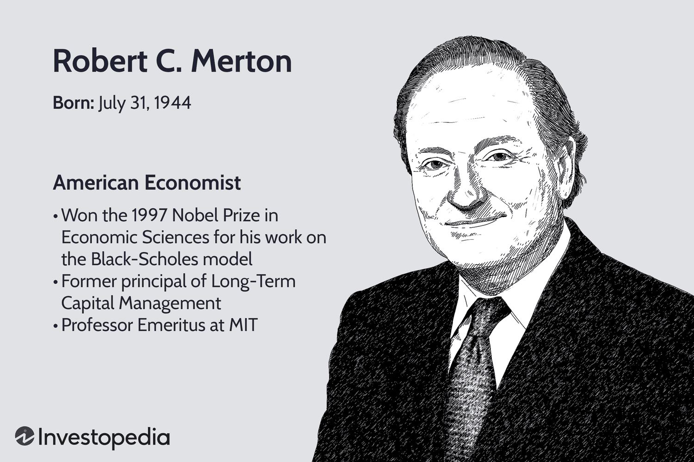

## Table of Contents

## Who is Robert C. Merton?

Robert C. Merton is a famous American economist. He was born on July 31, 1944. Merton is known for his work on how to price things like stocks and options. He helped create a model called the Black-Scholes-Merton model. This model helps people figure out how much an option is worth. For this work, he won the Nobel Prize in Economic Sciences in 1997.

Before winning the Nobel Prize, Merton worked at many big universities. He taught at the Massachusetts Institute of Technology (MIT) and later at Harvard University. He also worked at a company called Long-Term Capital Management. This company used his ideas to make money in the stock market. Unfortunately, the company failed in 1998, but Merton's work in economics is still very important today.

## When and where was Robert C. Merton born?

Robert C. Merton was born on July 31, 1944. He was born in New York City, in the United States.

Merton grew up to become a famous economist. He is known for his work on how to price things like stocks and options.

## What is Robert C. Merton's educational background?

Robert C. Merton went to school at Columbia University in New York. He finished his undergraduate studies there and got a Bachelor of Arts degree in Engineering Mathematics in 1966. After that, he decided to keep learning and went to the California Institute of Technology, also known as Caltech. At Caltech, he studied more about math and science and got a Master of Science degree in 1967.

After finishing at Caltech, Merton wanted to learn even more about economics. He went to the Massachusetts Institute of Technology, or MIT, to study for his Ph.D. At MIT, he worked hard and learned a lot about how to use math in economics. In 1970, he finished his Ph.D. in Economics. This education helped him become a very important economist later in his life.

## What are some of the key positions Robert C. Merton has held in his career?

Robert C. Merton has had many important jobs in his career. After finishing his Ph.D. at MIT, he started working as a professor at MIT's Sloan School of Management. He taught there for many years and did a lot of research on how to price options and other financial products. This work helped him become famous in the world of economics. In 1988, he moved to Harvard University to become the John and Natty McArthur University Professor. At Harvard, he kept teaching and doing research, and he also worked with many students and other professors.

Besides teaching, Merton also worked in the business world. In 1993, he became a partner at a company called Long-Term Capital Management. This company used his ideas to make money in the stock market. Even though the company failed in 1998, Merton's work there showed how his ideas could be used in real life. After that, he continued to work as a consultant and advisor for many other companies and organizations. Today, he is still a professor at MIT, where he helps students learn about finance and economics.

## What is Robert C. Merton known for in the field of finance?

Robert C. Merton is famous in the world of finance for helping to create the Black-Scholes-Merton model. This model is a way to figure out how much an option is worth. An option is like a bet on whether a stock will go up or down. Merton's work on this model showed how to use math to understand the price of options better. This was a big deal because it helped people in the stock market make better decisions. For his work on this model, Merton won the Nobel Prize in Economic Sciences in 1997, together with Myron Scholes.

Besides the Black-Scholes-Merton model, Merton also worked on other important ideas in finance. He helped develop ways to understand and manage risk in investments. This is important because it helps people know how safe or risky their investments are. Merton's ideas have been used by many people in the stock market and by companies that manage money. Even though he faced challenges, like when the company Long-Term Capital Management failed, his contributions to finance are still very important today.

## Can you explain the Black-Scholes-Merton model and Robert C. Merton's contribution to it?

The Black-Scholes-Merton model is a way to figure out how much an option is worth. An option is like a bet on whether a stock will go up or down. The model uses math to help people understand the price of an option. It looks at things like how much the stock moves, how long until the option expires, and how safe or risky the investment is. This model was a big deal because it helped people in the stock market make better decisions about buying and selling options.

Robert C. Merton's big contribution to the Black-Scholes-Merton model was adding a new way to think about risk. Before Merton, the model was created by Fischer Black and Myron Scholes. Merton made it better by showing how to use something called "continuous-time finance." This means he used math to look at how prices change all the time, not just at certain points. His work helped make the model more accurate and useful. For this, Merton won the Nobel Prize in Economic Sciences in 1997, together with Myron Scholes.

## What awards has Robert C. Merton received for his work?

Robert C. Merton has received many important awards for his work in economics and finance. The biggest award he got was the Nobel Prize in Economic Sciences in 1997. He shared this prize with Myron Scholes for their work on the Black-Scholes-Merton model. This model helps people figure out how much an option is worth. The Nobel Prize is a very big deal because it shows that Merton's work was very important and helpful to many people.

Besides the Nobel Prize, Merton has also received other awards. He got the John Bates Clark Medal in 1993. This medal is given to economists under the age of 40 who have made big contributions to the field. Merton was recognized for his work on how to price options and other financial products. These awards show that Merton's ideas have been very important in the world of economics and finance.

## How has Robert C. Merton influenced the practice of risk management?

Robert C. Merton has had a big impact on how people think about and manage risk in the world of finance. He helped create new ways to understand risk by using math. Merton's work showed that risk can be measured and managed using something called continuous-time finance. This means looking at how prices change all the time, not just at certain points. His ideas helped people see risk as something that can be handled better, instead of just something to be afraid of.

Because of Merton's work, companies and people who manage money started using his methods to make better decisions. They could now use his models to figure out how much risk they were taking with their investments. This helped them make their portfolios, or collections of investments, safer and more balanced. Even though his company, Long-Term Capital Management, failed in 1998, Merton's ideas about risk management are still used today and have made a big difference in the finance world.

## What are some of Robert C. Merton's most influential publications?

Robert C. Merton has written many important papers that have changed how people think about finance. One of his most famous works is the paper he wrote with Myron Scholes in 1973 called "The Pricing of Options and Corporate Liabilities." This paper introduced the Black-Scholes-Merton model, which helps people figure out how much an option is worth. The model uses math to look at things like how much a stock moves and how long until the option expires. This paper was a big deal because it helped people in the stock market make better decisions about buying and selling options.

Another important paper by Merton is "On the Pricing of Corporate Debt: The Risk Structure of Interest Rates," which he published in 1974. In this paper, Merton showed how to use math to understand the risk of corporate bonds. He explained that the risk of a bond depends on the company's chance of going bankrupt. This idea helped people see that the interest rates on bonds are related to how risky the company is. Merton's work on this topic has been very useful for people who invest in bonds and for companies that need to borrow money.

Merton also wrote a paper in 1990 called "Continuous-Time Finance." This paper is important because it helped people understand how to use math to look at how prices change all the time, not just at certain points. This idea, called continuous-time finance, has been used to make better models for pricing options and managing risk. Merton's work in this paper has had a big impact on how people in finance think about and handle risk in their investments.

## How has Robert C. Merton's work impacted the financial industry?

Robert C. Merton's work has made a big difference in the financial industry. He helped create the Black-Scholes-Merton model, which is a way to figure out how much an option is worth. This model uses math to look at things like how much a stock moves and how long until the option expires. Because of this model, people in the stock market can make better decisions about buying and selling options. It has helped make the market more fair and efficient because everyone can use the same math to understand the price of options.

Merton's ideas about risk have also changed how people in the financial industry think about and manage risk. He showed that risk can be measured and managed using something called continuous-time finance. This means looking at how prices change all the time, not just at certain points. His work helped people see that risk is something that can be handled better, instead of just something to be afraid of. Companies and people who manage money now use Merton's methods to make their investments safer and more balanced. Even though his company, Long-Term Capital Management, failed, his ideas about risk management are still used today and have made a big impact on the finance world.

## What are Robert C. Merton's views on the future of financial engineering?

Robert C. Merton believes that the future of financial engineering will be all about using new technology to make things easier and better for people. He thinks that computers and the internet will help make financial products and services more personalized. This means that people will be able to get financial advice and products that are made just for them, based on their own needs and goals. Merton also believes that financial engineering will keep getting better at managing risk. With more data and better tools, people will be able to make smarter decisions about their money and investments.

Merton also sees a future where financial engineering helps make the world a better place. He believes that new financial tools can help solve big problems like climate change and inequality. For example, financial engineering could create ways to invest in clean energy or help more people get access to education and healthcare. Merton thinks that by using math and technology, financial engineers can come up with new ideas to make the world fairer and more sustainable.

## What ongoing research or projects is Robert C. Merton currently involved in?

Robert C. Merton is currently working on research that focuses on how to make financial systems better and safer. He is interested in using new technology and data to help people make smarter decisions about their money. Merton is looking into ways to create financial products that are more personalized. This means that the products would be made just for each person, based on their own needs and goals. He believes that using math and computers can help make financial advice more accurate and helpful for everyone.

Merton is also involved in projects that aim to use financial engineering to solve big global problems. He is working on ideas that could help with issues like climate change and inequality. For example, he is exploring how financial tools can be used to invest in clean energy or to help more people get access to education and healthcare. Merton thinks that by using financial engineering, we can come up with new ways to make the world a better place for everyone.

## What are Merton's achievements?

Robert C. Merton, along with Fischer Black and Myron Scholes, was instrumental in the development of the Black-Scholes model, a groundbreaking methodology for valuing options. The model provides a mathematical framework for estimating the price of European-style options and has become a fundamental tool in the pricing and risk management of financial derivatives. The Black-Scholes model is based on the principle of no-[arbitrage](/wiki/arbitrage) and provides a closed-form analytic solution under the assumption of log-normal distribution of stock prices, continuous trading, and constant [volatility](/wiki/volatility-trading-strategies) and interest rates.

The formula for the Black-Scholes model is given by:

$$
C = S_0 N(d_1) - X e^{-rT} N(d_2)
$$

Where:
- $C$ is the call option price,
- $S_0$ is the current stock price,
- $X$ is the strike price of the option,
- $r$ is the risk-free interest rate,
- $T$ is the time to expiration,
- $N(\cdot)$ is the cumulative distribution function of the standard normal distribution,
- $d_1 = \frac{\ln(S_0/X) + (r + \sigma^2/2)T}{\sigma\sqrt{T}}$,
- $d_2 = d_1 - \sigma\sqrt{T}$,
- $\sigma$ is the volatility of the stock.

This formulation transformed the landscape of financial markets, enabling investors and financial institutions to systematically price options and other derivatives, creating more predictable financial models and strategies. Recognizing the significance of this work, Robert C. Merton shared the 1997 Nobel Memorial Prize in Economic Sciences with Myron Scholes. Fischer Black would have likely been a co-recipient had he not passed away two years prior.

The Black-Scholes model revolutionized financial markets by introducing rigorous quantitative analysis to derivatives pricing, which has led to the expansion and sophistication of financial products available today. It remains heavily employed by investment banks and hedge funds to implement dynamic hedging strategies, manage risks, and optimize investment portfolios. Despite its assumptions and limitations, such as the exclusion of dividends or the assumption of constant volatility, the Black-Scholes model continues to serve as a cornerstone in modern financial theory and practice. It paved the way for subsequent advancements in financial mathematics, allowing further refinement in generating more realistic models that incorporate various market nuances.

## What is the influence on algorithmic trading?

Robert C. Merton has profoundly influenced the field of [algorithmic trading](/wiki/algorithmic-trading), primarily through the application of the Black-Scholes model, a groundbreaking development in financial mathematics. This contribution laid the theoretical groundwork that underpins modern financial algorithms. 

The Black-Scholes model, developed by Merton alongside Fischer Black and Myron Scholes, introduced a method for valuing options, providing the mathematical framework essential to the development of automated trading systems. The model allows the calculation of the price of European-style options using the formula:

$$
C(S, t) = S \cdot N(d_1) - X \cdot e^{-r(T-t)} \cdot N(d_2)
$$

where
$$
d_1 = \frac{\ln(S/X) + (r + \sigma^2 / 2)(T - t)}{\sigma \sqrt{T - t}}
$$
$$
d_2 = d_1 - \sigma \sqrt{T - t}
$$

Here, $C$ is the price of the call option, $S$ is the current stock price, $X$ is the strike price, $T$ is the time to expiration, $t$ is the current time, $r$ is the risk-free [interest rate](/wiki/interest-rate-trading-strategies), and $\sigma$ is the volatility of the stock price. The function $N$ represents the cumulative distribution function of the standard normal distribution.

This precise valuation technique has enabled the creation of more sophisticated and predictable trading algorithms that form the backbone of algorithmic trading operations today. Traders and financial engineers rely on these methods to make data-driven decisions using complex mathematical models for risk management and investment strategies. The predictability offered by these methods is crucial for the development of algorithms that seek to capitalize on minute price movements observed in high-frequency trading.

Moreover, Merton's association with Long-Term Capital Management (LTCM), a highly influential [hedge fund](/wiki/hedge-fund-trading-strategies) renowned for its [quantitative trading](/wiki/quantitative-trading) strategies, highlights the practical applicability and potential risks of algorithmic trading based on advanced mathematical models. Despite LTCM's eventual collapse due to [liquidity](/wiki/liquidity-risk-premium) crises, its initial success amplified interest in the utilization of sophisticated mathematical tools, including those based on Merton's work, in trading.

Today, Merton's contributions continue to influence quantitative trading strategies employed by hedge funds and financial institutions. His work has provided the methodologies required for the complex algorithms that now define the landscape of financial markets, supporting the development of systems that operate with speed and accuracy beyond human capability. As technological advancements push the boundaries of trading strategies, the legacy of Merton's impact persists, guiding the evolution of modern financial markets.

## References & Further Reading

[1]: Merton, R. C. (1973). ["Theory of Rational Option Pricing."](https://www.jstor.org/stable/pdfplus/3003143) The Bell Journal of Economics and Management Science, 4(1), 141-183.

[2]: Black, F. & Scholes, M. (1973). ["The Pricing of Options and Corporate Liabilities."](https://www.cs.princeton.edu/courses/archive/fall09/cos323/papers/black_scholes73.pdf) Journal of Political Economy, 81(3), 637-654.

[3]: ["Continuous-Time Finance"](https://pages.stern.nyu.edu/~jcarpen0/pdfs/Continuous-timepdfs/lectureslides1arbmart.pdf) by Robert C. Merton

[4]: ["Options, Futures, and Other Derivatives"](https://www.amazon.com/Options-Futures-Other-Derivatives-10th/dp/013447208X) by John C. Hull

[5]: Lo, A. W. (2007). ["Efficient Market Hypothesis."](https://web.mit.edu/Alo/www/Papers/EMH_Final.pdf) The New Palgrave: A Dictionary of Economics.