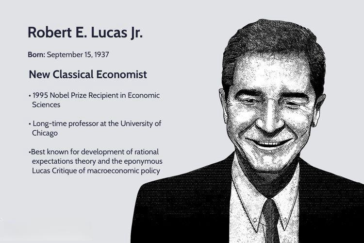

The intersection of economic theory and technology continues to shape modern trading practices, creating opportunities for innovation and efficiency in financial markets. One of the most influential figures in this field is Robert E. Lucas Jr., whose groundbreaking work laid the foundation for understanding how economic theories can inform technology-driven trading strategies. Lucas's pioneering contributions have consistently informed the development of modern economics, particularly in areas where technology and economic theory intersect. 

Algorithmic trading, which relies on complex models and data-driven strategies to execute trades at high speed, has been particularly influenced by Lucas's economic theories. This form of trading utilizes algorithms to predict market trends and execute trades based on anticipated movements. Understanding Lucas's insights, such as rational expectations and the Lucas Critique, provides a framework for developing trading algorithms that can adapt to changing market conditions, reflecting the core principles of these theories.



This article explores the impact of Lucas's economic ideas specifically in the context of algorithmic trading. By dissecting major concepts like rational expectations and the Lucas Critique, we can better appreciate how these frameworks help in designing algorithms that react and adapt effectively. Robert E. Lucas Jr.'s work not only changed macroeconomic theory but also provided a lasting influence on the technological advancements that drive today's trading practices.

## Table of Contents

## Robert E. Lucas Jr.: An Overview

Robert E. Lucas Jr. emerged as a pivotal figure in the field of economics, primarily associated with the New Classical School. His instrumental work on rational expectations fundamentally altered economic discourse, challenging and transforming the landscape of macroeconomic policy-making.

Lucas was awarded the Nobel Prize in Economic Sciences in 1995, an honor that recognized his profound impact on macroeconomic analysis and the formulation of policy. The Nobel Committee commended his development of the "Lucas Critique," which underscores how economic models based on historical data could fail to predict future outcomes if they do not account for shifts in public expectations in response to policy changes.

A significant aspect of Lucas's theoretical framework was the integration of microeconomic foundations into macroeconomic models. This approach was revolutionary in demonstrating that macroeconomic phenomena could not be accurately understood without considering individual behaviors and decision-making processes. By suggesting that economic agents optimally utilize available information when forming expectations about the future, Lucas proposed that these expectations will typically align closely with the model's predictions unless influenced by random external shocks.

Lucas's contributions fostered a more systematized and precise approach to economic policy evaluation, emphasizing models that assume rational behavior among participants. This paradigm shift urged economists and policymakers to formulate strategies that are resilient to expectation-driven deviations. His work remains a cornerstone in economic theory, continuing to inspire advancements in various fields, including finance and, notably, [algorithmic trading](/wiki/algorithmic-trading) systems, which bank on the predictive capabilities of models akin to those Lucas championed.

## Rational Expectations Theory

Robert E. Lucas Jr.'s rational expectations theory posits that individuals utilize all available information to make economic decisions. This theory fundamentally shifts how economists perceive market behaviors by suggesting that economic [agents](/wiki/agents) are forward-looking and incorporate expectations of future policies and events into their decision-making processes.

In financial markets, traders use available data, such as historical prices, economic indicators, and news, to anticipate trends and adjust their strategies. Algorithmic trading, which employs computer programs to execute trades, embodies this theory. Algorithms are designed to anticipate market movements by analyzing large datasets and identifying patterns that might predict future price actions.

The main concept of rational expectations can be mathematically expressed as follows: if $E_t$ represents the expectation based on information available at time $t$, then for a variable $x$ at a future time $t+1$, the expectation is $E_t(x_{t+1})$. Under rational expectations, the forecasting error, $x_{t+1} - E_t(x_{t+1})$, is not systematic and has a mean value of zero. This implies that traders cannot consistently earn abnormal profits by using historical data alone, as their expectations based on existing information are already accounted for in prices.

Algorithmic trading models rely heavily on this principle, striving to predict market movements and make decisions that align with future expectations. These models often use regression analysis, time-series forecasting, and [machine learning](/wiki/machine-learning) techniques to assess market data. Here's a simple example using Python to showcase how traders might use rational expectations in constructing a model:

```python
import numpy as np
import pandas as pd
from sklearn.linear_model import LinearRegression

# Simulate some market data
np.random.seed(0)
dates = pd.date_range('2023-01-01', periods=100)
prices = np.random.randn(100).cumsum() + 100

# Create a DataFrame
data = pd.DataFrame({'Date': dates, 'Price': prices})

# Prepare the features and target for regression model
data['L1_Price'] = data['Price'].shift(1)
data.dropna(inplace=True)

# Features and target variable
X = data[['L1_Price']]
y = data['Price']

# Fit a linear regression model
model = LinearRegression()
model.fit(X, y)

# Predict future prices
data['Predicted'] = model.predict(X)

# Evaluate model
print(data[['Price', 'Predicted']].head())
```

This example simulates market prices and uses a simple linear regression model to predict future prices. Such models embody the rational expectations theory by utilizing past information to anticipate future conditions. As market conditions change, algorithmic models can be refined to incorporate new data, ensuring their adaptability to dynamic environments, consistent with the principles of rational expectations.

## The Lucas Critique

The Lucas Critique is a significant concept put forward by Robert E. Lucas Jr. in the domain of macroeconomic modeling. It cautions against the use of historical data for the evaluation of economic policies, asserting that past data may no longer be relevant due to changes in public expectations during policy implementation. This critique highlights a fundamental shortcoming in traditional econometric models that fail to incorporate the dynamic nature of human behavior and expectations.

In the context of algorithmic trading, the Lucas Critique serves as a vital reminder of the necessity for adaptable trading models that respond to evolving market conditions. Markets are inherently dynamic, influenced by myriad factors such as economic policies, geopolitical events, and innovations. Any predictive model that bases its assumptions solely on historical data runs the risk of obsolescence as public expectations and external conditions shift.

Algorithmic trading systems must be designed with the flexibility to incorporate new information and adjust their strategies accordingly. This can involve the integration of machine learning algorithms capable of analyzing real-time data and detecting shifts in market sentiment. For example, a Python-based approach could utilize libraries such as TensorFlow or PyTorch to build prediction models that learn from both historical and incoming data:

```python
import numpy as np
import tensorflow as tf

# Hypothetical training data
historical_data_x = np.array([...])  # Historical market data features
historical_data_y = np.array([...])  # Target market trends

# Building a simple neural network model
model = tf.keras.Sequential([
    tf.keras.layers.Dense(64, activation='relu', input_shape=(historical_data_x.shape[1],)),
    tf.keras.layers.Dense(32, activation='relu'),
    tf.keras.layers.Dense(1)
])

model.compile(optimizer='adam', loss='mean_squared_error')

# Training the model with historical data
model.fit(historical_data_x, historical_data_y, epochs=10)

# Predicting future market trends based on new data inputs
new_data_x = np.array([...])  # New market data features
predicted_trends = model.predict(new_data_x)
```

Incorporating the Lucas Critique into algorithmic trading also requires recognizing the impact of economic policy changes on market behavior. For instance, when a government amends monetary policies, traders must anticipate how such changes will influence market dynamics, rather than merely relying on statistical patterns observed in a pre-policy-change environment.

Overall, algorithmic trading strategies that account for the Lucas Critique will be more robust, as they incorporate an understanding of the fluidity of market expectations and the necessity for continuous adaptation. This approach places greater emphasis on proactive policy analysis and the use of forward-looking data to sustain competitive advantages in trading practices.

## Implications of Lucas's Work for Algorithmic Trading

Robert E. Lucas Jr.'s economic theories have profound implications for the development of algorithmic trading strategies. His rational expectations theory posits that individuals and market participants use all available information to forecast future events, thereby making informed decisions. In the context of algorithmic trading, this concept underscores the necessity for trading algorithms to incorporate comprehensive data analysis and forecasting mechanisms. By integrating rational expectations, algorithms can anticipate market trends and adjust strategies preemptively, enhancing their effectiveness.

A critical aspect of rational expectations is the dynamic adaptation to economic policy shifts. As central banks and governments introduce new policies, market behaviors evolve. Algorithmic systems must be designed to interpret such shifts quickly and adjust their trading strategies accordingly. This dynamic approach ensures that algorithms maintain a competitive advantage by aligning with current economic conditions.

Beyond rational expectations, Lucas's insights into human capital and economic growth theories further aid in developing sophisticated trading models. Human capital, which encompasses the knowledge and skills of individuals, is a key [factor](/wiki/factor-investing) in economic growth according to Lucas's framework. For algorithmic trading, understanding the impact of human capital on market dynamics can lead to more refined predictive models. Incorporating variables that reflect changes in workforce competencies or education levels can improve the predictive power of trading algorithms.

Lucas's work on economic growth also highlights the significance of technological advancements and innovations. Algorithmic trading platforms can integrate these insights by continuously optimizing algorithms to account for technological changes in the markets. This involves regular updates and incorporating machine learning and [artificial intelligence](/wiki/ai-artificial-intelligence) to process evolving datasets efficiently.

In summary, Lucas's theories provide essential mechanisms for developing adaptive trading algorithms that forecast market movements and adjust to economic policies effectively. By embracing the principles of rational expectations and human capital, algorithmic systems can be designed to respond dynamically to the interplay between economic policy and market behaviors, strengthening their competitive positioning in the financial markets.

## Conclusion

Robert E. Lucas Jr.'s pioneering work has left a lasting legacy in economic thought and continues to shape contemporary trading practices. His groundbreaking theories, particularly on rational expectations and the Lucas Critique, offer a crucial framework for understanding market dynamics and inform the development of algorithmic trading strategies.

Lucas's insights into expectations have proved invaluable for traders aiming to gain a competitive advantage. By recognizing that market participants use all available information to form expectations about the future, algorithmic trading models can be designed to predict and adapt to market shifts effectively. This anticipatory approach aligns with the principles of rational expectations, where traders adjust strategies based on expected trends, minimizing lag in response to new data.

Furthermore, Lucas's work on the limitations of policy evaluation through historical data, as encapsulated in the Lucas Critique, underscores the necessity for adaptive models in algorithmic trading. Algorithms must be responsive to evolving market conditions and policy changes, ensuring strategies remain robust and effective. The awareness that static models may not account for changes in public expectations is vital for the continual refinement of trading algorithms.

Incorporating Lucas's economic principles facilitates the development of sophisticated trading strategies that are both dynamic and forward-looking. Understanding human capital and economic growth theories, as propounded by Lucas, further enriches the algorithms by providing deeper insights into long-term market trends and systemic risks.

As ongoing research and technological advancements push the boundaries of algo trading, the integration of Lucas's theoretical contributions will remain a fundamental component. By leveraging these insights, traders and developers can build more resilient, adaptive, and informed trading strategies, ensuring a strategic edge in increasingly complex financial markets.

## References & Further Reading

[1]: Lucas, R. E. (1972). Expectations and the Neutrality of Money. Journal of Economic Theory, 4(2), 103-124.

[2]: Lucas, R. E. (1976). Econometric Policy Evaluation: A Critique. Carnegie-Rochester Conference Series on Public Policy, 1, 19-46. doi:10.1016/S0167-2231(76)80003-6

[3]: Sargent, T. J., & Wallace, N. (1975). "Rational" Expectations, the Optimal Monetary Instrument, and the Optimal Money Supply Rule. Journal of Political Economy, 83(2), 241-254.

[4]: Engle, R. F. (1982). Autoregressive Conditional Heteroscedasticity with Estimates of the Variance of United Kingdom Inflation. Econometrica, 50(4), 987-1007.

[5]: Ljungqvist, L., & Sargent, T. J. (2018). Recursive Macroeconomic Theory. MIT Press.

[6]: Rossi, B. (2013). Exchange Rate Predictability. Journal of Economic Perspectives, 27(3), 103-128.

[7]: Lopez de Prado, M. (2018). Advances in Financial Machine Learning. Wiley. 

[8]: Pettengill, G. N., Sundaram, S., & Mathur, I. (1995). The Conditional Relation Between Beta and Returns. Journal of Financial and Quantitative Analysis, 30(1), 101-116.