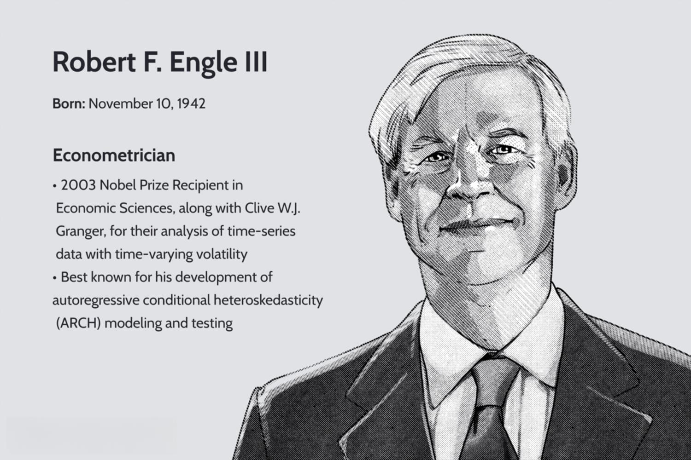

Robert F. Engle III has significantly contributed to the field of economics through his pioneering work on modeling financial volatility, culminating in the development of the Autoregressive Conditional Heteroskedasticity (ARCH) model. This groundbreaking innovation, which earned him the Nobel Prize in Economic Sciences in 2003, transformed the way economists and financial analysts perceive time-varying volatility in data. The ARCH model allows for the modeling of variance over time, providing a sophisticated tool for understanding financial markets' fluctuations. By capturing the dynamic nature of volatility, which traditional models struggled to elucidate, Engle's work has provided deeper insights into a critical aspect of financial data analysis. 

Engle’s ARCH model has become especially relevant in today’s financial markets, characterized by complex dynamics and extensive data-driven decision-making processes. The ability of ARCH models to effectively estimate and predict volatility is crucial for risk management, option pricing, and portfolio allocation. These models serve as foundational elements in algorithmic trading systems, where rapid, automatic transactions require precise volatility estimations to maximize returns and minimize risk. The continuous refinement of these models and their derivatives expands upon Engle’s initial work, proving its enduring importance in modern quantitative finance.



In algorithmic trading, volatility prediction is paramount. Engle's contribution has given rise to robust mathematical tools that facilitate such predictions, enhancing trading strategies that leverage high-frequency data. Financial institutions and hedge funds routinely incorporate ARCH models and related methodologies to gauge market conditions and optimize their trading algorithms. This has not only improved the efficacy of trading operations but also contributed to the stability and efficiency of financial markets globally.

Engle's influence extends beyond his theoretical contributions. He has laid the groundwork for empirical investigations and practical implementations that permeate current financial econometrics, underscoring the significance of volatility in the economic landscape. The adaptability and ongoing relevance of his models continue to inspire new research and applications, ensuring Engle's lasting legacy in both academia and the financial industry.

## Table of Contents

## Early Life and Academic Background

Robert F. Engle III was born on November 10, 1942, in Syracuse, New York. His early life was characterized by a strong family emphasis on education and intellectual curiosity, laying the groundwork for his future academic achievements. Engle's path to economics began with his undergraduate studies at Williams College, where he earned a Bachelor of Science degree in Physics in 1964. His interest in quantitative analysis and scientific rigor was initially nurtured in the field of physics.

Engle's transition from physics to economics took shape during his graduate studies at Cornell University. Motivated by an interest in applying mathematical techniques to social sciences, he pursued a Ph.D. in Economics, which he received in 1969. This remarkable shift from one scientific discipline to another underscores Engle's versatility and intellectual curiosity.

At Cornell, Engle was notably influenced by Ta Chung Liu, a distinguished economist who specialized in econometrics. Liu's guidance and mentorship played a crucial role in shaping Engle's academic focus and methodological approach. Liu was known for his expertise in time series analysis and statistical methods, areas that would become central to Engle’s groundbreaking work on modeling [volatility](/wiki/volatility-trading-strategies) in financial markets. Under Liu's tutelage, Engle developed a deep understanding of econometric modeling, which would later lead to his development of the Autoregressive Conditional Heteroskedasticity (ARCH) model — a significant breakthrough in the analysis of time-varying volatility.

The skills and insights Engle acquired during his formative years at Cornell laid a strong foundation for his future research and innovations. His journey from physics to economics exemplifies a seamless blending of quantitative analysis with economic theory, driven by the influences of his academic mentors and the robust educational environment at Cornell. This unique trajectory would ultimately empower him to make substantial contributions to economic sciences, including the work that would earn him the Nobel Prize.

## Nobel Prize-Winning Contributions

Robert F. Engle III, alongside Clive W.J. Granger, was awarded the Nobel Prize in Economic Sciences in 2003 for his influential work on methods of analyzing economic time series data characterized by time-varying volatility. Engle's seminal contribution was the development of the Autoregressive Conditional Heteroskedasticity (ARCH) model, which marked a profound advancement in the study of financial markets and contributed significantly to the field of econometrics.

The ARCH model, introduced by Engle in 1982, addresses a common phenomenon in financial data known as volatility clustering, where periods of high volatility are often followed by more high volatility periods, and similarly, low-volatility periods tend to follow low ones. Traditional models at the time assumed constant variance, which failed to capture this crucial aspect of financial time series data. The ARCH model, however, allows the conditional variance to change over time, depending on past errors.

Mathematically, the ARCH model is represented as:

$$

y_t = \mu + \epsilon_t 
$$
$$

\epsilon_t = \sigma_t z_t 
$$
$$

\sigma_t^2 = \alpha_0 + \alpha_1 \epsilon_{t-1}^2 + \alpha_2 \epsilon_{t-2}^2 + \cdots + \alpha_q \epsilon_{t-q}^2 
$$

where $y_t$ is the dependent time series variable, $\mu$ is the mean, $\epsilon_t$ is the error term, $\sigma_t^2$ is the conditional variance at time $t$, and $z_t$ is a white noise error term. The parameters $\alpha_0, \alpha_1, \ldots, \alpha_q$ are estimated from the data.

By allowing the variance to depend on past observations, the ARCH model effectively captures the changing risk or volatility over time in financial markets. This property is particularly crucial for understanding how financial markets behave in times of stress or exuberance, thus aiding in more efficient risk management and financial forecasting.

The application of the ARCH model has been wide-ranging. It provides a robust framework for measuring and forecasting volatility, which is central to option pricing, value-at-risk assessments, and hedging strategies. Economists, financial analysts, and policymakers have utilized ARCH models to better grasp the dynamics of economic systems and manage risks associated with financial instruments.

Engle's innovation laid a foundation for subsequent developments in econometric modeling of time-varying volatility, such as the Generalized ARCH (GARCH) model, which allows for more flexibility by incorporating longer lags of past variances. The understanding and prediction of volatility through these models are integral to forming [algorithmic trading](/wiki/algorithmic-trading) strategies that rely on volatility predictions to make informed trading decisions.

The ARCH model's ability to adapt to the intricacies of financial data has transformed the analysis of risks in markets, consolidating its position as a vital tool in modern economics and finance.

## ARCH Models and Their Applications

Autoregressive Conditional Heteroskedasticity (ARCH) is a statistical model that addresses the issue of time-varying volatility often observed in financial time series data. Developed by Robert F. Engle, the ARCH model captures the tendency of financial assets to exhibit periods of high and low volatility, which traditional models assuming constant variance fail to account for. The model's core concept is that current volatility depends on the size of previous periods' errors, recognizing that volatility itself is a predictable and evolving element of financial markets.

Mathematically, the ARCH model can be expressed as follows:

$$
\sigma_t^2 = \alpha_0 + \alpha_1 \epsilon_{t-1}^2 + \alpha_2 \epsilon_{t-2}^2 + \ldots + \alpha_q \epsilon_{t-q}^2
$$

Here, $\sigma_t^2$ denotes the conditional variance for time $t$, $\epsilon_{t-i}^2$ represents past squared returns, and $\alpha_i$ are coefficients estimated from the data. The model's flexibility allows for an adaptation into Generalized ARCH (GARCH) models, incorporating past conditional variances alongside squared returns for more robust predictions.

ARCH models find significant applications across various fields of economics and finance, primarily because they provide a mechanism for modeling and understanding changes in volatility over time. This capability is crucial for several reasons:

1. **Risk Management**: Financial institutions often use ARCH and its extensions to measure and manage risk by modeling the potential volatility of asset returns. For example, Value at Risk (VaR) calculations, which estimate the potential loss in an investment portfolio, often rely on volatility projections generated by ARCH models.

2. **Volatility Prediction**: Understanding future volatility is vital for pricing options and other derivative securities. ARCH models are employed to predict future market conditions, enabling dealers to set appropriate prices and hedge their positions effectively.

3. **Portfolio Optimization**: ARCH models support the optimization of portfolios by providing insights into the changing risk profiles of different assets. This helps in adjusting asset allocations according to the evolving risk-return landscape.

The reliance on ARCH models is evident in algorithmic trading, where they help in constructing models that [factor](/wiki/factor-investing) in the dynamic nature of market volatility, thereby refining trading strategies. These models allow traders to adapt their algorithms in real-time, accounting for market fluctuations and optimizing trade execution to reduce costs and improve returns.

In summary, ARCH models and their derivatives play a pivotal role in contemporary finance by enhancing the accuracy of volatility forecasts and helping practitioners devise better risk management strategies, understand price dynamics, and develop sophisticated financial instruments to cope with the uncertainties of financial markets.

## Impact on Algorithmic Trading

Robert F. Engle's Autoregressive Conditional Heteroskedasticity (ARCH) model has significantly influenced the landscape of algorithmic trading, underscoring the importance of understanding and predicting market volatility. In algorithmic trading, volatility prediction is crucial as it aids in the assessment of risk and informs trading strategies. The ARCH model, which accounts for time-varying volatility in financial data, provides traders with a robust framework for estimating and modeling volatility, thereby enhancing decision-making in automated trading systems.

One of the primary applications of the ARCH model in algorithmic trading is in the development of volatility-based strategies. These strategies often involve derivatives trading, such as options, where the pricing is heavily dependent on the expected volatility of the underlying asset. The ability to predict shifts in volatility allows traders to adjust their positions to mitigate risk or capitalize on anticipated market movements. For instance, a common approach is using GARCH (Generalized Autoregressive Conditional Heteroskedasticity), an extension of ARCH, to compute more precise volatility estimates. These estimates can then feed into algorithms that determine optimal trading signals.

ARCH models have laid the foundation for modern quantitative finance by formalizing the treatment of volatility clustering in financial markets. Prior to the advent of ARCH, volatility was often assumed to be constant, a simplification that can mislead risk assessments. Engle's work highlighted the importance of capturing these fluctuations, enabling more accurate pricing of financial instruments and better risk management. In Python, an ARCH model can be implemented using libraries like `arch`, allowing traders to harness computational algorithms in real time.

Here is a simplified Python example of implementing a GARCH model for volatility forecasting, which algorithmic traders might employ:

```python
import pandas as pd
from arch import arch_model

# Example data: A time series of asset returns
returns = pd.Series([0.03, -0.02, 0.015, ..., 0.005])

# Fit a GARCH(1, 1) model to the returns
model = arch_model(returns, vol='Garch', p=1, q=1)
fitted_model = model.fit()

# Forecast future volatility
volatility_forecast = fitted_model.forecast(horizon=5).variance[-1:]
print(volatility_forecast)
```

In this example, fitting and forecasting with a GARCH(1, 1) model provides traders with an anticipated measure of market volatility, which can be incorporated into their trading strategies. These forecasts are instrumental in crafting strategies that either thrive in high-volatility environments, such as market-making or statistical [arbitrage](/wiki/arbitrage), or protect against volatility, like hedging.

Engle's contribution thus extends beyond academic circles and is pivotal for algorithmic trading, wherein quantitative techniques are continually evolving. His work on volatility modeling enables traders to navigate the complexities of financial markets with a deeper understanding of the underlying risk dynamics, allowing for robust and adaptive trading algorithms. As algorithmic trading continues to gain sophistication, the principles established by Engle remain integral in fostering innovation and efficiency in financial markets.

## Legacy and Continued Influence

Robert F. Engle III's legacy extends far beyond his seminal work on the Autoregressive Conditional Heteroskedasticity (ARCH) model, influencing both academic and practical spheres within finance. One of his significant contributions to ongoing econometric research and practice is the establishment of the Volatility Institute at New York University (NYU) Stern School of Business. The Volatility Institute serves as a hub for academic researchers, financial institutions, and government bodies to collaborate on understanding and managing financial market volatility. This initiative underscores Engle's commitment to advancing the field of financial econometrics, encouraging the development of models and tools that address real-world financial instability.

Engle's impact on future generations of econometricians and financial practitioners is evident through his mentorship and the proliferation of ARCH and its extensions. Many of his protégés have become leading figures in economic research, adding depth and diversity to econometric analysis tools. This influence has cultivated an academic environment that encourages innovation in volatility modeling, contributing to a more nuanced understanding of financial data behaviors.

In current economic research and financial markets, Engle's work remains critically relevant. The ability to model and predict financial market volatility is essential for risk management and decision-making. Engle's ARCH model and its derivatives are integral to this process, as they allow for precise volatility estimation and forecasting. The predictive power of these models is not only valued by academics but also applied by financial practitioners in portfolio management, option pricing, and risk assessment strategies.

Moreover, the applicability of Engle's research extends to various financial market conditions. During periods of economic uncertainty, the need for accurate volatility modeling becomes more pronounced, emphasizing the continued necessity for innovation within this domain. The methodologies inspired by Engle's work facilitate adapting to these dynamic environments, showcasing the durability and adaptability of his contributions.

In conclusion, Robert F. Engle III's work has firmly established foundational pillars in the field of financial econometrics. His influence, perpetuated through the Volatility Institute and his academic legacy, continues to shape modern economic analysis and financial market strategies. Engle's work remains a vital reference point for those engaged in the ongoing quest to understand economic volatility and manage financial risk.

## Conclusion

Robert F. Engle III has left an indelible mark on the field of economics with his pioneering work in financial econometrics. His most notable contribution, the Autoregressive Conditional Heteroskedasticity (ARCH) model, has fundamentally transformed the way economists and financial analysts understand and manage volatility in financial markets. By providing a methodological framework to study time-varying volatility, the ARCH model enables more accurate forecasting and risk assessment, which are critical components of modern financial systems.

Engle’s work is particularly relevant in today’s volatile financial environment, where accurate predictions and efficient risk management strategies are paramount. In algorithmic trading, his models serve as a cornerstone for various strategies that depend on understanding and predicting market volatility. There are numerous algorithmic trading systems that integrate variations of the ARCH model to optimize trading decisions and manage risk exposure dynamically.

Beyond influencing trading practices, Engle’s contributions fostered the growth of quantitative finance, paving the way for new research areas and tools that continue to advance the field. The establishment of initiatives like the Volatility Institute at NYU underlines the lasting relevance and application of his work. This institute acts as a hub for ongoing research, offering insights into financial econometrics and ensuring that Engle’s legacy endures by influencing both current and future generations of researchers and practitioners.

In summary, Robert F. Engle III’s contributions profoundly impact how financial markets are analyzed and operated. His pioneering work invites further exploration of financial econometrics, encouraging scholars and practitioners to build on his legacy to better understand the complexities of financial markets. The continuous study and development in this field hold the promise of enhanced stability and efficiency in global financial systems, making Engle’s work as crucial today as it has ever been.

## References & Further Reading

[1]: Engle, R. F. (2004). ["Risk and Volatility: Econometric Models and Financial Practice."](https://www.aeaweb.org/articles?id=10.1257/0002828041464597) Nobel Prize Lecture, December 8, 2003.

[2]: Bollerslev, T. (1986). ["Generalized Autoregressive Conditional Heteroskedasticity"](https://www.sciencedirect.com/science/article/pii/0304407686900631). Journal of Econometrics, 31(3), 307-327.

[3]: Engle, R. F., & Patton, A. J. (2001). ["What Good is a Volatility Model?"](https://web-static.stern.nyu.edu/rengle/EnglePattonQF.pdf) Quantitative Finance, 1(2), 237-245.

[4]: Hamilton, J. D. (1994). ["Time Series Analysis."](https://press.princeton.edu/books/hardcover/9780691042893/time-series-analysis) Princeton University Press.

[5]: Shephard, N. (1996). ["Statistical Aspects of ARCH and Stochastic Volatility."](https://scholar.harvard.edu/shephard/publications/statistical-aspects-arch-and-stochastic-volatility) Chapman & Hall/CRC.

[6]: Andersen, T. G., Bollerslev, T., & Diebold, F. X. (2009). ["Parametric and Nonparametric Volatility Measurement."](https://www.nber.org/papers/w8160) Handbook of Financial Econometrics, Volume 1: Tools and Techniques, 67-130.

[7]: Tsay, R. S. (2005). ["Analysis of Financial Time Series."](https://cpb-us-w2.wpmucdn.com/blog.nus.edu.sg/dist/0/6796/files/2017/03/analysis-of-financial-time-series-copy-2ffgm3v.pdf) John Wiley & Sons.