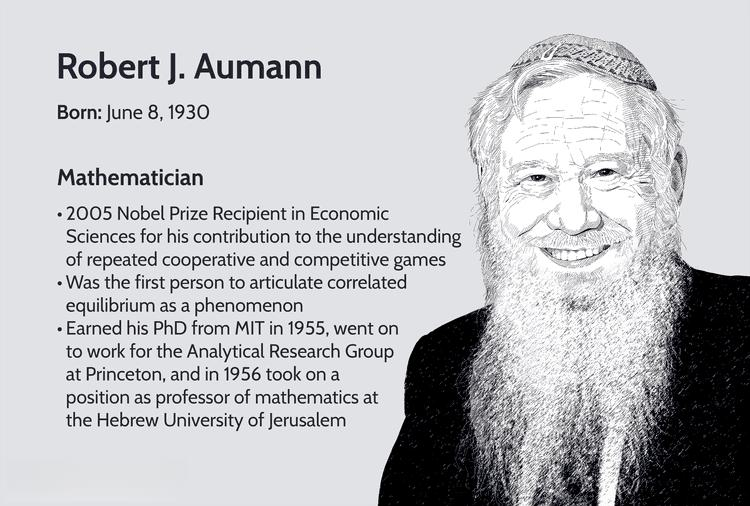

Robert J. Aumann, a distinguished Israeli-American mathematician, is widely recognized for his profound contributions to the field of game theory. His pioneering work has significantly advanced the understanding of complex issues involving conflict and cooperation. In 2005, Aumann was honored with the Nobel Prize in Economic Sciences, sharing the accolade with fellow esteemed economist Thomas C. Schelling. Their combined efforts have provided critical insights into how game-theory analysis can illuminate the strategic intricacies of human interactions.

Game theory, at its core, explores the strategic decision-making processes among rational agents. This analytical framework is applicable in diverse arenas, including economics, political science, and automated trading systems. Aumann’s theoretical innovations have laid the groundwork for robust models that analyze and predict behaviors in competitive environments. For instance, his concept of "correlated equilibrium" offers a refined perspective on strategic agreement between parties, exceeding the boundaries set by traditional Nash Equilibrium.

This article embarks on an exploration of Aumann's groundbreaking contributions to game theory. Moreover, it examines the profound implications of his work, particularly within the context of algorithmic trading—a domain where game-theoretical models are increasingly vital. By understanding Aumann's theories, analysts and researchers can devise sophisticated strategies and algorithms that anticipate and react to market fluctuations and trader behaviors.

## Table of Contents

## Early Life and Education

Robert J. Aumann, a distinguished figure in the field of game theory, was born in 1930 in Frankfurt, Germany. As the political climate in Germany grew increasingly hostile to Jewish families under Nazi rule, Aumann's family made the difficult decision to emigrate to the United States in 1938. Settling in New York, Aumann embarked on an academic journey that would shape his future contributions to mathematics and economics.

Aumann pursued his undergraduate studies at the City College of New York (CCNY), a well-respected institution for mathematics and sciences. Here, he earned a Bachelor of Science degree in mathematics in 1950. The rigors of his undergraduate studies equipped him with a strong foundation in mathematical principles, which would prove to be instrumental in his later work.

Following his graduation from CCNY, Aumann furthered his studies at the Massachusetts Institute of Technology (MIT), one of the world's leading centers for research and higher learning. In 1955, he successfully completed his Ph.D. in mathematics at MIT. His doctoral dissertation revolved around knot theory, a complex and nuanced area of mathematics. Knot theory involves the study of mathematical knots, which are embeddings of a circle in three-dimensional space, distinct from simple loops. This early focus on knot theory demonstrated Aumann's keen interest in mathematical modeling and abstraction, skills that he would later apply to the analysis and development of game theory.

Aumann's educational background laid a robust groundwork for his intellectual pursuits and achievements in game theory, establishing him as a pioneering thinker capable of bridging abstract mathematical concepts with practical applications in economics and beyond.

## Game Theory and the Nobel Prize

Robert J. Aumann's contributions to game theory have significantly reshaped the analysis of strategic interactions. One of his key developments is the theory of repeated games, which enhances the understanding of long-term interactions among rational players. Unlike one-shot games, repeated games consider the impact of future strategies based on past behavior, introducing concepts of trust and retaliation. These games enable analysts to predict outcomes not only from immediate payoffs but through a sequence of games and strategies over time.

Aumann's work on correlated equilibrium marks a substantial advancement over the Nash Equilibrium. In a Nash Equilibrium, each player's strategy is optimal given the strategies of others, but it requires that these decisions are made independently. In contrast, a correlated equilibrium permits coordination among players, guided by a common random signal that suggests strategies without mandating them. This allows for a broader range of equilibrium outcomes and often leads to more efficient results in strategic scenarios. In mathematical terms, while a Nash Equilibrium can be expressed as a set of strategies $(s_1, s_2, \ldots, s_n)$ such that no player can benefit by unilaterally deviating from $s_i$, a correlated equilibrium employs a probability distribution over the set of strategy profiles, ensuring that suggested strategies maximize expected payoffs given the distribution.

For these pioneering efforts, Aumann was awarded the Nobel Prize in Economic Sciences in 2005. His research has provided valuable insights into conflict resolution and cooperation, proving essential for analyzing complex strategic interactions found in international negotiations and economic policy formulations. Aumann's frameworks help design mechanisms that foster cooperation in settings where trust is fragile and incentives may diverge. By advancing the theoretical tools to better understand and predict the dynamics of cooperative and non-cooperative behavior, Aumann's work continues to inform economic strategies and bolster the efficacy of negotiation tactics across a global spectrum.

## Contributions to Theory and Practice

Robert J. Aumann has made significant contributions to the theoretical and practical aspects of game theory, enriching the field with his insights into phenomena such as common knowledge and Bayesian rationality. Common knowledge refers to information that is not only known by all participants but also known to be known by all, and so on ad infinitum. Aumann's work on this concept has been instrumental in understanding the dynamics of strategic decision-making. By formalizing common knowledge, he clarified how mutual understanding could affect the strategies selected by rational [agents](/wiki/agents).

In the context of Bayesian rationality, Aumann explored how individuals update their beliefs based on incoming information, a process critical to decision-making in uncertain environments. Bayesian rationality involves using probability theory to update beliefs in response to new evidence, adhering to the principles set by Bayes' theorem. Aumann's contributions emphasize rigorous mathematical formulations, allowing for a structured analysis of strategic interactions where the uncertainty of players' actions and types play significant roles.

Several collaborative efforts, notably with Michael Maschler, have further positioned Aumann as a pivotal figure in game theory. Their collaboration on games with incomplete information — often referred to as Bayesian games — has greatly influenced negotiation strategies and decision-making processes. In these games, players do not have perfect information about each other's preferences or available strategies, mirroring real-life scenarios of international diplomacy and competitive business environments. Their work provided a foundation for understanding equilibrium concepts in situations where players must make decisions without complete knowledge, thus shifting the focus to probabilistic reasoning and strategic adaptation. 

Consequently, Aumann's extensive research and collaborative efforts extend beyond abstract game-theoretical models to influence practical applications, offering tools for analyzing complex strategic interactions where information is incomplete, and uncertainty is prevalent.

## Algorithmic Trading and Game Theory

Game theory plays a crucial role in [algorithmic trading](/wiki/algorithmic-trading) by providing a framework for predicting market movements through the analysis of strategic interactions among market participants. Traders leverage game-theoretical concepts to anticipate the decisions of other traders and to devise strategies that optimize their outcomes in the market. This approach is essential for managing the complex dynamics of financial markets, where multiple agents with competing objectives operate simultaneously.

A cornerstone of game theory in the context of algorithmic trading is the formulation of strategies that can adapt to various market conditions. The principles of game theory assist in crafting algorithms that strive for optimality amidst uncertainty. These algorithms typically aim to maximize expected returns while minimizing risks, thus identifying the most advantageous trading strategies based on the inherent competition and cooperation present among traders.

Robert J. Aumann's work, particularly on repeated games and correlated equilibrium, is notably pertinent to understanding market dynamics. In repeated games, players encounter the same strategic scenario multiple times, allowing them to adapt their strategies based on previous outcomes. This repetition enables traders to refine their tactics, accounting for the recurring nature of financial market interactions. Aumann's development of the correlated equilibrium concept further enriches this understanding by introducing a more flexible solution concept than the classical Nash Equilibrium. In a correlated equilibrium, traders base their decisions on signals from a correlation device, enabling them to coordinate strategies in a manner that can lead to better mutual outcomes.

The application of these game-theoretical concepts in algorithmic trading can be implemented through various computational models. For instance, algorithms might be programmed to simulate repeated games where past trades inform future actions or to incorporate signals that guide decision-making towards achieving correlated equilibria. Such algorithms often employ predictive analytics and [machine learning](/wiki/machine-learning) techniques to adaptively respond to market signals and to forecast potential price movements.

By integrating Aumann's insights on repeated games and correlated equilibrium, algorithmic trading strategies can better navigate the interplay of strategies among traders, leading to more informed trading decisions. This incorporation of game theory not only enhances the precision of trading algorithms but also contributes to a deeper understanding of market behavior, ultimately advancing the effectiveness and reliability of algorithmic trading systems.

## Impact and Legacy

Robert J. Aumann's contributions to the field of game theory have had a profound impact far beyond academic circles, influencing policy-making, economics, and strategic negotiations on a global scale. By pioneering concepts such as the theory of repeated games and correlated equilibrium, Aumann provided essential tools and frameworks that have been utilized in various practical applications, altering the way strategic interactions are approached both in governmental and business contexts.

Aumann's influence extends deeply into education, where he has played a pivotal role in shaping curricula and inspiring new generations of mathematicians and economists. His rigorous approach and groundbreaking theories have become essential elements of economic and mathematics education worldwide, helping students and researchers alike understand complex strategic interactions. His work encourages a mode of thinking that synthesizes mathematical precision with real-world applicability, a combination that has been especially empowering for emerging scholars in these fields.

The legacy of Aumann's work is marked by its enduring relevance and transformative nature in both theoretical and applied contexts. In economics, his insights into game theoretic solutions have provided a structured methodology for analyzing markets and competitive behaviors. Notably, his work on correlated equilibrium offers a more adaptable and realistic view of strategic interactions compared to the traditional Nash Equilibrium, allowing for coordinated strategies among players without explicit communication.

In strategic negotiations, Aumann's theories facilitate better understanding and design of negotiation protocols. His exploration of common knowledge and Bayesian rationality assists negotiators in assessing the intentions and beliefs of other parties, leading to more informed and effective decision-making processes.

Robert J. Aumann's work has indelibly shaped the landscape of mathematics and economics through his innovative use of game theory. His theories provide a robust framework for addressing and predicting strategic behaviors, laying the foundation for continued advancements in these disciplines. Aumann's legacy is a testament to the power of mathematical thought in solving real-world problems, and his influence will undoubtedly persist as new challenges arise in policy-making, economic strategy, and beyond.

## Conclusion

Robert J. Aumann's work in game theory has established a comprehensive framework for analyzing strategic interactions across diverse domains. His development of the concept of correlated equilibrium extends beyond traditional Nash Equilibrium, offering a more nuanced approach to predicting and influencing economic behaviors. This concept plays a significant role in algorithmic trading, where understanding the interdependencies between various market players can inform more sophisticated and effective trading strategies.

Algorithmic trading, which relies heavily on forecasting and automation, greatly benefits from Aumann's insights. By applying game-theoretical principles, traders can identify optimal strategies that anticipate and react to the actions of other market participants. For instance, the repeated games framework provides a basis for modeling interactions over time, allowing for adaptive strategies that account for ongoing market dynamics.

As financial markets continue to grow in complexity, the relevance of Aumann's theories has only increased. The algorithms that drive modern trading systems must adapt to rapid changes and uncertainties inherent in the market environment. Aumann’s work supports the creation of robust algorithms that can accommodate strategic shifts, leading to improved decision-making and increased efficiency in trading.

In summary, the versatility of Robert J. Aumann's game theory contributions underpins their application in algorithmic trading and beyond. His pioneering ideas provide the intellectual tools necessary to navigate the evolving landscape of strategic interactions, ensuring that his theories continue to be critical resources in both academic research and practical, real-world applications.

## References & Further Reading

[1]: Aumann, R. J., & Maschler, M. (1995). ["Repeated Games with Incomplete Information."](https://mitpress.mit.edu/9780262526265/repeated-games-with-incomplete-information/) MIT Press.

[2]: Osborne, M. J., & Rubinstein, A. (1994). ["A Course in Game Theory."](https://sites.math.rutgers.edu/~zeilberg/EM20/OsborneRubinsteinMasterpiece.pdf) MIT Press.

[3]: Myerson, R. B. (1991). ["Game Theory: Analysis of Conflict."](https://www.jstor.org/stable/j.ctvjsf522) Harvard University Press.

[4]: Fudenberg, D., & Tirole, J. (1991). ["Game Theory."](https://mitpress.mit.edu/9780262061414/game-theory/) MIT Press.

[5]: Shubik, M. (1982). ["Game Theory in the Social Sciences."](https://archive.org/details/gametheoryinsoci0000shub) MIT Press.