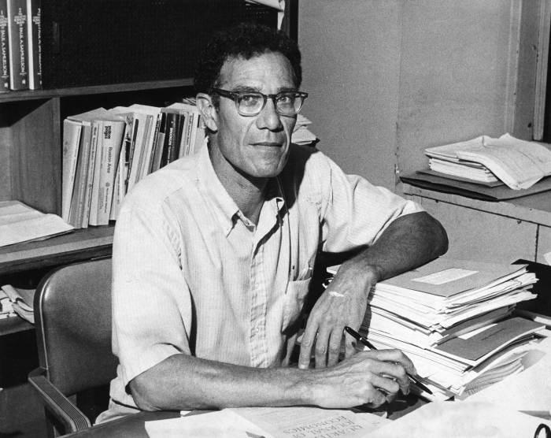

## Table of Contents

## Who is Robert M. Solow?

Robert M. Solow is an American economist who was born in 1924. He is famous for his work on economic growth and how it happens. In 1987, he won the Nobel Prize in Economics for his ideas. Solow's most important work is called the Solow-Swan growth model. This model helps explain how countries can grow their economies over time by using things like technology and saving money.

Solow taught at the Massachusetts Institute of Technology (MIT) for many years. He helped shape the way economists think about growth and development. His ideas are still used today to help countries plan their economic policies. Solow also wrote many books and articles that are important in the field of economics. He is considered one of the most influential economists of his time.

## What is Robert Solow best known for in economics?

Robert Solow is best known for his work on economic growth, especially for creating the Solow-Swan growth model. This model helps explain how countries can grow their economies by using technology and saving money. Before Solow's work, many people thought that growth came mainly from having more workers or more machines. Solow showed that technology is very important for growth too. His model says that as technology improves, countries can produce more with the same amount of workers and machines.

Solow's ideas changed how economists think about growth and development. His work helped people understand that investing in technology and education is important for a country's economy. Because of his contributions, Solow won the Nobel Prize in Economics in 1987. His work is still used today to help countries plan their economic policies. Solow's influence on economics is big, and he is considered one of the most important economists of his time.

## What is the Solow-Swan growth model and how does it work?

The Solow-Swan growth model is a way to understand how countries can grow their economies over time. It was created by Robert Solow and Trevor Swan. The model says that economic growth happens when a country saves money and invests it in things like machines and technology. It also says that the population, or the number of workers, is important. When there are more workers, they can use the machines and technology to make more stuff. But the most important part of the model is technology. If technology gets better, then workers can make even more stuff with the same machines.

The model works by showing how these things - savings, investment, population, and technology - work together. Imagine a country that saves a lot of money. It can use that money to buy more machines. With more machines, workers can make more things. But if the population grows too fast, there might not be enough machines for everyone, and growth could slow down. The key to keeping growth going is improving technology. When technology gets better, it helps workers use machines more efficiently. This means the country can keep growing even if it has the same number of machines and workers. The Solow-Swan model helps economists understand these relationships and plan for better economic growth.

## How did Robert Solow's work influence economic policy?

Robert Solow's work changed how countries think about growing their economies. Before his ideas, people thought that having more workers or more machines was the main way to grow. But Solow showed that technology is very important too. His model, called the Solow-Swan growth model, helped countries see that investing in technology and education can make their economies stronger. This changed the way governments planned their economic policies. They started to focus more on making technology better and helping people learn new skills.

Solow's ideas are still used today to help countries plan their growth. Governments now understand that they need to spend money on things like research and education to keep their economies growing. This has led to policies that support innovation and learning. For example, many countries now have programs to help businesses develop new technologies or to help people go to school. Solow's work helped make these kinds of policies more common, and they have been important for helping economies grow over time.

## What awards and recognitions has Robert Solow received?

Robert Solow has received many awards for his work in economics. The most famous one is the Nobel Prize in Economic Sciences, which he won in 1987. This prize is a big deal because it shows how important his ideas about economic growth are. Solow also got the National Medal of Science in 1999. This award is given by the President of the United States to people who have made big contributions to science.

Besides these big awards, Solow has been recognized in other ways too. He was made a member of the American Academy of Arts and Sciences and the National Academy of Sciences. These groups honor people who have done important work in their fields. Solow also received many honorary degrees from different universities. All these awards and recognitions show how much his work has helped people understand how economies grow.

## Can you explain the concept of 'Solow residual' and its significance?

The 'Solow residual' is a way to measure how much of a country's economic growth comes from better technology. Robert Solow came up with this idea when he noticed that the growth of an economy could not be explained just by having more workers or more machines. He found that even if you account for all the workers and machines, there was still some growth left over. This extra growth is what he called the Solow residual, and it represents the effect of technology on the economy.

The Solow residual is important because it helps economists understand the true sources of economic growth. Before Solow's work, people thought that growth came mostly from having more workers or more machines. But the Solow residual showed that technology plays a big role too. This idea changed how people think about growing their economies. Now, countries know that investing in technology and education can help their economies grow faster. The Solow residual has become a key tool for economists to measure and understand the impact of technology on economic growth.

## How does Solow's model differ from other economic growth models?

Robert Solow's model, known as the Solow-Swan growth model, is different from other economic growth models because it puts a big focus on technology. Before Solow, many models thought that growth came mostly from having more workers or more machines. But Solow showed that technology is really important too. His model says that when technology improves, countries can make more stuff even if they have the same number of workers and machines. This was a new idea that changed how people think about growing economies.

Another way Solow's model is different is that it looks at how savings and investment affect growth. In his model, if a country saves a lot of money, it can use that money to buy more machines. This helps the economy grow because workers can use the machines to make more things. But Solow's model also says that if the population grows too fast, there might not be enough machines for everyone, and growth could slow down. By showing how savings, investment, population, and technology all work together, Solow's model gives a fuller picture of economic growth than many other models.

## What criticisms have been leveled against the Solow growth model?

Some people have criticized the Solow growth model because it doesn't explain everything about how economies grow. One big criticism is that the model assumes that all workers and machines are the same. In real life, workers have different skills and machines can be different too. This means the model might not show the full picture of how an economy works. Also, the Solow model doesn't talk about how new ideas and inventions happen. It just says that technology gets better over time, but it doesn't explain how or why that happens.

Another criticism is that the Solow model doesn't look at how different parts of the economy affect each other. For example, it doesn't talk about how the government, businesses, and people all work together. Some people think the model is too simple because it doesn't include these details. Critics also say that the model might not work well for countries that are still developing. These countries might need different ways to grow their economies than what the Solow model suggests.

## How has Robert Solow contributed to the understanding of technological change in economics?

Robert Solow changed how economists think about technology in economic growth. Before Solow, many people believed that growth came mostly from having more workers or more machines. But Solow showed that technology is just as important. He created the Solow residual, which measures how much of a country's growth comes from better technology. This idea helped economists see that investing in technology and education can make economies grow faster. Solow's work made people understand that technology isn't just a small part of growth; it's a big part.

Solow's ideas have had a big impact on how countries plan their economies. Governments now know that they need to spend money on things like research and education to keep their economies growing. This has led to policies that support innovation and learning. For example, many countries now have programs to help businesses develop new technologies or to help people go to school. Solow's work helped make these kinds of policies more common, and they have been important for helping economies grow over time. His ideas are still used today to help countries plan their economic growth.

## What are some of the practical applications of the Solow growth model in today's economy?

The Solow growth model is used by governments and economists to plan how to grow their economies. They use it to understand that saving money and investing in things like machines and technology can help the economy grow. The model helps them see that if they want their country to get richer, they need to focus on making technology better. This means spending money on research and helping businesses create new inventions. Governments also use the model to decide how much money to spend on education, because educated people can use new technology better and help the economy grow.

Another way the Solow growth model is used today is to help developing countries plan their growth. These countries often have fewer machines and less technology than richer countries. The model shows them that they need to save money and invest in technology to catch up. It also helps them understand that if their population grows too fast, it can be hard to have enough machines for everyone. So, they need to balance population growth with investment in technology. By using the Solow growth model, these countries can make better plans to grow their economies and improve the lives of their people.

## How has Solow's work on economic growth been adapted or expanded upon by later economists?

Later economists have built on Robert Solow's ideas about economic growth. One big way they did this is by trying to explain how technology gets better over time. Solow's model said that technology improves, but it didn't say how or why. Economists like Paul Romer came up with new models that look at how people come up with new ideas and inventions. These models are called endogenous growth models because they explain how growth happens from within the economy. They show that things like education, research, and even the number of people working on new ideas can make technology better and help the economy grow.

Another way economists have expanded on Solow's work is by looking at how different parts of the economy affect each other. Solow's model was simple and didn't talk about how the government, businesses, and people all work together. Later models, like those by Robert Barro, include things like government spending, taxes, and how much people save. These models help economists understand how all these parts can help or hurt economic growth. By building on Solow's ideas, these new models give a fuller picture of how economies grow and what countries can do to make their economies stronger.

## What is Robert Solow's legacy in the field of economics and how is it viewed by contemporary economists?

Robert Solow's legacy in economics is big because he changed how people think about economic growth. He showed that technology is very important for making economies grow. Before Solow, people thought growth came mostly from having more workers or more machines. But Solow's work, especially his Solow-Swan growth model and the Solow residual, helped everyone see that technology plays a big role too. This idea has changed how countries plan their economies. They now know that spending money on research and education can help their economies grow faster.

Contemporary economists still think Solow's work is very important. They use his ideas to help plan how to grow economies. Economists like Paul Romer have built on Solow's work to create new models that explain how technology gets better over time. These new models help countries understand how to keep growing their economies. Solow's ideas are still taught in schools and used by governments around the world. His work has made a lasting impact on how economists think about growth and development.

## What are the implications of the Solow Growth Model in modern economics?

The Solow Growth Model remains an essential tool for evaluating long-term economic growth across contemporary economies. One of the model's central tenets is the role of technological advancement in driving productivity growth. Solow's insights have allowed economists to pinpoint the impact of various factors on economic output, distinguishing between inputs such as capital and labor and the residual effect captured by technological progress, often referred to as Total Factor Productivity (TFP).

The Solow Model prescribes that the steady-state level of output per worker is a function of the capital accumulation process, delineated through the production function, typically expressed as:

$$
Y = F(K, L)
$$

where $Y$ represents output, $K$ capital, and $L$ labor. Solow introduced the concept of the Solow Residual, identifying the portion of output growth not explained by the accumulation of capital and labor inputs, signifying technological change as a productivity driver.

Moreover, Solow's model is instrumental for policymakers, especially regarding savings rates and their contributions to long-term economic stability and growth. By differentiating between temporary and persistent effects on growth, the model provides insights into how changes in savings behavior can influence the capital accumulation path and, ultimately, the growth trajectory of an economy.

In terms of labor and capital substitutability, the Solow Model introduces the notion that economies can achieve a more stable growth path by minimizing dependencies on any single production input. The elasticity of substitution between capital and labor ensures that economies can adapt to shifts in technology, resource availability, and policy changes without risking stability.

Furthermore, Solow's exploration of technological progress imposes responsibilities concerning sustainable practices. In an era marked by rapid technological development, economists and policymakers utilize Solow's framework to evaluate the long-term impacts of technological innovations. The model stresses the need for responsible management of technological changes to ensure they contribute positively to sustainable economic progress, avoiding scenarios where short-term gains might culminate in long-term inefficiencies or environmental degradation.

Through these implications, the Solow Growth Model continues to inform economic analysis, providing a lens through which modern economies can assess growth dynamics and design strategies for sustained development.

## References & Further Reading

[1]: Solow, R. M. (1956). ["A Contribution to the Theory of Economic Growth."](https://pages.nyu.edu/debraj/Courses/Readings/Solow.pdf) The Quarterly Journal of Economics, 70(1), 65-94.

[2]: Solow, R. M. (1957). ["Technical Change and the Aggregate Production Function."](http://piketty.pse.ens.fr/files/Solow1957.pdf) The Review of Economics and Statistics, 39(3), 312-320.

[3]: ["Growth Theory: An Exposition"](https://archive.org/details/growththeoryexpo0000solo_x3f3) by Robert M. Solow.

[4]: ["The Concise Encyclopedia of Economics: Robert M. Solow"](https://about.libertyfund.org/books/the-concise-encyclopedia-of-economics/) by The Library of Economics and Liberty.

[5]: ["The Cambridge Handbook of Algorithmic Trading"](https://www.cuats.co.uk/) by Antoine Savine.