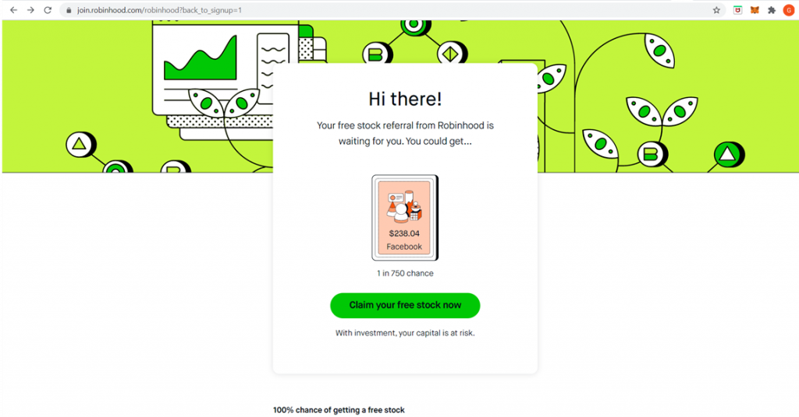

## Table of Contents

## What is the Robinhood API and what can it be used for?

The Robinhood API is a tool that lets you connect to the Robinhood app from outside. It helps you do things like check your account, buy and sell stocks, and see how your investments are doing, all without using the app directly. It's like a special language that lets your computer talk to Robinhood's computer.

You can use the Robinhood API for many things. For example, if you like to keep track of your money and investments, you can use it to make your own tools that show you how your stocks are doing. Or, if you know how to code, you can make programs that buy and sell stocks automatically based on certain rules you set. This can save you time and help you manage your investments better.

## How do I get started with the Robinhood API?

To get started with the Robinhood API, first you need to sign up for a Robinhood account if you don't already have one. Once you're signed up, you'll need to get your API keys. These are special codes that let your computer talk to Robinhood's computer. You can find these keys in the settings section of your Robinhood account. Make sure to keep them secret, just like you would with your password.

After you have your API keys, you'll need to choose a programming language and set up your development environment. Python is a popular choice because it's easy to learn and has lots of tools that work well with the Robinhood API. You can download Python for free from its official website. Once you have Python installed, you can use libraries like `robin-stocks` or `pyrh` to connect to the Robinhood API. These libraries make it easier to write code that can check your account balance, buy and sell stocks, and more.

## What are the prerequisites for using the Robinhood API?

To use the Robinhood API, you first need a Robinhood account. If you don't have one, you'll need to sign up. Once you have an account, you need to get your API keys. These keys are like special passwords that let your computer talk to Robinhood's computer. You can find them in your account settings. It's important to keep these keys secret, just like you keep your regular passwords safe.

Next, you'll need to know how to code. Python is a good language to use because it's easy to learn and works well with the Robinhood API. You can download Python for free from its website. After you have Python, you can use special tools called libraries, like `robin-stocks` or `pyrh`, to help you write code that can do things like check your account balance or buy and sell stocks. With these tools, you can start making your own programs to manage your investments.

## How do I authenticate with the Robinhood API?

To authenticate with the Robinhood API, you first need to get your API keys from your Robinhood account. These keys are special codes that let your computer talk to Robinhood's computer. You can find them in the settings section of your account. Make sure to keep these keys secret, just like you would with your password. Once you have your keys, you'll use them in your code to connect to the API.

When you're ready to use the API, you'll need to write code that includes your API keys. This code will send a request to Robinhood's server, showing your keys to prove who you are. If the keys are correct, Robinhood will let you do things like check your account balance or buy and sell stocks. If you're using a library like `robin-stocks` or `pyrh` in Python, these libraries will handle the authentication for you, making it easier to connect and start using the API.

## What are the basic endpoints I should know about in the Robinhood API?

The Robinhood API has several basic endpoints that you should know about. The first one is the 'accounts' endpoint. This endpoint lets you see information about your Robinhood account, like how much money you have and what stocks you own. Another important endpoint is the 'orders' endpoint. This one helps you buy and sell stocks. You can use it to place new orders or check on orders you've already made.

There's also the 'quotes' endpoint, which is useful for getting the current price of a stock. If you want to know how much a stock costs right now, you can use this endpoint. The 'instruments' endpoint is another key one. It helps you find information about different stocks, like their symbols and names. These endpoints are the building blocks you'll use to manage your investments through the Robinhood API.

## How can I retrieve my portfolio data using the Robinhood API?

To retrieve your portfolio data using the Robinhood API, you need to use the 'accounts' endpoint. This endpoint will give you information about your Robinhood account, including how much money you have and what stocks you own. You'll need to send a request to this endpoint with your API keys, which prove that you're allowed to see this information. Once you send the request, the API will send back data about your account, and you can use this data to see your current portfolio.

After you get the basic account information, you might want to know more details about the stocks in your portfolio. For this, you can use the 'positions' endpoint. This endpoint will show you a list of all the stocks you own, along with how many shares you have and what they're worth. By combining the data from both the 'accounts' and 'positions' endpoints, you can get a complete picture of your portfolio, helping you keep track of your investments easily.

## Can I place orders through the Robinhood API? If so, how?

Yes, you can place orders through the Robinhood API. To do this, you'll need to use the 'orders' endpoint. First, make sure you have your API keys ready, which you can find in your Robinhood account settings. These keys are like special passwords that let your computer talk to Robinhood's computer. Once you have your keys, you can write code that sends a request to the 'orders' endpoint, telling Robinhood what stock you want to buy or sell, how many shares, and at what price.

When you send the request, make sure to include all the details Robinhood needs to place your order. This includes the stock symbol, the number of shares, whether you want to buy or sell, and the type of order (like a market order or a limit order). If everything is correct, Robinhood will process your order and send back a confirmation. This way, you can manage your investments directly through your own programs, making it easier and more automatic.

## What are some common errors I might encounter with the Robinhood API and how do I handle them?

When you're using the Robinhood API, you might run into some common errors. One of them is the "Invalid Credentials" error. This happens if you enter your API keys wrong or if they're not working anymore. To fix this, make sure you're using the right keys and that they're still active. Another error you might see is the "Rate Limit Exceeded" error. This means you're asking Robinhood's computer too many questions too quickly. If you get this error, you should slow down and wait a bit before sending more requests.

Another common issue is the "Insufficient Funds" error. This happens when you try to buy stocks but don't have enough money in your account. To solve this, you need to add more money to your Robinhood account or change your order to buy fewer shares. Lastly, there's the "Invalid Instrument" error. This means you're trying to buy or sell a stock that Robinhood doesn't recognize. To fix this, make sure you're using the correct stock symbol and that the stock is available on Robinhood. By knowing these errors and how to handle them, you can use the Robinhood API more smoothly.

## How can I use the Robinhood API to analyze market data?

You can use the Robinhood API to analyze market data by getting information about stocks and their prices. The 'quotes' endpoint is really helpful for this. It lets you see the current price of a stock, which is important if you want to know how much a stock costs right now. You can also use the 'historicals' endpoint to get past prices of a stock. By looking at this data, you can see how a stock's price has changed over time. This can help you figure out if a stock is going up or down and make better choices about buying or selling.

Another way to use the Robinhood API for market analysis is by combining data from different endpoints. For example, you can use the 'instruments' endpoint to find out about different stocks, like their symbols and names. Then, you can use the 'fundamentals' endpoint to get more details about a stock, like its earnings and how much it's worth. By putting all this information together, you can do a deeper analysis of the market. This can help you understand which stocks might be good to invest in and make smarter decisions with your money.

## What advanced features does the Robinhood API offer for experienced users?

The Robinhood API offers advanced features that can help experienced users do more with their investments. One cool thing is that you can set up automatic trading. This means you can write code that buys or sells stocks based on certain rules you make. For example, you could tell your program to buy a stock if its price goes below a certain amount, or sell it if it goes above another amount. This can save you a lot of time and help you make quick decisions without having to watch the market all the time.

Another advanced feature is that you can use the API to do detailed market analysis. By pulling data from different endpoints like 'historicals' and 'fundamentals', you can look at past prices and other important information about stocks. This can help you see trends and patterns that might not be easy to spot just by looking at the app. With this information, you can make smarter choices about which stocks to buy or sell, and even build your own tools to help you manage your investments better.

## How can I integrate the Robinhood API with other tools or platforms?

You can integrate the Robinhood API with other tools or platforms to make your investment management easier and more powerful. For example, if you use a spreadsheet program like Google Sheets or Microsoft Excel, you can write code that pulls data from the Robinhood API and puts it into your spreadsheet. This way, you can see all your investment information in one place and even do calculations or make charts to help you understand your portfolio better. Another way to integrate is by using programming tools like Python. With Python, you can write scripts that not only get data from Robinhood but also send it to other services, like sending alerts to your phone when a stock price changes or updating a database with your latest trades.

Another useful integration is with trading bots or automated trading platforms. By connecting the Robinhood API to these tools, you can set up automatic trading strategies that buy or sell stocks based on rules you create. This can help you trade more efficiently and take advantage of market opportunities without having to watch the market all the time. For example, you could use the API to connect with a platform like TradingView, where you can create custom indicators and alerts that trigger trades on Robinhood. By combining the Robinhood API with these other tools, you can build a more complete and automated investment system.

## What are the best practices for securing my applications that use the Robinhood API?

When you're using the Robinhood API in your applications, it's really important to keep your API keys safe. These keys are like special passwords that let your computer talk to Robinhood's computer. Make sure you don't share them with anyone and keep them in a secure place, like in a special file that only your program can read. Also, never put your API keys directly in your code, especially if you're sharing your code with others. Instead, use environment variables or a secure configuration file to store them. This way, even if someone sees your code, they won't be able to see your keys.

Another good practice is to use secure connections when you're sending requests to the Robinhood API. Always make sure your program is using HTTPS instead of HTTP to talk to Robinhood's servers. This helps keep your data safe while it's traveling over the internet. It's also a good idea to limit how often your program asks for information from Robinhood. If you send too many requests too quickly, you might get a "Rate Limit Exceeded" error. By slowing down your requests, you can avoid this problem and keep your program running smoothly. By following these simple steps, you can help make sure your applications that use the Robinhood API are as secure as possible.

## References & Further Reading

[1]: ["Advances in Financial Machine Learning"](https://www.amazon.com/Advances-Financial-Machine-Learning-Marcos/dp/1119482089) by Marcos Lopez de Prado

[2]: ["Evidence-Based Technical Analysis: Applying the Scientific Method and Statistical Inference to Trading Signals"](https://www.amazon.com/Evidence-Based-Technical-Analysis-Scientific-Statistical/dp/0470008741) by David Aronson

[3]: ["Machine Learning for Algorithmic Trading"](https://github.com/PacktPublishing/Machine-Learning-for-Algorithmic-Trading-Second-Edition) by Stefan Jansen

[4]: ["Quantitative Trading: How to Build Your Own Algorithmic Trading Business"](https://books.google.com/books/about/Quantitative_Trading.html?id=j70yEAAAQBAJ) by Ernest P. Chan

[5]: Pine, J. (2019). ["Algorithmic Trading & Quantitative Analysis Using Python & Pandas"](https://www.datacamp.com/tutorial/finance-python-trading)

[6]: Elkan, C. (2013). ["Backtesting Strategies"](https://www.nber.org/system/files/working_papers/w21329/w21329.pdf) Quantpedia.