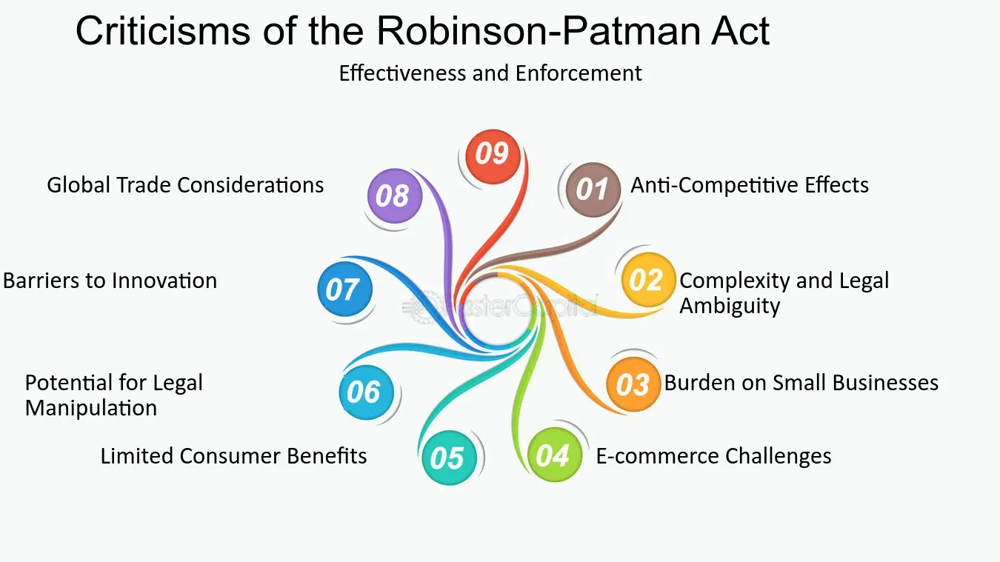

## Table of Contents

## What is the Robinson-Patman Act?

The Robinson-Patman Act is a law in the United States that was passed in 1936. It aims to protect small businesses and promote fair competition by preventing big companies from using unfair pricing strategies. The act makes it illegal for companies to give different prices to different buyers if it hurts competition. This means a company can't sell the same product to one store at a lower price than to another store just because they want to hurt the second store's business.

The law also stops companies from giving special deals or discounts to some buyers but not others. For example, if a company gives a big discount to a large chain store but not to a small local store, that could be against the Robinson-Patman Act. The goal is to make sure all buyers have a fair chance to compete. However, enforcing this law can be tricky, and there are many rules and exceptions to consider. Overall, the Robinson-Patman Act tries to keep the market fair for everyone.

## When was the Robinson-Patman Act enacted?

The Robinson-Patman Act was enacted on June 19, 1936. This law was created to help small businesses by making sure big companies couldn't use unfair pricing to hurt them.

The act stops companies from charging different prices to different buyers if it harms competition. It also prevents companies from giving special deals to some buyers but not others. This helps keep the market fair for everyone.

## What are the main provisions of the Robinson-Patman Act?

The Robinson-Patman Act has rules to make sure big companies treat all buyers fairly. One main rule is that companies can't charge different prices to different buyers for the same product if it hurts competition. For example, a company can't sell a product to one store for $10 and to another store for $15 just to hurt the second store's business. This rule helps small stores compete with bigger ones by making sure they all pay the same price for products.

Another important rule is that companies can't give special deals or discounts to some buyers but not others. If a company gives a big discount to a large chain store, it has to offer the same discount to a small local store too. This stops big companies from using discounts to favor certain buyers and hurt others. The goal is to keep the market fair for everyone, but there are many details and exceptions to these rules that can make them hard to enforce.

## How does the Robinson-Patman Act aim to protect small businesses?

The Robinson-Patman Act helps small businesses by making sure big companies can't use unfair pricing to hurt them. The law says that companies can't charge different prices to different buyers for the same product if it harms competition. This means a big company can't sell something to a small store at a higher price than to a big chain store just to make the small store struggle. By keeping prices the same for everyone, small businesses have a better chance to compete fairly.

The act also stops companies from giving special deals or discounts to some buyers but not others. If a company gives a big discount to a large store, it has to offer the same discount to a small store too. This rule prevents big companies from using discounts to favor certain buyers and hurt others. By making sure all buyers get the same treatment, the Robinson-Patman Act helps keep the market fair for small businesses.

## What types of price discrimination does the Robinson-Patman Act address?

The Robinson-Patman Act focuses on two main types of price discrimination. The first type is when a company charges different prices to different buyers for the same product. This is not allowed if it hurts competition. For example, if a big company sells a product to one store for $10 and to another store for $15 just to make the second store struggle, that's against the law. The act helps keep prices fair for everyone, so small businesses can compete better.

The second type of price discrimination the act addresses is when companies give special deals or discounts to some buyers but not others. If a company gives a big discount to a large chain store, it has to offer the same discount to a small local store too. This rule stops big companies from using discounts to favor certain buyers and hurt others. By making sure all buyers get the same treatment, the Robinson-Patman Act helps keep the market fair for small businesses.

## Can you explain the concept of 'meeting competition' in the context of the Robinson-Patman Act?

The concept of 'meeting competition' is an important part of the Robinson-Patman Act. It allows a company to lower its prices to match what another company is offering, even if it means giving different prices to different buyers. This is okay as long as the company is only doing it to keep up with the competition and not to hurt other businesses. For example, if one store is selling a product for $10 and another store is selling the same product for $8, the first store can lower its price to $8 to match the second store. This helps keep things fair and stops companies from losing customers just because someone else is offering a lower price.

However, the 'meeting competition' defense has to be used carefully. The company has to show that it really is just trying to match what another company is doing, and not using the lower price to harm other buyers. If a company can prove it's only matching a competitor's price, then it won't be breaking the Robinson-Patman Act. This rule helps businesses stay competitive without unfairly hurting others, but it can be tricky to use correctly because it needs to be done in a way that keeps the market fair for everyone.

## What are the potential penalties for violating the Robinson-Patman Act?

Violating the Robinson-Patman Act can lead to serious penalties. If a company breaks the rules, it might have to pay a lot of money as a fine. The fine can be up to three times the amount of money the company made from the unfair pricing. This is called treble damages. The company might also have to pay for the legal costs of the people who took them to court.

Besides fines, the company could face other punishments. The government might stop the company from doing business in certain ways until they follow the law. This is called an injunction. Sometimes, the people who were hurt by the unfair pricing can also sue the company. This can lead to more fines and legal costs for the company. Breaking the Robinson-Patman Act can be very costly and can harm a company's reputation.

## How has the enforcement of the Robinson-Patman Act evolved over time?

The enforcement of the Robinson-Patman Act has changed a lot over the years. When it was first passed in 1936, the government was very strict about making sure companies followed the rules. They wanted to protect small businesses and keep the market fair. But as time went on, the focus of antitrust laws shifted more toward protecting consumers and promoting competition, rather than just protecting small businesses. This meant that the Robinson-Patman Act was enforced less often, and it became harder for small businesses to use the law to fight against big companies.

Today, the Robinson-Patman Act is not enforced as much as it used to be. The Federal Trade Commission (FTC) and the Department of Justice (DOJ) have other priorities and usually focus on bigger antitrust issues. However, the law is still on the books, and it can still be used in court. Some big cases have been won using the Robinson-Patman Act, but it's not as common as before. This change shows how the goals of antitrust laws have evolved, with more emphasis now on consumer welfare and overall market competition.

## What are some common criticisms of the Robinson-Patman Act?

Some people think the Robinson-Patman Act is not a good law because it can stop companies from giving discounts to big buyers. They say this can make prices higher for everyone. If a big store can't get a lower price, they might have to charge more to their customers. This can make shopping more expensive for people. Critics also say the law is hard to enforce and can be used in ways that hurt competition instead of helping it.

Another criticism is that the Robinson-Patman Act can protect businesses that are not doing well just because they are small. Some people think this is not fair. They believe that if a small business can't compete, it should not be protected by the law. Instead, they say the market should decide which businesses succeed. Critics also argue that the law can make it harder for companies to offer deals and discounts, which can be good for customers.

## How does the Robinson-Patman Act impact modern e-commerce?

The Robinson-Patman Act can affect modern e-commerce because it stops companies from giving different prices to different buyers. In the world of online shopping, big companies often give special deals to big buyers like Amazon. The act says this is not allowed if it hurts smaller online stores. So, if a company gives a big discount to Amazon but not to a small online store, that could be against the law. This can make it harder for big companies to offer special deals online, which might change how they do business.

Even though the Robinson-Patman Act is still around, it is not used as much as before. This means big e-commerce companies can sometimes get away with giving different prices to different buyers. But if someone thinks a company is breaking the law, they can still take them to court. This can be tricky for small online stores because they might not have the money or resources to fight big companies in court. So, while the law is meant to help small businesses, it can be hard for them to use it in the fast-changing world of e-commerce.

## What are the arguments for and against repealing the Robinson-Patman Act?

Some people want to get rid of the Robinson-Patman Act because they think it stops companies from giving discounts to big buyers. They say this can make prices higher for everyone. If a big store can't get a lower price, they might have to charge more to their customers. This can make shopping more expensive. Critics also say the law is hard to enforce and can be used in ways that hurt competition instead of helping it. They believe that if a small business can't compete, it should not be protected by the law. Instead, they say the market should decide which businesses succeed.

On the other hand, some people want to keep the Robinson-Patman Act because they think it helps small businesses. They say the law stops big companies from using unfair pricing to hurt small stores. This helps keep the market fair for everyone. Supporters of the act believe it's important to protect small businesses because they are a big part of the economy. They argue that without the law, big companies could use their power to push small businesses out of the market, which would be bad for competition and consumers.

## How do courts interpret the Robinson-Patman Act in contemporary legal cases?

In today's court cases, judges look at the Robinson-Patman Act carefully to see if companies are treating all buyers fairly. They check if a company is giving different prices to different buyers and if this hurts competition. Courts want to make sure that big companies aren't using unfair pricing to hurt small businesses. They also look at whether the company has a good reason for the different prices, like matching a competitor's price. If a company can show it's just trying to stay competitive, the court might not say it's breaking the law.

However, courts often find it hard to enforce the Robinson-Patman Act because it can be tricky to prove that different prices are hurting competition. They have to look at a lot of details and understand the market well. Sometimes, courts are more focused on other antitrust laws that protect consumers and overall competition. This means the Robinson-Patman Act is not used as much as before, but it can still be important in cases where small businesses feel they are being treated unfairly.

## What is Price Discrimination Explained?

Price discrimination occurs when a seller offers the same product at different prices to different buyers. This practice can be classified as either legal or illegal, largely depending on its impact on market competition. In general, price discrimination aims to maximize a seller's profit by extracting the maximum willingness to pay from different consumer segments. However, when such practices threaten competitive market dynamics, they may attract scrutiny under antitrust laws such as the Robinson-Patman Act.

Legal instances of price discrimination are typically justified by several factors, including variations in cost, fluctuations in demand, or the necessity to meet competition. For example, if a seller lowers prices for high-[volume](/wiki/volume-trading-strategy) purchasers due to reduced marginal costs, this form of price discrimination may be legally defensible. Mathematically, if $C(q)$ represents the cost function for quantity produced, and larger purchases result in lower average costs, price variations can be justified by:

$$
P_1 = C'(q_1) \times (1 + \text{Margin}_1)
$$
$$
P_2 = C'(q_2) \times (1 + \text{Margin}_2)
$$

where $P_1$ and $P_2$ represent different prices for quantities $q_1$ and $q_2$, reflecting differences in cost $C'(q)$ and respective margins.

The Robinson-Patman Act expressly targets price discrimination practices that could harm competition, focusing on protecting small businesses from the competitive disadvantages that might arise when larger buyers receive more favorable pricing. Under the Act, price discrimination is considered illegal if it diminishes competition among buyers or reduces consumer choice without a justifiable business reason, like a difference in cost. The evaluation typically involves examining whether price differences have a direct and substantial impact on competition.

The complexity of proving unlawful price discrimination necessitates comprehensive evidence, including intent and market impact analysis. Economic assessments may be conducted to determine whether a price differential is merely an outcome of dynamic market forces or a strategic move to undercut competition. Thus, while price discrimination is a common business tactic, its legality hinges on its consequences for market competition and the rationale behind its implementation.

## References & Further Reading

[1]: Pitofsky, R. (1995). ["Challenges Of The Antitrust Exceptions And Immunities - Journal."](https://www.jstor.org/stable/40843561) Federal Trade Commission.

[2]: Areeda, P., & Hovenkamp, H. (2011). "Antitrust Law: An Analysis of Antitrust Principles and Their Application." Wolters Kluwer.

[3]: Blair, R. D., & Kaserman, D. L. (1985). "Antitrust Economics." Richard D. Irwin.

[4]: United States Federal Trade Commission. ["Guide to Antitrust Laws."](https://www.ftc.gov/advice-guidance/competition-guidance/guide-antitrust-laws) Federal Trade Commission.

[5]: Brandenburger, A. M., & Nalebuff, B. J. (1996). "Co-opetition." Currency Doubleday.

[6]: Scherer, F. M. (1980). "Industrial Market Structure and Economic Performance." Houghton Mifflin. 

[7]: Einav, L., & Levin, J. (2010). ["Empirical Industrial Organization: A Progress Report."](https://www.aeaweb.org/articles?id=10.1257/jep.24.2.145) Journal of Economic Perspectives, 24(2), 145-162.

[8]: Harris, L. (2003). "Trading and Exchanges: Market Microstructure for Practitioners." Oxford University Press.

[9]: Lo, A. W. (2010). "Hedge Funds: An Analytic Perspective." Princeton University Press.

[10]: Securities and Exchange Commission. ["Algorithmic Trading: Overview, Regulations, and Risks."](https://www.investopedia.com/the-sec-s-new-rules-target-trading-apps-that-use-predictive-algorithms-7565878) United States Securities and Exchange Commission.