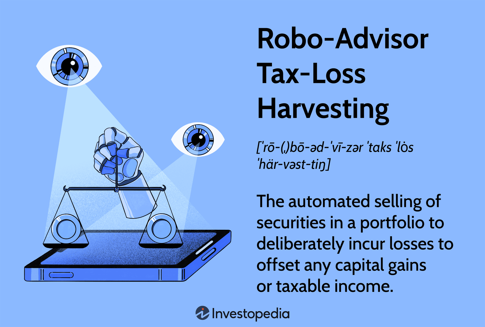

In the rapidly evolving world of finance, technology is significantly influencing investment strategies. The advent of robo-advisors, tax-loss harvesting, and algorithmic trading is fundamentally reshaping how investors manage their portfolios. This article aims to explore these innovative tools and strategies, providing a comprehensive understanding of their impact on investment management.

Robo-advisors utilize advanced algorithms to deliver automated investment management services, making financial advice accessible and affordable with minimal human intervention. This has democratized investing by lowering barriers such as high advisor fees and complex investment processes, allowing individuals of varying experience levels to participate effectively in the market.

On the other hand, tax-loss harvesting serves as a strategic tool to enhance tax efficiency by offsetting capital gains through the sale of securities at a loss. By improving after-tax returns, this tactic plays a crucial role in optimizing financial outcomes, especially in volatile markets. Furthermore, some robo-advisors have integrated automated tax-loss harvesting capabilities to maximize investors' tax efficiency seamlessly.

Algorithmic trading, characterized by the use of computer algorithms to execute trades at optimal speed and price, removes the emotional aspect from trading decisions. This form of trading ensures precision and speed, crucial for taking advantage of brief market opportunities while reducing transaction costs. Algorithmic trading is not only beneficial for institutions but also increasingly accessible to individual investors seeking to enhance portfolio performance.

Understanding how these technologies work, their benefits, and the ways in which investors can leverage them is essential for optimizing investment strategies. Whether seasoned or novice, investors can benefit from these technological advancements, leading to more informed and effective financial decision-making. By embracing these technologies, investors can enhance their ability to navigate the complexities of modern financial markets.

## Table of Contents

## Robo-Advisors: Revolutionizing Investment Advice

Robo-advisors have emerged as transformative tools in the field of investment management. These sophisticated platforms harness algorithms to deliver automated services, making them a cost-effective alternative to traditional financial advisors. By leveraging modern technology, robo-advisors offer personalized financial advice with minimal human intervention, thus democratizing the process of investing.

At their core, robo-advisors utilize algorithms that analyze an investor's financial situation, goals, risk tolerance, and time horizon. Based on this analysis, the algorithms allocate assets across diversified portfolios that align with the investor's unique profile. The primary components of these algorithms include financial modeling, data analytics, and predictive analytics. For example, a typical robo-advisor may employ the Modern Portfolio Theory (MPT) to optimize the risk-return trade-off.

**Key Features and Top Platforms**

Robo-advisors typically come with features such as automatic rebalancing, tax-loss harvesting, and low account minimums. Automatic rebalancing ensures that portfolios stay aligned with the investor's risk profile by adjusting the asset allocation as market conditions change. Tax-loss harvesting, available on many platforms, involves the strategic selling of securities to realize losses and offset capital gains taxes.

Popular platforms in the robo-advisory space include Betterment, Wealthfront, and Vanguard Personal Advisor Services. Each of these offers a range of features and pricing structures tailored to different types of investors. For instance, Betterment is known for its user-friendly interface and goal-based planning tools, while Wealthfront offers a comprehensive suite of services including financial planning and lines of credit.

**Advantages for Investors**

Robo-advisors present several advantages that make them appealing, especially to new investors or those seeking a passive investment strategy. One significant advantage is cost. Traditional financial advisors typically charge around 1% of assets under management, whereas robo-advisors often charge between 0.25% and 0.5%. This fee reduction can translate to significant savings over the long-term.

Another advantage is access to diversified portfolios. By investing in a mix of asset classes like equities, bonds, and international markets, robo-advisors help in mitigating risk while aiming for consistent returns. Furthermore, the ease of use associated with robo-advisors simplifies investment decisions, allowing users to set up accounts and begin investing with minimal effort.

Lastly, robo-advisors cater well to hands-off investors. By automating portfolio management and offering features like auto-rebalancing, investors can achieve portfolio growth without the need for constant monitoring. This provides peace of mind to those who may not have the time, expertise, or interest to manage investments actively.

In summary, robo-advisors are redefining the landscape of investment advice by combining technological efficiency with affordability and convenience. They make investing accessible to a broader audience, offering tailored advice and portfolio management that were once reserved for high-net-worth individuals. As technology continues to advance, the capabilities and reach of robo-advisors are expected to expand, further revolutionizing how individuals manage their investments.

## Tax-Loss Harvesting: A Strategy for Tax Efficiency

Tax-loss harvesting is a strategic financial practice aimed at enhancing tax efficiency by selling securities that have experienced a loss. This process allows investors to offset realized capital gains, thereby reducing their overall tax liability. By carefully selecting which assets to sell, investors can effectively decrease the taxes owed on gains from more successful investments.

The primary benefit of tax-loss harvesting lies in improving an investor's after-tax returns. For instance, if an investor has capital gains of $10,000 from certain investments but also has unrealized losses of $3,000 in other positions, they can choose to sell the loss-incurring securities. This action would reduce their taxable capital gains to $7,000. Given the progressive nature of taxes on capital gains, this reduction can lead to significant tax savings.

The mechanics of tax-loss harvesting are relatively straightforward but require strategic consideration. Investors must ensure that the sale of loss-incurring securities aligns with the "wash sale rule," as defined by the U.S. Internal Revenue Service (IRS). This rule prohibits claiming a tax deduction on a security sold at a loss if a "substantially identical" one is repurchased within 30 days before or after the sale date. This necessitates identifying replacement securities that do not violate this rule while maintaining the desired asset allocation and risk exposure.

Tax-loss harvesting can be effectively applied in varying market conditions. During market downturns, the strategy becomes particularly advantageous as more opportunities to realize losses arise. Conversely, in bullish markets, investors may find fewer opportunities but should remain vigilant in identifying any underperforming assets that can be cycled out.

While the advantages of tax-loss harvesting are clear, investors must be aware of potential pitfalls. Timing the market to capture losses demands careful planning and can lead to misjudgments without thorough analysis. Additionally, the complexity of maintaining the tax lot (specific shares or units identified as sold) accounting may necessitate professional advice or sophisticated software solutions.

Best practices for tax-loss harvesting include regular portfolio reviews to identify loss-harvesting candidates, understanding tax implications, and aligning strategies with overall financial goals. It is also advisable to integrate loss-harvesting plans within a broader tax strategy, working closely with tax advisors to maximize gains.

In recent years, robo-advisors have begun to incorporate tax-loss harvesting as part of their automated investment strategies, significantly enhancing investors' tax efficiencies. These platforms are equipped to monitor portfolios continuously and execute tax-loss harvesting without manual intervention. By doing so, they offer scalable solutions that not only streamline the process but also optimize after-tax returns. Popular robo-advisors such as Betterment and Wealthfront have made tax-loss harvesting a key feature, providing both novice and experienced investors with tools to enhance their portfolio's performance while maintaining tax efficiency.

Overall, tax-loss harvesting represents a valuable mechanism within the broader spectrum of investment strategies. By understanding its mechanics, potential pitfalls, and best practices, investors, alongside leveraging technology-driven platforms, can improve their portfolio's financial outcomes significantly.

## Algorithmic Trading: Speed and Precision in Execution

Algorithmic trading, a method that employs computer algorithms to execute trading orders efficiently and at optimal prices, has become a significant force in modern financial markets. By automating decision-making processes, [algorithmic trading](/wiki/algorithmic-trading) reduces human emotion's impact on trading behavior, allowing for more precise and timely actions.

Algorithmic trading systems function through a series of pre-defined rules and conditions, informed by complex mathematical models and quantitative analyses. These algorithms identify trading opportunities based on criteria such as timing, price, quantity, or any other mathematical model. The application of these algorithms ranges widely, from executing single orders to managing the entire trading strategy.

One prevalent form of algorithmic trading is high-frequency trading ([HFT](/wiki/high-frequency-trading-strategies)), which executes a large number of orders at incredibly fast speeds, often in fractions of a second. HFT takes advantage of small price discrepancies that may exist for only a brief moment. Other forms include statistical [arbitrage](/wiki/arbitrage), which identifies pricing inefficiencies across related financial products, and market-making, where traders provide [liquidity](/wiki/liquidity-risk-premium) to the market by consistently buying and selling financial instruments.

Technological advancements are central to the growth and adoption of algorithmic trading. The development of powerful computing systems, low-latency trading networks, and sophisticated data analysis tools has propelled the capabilities of algorithmic trading systems. Machine learning and [artificial intelligence](/wiki/ai-artificial-intelligence) further enhance these systems by allowing them to adapt to new data, identify novel patterns, and refine strategies in real-time.

The advantages of algorithmic trading are manifold. It significantly improves market liquidity by facilitating continuous trading and providing tight bid-ask spreads. Additionally, it offers enhanced risk management through automated stop-loss orders and dynamic asset rebalancing. Transaction costs are also reduced as algorithms optimize the execution of orders, minimizing market impact and avoiding price slippage.

Despite its benefits, algorithmic trading entails certain risks and challenges. Market [volatility](/wiki/volatility-trading-strategies) and flash crashes, where rapid algorithmic trades can lead to monumental price swings, are notable concerns. Furthermore, the reliance on technology can expose systems to technical failures and cyber threats. Regulatory scrutiny is also heightened as authorities seek to prevent market manipulation and ensure fair trading practices.

Both institutions and individual investors can leverage algorithmic trading to improve portfolio performance. Institutions often deploy custom algorithms to execute large volumes of trades efficiently, capitalizing on advanced market insights. Individual investors, on the other hand, can access algorithmic trading through brokerage platforms that offer automated trading bots and custom strategy development tools.

In conclusion, algorithmic trading represents a pivotal advancement in the execution of trades, markedly enhancing the speed and precision of transactions. As technology continues to evolve, its role in financial markets will likely expand, presenting new opportunities and challenges for traders and investors alike.

## Integrating Technology into Investment Strategies

Integrating technology into investment strategies through robo-advisors, tax-loss harvesting, and algorithmic trading can significantly enhance an investor's portfolio management capabilities. Each technology, on its own, offers distinct benefits. When combined, they can lead to comprehensive solutions that tailor investment strategies to achieve various financial goals.

Robo-advisors provide an automated, low-cost platform for portfolio management. These platforms use algorithms to create diversified investment portfolios based on an individual’s risk tolerance and investment goals. By incorporating tax-loss harvesting, robo-advisors actively work to minimize tax liabilities, which can significantly enhance after-tax returns. For instance, if a portfolio includes a stock that has decreased in value, its sale can be used to offset gains elsewhere in the portfolio, enhancing tax efficiency.

Algorithmic trading offers precision and speed in executing trades, crucial for capturing value in rapidly moving markets. Algorithms can identify trends and execute trades without the emotional bias that often affects human traders. By integrating algorithmic trading with robo-advisors, investors can automate trade executions based on predefined criteria, ensuring that portfolios are rebalanced efficiently and swiftly, maximizing market opportunities while maintaining the desired asset allocation.

The synergy between these technologies can lead to better portfolio diversification, reduced risk, and maximized returns. For example, an investor could use a robo-advisor for strategic asset allocation, incorporating algorithmic trading to execute tactical trades in response to market conditions, while continually optimizing the portfolio’s tax position through tax-loss harvesting.

Staying informed about technological advancements and regulatory considerations is essential for investors. The fintech landscape is dynamic, with continuous improvements and new tools emerging. Understanding the regulatory environment, such as data privacy laws and trading regulations, ensures that investment strategies remain compliant and effective.

A tech-driven approach to investing allows investors to address specific financial needs and objectives efficiently. By leveraging these tools, investors can not only streamline their investment processes but also gain a competitive edge in achieving their financial goals. Embracing technology in investments is not just about efficiency; it is a strategic necessity in today's fast-paced financial world.

## The Future of Investment Strategies: Embracing Innovation

As technology relentlessly advances, investment strategies continues to undergo substantial transformation. This evolution is marked by significant enhancements in key areas such as robo-advisors, tax-loss harvesting, and algorithmic trading. Each of these strategies has witnessed profound technological advancements, forecasting future trajectories in investment management.

Robo-advisors, initially introduced as basic portfolio management tools, are evolving with the integration of artificial intelligence (AI) and [machine learning](/wiki/machine-learning) (ML) technologies. These advancements enable robo-advisors to provide even more personalized and sophisticated investment advice. Machine learning algorithms can analyze vast amounts of data to predict market trends and optimize asset allocations more efficiently. As AI models become more sophisticated, robo-advisors are expected to offer a level of customization and adaptability traditionally associated with human financial advisors, but at a fraction of the cost.

Tax-loss harvesting, a strategy traditionally employed by savvy investors to minimize tax liabilities, is also witnessing a paradigm shift through automation. Advancements in software platforms now allow even retail investors to automatically implement tax-loss harvesting strategies. Future developments in blockchain technology could further streamline this process by providing immutable transaction records, thus enhancing transparency and accuracy in tax reporting.

Algorithmic trading stands at the forefront of embracing technological innovation, harnessing the power of high-frequency trading and big data analytics. The development and implementation of quantum computing have the potential to revolutionize algorithmic trading strategies by exponentially increasing computational speeds. This could allow for the execution of more complex trading algorithms in real-time, effectively enhancing market liquidity and minimizing price slippage.

For investors aiming to stay adaptive and informed in this rapidly changing technological landscape, it is crucial to remain abreast of these emerging innovations. Engaging with educational resources, participating in financial technology conferences, and leveraging advanced investment platforms can all be beneficial strategies for investors. Embracing these technological tools not only aids in optimizing investment strategies but also empowers investors to make informed, data-driven decisions.

In conclusion, the inexorable advancement of technology in investment strategies underscores the importance of embracing innovation to maintain a competitive edge. As new technologies emerge, enhancing the capabilities of robo-advisors, tax-loss harvesting, and algorithmic trading, investors who remain proactive and adaptable will be well-positioned to capitalize on these transformative changes in the financial landscape.

## References & Further Reading

[1]: Piketty, T. (2014). ["Capital in the Twenty-First Century"](https://www.jstor.org/stable/j.ctt6wpqbc). Harvard University Press.

[2]: Malkiel, B. G. (2019). ["A Random Walk Down Wall Street: The Time-Tested Strategy for Successful Investing"](https://www.amazon.com/Random-Walk-Down-Wall-Street/dp/1324002182). W. W. Norton & Company.

[3]: Lopez de Prado, M. (2018). ["Advances in Financial Machine Learning"](https://www.amazon.com/Advances-Financial-Machine-Learning-Marcos/dp/1119482089). John Wiley & Sons.

[4]: Markowitz, H. (1952). ["Portfolio Selection."](https://onlinelibrary.wiley.com/doi/abs/10.1111/j.1540-6261.1952.tb01525.x) The Journal of Finance, 7(1), 77-91.

[5]: McMillan, L. G. (2012). ["Options as a Strategic Investment"](https://archive.org/details/optionsasstrateg0000mcmi). Prentice Hall Press.

[6]: Jansen, S. (2020). ["Machine Learning for Algorithmic Trading"](https://github.com/stefan-jansen/machine-learning-for-trading). Packt Publishing.

[7]: Wealthfront. (n.d.). ["Tax-Loss Harvesting."](https://support.wealthfront.com/hc/en-us/articles/209348486-Tax-Loss-Harvesting) Wealthfront Corporation.

[8]: Chan, E. (2009). ["Quantitative Trading: How to Build Your Own Algorithmic Trading Business"](https://github.com/ftvision/quant_trading_echan_book). John Wiley & Sons.