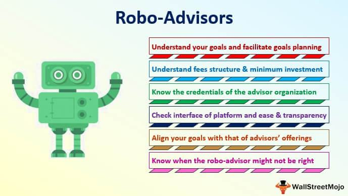

Automation is fundamentally transforming the financial services industry, significantly enhancing accessibility and affordability of investment guidance to a broader audience. Central to this transformation are robo-advisors and algorithmic trading platforms, which are reshaping wealth management and personal finance. These automated solutions are becoming increasingly popular due to their efficiency and ability to provide personalized investment strategies with minimal human intervention.

Robo-advisors have streamlined the process of financial planning by utilizing algorithms to offer recommendations based on individual investor profiles. These platforms gather data about a client's financial situation and aspirations through online questionnaires. They then leverage this information to create and manage a diversified portfolio, typically consisting of exchange-traded funds (ETFs) or mutual funds. The appeal of robo-advisors lies in their low fees and user-friendly interfaces, making them accessible to both novice investors seeking to enter the market and experienced investors looking for efficient portfolio management.



Algorithmic trading, on the other hand, employs sophisticated algorithms to make real-time trading decisions, optimizing trade execution according to pre-set criteria. High-frequency trading and the application of artificial intelligence (AI) in this domain enable the handling of substantial volumes of assets with precision and speed. Machine learning algorithms enhance these systems by adapting trading strategies based on new data, potentially improving investment outcomes.

The article aims to explore the emergence and functionality of these technologies, outlining their benefits in reducing costs, minimizing human error, and offering continuous portfolio management. It will also address potential limitations such as the absence of personalized advice in complex financial scenarios and the risks associated with algorithmic decision-making.

Investors are encouraged to understand the mechanics and potential of robo-advisors and algorithmic trading in order to make informed decisions about their integration into investment strategies. With the advent of these technologies, investment management is entering a new era, offering opportunities for growth and innovation in financial services.

## Table of Contents

## What Are Robo-Advisors?

Robo-advisors are digital platforms designed to deliver financial planning services through algorithms, minimizing the need for human intervention. These platforms fundamentally operate by collecting data about a client's financial situation and investment goals via online questionnaires. This data is then utilized to generate tailored investment advice and strategies.

The recommendation process involves clients being allocated into diversified portfolios, predominantly composed of Exchange-Traded Funds (ETFs) or mutual funds, which are managed by the robo-advisors. The automation involved in these platforms not only ensures that portfolio construction is aligned with modern portfolio theory but also allows for systematic rebalancing to optimize gains and manage risks effectively.

One of the main advantages of robo-advisors is their cost-efficiency. Compared to conventional financial advisory services, robo-advisors charge significantly lower fees, making them an attractive option for both new investors and those with more experience. Their user-friendly interfaces and the accessibility of services online democratize investment management, facilitating wider participation in financial markets.

Robo-advisors also come with the benefit of transparency, allowing investors to track their portfolios’ performance in real-time. This feature, coupled with the low minimum investment requirements typically associated with robo-advisory services, ensures that a broad audience can access sophisticated financial management previously reserved for those with substantial assets.

## The Evolution of Robo-Advisors

The evolution of robo-advisors marks a significant development in the financial technology landscape. The inception of robo-advisors began in 2008 with the launch of platforms such as Betterment and Wealthfront. Initially, these platforms were designed to provide straightforward asset management services by offering diversified investment opportunities through portfolios of exchange-traded funds (ETFs) and mutual funds. These early robo-advisors focused on simplifying the investment process for users and offered cost-effective solutions compared to traditional financial advisors.

As technology progressed, the capabilities of robo-advisors expanded substantially, integrating more sophisticated financial services. Key developments have included the incorporation of tax-loss harvesting, which helps minimize an investor’s tax liabilities by offsetting gains with losses, and comprehensive retirement planning tools that assist users in achieving long-term financial goals. These enhancements have been made possible through advancements in data analytics and [artificial intelligence](/wiki/ai-artificial-intelligence), allowing robo-advisors to offer personalized and automated financial advice tailored to individual client needs.

The trajectory of robo-advisor adoption underscores their growing importance in the investment community. Today, these platforms are widely accepted and trusted by millions of investors globally, managing billions of dollars in assets. This widespread usage can be attributed to their low fee structures and user-friendly interfaces, which appeal to both novice investors and those seeking efficient portfolio management.

The scalability and efficiency of robo-advisors continue to attract both individuals and institutional investors, contributing to a democratization of investment opportunities. As the financial services industry increasingly embraces digital transformation, robo-advisors are positioned to further enhance their capabilities, integrating more personalized services and aligning with emerging financial technologies to better serve the evolving needs of investors.

## Algorithmic Trading: The Role of AI

Algorithmic trading involves the use of pre-programmed instructions to execute trades automatically, optimizing the process in terms of speed, [volume](/wiki/volume-trading-strategy), and price. It is a method that leverages complex algorithms to analyze market conditions and execute orders at a pace and volume far beyond what human traders can achieve. A prominent feature of [algorithmic trading](/wiki/algorithmic-trading) is high-frequency trading ([HFT](/wiki/high-frequency-trading-strategies)), characterized by the rapid execution of thousands to millions of orders in fractions of a second. 

AI and [machine learning](/wiki/machine-learning) are essential components of algorithmic trading, providing the capacity to adapt and improve trading strategies with new data. Machine learning algorithms can identify patterns and trends that might not be immediately apparent to human analysts. For instance, supervised learning models such as linear regression and decision trees can predict future market movements by learning from historical financial data. 

Consider a basic implementation using Python, where machine learning could be used to make trading decisions:

```python
from sklearn.ensemble import RandomForestClassifier
import numpy as np

# Sample historical data: [feature1, feature2, ..., featureN, target]
# Features can be technical indicators like moving averages, volume, etc.
data = np.array([
    [1.1, 2.5, 3.2, 0],
    [1.3, 2.7, 3.5, 1],
    # ... more data ...
])

# Splitting features and target variables
X = data[:, :-1]  # Features
y = data[:, -1]   # Target (0 or 1 for sell or buy)

# Training the model
model = RandomForestClassifier()
model.fit(X, y)

# Making a prediction
new_data = np.array([[1.2, 2.6, 3.3]])
decision = model.predict(new_data)

# Output: decision to buy (1) or sell (0)
print("Decision:", "Buy" if decision [0] == 1 else "Sell")
```

In this example, the model is trained on historical market data to make buy or sell decisions based on new input data. The capacity for machines to process large volumes of data and detect non-linear relationships equips algorithmic trading systems with a substantial advantage over traditional human-based methods.

AI also enhances the capability for real-time data analysis and decision-making. Reinforcement learning, a branch of machine learning, empowers trading systems to develop dynamic strategies by interacting with the market environment. These algorithms continuously learn and adjust trading strategies to maximize portfolio returns or minimize risk.

Despite the efficacy of AI-driven algorithmic trading, it requires careful risk management and supervision. Algorithmic strategies are only as good as the data and assumptions they are based on, making it crucial to regularly update models and evaluate their performance in varying market conditions.

## Benefits of Automated Financial Solutions

Automated financial solutions, particularly robo-advisors and algorithmic trading platforms, offer several significant benefits that enhance modern investment management. One of the primary advantages is the substantial cost reduction in investment management. Traditional human advisory services often require significantly higher fees due to the personalized attention and human labor involved. In contrast, robo-advisors leverage technology-driven efficiencies to offer their services at notably lower fees. This cost reduction is mainly attributed to the automation of routine tasks and the ability to scale services to a broader audience without incurring proportional increases in labor costs.

Robo-advisors are particularly attractive due to their low barrier to entry. Many of these platforms have eliminated account minimums, thereby enabling a more inclusive approach to investment management. This accessibility is further complemented by their user-friendly interfaces, which simplify the process of managing investment portfolios for both novice and experienced investors. By utilizing intuitive dashboards and clear guidance, robo-advisors empower users to engage with their financial planning actively.

Continuous portfolio monitoring and rebalancing are hallmarks of automated investing platforms. Robo-advisors are designed to monitor the performance of investments continuously and adjust asset allocations as needed to maintain the desired risk-return profile. This proactive approach optimizes returns while mitigating potential risks, ensuring investments remain aligned with the investor's goals. The algorithmic nature of these platforms allows for sophisticated techniques such as tax-loss harvesting, which can further enhance after-tax returns.

Algorithmic trading further enhances the precision and efficiency of executing trades. By using complex algorithms, these systems can make split-second trading decisions based on predefined criteria, maximizing execution efficiency and minimizing market impact costs. Additionally, algorithmic trading platforms are equipped to handle large volumes of assets with precision and speed that are beyond the capabilities of human traders. This capability is especially beneficial in markets characterized by [high frequency](/wiki/high-frequency-trading) and fast-moving data, where human decision-making might lag.

In conclusion, the integration of automated financial solutions into investment management presents a range of benefits. Cost efficiency, accessibility, continuous optimization, and precision trading collectively represent significant advancements over traditional investment methods. These technologies not only democratize access to financial management but also enhance the effectiveness of investment strategies.

## Limitations and Considerations

Robo-advisors, while efficient and cost-effective, come with several limitations and considerations that investors must evaluate before relying wholly on such platforms. One significant drawback is the lack of personalized, human interaction. Unlike traditional financial advisors, robo-advisors might not fully grasp nuanced or complex financial needs, such as estate planning, tax optimization, or the intricacies of intergenerational wealth transfer. These aspects often require a level of customization and human insight that automated platforms may not provide.

In addition, the inherent reliance on algorithms presents unique challenges. Although algorithms can process vast amounts of data swiftly, they are not infallible. Investors should be aware of the risks associated with market exposure driven by algorithmic decisions, which might not always account for unusual market conditions or unexpected geopolitical events. Algorithmic biases can emerge if the system is trained on incomplete or biased data, potentially leading to suboptimal investment choices.

Furthermore, automated systems perform optimally when they have clear and specific investment goals to work towards. Ambiguity or lack of clarity in investment objectives can result in the misalignment of portfolio strategies. For instance, an investor might have a long-term goal of retirement savings, but if this is not explicitly defined within the parameters set for the robo-advisor, the system might adopt a more conservative or aggressive approach than desired, affecting the overall outcome.

In summary, while robo-advisors offer many advantages, potential users should carefully assess these limitations. Consideration of these factors, alongside the benefits, will aid investors in deciding whether the convenience and cost savings of robo-advisors align with their broader financial goals and personal investment strategies.

## The Future of Robo-Advisors and Algo Trading

The future of robo-advisors and algorithmic trading appears promising, fueled by ongoing technological advancements and a broadening user base. As the technology behind these platforms progresses, there is potential for more personalized service offerings that cater to individual investor preferences and financial goals. Customization could become more prevalent, enabling users to tailor investment strategies closely aligned with their risk tolerance and return expectations.

Moreover, integration with other financial technologies is poised to enhance the value proposition of robo-advisors and algorithmic trading systems. For example, combining robo-advisors with blockchain could offer transparent and immutable records of transactions, increasing trust and security in automated financial solutions. Similarly, the incorporation of biometrics could streamline user authentication processes, enhancing user experience and security.

Regulatory changes are also expected to play a crucial role. As the industry matures, regulatory frameworks may evolve to address emerging challenges and ensure fairness, transparency, and protection for investors. These regulations could require more robust risk management practices and greater operational oversight, potentially setting a higher standard for automated platforms.

Enhancements in artificial intelligence and machine learning promise to refine the predictive capabilities of robo-advisors and algorithmic trading. These advancements could allow for more sophisticated data analysis, better pattern recognition, and faster adaptation to market conditions. For instance, [deep learning](/wiki/deep-learning) models could improve forecasts of asset price movements or identify new investment opportunities. Developers might employ techniques like [reinforcement learning](/wiki/reinforcement-learning) to optimize trading strategies continually.

In summary, the ongoing evolution of robo-advisors and algorithmic trading is likely to bring about a more integrated, efficient, and intelligent landscape for automated financial advisory services. As these platforms become more sophisticated, their ability to offer detailed, personalized investment advice will increase, further democratizing access to financial management and potentially reshaping the investment industry.

## Conclusion

Automated financial advice and investment platforms are transforming the landscape of wealth management by making financial planning more accessible to individuals across varying socio-economic backgrounds. These technologies, including robo-advisors and algorithmic trading platforms, offer users the ability to engage in sophisticated investment strategies with relative ease and lower cost compared to traditional investment advisory services. However, even though the advantages of these tools are significant, investors must carefully evaluate their own financial goals, risk tolerance, and unique situations before embracing such technologies.

Robo-advisors and algo-trading are becoming integral components of the investment management ecosystem due to ongoing technological advancements. They enable not only diversification and strategic allocation of assets but also introduce new methodologies for real-time data analytics and decision-making processes. As artificial intelligence and machine learning technologies continue to evolve, the capabilities and precision of automated platforms are expected to improve further.

Staying informed about these technological trends and understanding the operational nuances is crucial for investors wanting to harness the full potential of automated financial solutions. By doing so, investors can make well-informed decisions that align with their financial aspirations, thereby optimizing returns while managing risks effectively. As automation continues to expand its footprint in finance, embracing these innovations with a clear understanding of personal investment needs will be key to maximizing benefits.

## References & Further Reading

[1]: ["Advances in Financial Machine Learning"](https://www.amazon.com/Advances-Financial-Machine-Learning-Marcos/dp/1119482089) by Marcos Lopez de Prado

[2]: Bergstra, J., Bardenet, R., Bengio, Y., & Kégl, B. (2011). ["Algorithms for Hyper-Parameter Optimization."](https://dl.acm.org/doi/10.5555/2986459.2986743) Advances in Neural Information Processing Systems 24.

[3]: ["Evidence-Based Technical Analysis: Applying the Scientific Method and Statistical Inference to Trading Signals"](https://www.amazon.com/Evidence-Based-Technical-Analysis-Scientific-Statistical/dp/0470008741) by David Aronson

[4]: ["Machine Learning for Algorithmic Trading"](https://github.com/stefan-jansen/machine-learning-for-trading) by Stefan Jansen

[5]: ["Quantitative Trading: How to Build Your Own Algorithmic Trading Business"](https://www.amazon.com/Quantitative-Trading-Build-Algorithmic-Business/dp/1119800064) by Ernest P. Chan