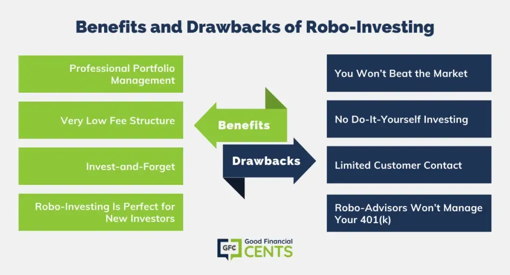

## Table of Contents

## What is a robo-advisor?

A robo-advisor is a type of automated financial service that uses computer algorithms to manage your investments. It takes the information you provide about your financial goals, how much risk you're willing to take, and other details, and then it creates and manages a personalized investment portfolio for you. This means you don't need to pick individual stocks or worry about when to buy or sell them; the robo-advisor does all that work for you.

Robo-advisors are popular because they are usually cheaper than traditional financial advisors. They charge lower fees because they use technology instead of human advisors. This makes them a good option for people who want to invest but don't have a lot of money to start with or can't afford to pay high fees. However, robo-advisors might not be the best choice for everyone, especially if you have very specific or complex financial needs that require a human touch.

## How does a robo-advisor work?

A robo-advisor works by using a computer program to manage your money. When you sign up, you answer some questions about your money goals, how much risk you want to take, and other things about your life. The robo-advisor takes this information and creates a special plan for you. This plan is called a portfolio, and it's made up of different investments like stocks and bonds. The robo-advisor picks these investments based on what you told it, trying to match your goals and comfort with risk.

Once your portfolio is set up, the robo-advisor keeps an eye on it all the time. If the value of your investments goes up or down a lot, the robo-advisor might make changes to keep your portfolio balanced. It might buy or sell things to make sure your investments still fit with your goals. All of this happens automatically, so you don't have to do anything. You can check on your investments anytime you want, but the robo-advisor does the work for you.

## What are the typical fees associated with using a robo-advisor?

The fees for using a robo-advisor are usually pretty low, which is one of the reasons people like them. Most robo-advisors charge a percentage of the money you have invested with them. This fee is often between 0.25% and 0.50% per year. So, if you have $10,000 invested, you might pay between $25 and $50 a year.

Besides the management fee, there can be other costs. For example, the investments that the robo-advisor picks for you, like exchange-traded funds (ETFs), might have their own fees. These are called expense ratios, and they are usually very small, often less than 0.10% per year. So, if you're invested in ETFs with an expense ratio of 0.05%, that's another $5 per year for every $10,000 you have invested. Adding up all these fees, the total cost of using a robo-advisor is still much lower than what you might pay for a human financial advisor.

## What are the main benefits of using a robo-advisor?

One of the biggest benefits of using a robo-advisor is that it's really easy and cheap. You don't need to know a lot about investing to use one. Just answer a few questions, and the robo-advisor does the rest. It picks your investments and keeps an eye on them, so you don't have to. Plus, the fees are a lot lower than what you'd pay for a human advisor. This means you can start investing without needing a lot of money.

Another benefit is that robo-advisors help you stay on track with your goals. They automatically adjust your investments to match what you want, whether it's saving for a house or planning for retirement. This can take a lot of the stress out of investing. Also, because everything is done online, you can check on your investments anytime and from anywhere, which makes managing your money more convenient.

## Can robo-advisors outperform human financial advisors?

It's hard to say for sure if robo-advisors can always do better than human financial advisors. It depends on a lot of things, like what you want to achieve with your money and how much risk you're okay with. Robo-advisors are good at following a set plan and making sure your investments match your goals. They use computer programs that can look at a lot of information quickly and make choices based on that. But they can't think outside the box or understand your personal situation in the same way a human can.

Human financial advisors, on the other hand, can give you advice that's more tailored to your life. They can listen to your worries and change your investment plan as your life changes. They might also be able to find special investment chances that a robo-advisor might miss. But human advisors usually cost more, and they might not always do better than robo-advisors. In the end, whether a robo-advisor or a human advisor is better for you depends on what you need and what you're comfortable with.

## What are the potential drawbacks of using a robo-advisor?

One potential drawback of using a robo-advisor is that it might not be able to handle your specific needs as well as a human advisor can. Robo-advisors follow a set plan and use computer programs to make choices. But if you have a complicated financial situation or if your goals change a lot, a robo-advisor might not be able to adjust in the best way. They can't talk to you about your worries or give you advice that's just right for your life.

Another issue is that robo-advisors might not be able to take advantage of special investment chances that a human advisor could find. Human advisors can look at things like new business ideas or changes in the market that might not show up in the computer programs that robo-advisors use. Also, if something goes wrong with the technology, like a computer problem, it could affect your investments, and you might not be able to get help right away.

## How do robo-advisors handle tax optimization?

Robo-advisors help with tax optimization by using a strategy called tax-loss harvesting. This means they look for chances to sell investments that have lost value. By selling these, they can use the losses to lower the taxes you owe on other gains or income. It's like finding a silver lining in a bad situation. Robo-advisors do this automatically, so you don't have to think about it.

They also pick investments that are good for tax savings. For example, they might choose ETFs that are known for being tax-efficient. These are investments that don't create a lot of taxable events, which means you won't have to pay as much in taxes. By doing this, robo-advisors try to keep more money in your pocket and less going to the tax office.

## What level of customization can you expect from a robo-advisor?

When you use a robo-advisor, you can expect some level of customization, but it's not as detailed as what you might get from a human advisor. Robo-advisors start by asking you questions about your financial goals, how much risk you're okay with, and other details about your life. Based on your answers, they create a plan that's meant to fit your needs. This means they can adjust the mix of investments in your portfolio to be more or less risky, depending on what you want.

However, the customization with robo-advisors has limits. They work with set plans and computer programs, so they can't make changes that are very specific to your situation. If you have unusual financial goals or if your life changes a lot, a robo-advisor might not be able to adjust your investments in the best way. It's good for keeping things simple and following a general path, but it might not be the best choice if you need a lot of personal attention or if your financial situation is very complicated.

## How secure are robo-advisors in terms of data protection and privacy?

Robo-advisors take data protection and privacy very seriously. They use strong security measures to keep your information safe. This includes things like encryption, which is like putting your data in a secret code that only the robo-advisor can read. They also have firewalls and other technology to stop hackers from getting into their systems. Plus, they follow rules and laws about keeping your data private, like the ones set by the government.

However, no system is perfect, and there's always a small chance something could go wrong. If a robo-advisor has a big data breach, your personal information could be at risk. But most robo-advisors have plans in place to deal with these problems quickly. They also usually have insurance to help cover any losses if something bad happens. So while there's some risk, robo-advisors work hard to keep your data safe and private.

## What should you consider when choosing a robo-advisor?

When choosing a robo-advisor, it's important to think about the fees they charge. Most robo-advisors have low fees, but they can still add up over time. Look for a robo-advisor that has a fee that fits well with how much money you're investing. Also, consider the minimum amount of money you need to start investing with them. Some robo-advisors let you start with a small amount, while others need you to have more money before you can begin.

Another thing to think about is how well the robo-advisor can help you reach your financial goals. Different robo-advisors might offer different kinds of investments or ways to plan for your future. Make sure the robo-advisor you choose can make a plan that matches what you want to achieve. It's also a good idea to check if the robo-advisor has good customer service. If you have questions or need help, you'll want to know that someone is there to assist you.

Lastly, think about the security of the robo-advisor. Your personal information and money need to be safe, so look for a robo-advisor that uses strong security measures like encryption and has a good track record of keeping data private. Reading reviews from other users can also help you understand if the robo-advisor is reliable and easy to use. By considering these things, you can find a robo-advisor that's a good fit for you.

## How do robo-advisors adapt to changing market conditions?

Robo-advisors keep an eye on the market all the time. They use computer programs to watch how the stocks, bonds, and other things you're invested in are doing. If the market changes a lot, like if there's a big drop or a big rise, the robo-advisor might decide to make changes to your investments. It does this to make sure your money is still safe and working towards your goals. For example, if the market goes down, the robo-advisor might sell some things that have lost value and buy others that are doing better.

Even though robo-advisors can't think like humans, they use smart math to figure out the best moves. They look at a lot of information quickly and make choices based on what they see. This means they can adjust your investments faster than a person might be able to. But remember, they follow set rules and can't make choices that are very different from what they're programmed to do. So, while they're good at keeping your investments on track, they might not be able to take advantage of every single change in the market.

## What future developments can we expect in robo-advisory services?

In the future, robo-advisors are likely to get even better at what they do. They might use new technology like [artificial intelligence](/wiki/ai-artificial-intelligence) (AI) to make smarter choices about your investments. This could mean they can look at more information and understand it better, so they can make your money grow in ways that fit your goals even more closely. They might also start working with other kinds of financial services, like banking or insurance, to give you a complete plan for your money all in one place.

Another thing we might see is robo-advisors becoming more personal. Right now, they follow set plans, but in the future, they might be able to understand more about your life and what you need. This could mean they can give you advice that feels more like what you'd get from a human advisor. They might also use new ways to talk to you, like through voice commands or chatbots, making it easier and more fun to manage your money.

## References & Further Reading

[1]: Bergstra, J., Bardenet, R., Bengio, Y., & Kégl, B. (2011). ["Algorithms for Hyper-Parameter Optimization."](https://papers.nips.cc/paper/4443-algorithms-for-hyper-parameter-optimization) Advances in Neural Information Processing Systems 24.

[2]: ["Advances in Financial Machine Learning"](https://www.amazon.com/Advances-Financial-Machine-Learning-Marcos/dp/1119482089) by Marcos Lopez de Prado

[3]: ["Evidence-Based Technical Analysis: Applying the Scientific Method and Statistical Inference to Trading Signals"](https://www.amazon.com/Evidence-Based-Technical-Analysis-Scientific-Statistical/dp/0470008741) by David Aronson

[4]: ["Machine Learning for Algorithmic Trading"](https://github.com/stefan-jansen/machine-learning-for-trading) by Stefan Jansen

[5]: ["Quantitative Trading: How to Build Your Own Algorithmic Trading Business"](https://www.amazon.com/Quantitative-Trading-Build-Algorithmic-Business/dp/1119800064) by Ernest P. Chan