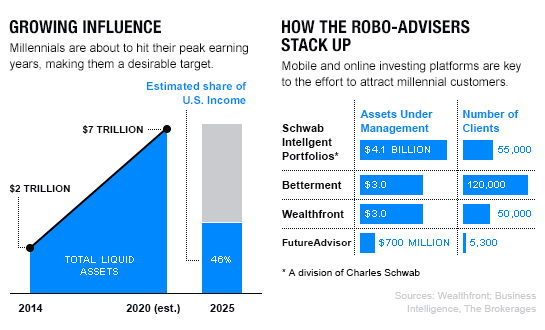

## Table of Contents

## What is a robo-advisor?

A robo-advisor is a type of online investment platform that uses computer algorithms to manage your money. It helps you invest your money without needing to talk to a human financial advisor. You just need to answer some questions about your money goals and how much risk you're okay with, and the robo-advisor will create an investment plan for you.

Robo-advisors are popular because they are usually cheaper than working with a human advisor. They can manage your investments for a small fee, often less than 1% of your money each year. They are also easy to use, as you can do everything online or with an app on your phone. This makes them a good choice for people who want to start investing but don't know much about it or don't want to spend a lot of time on it.

## How do robo-advisors work?

Robo-advisors work by using computer programs to manage your money. When you sign up, you'll answer some questions about your money goals, how long you want to invest for, and how much risk you're willing to take. Based on your answers, the robo-advisor creates a plan for you. This plan usually includes a mix of different investments like stocks and bonds, which are chosen to match your goals and risk level.

Once your plan is set up, the robo-advisor keeps an eye on your investments. It makes changes automatically to keep your money growing in the best way possible. For example, if the stock market goes up or down a lot, the robo-advisor might move your money around to keep things balanced. All of this happens without you needing to do anything, making it easy and hands-off for you.

## What are the benefits of using robo-advisors for investment?

One of the biggest benefits of using robo-advisors is that they are usually cheaper than working with a human financial advisor. Robo-advisors charge a small fee, often less than 1% of your money each year. This means you get to keep more of your money, which can grow over time. They also make investing easy because everything can be done online or through an app on your phone. You don't need to know a lot about investing to start, as the robo-advisor does all the work for you.

Another advantage is that robo-advisors are very convenient. They manage your investments automatically, so you don't need to spend time watching the stock market or making decisions about where to put your money. The robo-advisor keeps your investments balanced and makes changes when needed, all without you having to do anything. This makes it a good choice for people who want to invest but don't have a lot of time or knowledge about investing.

## Why might millennials be particularly interested in robo-advisors?

Millennials might be interested in robo-advisors because they are often comfortable with technology and like using apps and online tools. Robo-advisors are easy to use on a phone or computer, which fits well with how millennials live their lives. They can manage their money without needing to meet with a financial advisor in person, which saves time and is more convenient.

Another reason is that robo-advisors are usually cheaper than traditional financial advisors. Millennials might not have a lot of money to start investing, so paying less in fees is important. Robo-advisors let them start investing with smaller amounts of money and still get good advice, which can help them grow their savings over time.

## What are the typical fees associated with robo-advisors?

Robo-advisors usually charge a small fee for managing your money. This fee is often a percentage of the money you have invested with them. Most robo-advisors charge between 0.25% and 0.50% per year. So, if you have $10,000 invested, you might pay between $25 and $50 each year for their service.

Some robo-advisors might also charge extra fees for things like trading or account maintenance, but these are less common. It's important to check what fees a robo-advisor charges before you start using them, so you know exactly what you'll be paying. Overall, the fees for robo-advisors are usually much lower than what you would pay for a human financial advisor, which is one of the big reasons people like them.

## How do robo-advisors compare to traditional financial advisors?

Robo-advisors and traditional financial advisors both help you with your money, but they work in different ways. Robo-advisors use computer programs to manage your investments. They ask you some questions about your goals and how much risk you want to take, and then they make a plan for you. This plan is usually a mix of different investments like stocks and bonds. Robo-advisors are good because they are cheaper, often charging less than 1% of your money each year. They are also easy to use because you can do everything online or on your phone.

Traditional financial advisors, on the other hand, are real people you can talk to. They can give you advice that is more personal because they know you and your situation better. They might help you with more than just investing, like planning for retirement or buying a house. But, working with a traditional advisor can be more expensive. They usually charge between 1% and 2% of your money each year, and sometimes even more. So, while you get more personal help, it costs more money.

Choosing between a robo-advisor and a traditional financial advisor depends on what you need and how much you want to spend. If you want something easy and cheap, a robo-advisor might be the best choice. But if you want more personal help and are okay with paying more, a traditional advisor could be better for you.

## What types of investment portfolios do robo-advisors offer?

Robo-advisors offer different types of investment portfolios to match what you want and how much risk you're okay with. They usually have portfolios that are more about safety, with a lot of bonds, and others that are more about growth, with more stocks. Some robo-advisors also have special portfolios, like ones that focus on things like the environment or social good. They use a mix of different investments to spread out the risk and help your money grow.

When you start with a robo-advisor, you answer questions about your money goals and how long you want to invest. Based on your answers, the robo-advisor picks the right portfolio for you. They keep an eye on your investments and make changes to keep things balanced. This way, your money stays on track to meet your goals without you needing to do much work.

## How can millennials start investing with a robo-advisor?

Millennials can start investing with a robo-advisor by first [picking](/wiki/asset-class-picking) a robo-advisor that fits their needs. There are many robo-advisors out there, so it's good to look at what each one offers and how much they charge. Once they choose one, they need to sign up on the robo-advisor's website or app. They'll need to answer some questions about their money goals, how long they want to invest, and how much risk they're okay with. This helps the robo-advisor pick the right investment plan for them.

After signing up and answering the questions, the robo-advisor will create an investment portfolio. This portfolio will be a mix of different investments like stocks and bonds, chosen to match the millennial's goals and risk level. They can then add money to their account to start investing. The robo-advisor will manage the investments automatically, making changes when needed to keep things on track. This way, millennials can start investing easily and without needing to know a lot about the stock market.

## What are the risks involved in using robo-advisors for investment?

Using robo-advisors for investment comes with some risks. One big risk is that robo-advisors use computer programs to manage your money. These programs might not always make the best choices, especially if something unexpected happens in the stock market. Also, robo-advisors usually don't give you personal advice. They use the same plan for everyone who has similar goals and risk levels, so your plan might not be perfect for your specific situation.

Another risk is that robo-advisors invest your money in things like stocks and bonds, and these can go up and down in value. If the stock market goes down a lot, your investments could lose money. While robo-advisors try to balance your investments to lower the risk, there's still a chance you could lose money. It's important to know that all investing has risks, and robo-advisors are no different.

## How do robo-advisors personalize investment strategies for individual users?

Robo-advisors personalize investment strategies by asking users questions about their money goals, how long they want to invest, and how much risk they're okay with. Based on these answers, the robo-advisor creates a plan that fits the user's needs. For example, if someone wants to save for retirement in 30 years and is okay with a lot of risk, the robo-advisor might pick a portfolio with more stocks. If someone wants to save for a house in 5 years and wants less risk, the robo-advisor might pick a portfolio with more bonds.

Even though robo-advisors use computer programs, they still try to make things personal. They keep an eye on the user's investments and make changes to keep everything balanced. If the user's situation changes, like if they get a new job or have a baby, they can update their goals and risk level. The robo-advisor will then adjust the investment plan to match the new information. This way, the investment strategy stays personal and up-to-date with the user's life.

## What advanced features do some robo-advisors offer that might appeal to more experienced investors?

Some robo-advisors offer advanced features that can appeal to more experienced investors. One of these features is tax-loss harvesting, which helps reduce the taxes you pay on your investments. Robo-advisors can automatically sell investments that have lost value and replace them with similar ones, which can lower your tax bill. Another feature is the ability to invest in a wider range of assets, like real estate or commodities, which can help experienced investors spread out their risk and maybe earn more money.

These robo-advisors also let users have more control over their investments. They might offer tools to let you pick your own stocks or ETFs, or let you set up custom portfolios based on your own ideas. This can be good for investors who know a lot about the market and want to use their own strategies. Even with these advanced features, the robo-advisor still helps manage and balance the investments, making it easier for experienced investors to use their knowledge without spending a lot of time on it.

## How has the performance of robo-advisors been evaluated in academic studies and what are the findings?

Academic studies have looked at how well robo-advisors do their job. They often compare robo-advisors to other ways of investing, like doing it yourself or using a human advisor. The studies look at things like how much money the investments make, how much risk there is, and how much it costs to use a robo-advisor. Many studies have found that robo-advisors can be a good choice because they are usually cheaper than human advisors and still help people make money over time.

The findings from these studies show that robo-advisors often do a good job of managing money for people. They use computer programs to pick investments that match what people want and how much risk they are okay with. This helps keep things balanced and can lead to good results. But, robo-advisors are not perfect. They might not do as well when the stock market changes a lot, and they don't give personal advice like a human advisor would. Overall, the studies say that robo-advisors are a good option for people who want an easy and cheap way to invest.

## References & Further Reading

[1]: Markowitz, H. M. (1952). ["Portfolio Selection"](https://onlinelibrary.wiley.com/doi/abs/10.1111/j.1540-6261.1952.tb01525.x). The Journal of Finance, 7(1), 77-91.

[2]: Malkiel, B. G. (2019). ["A Random Walk Down Wall Street: The Time-Tested Strategy for Successful Investing"](https://yourknowledgedigest.org/wp-content/uploads/2020/04/a-random-walk-down-wall-street.pdf). W. W. Norton & Company.

[3]: Baker, M., & Nofsinger, J. R. (2010). ["Behavioral Finance: Investors, Corporations and Markets."](https://onlinelibrary.wiley.com/doi/book/10.1002/9781118258415) John Wiley & Sons.

[4]: Piketty, T. (2014). ["Capital in the Twenty-First Century"](https://www.jstor.org/stable/j.ctt6wpqbc). Harvard University Press.

[5]: Kahneman, D. (2011). ["Thinking, Fast and Slow"](https://link.springer.com/article/10.1007/s00362-013-0533-y). Farrar, Straus and Giroux.