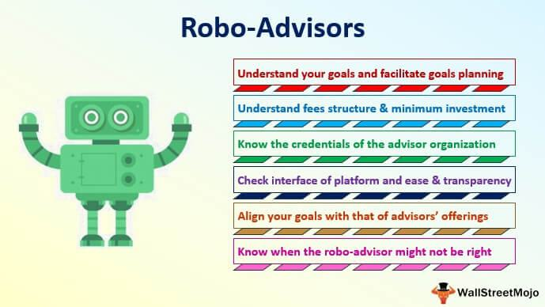

The financial landscape is undergoing a transformative shift, significantly influenced by advancements in technology that are redefining the investment strategies embraced by young investors. Central to this evolution are robo-advisors, sophisticated digital platforms harnessing algorithms to deliver automated financial services. These platforms have rapidly gained traction among millennials and Generation Z due to their flexibility, affordability, and accessibility.

Robo-advisors minimize traditional barriers to investing, such as high fees and significant initial capital requirements, making them an attractive option for the younger demographic who often face financial constraints. The ability to start investing with lower amounts positions these digital tools as gateways to financial participation, particularly for those new to the market.



Moreover, the integration of algorithmic trading within robo-advisory platforms enhances decision-making by leveraging data-driven strategies that operate with precision and efficiency far superior to human capabilities. This has enabled young investors to execute trades with remarkable speed and accuracy, potentially optimizing returns while minimizing emotional bias that can often skew investment decisions.

This article examines the transformative impact of robo-advisors on young investors from various angles. It highlights their benefits, including cost-effectiveness and ease of use, while also navigating through the challenges they present. Understanding these dynamics is crucial for young investors aiming to utilize robo-advisors effectively. As these technological tools continue to evolve and integrate more sophisticated features, they are poised to play an increasingly pivotal role in democratizing access to financial markets, ultimately reshaping the future investment landscape for emerging generations.

## Table of Contents

## Understanding Robo-Advisors

Robo-advisors are automated platforms designed to manage investment portfolios with minimal human intervention. They employ complex algorithms to make investment decisions, offering various services such as portfolio rebalancing, tax-loss harvesting, and personalized investment strategies. The primary objective of robo-advisors is to democratize investing, making it accessible to individuals with lower starting balances who might otherwise be excluded from traditional investment opportunities.

The mechanism of robo-advisors typically involves the use of mathematical algorithms to optimize investment strategies based on an individual's risk tolerance, financial goals, and investment horizon. For example, portfolio rebalancing is a process that ensures an investment portfolio remains aligned with an investor's risk tolerance over time by adjusting the proportion of assets. This procedure can be illustrated with a simple Python snippet:

```python
def rebalance_portfolio(current_weights, target_weights, threshold):
    for i in range(len(current_weights)):
        if abs(current_weights[i] - target_weights[i]) > threshold:
            # Adjust current_weights[i] to match target_weights[i]
            # Implement rebalancing logic here
            pass
```

In practice, robo-advisors provide several advantages. They use tax-loss harvesting techniques to minimize tax liabilities by selling losing investments to offset capital gains. Additionally, they offer personalized investment strategies tailored to each investor's preferences.

However, like any financial tool, robo-advisors have their critics. A major concern is their performance during economic downturns. Critics argue that the algorithms used may not respond well to unpredictable market conditions or may fail to account for the nuanced financial strategies that human advisors can offer. Despite these criticisms, robo-advisors continue to gain popularity as they represent a cost-effective and accessible way for individuals of all financial backgrounds to engage in the investment market. 

As technology continues to evolve, the capabilities of robo-advisors are expected to expand, potentially addressing some of these criticisms while continuing to offer streamlined and efficient investment management solutions.

## The Appeal of Robo-Advisors for Millennials

Millennials, characterized by their affinity for technology and preference for seamless digital interactions, find robo-advisors particularly appealing. This tech-savvy generation values efficiency and accessibility, making robo-advisors, with their automated nature and user-friendly interfaces, an attractive option. These platforms typically offer lower fees compared to traditional financial advisors—a significant [factor](/wiki/factor-investing) for young investors who may be starting their investment journeys with modest capital. For instance, many robo-advisors require minimal initial investments, removing barriers that might deter young investors from entering the financial markets.

Moreover, millennials, as digital natives, inherently trust technological solutions and frequently prefer online interactions over traditional face-to-face consultations. Robo-advisors provide a digital interface that allows for straightforward portfolio management and investment tracking, which aligns perfectly with the lifestyle and expectations of this generation. This alignment is facilitated by intuitive platforms that require minimal financial jargon, providing ease of use to those with varying levels of financial literacy.

The adaptability of robo-advisors to mobile platforms is another aspect that resonates well with millennials, who are accustomed to managing significant portions of their lives through smartphones and digital apps. The ability to monitor and adjust investments on-the-go, along with receiving instant notifications about portfolio changes or market news, offers a sense of control and immediacy that is highly valued.

Additionally, millennials are known for their strong leanings towards socially responsible and sustainable investing. Many robo-advisor platforms have integrated Environmental, Social, and Governance ([ESG](/wiki/esg-investing)) investment options, catering to this demographic's desire to align their financial choices with personal values. This capability not only attracts more young investors but also aids in promoting and sustaining a culture of ethical investing.

In essence, robo-advisors offer millennials a combination of cost-effectiveness, ease of use, and flexibility, providing an investment solution that caters to their unique preferences and financial situations. This convergence of digital convenience, affordability, and customization is what makes robo-advisors a preferred choice among young investors today.

## Benefits of Algo Trading for Young Investors

Algorithmic trading, often referred to as algo trading, has become a significant tool for young investors. It empowers them to execute investment strategies at speeds and scales that humans cannot match, enhancing their capacity to achieve financial efficiency. 

1. **Speed and Efficiency**: Algo trading operates on the foundation of rapid execution. Algorithms can process market data and execute hundreds of trades within milliseconds, a feat unattainable for human traders. This ability to act swiftly is particularly advantageous in markets where timing is critical to capitalize on minute price differences. For young investors who are often looking to make their mark quickly, the speed of algo trading can provide a competitive edge.

2. **Reduction of Emotional Biases**: Investing is not just about numbers; human emotions frequently come into play, often leading to poor decision-making. The psychological stresses of market volatility can cause investors to make impulsive decisions, such as panic selling during downturns. Algorithms, however, operate on predetermined logic and criteria, devoid of emotional influences. They adhere strictly to strategy, which helps maintain discipline, reduce errors in judgment, and potentially improve returns over time.

3. **Portfolio Balance and Monitoring**: Maintaining a consistently balanced portfolio is crucial for mitigating risk. Algo trading offers the ability to continuously monitor and rebalance portfolios as market conditions evolve. Automated systems can be programmed to check and adjust portfolio distribution regularly, ensuring that allocations remain aligned with investment goals and risk tolerance levels. 

4. **Performance Optimization**: Advanced algorithms are equipped to adjust portfolios automatically based on market data and trends. By leveraging machine learning and artificial intelligence, these systems can identify subtle patterns and insights that may be invisible to human traders. For instance, algorithms can forecast potential market movements and reallocate assets to optimize performance. Here is an example of how a simple moving average crossover strategy can be implemented in Python:

   ```python
   import pandas as pd
   import numpy as np
   import matplotlib.pyplot as plt

   # Fetch market data
   data = pd.read_csv('market_data.csv')
   data['SMA50'] = data['Close'].rolling(window=50).mean()
   data['SMA200'] = data['Close'].rolling(window=200).mean()

   # Generate signals
   data['Signal'] = np.where(data['SMA50'] > data['SMA200'], 1, 0)

   # Plot results
   plt.figure(figsize=(14, 7))
   plt.plot(data['Close'], label='Price')
   plt.plot(data['SMA50'], label='50-day SMA')
   plt.plot(data['SMA200'], label='200-day SMA')
   plt.plot(data[data['Signal'] == 1].index, data['Close'][data['Signal'] == 1], '^', markersize=10, color='g', lw=0, label='Buy Signal')
   plt.plot(data[data['Signal'] == 0].index, data['Close'][data['Signal'] == 0], 'v', markersize=10, color='r', lw=0, label='Sell Signal')
   plt.title('Moving Average Crossover Strategy')
   plt.legend()
   plt.show()
   ```

In conclusion, [algorithmic trading](/wiki/algorithmic-trading) provides young investors with tools to improve their trading efficiency, minimize psychological influences, maintain robust portfolios, and optimize investment returns. The ongoing advancements in this space hold substantial promise for enhancing financial strategies and outcomes for young investors globally.

## Evaluating the Best Robo-Advisors for Young Investors

When evaluating robo-advisors suitable for young investors, several factors come into play, including account minimums, fees, available features, and the company's reputation. These factors help ensure a balanced approach that aligns with the investor's financial goals and digital preferences.

One of the first aspects to consider is account minimums, as these determine the initial investment required to start using the platform. For example, **Wealthfront** typically requires a minimum investment of $500, whereas **Betterment** does not have a minimum balance requirement, making it more accessible for those with less starting capital. **M1 Finance**, in contrast, requires a $100 minimum for taxable accounts and $500 for retirement accounts.

Fees are another crucial consideration. Most robo-advisors charge an annual fee based on the percentage of assets under management (AUM). Wealthfront charges a 0.25% annual fee, similar to Betterment's pricing structure. M1 Finance stands out by not charging management fees, which can be advantageous for fee-sensitive investors.

In terms of features, each platform offers unique services that cater to different investment needs. Wealthfront provides robust features such as tax-loss harvesting and a comprehensive financial planning tool called Path. Betterment offers socially responsible investing (SRI) portfolios and provides access to human advisors for an additional fee. M1 Finance distinguishes itself with its unique pie-based investing model, allowing investors to customize and automate their portfolio allocations.

Environmental, Social, and Governance (ESG) options are increasingly important to young investors prioritizing sustainability. Both Wealthfront and Betterment offer ESG portfolios that align investments with ethical values, whereas M1 Finance offers a more customizable approach that requires manual selection of socially responsible ETFs.

Understanding these unique offerings is crucial for investors to make informed decisions. Tax-deferred accounts, such as IRAs and 401(k)s, are available on these platforms, providing additional tax-saving opportunities. Access to human advisors is an added benefit for those seeking personalized guidance amid automated services, which Betterment offers through its premium plan.

In summary, when evaluating robo-advisors like Wealthfront, Betterment, and M1 Finance, young investors should weigh the importance of account minimums, fees, available features, ESG options, and access to human advisors. This comprehensive analysis helps identify the platform that best aligns with their financial goals and investing preferences.

## Challenges and Considerations

Robo-advisors have significantly transformed investment strategies for young investors, but they are not without challenges and considerations. One major limitation is the inability to cater to complex financial needs. While robo-advisors offer a broad spectrum of automated services, their standardized approach might not adequately address the intricate financial strategies required by some investors. Personalized advice is often necessary for managing unique financial goals, such as tailored tax strategies or estate planning, which robo-advisors generally do not provide.

For young investors, staying informed on market trends and updates to robo-advisor platforms is essential. The dynamic nature of financial markets necessitates continuous monitoring and adaptation to leverage opportunities and mitigate risks effectively. Robo-advisors, while automated, rely on pre-set algorithms that may not always reflect sudden market changes. Therefore, investors should regularly review their investment portfolios and stay abreast of economic developments to ensure their financial objectives remain aligned with market conditions.

Furthermore, for those seeking a more comprehensive service, a hybrid approach that combines both digital automation and human financial advice can be beneficial. This model allows investors to enjoy the efficiency and cost-effectiveness of robo-advisors while gaining access to personalized insights from human advisors. These hybrid platforms bridge the gap between automated investing and the nuanced advisory requirements of more complex financial goals, offering a balanced solution.

In summary, while robo-advisors provide accessible investment options, young investors must be aware of their limitations concerning complex financial needs and the necessity for constant engagement with market changes. Considering a hybrid model can potentially offer the best of both worlds, combining technological efficiency with personalized advisory services for a well-rounded investment strategy.

## The Future of Investing for Young Generations

As technology continues to evolve, the future of investing for young generations seems increasingly intertwined with advancements in robo-advisors. These platforms are expected to integrate more sophisticated features, enhancing their utility and appeal. Key among these advancements is the anticipated integration with comprehensive financial planning tools. Such tools can offer users a holistic view of their financial situation, enabling better decision-making and strategic planning. Robo-advisors are also likely to leverage [artificial intelligence](/wiki/ai-artificial-intelligence) (AI) and data analytics to personalize investment strategies further. By analyzing a vast array of financial data, AI can provide insights and recommendations tailored to individual investors' profiles and risk tolerances.

Moreover, these platforms play a crucial role in promoting financial literacy among young investors. With user-friendly interfaces and educational resources, robo-advisors can help demystify complex financial concepts, empowering users to make informed investment choices. This educational aspect is particularly beneficial for millennials and Gen Z, who typically prefer self-service platforms and may lack traditional financial advisors' guidance.

Furthermore, robo-advisors contribute significantly to the democratization of financial markets. By lowering the barriers to entry, such as high fees and significant initial investment requirements, these platforms make investing accessible to a broader audience. This inclusivity is crucial in ensuring that younger generations have the opportunity to build and manage wealth effectively.

In conclusion, the integration of advanced technologies and educational tools in robo-advisors is paving the way for a more informed and inclusive investing environment. As these platforms continue to evolve, they are poised to be instrumental in shaping the financial futures of young investors, promoting both accessibility and financial literacy.

## Conclusion

Robo-advisors offer a viable, cost-effective solution for young investors who are comfortable with technology. These digital platforms provide a modern alternative to traditional investment methods, appealing particularly to millennials and Gen Z due to their ease of use, lower fees, and accessibility. Understanding the advantages and limitations of robo-advisors is essential for young investors aiming to leverage their full potential. Benefits include portfolio diversification, automatic rebalancing, and a reduction in emotional biases often seen with traditional investing. However, limitations such as insufficient personalization for complex financial needs should also be acknowledged. 

As robo-advisor technology continues to evolve, it is anticipated that they will play an increasingly significant role in the investment strategies of younger generations. Advancements in artificial intelligence and data analytics are likely to enhance their capabilities, integrating more sophisticated features that cater to an even broader range of financial goals. Moreover, by promoting financial literacy and democratizing access to the financial markets, robo-advisors contribute to a more inclusive financial environment. As such, they are poised to shape the future investment landscape, providing young investors with the tools needed to secure their financial futures effectively.

## References & Further Reading

[1]: Markowitz, H. M. (1952). ["Portfolio Selection"](https://onlinelibrary.wiley.com/doi/abs/10.1111/j.1540-6261.1952.tb01525.x). The Journal of Finance, 7(1), 77-91.

[2]: Malkiel, B. G. (2019). ["A Random Walk Down Wall Street: The Time-Tested Strategy for Successful Investing"](https://yourknowledgedigest.org/wp-content/uploads/2020/04/a-random-walk-down-wall-street.pdf). W. W. Norton & Company.

[3]: Baker, M., & Nofsinger, J. R. (2010). ["Behavioral Finance: Investors, Corporations and Markets."](https://onlinelibrary.wiley.com/doi/book/10.1002/9781118258415) John Wiley & Sons.

[4]: Piketty, T. (2014). ["Capital in the Twenty-First Century"](https://www.jstor.org/stable/j.ctt6wpqbc). Harvard University Press.

[5]: Kahneman, D. (2011). ["Thinking, Fast and Slow"](https://link.springer.com/article/10.1007/s00362-013-0533-y). Farrar, Straus and Giroux.