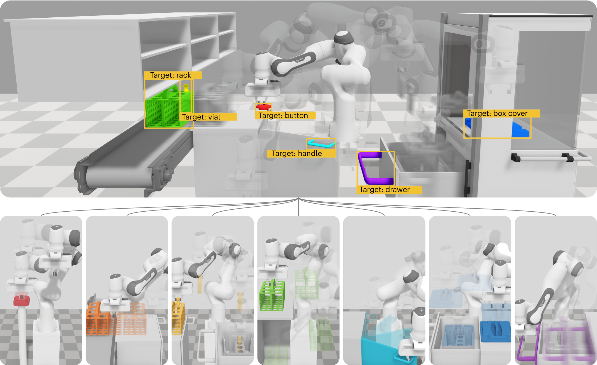

## Table of Contents

## What is robotic manipulation in the context of machine learning?

Robotic manipulation in the context of machine learning refers to the use of algorithms and data to teach robots how to interact with and manipulate objects in their environment. This involves training robots to perform tasks such as picking up objects, assembling parts, or navigating through complex spaces. Machine learning helps robots learn from experience, improving their performance over time by analyzing data from sensors and cameras to make better decisions about how to move and interact with objects.

One common approach to robotic manipulation is reinforcement learning, where a robot learns to perform tasks by trial and error. In this method, the robot receives feedback in the form of rewards or penalties based on its actions, and it uses this feedback to adjust its behavior to maximize the rewards. For example, a robot might learn to pick up a cup by trying different grasps and receiving a reward when it successfully lifts the cup without dropping it. Over many attempts, the robot can refine its technique to become more efficient and reliable.

Another important aspect of robotic manipulation is the use of deep learning, particularly convolutional neural networks (CNNs), to process visual data. These networks can help robots recognize and understand the objects they need to manipulate, even in cluttered or changing environments. By analyzing images from cameras, a robot can identify the shape, size, and position of objects, allowing it to plan and execute precise movements. This combination of machine learning techniques enables robots to perform complex manipulation tasks with increasing autonomy and accuracy.

## How do robotic manipulation models differ from traditional robotics?

Robotic manipulation models using [machine learning](/wiki/machine-learning) differ from traditional robotics mainly in how they learn and adapt. Traditional robotics often relies on pre-programmed instructions and rules to perform tasks. For example, a traditional robot might be programmed to pick up a specific object at a fixed location using a set sequence of movements. These robots can be very precise but struggle when faced with new or changing situations. On the other hand, robotic manipulation models using machine learning can learn from their experiences. They use data from sensors and cameras to improve their actions over time, making them more flexible and able to handle new tasks without needing new programming.

Machine learning in robotic manipulation often uses techniques like [reinforcement learning](/wiki/reinforcement-learning) and [deep learning](/wiki/deep-learning). In reinforcement learning, a robot learns by trying different actions and getting feedback in the form of rewards or penalties. For example, a robot might try different ways to pick up a cup and get a reward when it succeeds. Over time, the robot learns the best way to do the task. Deep learning, especially with convolutional neural networks (CNNs), helps robots understand what they see. By analyzing images, a robot can recognize and locate objects, which helps it plan its movements more accurately. This combination of learning methods allows robotic manipulation models to adapt to new situations and become more efficient than traditional robotics.

## What are the basic components of a robotic manipulation system?

A robotic manipulation system is made up of several key parts that work together to help the robot move and interact with things around it. The first part is the robot's hardware, which includes its arms, grippers, and joints. These parts let the robot physically reach out and grab objects. The robot also has sensors, like cameras and touch sensors, which help it see and feel its surroundings. These sensors send information to the robot's control system, which decides what the robot should do next.

The second part of a robotic manipulation system is the software, which includes the control algorithms and machine learning models. The control algorithms tell the robot's motors how to move the arms and grippers. Machine learning models, like those used in reinforcement learning and deep learning, help the robot learn from its experiences. For example, a robot might use a model to learn the best way to pick up a cup. The software takes in data from the sensors, processes it, and then sends commands to the robot's hardware to [carry](/wiki/carry-trading) out the task. Together, the hardware and software make it possible for the robot to manipulate objects effectively and adapt to new situations.

## What is the role of machine learning in improving robotic manipulation?

Machine learning helps robots get better at moving and handling objects by letting them learn from their experiences. Instead of following set instructions, a robot can try different ways to pick up a cup and see which works best. If it drops the cup, it learns not to do that again. Over time, the robot figures out the best way to do the job. This makes the robot more flexible and able to handle new tasks without needing new programming. For example, a robot might learn to pick up different objects like a ball or a book by trying different grasps and getting feedback on what works.

Machine learning also helps robots understand what they see. Using deep learning, robots can look at pictures from their cameras and recognize objects. This is important because it helps the robot know where the object is and how to grab it. For example, a robot might use a machine learning model to find a cup on a table and then plan the best way to reach it. By learning from lots of images, the robot gets better at recognizing objects even if they are in different places or if the lighting changes. This makes the robot more reliable and able to work in many different situations.

## Can you explain the concept of a Virtual Simulation Framework (VSF) in robotic manipulation?

A Virtual Simulation Framework (VSF) is a tool that helps robots practice and learn how to move and handle objects in a safe, computer-made world. It's like a video game where the robot can try different things without breaking anything in the real world. In this virtual world, the robot can experiment with [picking](/wiki/asset-class-picking) up cups, moving blocks, or even assembling parts. By doing this, the robot can learn from its mistakes and improve its skills before trying them in real life. This practice helps the robot become better at its job and reduces the risk of damage or accidents when it works with real objects.

Machine learning plays a big role in making VSF useful for robotic manipulation. The robot uses algorithms to learn from what it does in the virtual world. For example, it might try different ways to grab a cup and get feedback on which way works best. Over time, the robot gets smarter and can handle new tasks more easily. This learning can then be applied to the real world, making the robot more effective and adaptable. Using a VSF, engineers can test and refine the robot's abilities in a controlled environment, which saves time and resources when the robot is finally used in real-world situations.

## How does myGym contribute to the development of robotic manipulation models?

myGym is a special tool that helps robots learn how to move and handle objects better. It's like a playground where robots can practice picking up cups, moving blocks, or doing other tasks in a safe, computer-made world. By using myGym, robots can try different ways to do things and learn from their mistakes without breaking anything in the real world. This practice helps the robot get better at its job and makes it ready to work with real objects.

In myGym, robots use machine learning to get smarter. They try different actions and get feedback on what works best. For example, a robot might try different ways to grab a cup and learn which way is the best. Over time, the robot gets better at doing tasks and can handle new situations more easily. This learning in myGym can then be used in the real world, making the robot more effective and adaptable.

## What are some common algorithms used in machine learning for robotic manipulation?

Machine learning helps robots learn how to move and handle objects better by using special algorithms. One common algorithm is reinforcement learning, which works like a game. In this game, the robot tries different actions and gets points for doing things right. If the robot picks up a cup correctly, it gets a high score. If it drops the cup, it gets a low score. Over time, the robot learns the best way to pick up the cup by trying to get the highest score possible. This method is good because it helps the robot learn from its mistakes and improve.

Another important algorithm is deep learning, which helps robots understand what they see. Deep learning uses something called convolutional neural networks (CNNs) to look at pictures from the robot's cameras. These networks help the robot recognize objects like cups or balls, even if they are in different places or the light changes. By learning from lots of pictures, the robot gets better at knowing where the object is and how to grab it. This makes the robot more reliable and able to work in many different situations.

Sometimes, these algorithms work together. For example, a robot might use deep learning to find a cup and then use reinforcement learning to figure out the best way to pick it up. By combining these methods, the robot can learn more quickly and handle new tasks without needing new programming. This makes the robot smarter and more useful in the real world.

## How do reinforcement learning techniques apply to robotic manipulation models?

Reinforcement learning helps robots learn how to move and handle objects by playing a game-like process. In this game, the robot tries different actions and gets rewards or penalties based on how well it does. For example, if the robot picks up a cup without dropping it, it gets a high reward. If it drops the cup, it gets a low reward or a penalty. Over time, the robot learns the best way to pick up the cup by trying to get the highest rewards possible. This method is great because it lets the robot learn from its mistakes and improve its skills without needing new programming.

In reinforcement learning, the robot uses a special algorithm that decides what to do next based on the rewards it gets. This algorithm is called a policy, and it helps the robot figure out the best actions to take in different situations. For example, the robot might learn that it needs to adjust its grip strength depending on the weight of the object it's trying to pick up. By trying different actions and learning from the rewards, the robot can become very good at handling objects. This makes it more useful and able to work in many different situations, even when things change or new tasks come up.

## What challenges are faced when training robotic manipulation models in simulated environments?

Training robotic manipulation models in simulated environments can be tricky because the virtual world is not exactly like the real world. In simulations, everything is perfect and controlled, but real life has things like gravity, friction, and unexpected changes. This means that what works well in the simulation might not work as well in real life. For example, a robot might learn to pick up a cup in a simulation, but when it tries in the real world, the cup might be heavier or slippery, causing the robot to drop it. This difference between the simulation and reality is called the "reality gap," and it's a big challenge for making sure robots can work well in real situations.

Another challenge is making the simulations detailed and accurate enough to be useful. Creating a simulation that includes all the details of the real world, like different lighting conditions or the feel of different materials, can be very hard and time-consuming. If the simulation is too simple, the robot might not learn all the skills it needs. But if the simulation is too complex, it can take a long time to run and might not be practical. Engineers have to find a balance to make sure the robot can learn useful skills in the simulation that will help it in the real world. This balance is important for training effective robotic manipulation models.

## How can transfer learning be utilized to enhance robotic manipulation performance?

Transfer learning is a smart way to make robots better at moving and handling objects. It works by letting a robot use what it has already learned in one situation to help it in a new situation. For example, if a robot has learned to pick up a cup, it can use that knowledge to help it pick up a bottle. This saves time because the robot doesn't have to start learning from scratch every time it faces a new task. It can take what it knows and adjust it a little to work with different objects or in different environments.

In practice, transfer learning can make a big difference in how quickly a robot gets good at its job. Imagine a robot that has been trained in a virtual world to grab different objects. When it moves to the real world, it can use what it learned in the simulation to help it pick up real objects faster. This is especially useful because real-world situations can be unpredictable, with things like changes in lighting or the weight of objects. By using transfer learning, the robot can adapt what it knows to handle these new challenges more easily, making it more effective and reliable in real-life tasks.

## What are the latest advancements in deep learning for robotic manipulation?

The latest advancements in deep learning for robotic manipulation have made robots much better at understanding and moving objects. One big improvement is in using deep neural networks to process visual information. These networks help robots see and recognize objects more clearly, even when things like lighting or background change. For example, convolutional neural networks (CNNs) can look at pictures from a robot's camera and figure out where a cup is on a table. This helps the robot plan how to reach and grab the cup more accurately. Another cool advancement is in using reinforcement learning with deep learning. This lets robots learn the best way to pick up different objects by trying different methods and getting feedback on what works best.

Another important advancement is the use of generative models like Generative Adversarial Networks (GANs) and Variational Autoencoders (VAEs). These models help robots imagine different ways an object might look or move, which makes them better at handling new situations. For example, a robot can use these models to predict how a soft object like a sponge might change shape when it's picked up. This helps the robot adjust its grip to hold the object better. Also, researchers are working on making deep learning models smaller and faster, so they can run on robots without needing powerful computers. This means robots can learn and react more quickly in real-time, making them more useful in everyday tasks.

## How do experts evaluate and benchmark the performance of robotic manipulation models?

Experts evaluate and benchmark the performance of robotic manipulation models by using a mix of different tests and measures. They look at how well the robot can pick up and move objects, how fast it does these tasks, and how often it makes mistakes. They also check if the robot can handle new situations well, like picking up objects it hasn't seen before or working in different lighting. To do this, they might use a special setup called a benchmark, which is like a test [course](/wiki/best-algorithmic-trading-courses) with different tasks for the robot to complete. By comparing how different robots do on the same tasks, experts can see which ones are better and where they need to improve.

One common way to measure performance is to use something called success rate, which is just the percentage of times the robot successfully completes a task. For example, if a robot tries to pick up a cup 100 times and succeeds 90 times, its success rate is 90%. Experts also look at other numbers like how long it takes the robot to finish a task, how much force it uses, and how well it can adapt to changes. By combining all these measures, they get a good picture of how well the robot is doing and where it might need more training or better algorithms.

## References & Further Reading

[1]: Levine, S., Finn, C., Darrell, T., & Abbeel, P. (2016). ["End-to-End Training of Deep Visuomotor Policies."](https://arxiv.org/abs/1504.00702) Journal of Machine Learning Research, 17(1), 1334-1373.

[2]: Lillicrap, T. P., Hunt, J. J., Pritzel, A., Heess, N., Erez, T., Tassa, Y., Silver, D., & Wierstra, D. (2015). ["Continuous control with deep reinforcement learning."](https://arxiv.org/abs/1509.02971) arXiv preprint arXiv:1509.02971.

[3]: Schulman, J., Wolski, F., Dhariwal, P., Radford, A., & Klimov, O. (2017). ["Proximal Policy Optimization Algorithms."](https://arxiv.org/abs/1707.06347) arXiv preprint arXiv:1707.06347.

[4]: Krizhevsky, A., Sutskever, I., & Hinton, G. E. (2012). ["ImageNet Classification with Deep Convolutional Neural Networks."](https://dl.acm.org/doi/10.1145/3065386) Advances in neural information processing systems, 25.

[5]: Mnih, V., Kavukcuoglu, K., Silver, D., Rusu, A. A., Veness, J., Bellemare, M. G., ... & Hassabis, D. (2015). ["Human-level control through deep reinforcement learning."](https://www.nature.com/articles/nature14236) Nature, 518(7540), 529-533.

[6]: OpenAI, Espeholt, L., Soyer, H., Munos, R., & Kavukcuoglu, K. (2017). ["Scalable trust-region method for deep reinforcement learning using Kronecker-factored approximation."](https://arxiv.org/abs/1802.01561) arXiv preprint arXiv:1708.05144.

[7]: Sutton, R. S., & Barto, A. G. (2018). ["Reinforcement learning: An introduction."](https://web.stanford.edu/class/psych209/Readings/SuttonBartoIPRLBook2ndEd.pdf) MIT press.