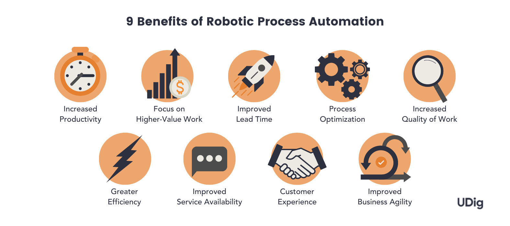

## Table of Contents

## What is Robotic Process Automation (RPA)?

Robotic Process Automation, or RPA, is a technology that uses software robots or "bots" to automate routine and repetitive tasks that people usually do on computers. These tasks can include things like entering data, processing transactions, or handling customer service inquiries. By using RPA, businesses can make their work faster, more accurate, and less costly because the bots can work around the clock without getting tired or making mistakes.

RPA bots work by following a set of rules and instructions that tell them exactly what to do. They can interact with different software applications the same way a human would, by clicking buttons, filling out forms, and reading information from screens. This means they can be used in many different industries, like banking, healthcare, and customer service, to help with tasks that are time-consuming and repetitive. As a result, employees can focus on more important work that needs human skills, like problem-solving and decision-making.

## How does RPA work?

RPA works by using software bots that follow a set of instructions to do tasks on a computer. These bots can see what's on the screen, click buttons, and type information just like a person would. They are programmed to do the same tasks over and over again without getting tired or making mistakes. For example, if a company needs to enter data from a lot of forms into a computer system, an RPA bot can do this job quickly and accurately.

The bots get their instructions from a special program that tells them exactly what to do and when to do it. This program can be set up to work with different software applications, so the bots can move between programs and complete tasks that involve multiple steps. For instance, a bot might start by pulling information from an email, then enter that information into a database, and finally send a confirmation email back to the sender. By automating these steps, RPA helps businesses save time and reduce errors.

## What are the common applications of RPA in businesses?

RPA is used a lot in businesses to help with tasks that are boring and repetitive. One common use is in the finance department, where RPA bots can handle things like processing invoices, managing accounts payable and receivable, and doing financial reporting. This means that the finance team can spend more time on important tasks like analyzing data and making decisions, instead of doing the same work over and over again.

Another place where RPA is really helpful is in customer service. RPA bots can deal with customer inquiries, update customer records, and even handle simple requests like password resets. This makes the customer service process faster and more efficient, so customers get help more quickly and the service team can focus on solving harder problems that need human attention.

RPA is also used in human resources to help with tasks like onboarding new employees, managing employee records, and processing payroll. By automating these tasks, HR teams can spend more time on things like employee development and engagement, which are important for keeping a happy and productive workforce.

## What are the main benefits of implementing RPA?

One big benefit of using RPA is that it can save businesses a lot of time and money. RPA bots can work around the clock without taking breaks, so they can get a lot more done than people can. This means that businesses can process more work in less time, which can help them make more money. Also, RPA bots don't make mistakes like people sometimes do, so the work they do is more accurate. This can save businesses money by reducing errors and the need to fix them.

Another benefit of RPA is that it can make employees happier and more productive. When RPA bots take over boring and repetitive tasks, employees have more time to focus on important work that needs human skills, like problem-solving and decision-making. This can make their jobs more interesting and satisfying, which can lead to better morale and less turnover. Plus, RPA can help businesses respond to customers and partners more quickly, which can improve their reputation and make them more competitive.

## Can you explain the difference between RPA and traditional automation?

RPA and traditional automation are both ways to make work easier by using technology, but they work in different ways. Traditional automation usually involves changing the software or systems that a business uses to make them do things automatically. For example, if a company wants to automate how it processes invoices, it might need to change its accounting software to add automatic invoice processing. This kind of automation often needs a lot of time and money because it involves changing the software itself.

RPA, on the other hand, doesn't need to change the software or systems that a business already uses. Instead, RPA uses software bots that can work with the existing software just like a person would. These bots follow instructions to do tasks like entering data or processing transactions without needing any changes to the software. This makes RPA quicker and cheaper to set up because it doesn't require big changes to the way a business works.

## What industries benefit the most from RPA?

Many industries find RPA very helpful, but some benefit more than others. The finance and banking sector is one of the biggest users of RPA. This is because there are a lot of repetitive tasks in banking, like processing payments, handling invoices, and managing accounts. RPA can do these tasks quickly and without mistakes, which saves time and money for banks. It also helps them follow rules and regulations more easily, which is very important in the finance world.

Another industry that benefits a lot from RPA is healthcare. Hospitals and clinics have to deal with a lot of paperwork and data entry, like patient records and insurance claims. RPA can help with these tasks, making the work faster and more accurate. This means that healthcare workers can spend more time taking care of patients instead of doing paperwork. Plus, RPA can help make sure that patient information is handled safely and securely, which is really important in healthcare.

Customer service is also a big winner with RPA. Many customer service tasks, like answering common questions or updating customer information, can be done by RPA bots. This makes the service faster and more efficient, so customers get help more quickly. It also means that customer service workers can focus on solving harder problems that need human skills, which can make their jobs more interesting and satisfying.

## How does RPA improve efficiency and productivity?

RPA improves efficiency and productivity by taking over boring and repetitive tasks that people usually do. When RPA bots do these tasks, they can work all the time without getting tired or making mistakes. This means that businesses can get a lot more work done in less time. For example, if a company needs to enter a lot of data into a computer system, an RPA bot can do this job much faster and more accurately than a person. This saves time and reduces the chance of errors, which can make the whole business run more smoothly.

RPA also helps employees be more productive by freeing them up to do more important work. When RPA bots handle the repetitive tasks, employees can focus on jobs that need human skills, like problem-solving and decision-making. This can make their work more interesting and satisfying, which can lead to better morale and less turnover. Plus, because RPA can help businesses respond to customers and partners more quickly, it can improve their reputation and make them more competitive in the market.

## What are the potential challenges or limitations of RPA?

One challenge with RPA is that it can be hard to set up and get working right. RPA bots need clear instructions to do their jobs, and making these instructions can take a lot of time. If the instructions are not clear or if something changes in the software the bots are using, they might not work correctly. This means that businesses need to spend time and money to make sure the RPA system is set up well and keeps working well.

Another limitation of RPA is that it can't do everything. RPA bots are good at doing simple, repetitive tasks, but they can't think or make decisions like people can. If a task needs someone to understand a situation or make a choice, RPA can't help. This means that businesses still need people to do the more complicated work that needs human skills. Also, if the software or systems that the RPA bots use change a lot, the bots might need to be updated or reprogrammed, which can be a lot of work.

## How can RPA be integrated with existing systems?

RPA can be integrated with existing systems without needing to change them. This means that businesses can use RPA bots with the software they already have, like email programs, databases, or customer service systems. The bots are set up to follow instructions that tell them how to interact with these systems. For example, an RPA bot can be told to open an email, read the information inside, and then enter that information into a database. This makes it easy for businesses to start using RPA because they don't need to buy new software or change how they work.

However, setting up RPA to work with existing systems can take some time and effort. The instructions for the bots need to be very clear and detailed so they know exactly what to do. If the existing systems change, like if a software program gets updated, the instructions for the bots might need to be updated too. This means that businesses need to keep an eye on their RPA system and make sure it keeps working well with their other systems. Even though it takes some work to set up, once it's running, RPA can help businesses do a lot more work in less time.

## What are the best practices for implementing RPA?

When you start using RPA, it's important to pick the right tasks for the bots. Look for jobs that are boring and repetitive, like entering data or processing invoices. These tasks are perfect for RPA because the bots can do them quickly and without making mistakes. Also, make sure to choose tasks that don't need a lot of thinking or decision-making, since RPA bots can't do those things. By picking the right tasks, you can make sure that RPA helps your business the most.

Once you've picked the tasks, you need to set up the RPA system carefully. This means making clear and detailed instructions for the bots to follow. It can take some time to get this right, but it's worth it because the bots need to know exactly what to do. It's also a good idea to start with a small project first, to see how RPA works in your business. If it goes well, you can use RPA for more tasks later. Remember to keep checking on the RPA system and update it if your other software changes, so the bots keep working well.

## What advanced features does RPA offer to expert users?

RPA has some cool advanced features for people who know a lot about it. One of these features is called "attended automation," which means that RPA bots can work with people at the same time. This is helpful when someone needs to check or approve something that the bot is doing. Another advanced feature is "unattended automation," where the bots can work all by themselves without people needing to watch them. This is great for tasks that can be done completely without human help.

RPA also has something called "cognitive automation," which is a bit like giving the bots the ability to think a little. This means they can do things like understand text, recognize images, and even learn from what they do. This helps them handle tasks that are a bit more complicated than just following simple instructions. For example, a bot with cognitive automation can read an email, understand what it's about, and then decide what to do next. These advanced features make RPA even more useful for businesses that want to do a lot more with automation.

## How is RPA expected to evolve in the future?

In the future, RPA is expected to become even smarter and more useful. One big change will be the use of artificial intelligence (AI) and machine learning. This means that RPA bots will be able to learn from what they do and get better over time. They will be able to handle more complicated tasks that need some thinking and decision-making, not just simple repetitive work. This will make RPA even more helpful for businesses because the bots will be able to do a wider range of jobs.

Another way RPA will evolve is by working better with other technologies. RPA will be more connected to things like cloud computing, which means businesses can use RPA from anywhere. RPA will also work more closely with other automation tools, making it easier to set up and manage. This will help businesses use RPA in more parts of their work, making everything run more smoothly and efficiently. As RPA gets smarter and more connected, it will become an even bigger part of how businesses work.

## References & Further Reading

[1]: Bergstra, J., Bardenet, R., Bengio, Y., & Kégl, B. (2011). ["Algorithms for Hyper-Parameter Optimization."](https://dl.acm.org/doi/10.5555/2986459.2986743) Advances in Neural Information Processing Systems 24.

[2]: ["Advances in Financial Machine Learning"](https://www.amazon.com/Advances-Financial-Machine-Learning-Marcos/dp/1119482089) by Marcos Lopez de Prado

[3]: ["Evidence-Based Technical Analysis: Applying the Scientific Method and Statistical Inference to Trading Signals"](https://www.amazon.com/Evidence-Based-Technical-Analysis-Scientific-Statistical/dp/0470008741) by David Aronson

[4]: ["Machine Learning for Algorithmic Trading"](https://github.com/stefan-jansen/machine-learning-for-trading) by Stefan Jansen

[5]: ["Quantitative Trading: How to Build Your Own Algorithmic Trading Business"](https://github.com/LucindaYa/quant-resources/blob/master/Quantitative%20Trading%20How%20to%20Build%20Your%20Own%20Algorithmic%20Trading%20Business.pdf) by Ernest P. Chan