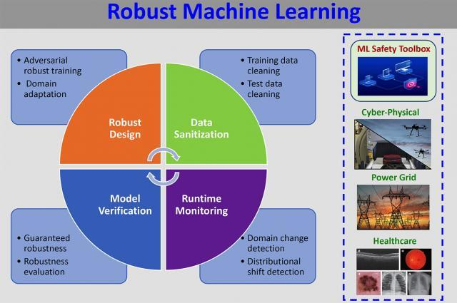

## Table of Contents

## What is robust training in machine learning?

Robust training in machine learning is about making models that can handle new and different data well. When we train a model, we usually use a set of data. But in real life, the data the model sees might be a bit different. Robust training helps the model to still work well even when the data changes a bit. This is important because it makes the model more reliable and useful in many situations.

To do robust training, we can use different methods. One way is to add some noise to the training data. This means we slightly change the data on purpose while training the model. By doing this, the model learns to not be too sensitive to small changes in the data. Another way is to use different sets of data for training, so the model sees a lot of variety. This helps the model to understand the main patterns in the data, not just the specific examples it was trained on.

## Why is robust training important for machine learning models?

Robust training is important for machine learning models because it helps them work well with new and different data. In real life, the data a model sees can change a lot. If a model is only good at working with the exact data it was trained on, it might not be very useful. Robust training makes the model more flexible, so it can still do a good job even when the data is a bit different from what it has seen before.

This is really helpful in many situations. For example, if you have a model that recognizes pictures of cats, you want it to still recognize a cat even if the picture is a bit blurry or taken from a different angle. By using robust training, the model learns to focus on the important parts of the data, like the shape and features of a cat, instead of small details that can change. This makes the model more reliable and useful in the real world, where data can be messy and unpredictable.

## What are some common challenges faced during robust training?

One common challenge during robust training is finding the right balance between making the model strong and keeping it accurate. If you add too much noise or too many different types of data, the model might start to ignore important patterns and become less accurate. On the other hand, if you don't add enough variety, the model might not be able to handle new data well. It's like trying to teach a kid to ride a bike: you need to let them practice on different terrains, but not so much that they forget how to balance on a flat road.

Another challenge is that robust training can take a lot more time and resources. Training a model with a lot of different data or with added noise means the model has to work harder to learn. This can make the training process slower and might need more powerful computers. For example, if you're training a model to recognize faces, you might need to use many different pictures of faces in different lighting and angles. This can make the training process much longer and more expensive.

Lastly, it can be hard to know if the model is really becoming more robust or if it's just overfitting to the new, varied data. Overfitting means the model is learning the training data too well, including the noise, and might not work well on new data. To check if the model is truly robust, you need to test it on completely new data that it hasn't seen before. This can be tricky because you need to make sure this new data is different enough to really test the model's robustness.

## How does Distributionally Robust Optimization (DRO) contribute to robust training?

Distributionally Robust Optimization (DRO) helps make [machine learning](/wiki/machine-learning) models more robust by focusing on how the data is spread out. Instead of just training a model on the data it sees, DRO thinks about different ways the data could be spread out in the future. It tries to make the model work well not just for the data it has seen, but for many different possible ways the data could look. This is like preparing for different weather conditions instead of just the weather you see today. By doing this, DRO helps the model be ready for new and different data, making it more reliable in real life.

One way DRO does this is by looking at a set of possible data distributions, not just the one it was trained on. It tries to find the worst-case scenario within this set and makes sure the model can still do well even in that tough situation. For example, if you're training a model to predict house prices, DRO would consider different ways the housing market could change and make sure the model can handle those changes. This approach helps the model be more flexible and less likely to fail when the data changes a bit. By preparing for the worst, DRO makes the model stronger and more useful in the real world.

## What is the concept of DEQ (Deep Equilibrium Models) in robust training?

Deep Equilibrium Models (DEQ) are a type of machine learning model that help with robust training by finding a balance point in the model's calculations. Instead of going through many steps to make a prediction, DEQ models find a point where the model's calculations stay the same. This is like finding a balance on a seesaw. By doing this, DEQ models can handle new and different data better because they focus on the overall balance of the data, not just the specific steps to get there.

In robust training, DEQ models are useful because they can adapt to changes in the data more easily. If the data changes a bit, the model can still find a new balance point quickly. This makes the model more reliable in real life, where data can be messy and unpredictable. By using DEQ, the model learns to focus on the important patterns in the data, making it stronger and more useful in many situations.

## How does ELR (Early Learning Regularization) enhance the robustness of machine learning models?

Early Learning Regularization (ELR) helps make machine learning models more robust by focusing on what the model learns at the beginning of its training. When a model starts learning, it usually picks up the most important patterns in the data first. ELR makes sure the model keeps paying attention to these important patterns throughout the training process, even when it starts to see more complex or noisy data. This is like teaching a kid to remember the basics of math even as they learn more advanced topics. By doing this, ELR helps the model stay strong and accurate, even when the data changes a bit.

In practice, ELR works by adjusting the model's learning process to emphasize the early stages. It does this by adding a special term to the model's training goal that encourages it to keep using what it learned at the start. This term helps the model stay focused on the main patterns and not get too distracted by small changes or noise in the data. As a result, the model becomes more reliable and can handle new and different data better, making it more useful in real-life situations where data can be messy and unpredictable.

## What role does Self-adaptive Training play in achieving robustness?

Self-adaptive training helps make machine learning models more robust by changing how the model learns based on what it sees. Imagine you're learning to ride a bike. At first, you might need training wheels, but as you get better, you can take them off. Self-adaptive training is like that. It adjusts the training process to make the model better at handling new and different data. If the model sees something new, it can change its learning strategy to focus on what's important, making it stronger and more reliable.

This method works by looking at how well the model is doing and then tweaking the training to improve it. For example, if the model starts to struggle with certain types of data, self-adaptive training might add more examples of that type or change how the model learns from them. By doing this, the model learns to be more flexible and can handle changes in the data better. This makes the model more useful in real life, where data can be messy and unpredictable.

## Can you explain the CW-ERM (Class-Weighted Empirical Risk Minimization) approach to robust training?

Class-Weighted Empirical Risk Minimization (CW-ERM) is a way to make machine learning models more robust by paying more attention to certain types of data. When training a model, you usually want it to do well on all the data it sees. But sometimes, some types of data are more important or harder for the model to learn. CW-ERM helps by giving these types of data more weight during training. This means the model tries harder to get these types of data right, making it better at handling different kinds of data in the real world.

In practice, CW-ERM works by adding weights to different classes of data in the training process. For example, if you're training a model to recognize different animals, and it's having a hard time with pictures of birds, you can give more weight to the bird pictures. This makes the model focus more on learning about birds, which can help it be more accurate and reliable when it sees new pictures of birds. By doing this, CW-ERM helps the model be ready for different situations and makes it more useful in real life.

## How do adversarial training techniques fit into the framework of robust training?

Adversarial training is a way to make machine learning models more robust by showing them tricky examples on purpose. These tricky examples, called adversarial examples, are made to fool the model. By training the model with these examples, it learns to be better at recognizing them and not getting fooled. This is like practicing with hard puzzles to get better at solving them. Adversarial training helps the model be ready for new and different data, making it more reliable in real life.

In practice, adversarial training works by adding small changes to the training data to create adversarial examples. These changes are designed to make the model make mistakes. For example, if you're training a model to recognize pictures of dogs, you might add some noise to the pictures to make them harder to recognize. By doing this, the model learns to focus on the important parts of the data, like the shape and features of a dog, instead of small details that can change. This makes the model stronger and more useful in many situations where data can be messy and unpredictable.

## What are the differences between traditional training methods and robust training methods?

Traditional training methods focus on making a model work well with the exact data it was trained on. They usually use a set of data to teach the model, and the goal is to make the model as accurate as possible on that data. For example, if you're training a model to recognize pictures of cats, traditional methods would show the model many pictures of cats and try to make it good at recognizing those specific pictures. The problem with this approach is that the model might not work well with new pictures of cats that look a bit different from the ones it was trained on.

Robust training methods, on the other hand, aim to make the model work well with new and different data. They do this by adding variety to the training data or by using special techniques like adding noise or adversarial examples. For example, robust training might show the model pictures of cats in different lighting, angles, or with added noise. This helps the model learn to focus on the important parts of the data, like the shape and features of a cat, instead of small details that can change. By doing this, robust training makes the model more reliable and useful in real life, where data can be messy and unpredictable.

## How can one evaluate the robustness of a trained machine learning model?

To evaluate the robustness of a trained machine learning model, you need to test it with different kinds of data that it hasn't seen before. This means using new data that might be a bit different from the data used during training. For example, if your model recognizes pictures of cats, you could test it with pictures taken in different lighting or from different angles. By doing this, you can see if the model can still recognize cats even when the pictures are not exactly like the ones it was trained on. A common way to measure this is by looking at how well the model performs on these new, different datasets. If the model's accuracy stays high, it's a good sign that it's robust.

Another way to evaluate robustness is by using adversarial examples. These are special examples that are made to trick the model. For example, you might add a little noise to a picture of a cat to see if the model still recognizes it as a cat. If the model can handle these tricky examples well, it shows that it's robust. You can also use techniques like cross-validation, where you split your data into different parts and train the model on some parts while testing it on others. This helps you see how the model performs on different slices of data, giving you a better idea of its overall robustness. By using these methods, you can get a good sense of how well your model will work in the real world, where data can be unpredictable and messy.

## What are the latest advancements in robust training techniques and their impact on the field of machine learning?

Recent advancements in robust training have focused on making models more adaptable and reliable in real-world scenarios. One significant development is the use of Distributionally Robust Optimization (DRO), which helps models prepare for different ways data might look in the future. Instead of just training on the data it has, DRO makes the model work well for many possible data distributions. This is like preparing for different weather conditions instead of just the weather you see today. By doing this, DRO helps the model be ready for new and different data, making it more reliable in real life. Another advancement is the use of Deep Equilibrium Models (DEQ), which find a balance point in the model's calculations. This helps the model adapt to changes in the data more easily, making it more robust.

Another exciting development is the use of adversarial training techniques, which show the model tricky examples on purpose to make it stronger. These tricky examples, called adversarial examples, are made to fool the model. By training the model with these examples, it learns to recognize them and not get fooled. This makes the model better at handling new and different data, which is important for real-life applications. Additionally, Self-adaptive Training has been gaining attention, as it adjusts the training process based on what the model sees. This helps the model learn to be more flexible and handle changes in the data better. These advancements have a big impact on machine learning by making models more reliable and useful in many situations, where data can be messy and unpredictable.