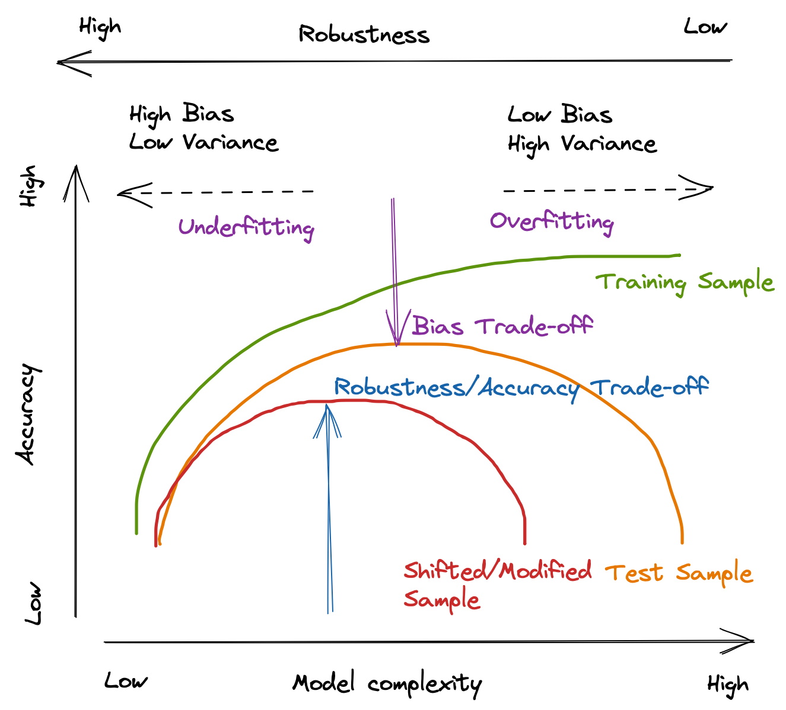

## Table of Contents

## What is robustness in the context of machine learning?

Robustness in machine learning refers to how well a model can handle different kinds of data and still give good results. Imagine you have a model that can recognize cats in pictures. If this model can still identify cats even when the pictures are blurry, dark, or taken from weird angles, then it's robust. Robustness is important because real-world data can be messy and unpredictable, so we want our models to work well no matter what.

To make a model more robust, we can use different techniques. One way is to train the model with a wide variety of data, including examples that might be challenging or different from the usual. Another way is to use something called data augmentation, where we slightly change the training data, like rotating or cropping images, to help the model learn to recognize patterns under different conditions. By doing this, the model becomes better at handling new, unexpected data it might see in the future.

In summary, robustness is about making sure our machine learning models are reliable and can perform well even when faced with new or difficult data. This is crucial for applications where the model needs to work in the real world, where data can be unpredictable and varied. By training models with diverse data and using techniques like data augmentation, we can improve their robustness and make them more useful in practical scenarios.

## Why is robustness important for machine learning models?

Robustness is really important for [machine learning](/wiki/machine-learning) models because it makes sure they work well in the real world. Imagine you've built a model to detect if an email is spam or not. If this model can only recognize spam when the email looks exactly like the ones it was trained on, it won't be very useful. Real emails can come in all sorts of formats, with different words and styles. A robust model can handle these differences and still correctly identify spam, making it much more reliable and useful.

Another reason robustness matters is that it helps models deal with unexpected situations. For example, if you have a self-driving car that uses machine learning to recognize road signs, it needs to work well even if the signs are dirty, partially covered, or seen from unusual angles. If the model isn't robust, it might fail to recognize a stop sign and cause an accident. By making sure the model is trained on a wide variety of data and can handle different conditions, we can make it safer and more dependable for real-world use.

## What are some common types of adversarial attacks that robustness methods aim to mitigate?

Adversarial attacks are sneaky ways to trick machine learning models into making mistakes. One common type is called the "adversarial example" where someone adds tiny changes to an image or data that are hard for humans to see, but fool the model into thinking it's something else. For instance, adding a special pattern to a stop sign might make a self-driving car's model think it's a speed limit sign instead. Another type is the "poisoning attack," where bad data is mixed into the training set to mess up the model's learning process. This can make the model less accurate or even biased in certain ways.

There's also something called a "model inversion attack," where an attacker tries to figure out the model's training data by studying its outputs. This can be a big privacy issue because it might reveal sensitive information. Lastly, "evasion attacks" happen after the model is already trained. Here, the attacker changes the input data at test time to make the model give the wrong answer. For example, they might alter an image just enough so the model can't recognize what's in it anymore. These types of attacks show why it's so important to make machine learning models robust and able to handle tricky situations.

## What is Randomized Smoothing and how does it enhance model robustness?

Randomized Smoothing is a way to make machine learning models more robust against tricky attacks, like when someone changes an image a tiny bit to fool the model. Imagine you have a picture of a cat, and someone adds a little noise to it, making the model think it's a dog instead. Randomized Smoothing helps by adding its own random noise to the image before the model looks at it. By doing this over and over again, the model learns to focus on the main parts of the image, like the shape of the cat, and not get confused by small changes.

This technique makes the model more reliable because it can handle different versions of the same image. When you add random noise and the model still says it's a cat, you know it's more likely to be right even if someone tries to trick it. Randomized Smoothing is like giving the model a bunch of slightly different views of the same thing, helping it understand what's important and what's just noise. This way, the model becomes better at dealing with real-world data, which can be unpredictable and messy.

## How does Denoised Smoothing work to improve the robustness of machine learning models?

Denoised Smoothing is another technique to make machine learning models stronger against tricks like adding noise to images. It works by cleaning up the image before the model sees it. Imagine someone adds a bit of static to a picture of a dog to fool the model into thinking it's a cat. With Denoised Smoothing, the model first uses a special tool to remove that static, making the image clearer. This way, when the model looks at the cleaned-up picture, it's more likely to see the dog correctly, even if someone tried to mess with the image.

This method helps the model stay reliable because it can handle images that have been tampered with. By smoothing out the noise, the model focuses on the important parts of the image, like the shape and features of the dog, instead of getting confused by the added static. This makes the model better at dealing with real-world data, which can often be messy or altered in ways that might trick a less robust model.

## Can you explain the Fishr method and its role in increasing model robustness?

The Fishr method, which stands for "Fisher Information-based Robustness," is a way to make machine learning models stronger against tricky attacks. Imagine you have a model that recognizes cats in pictures. Someone might try to fool it by adding a tiny change to the picture that makes the model think it's a dog instead. Fishr helps by looking at how sensitive the model is to these tiny changes. It uses something called Fisher Information to figure out where the model is most likely to be tricked and then trains it to be more careful in those spots. This makes the model better at recognizing cats even if someone tries to mess with the picture.

Fishr works by measuring how much information the model gets from the data it sees. If the model is getting a lot of information from a part of the picture, it means that part is important for making the right guess. By focusing on these important parts, Fishr helps the model learn to ignore small changes that don't matter. This way, the model becomes more reliable because it can handle pictures that have been tampered with. It's like teaching the model to pay attention to what's really important in the picture and not get fooled by little tricks.

## What is Randomized Deletion and how does it contribute to robustness in machine learning?

Randomized Deletion is a technique used to make machine learning models stronger and more reliable. Imagine you have a model that reads sentences to understand what they mean. Sometimes, someone might try to trick the model by changing a few words in the sentence. Randomized Deletion helps by randomly removing some words from the sentence before the model reads it. By doing this many times, the model learns to focus on the most important words and still understand the sentence, even if some words are missing or changed.

This method helps the model become better at handling real-world data, which can be messy and unpredictable. If the model can still understand a sentence even after some words are deleted, it's more likely to be correct when faced with sentences that have been tampered with. Randomized Deletion is like giving the model practice with different versions of the same sentence, helping it learn what's essential and what's just extra. This way, the model becomes more robust and reliable in practical situations.

## How do these robustness methods (Randomized Smoothing, Denoised Smoothing, Fishr, Randomized Deletion) compare in terms of effectiveness and computational cost?

Randomized Smoothing, Denoised Smoothing, Fishr, and Randomized Deletion all work to make machine learning models more robust, but they do it in different ways and have different costs. Randomized Smoothing adds random noise to images before the model looks at them, helping the model focus on the main parts and ignore small changes. This method is pretty good at making models more reliable, but it can be slow because the model has to look at many different versions of the same image. Denoised Smoothing, on the other hand, cleans up the image before the model sees it, which can be faster because it only needs to process the image once after cleaning. However, it might not be as effective as Randomized Smoothing because it relies on how well the cleaning works.

Fishr uses Fisher Information to find out where the model is most likely to be tricked and then trains it to be more careful in those spots. This method can be very effective because it directly targets the model's weaknesses, but it can also be computationally expensive because it needs to calculate a lot of information about how the model works. Randomized Deletion, which removes words from sentences randomly, helps models focus on important parts of the text. It's usually less computationally heavy than the others because it just involves changing the input data, but its effectiveness can vary depending on how well the model can still understand the sentence with missing words.

In summary, Randomized Smoothing and Fishr might be more effective at improving robustness, but they can be slower and more computationally expensive. Denoised Smoothing and Randomized Deletion are faster and less computationally heavy, but they might not make the model as strong against attacks. The best choice depends on what you need the model to do and how much computing power you have.

## What are the limitations or potential drawbacks of using Randomized Smoothing in practice?

Randomized Smoothing is great for making machine learning models more robust, but it has some limitations. One big problem is that it can make the model slower. When you use Randomized Smoothing, the model has to look at many different versions of the same image, each with a little bit of random noise added. This means it takes more time to make a decision, which can be a big deal if you need the model to work quickly, like in self-driving cars or real-time systems. Another issue is that it might not work as well for all kinds of data. For example, if the model is trained on images that are already noisy or blurry, adding more noise might not help much and could even make things worse.

Another drawback is that Randomized Smoothing can be tricky to set up just right. You have to figure out how much noise to add and what kind of noise works best. If you add too much noise, the model might not be able to recognize anything at all. If you add too little, it might not be enough to make the model more robust. This can take a lot of time and effort to get right. Also, while Randomized Smoothing can help with certain types of attacks, it might not protect against all kinds of tricks that people might use to fool the model. So, it's important to think about what kinds of attacks you're most worried about when deciding if Randomized Smoothing is the right choice for your model.

## How can Denoised Smoothing be optimized for better performance in specific applications?

To optimize Denoised Smoothing for better performance in specific applications, it's important to tailor the denoising process to the kind of data the model is working with. For example, if the model is used for medical imaging, the denoising algorithm should be good at cleaning up the specific types of noise found in those images, like speckle noise in ultrasound images. By using a denoising method that matches the data, the model can focus better on the important parts of the image, making it more accurate and reliable. It's also helpful to adjust the strength of the denoising based on how noisy the images usually are. If the images are usually very noisy, a stronger denoising might be needed, but if they're mostly clean, a lighter touch could work better.

Another way to optimize Denoised Smoothing is by using machine learning to make the denoising process smarter. This can be done by training a separate model to clean up the images before they're fed into the main model. This denoising model can learn to remove noise in a way that helps the main model the most. By doing this, the main model can work faster and more accurately because it's seeing cleaner images. It's also a good idea to test different denoising methods and see which one helps the main model perform the best. By trying out different approaches and fine-tuning them, you can make sure Denoised Smoothing is as effective as possible for the specific application you're working on.

## What advanced techniques can be combined with Fishr to further enhance robustness?

Combining Fishr with other advanced techniques can make machine learning models even stronger against tricky attacks. One way to do this is by using something called "adversarial training." This means training the model not just on regular data, but also on data that has been changed to try to fool it. By doing this, the model learns to recognize and ignore these changes, making it more robust. Fishr can help figure out where the model is most likely to be tricked, and then adversarial training can focus on making those spots stronger. This combination can make the model very good at handling all sorts of tricky data.

Another technique that can be used with Fishr is "[data augmentation](/wiki/data-augmentation)." This means changing the training data in small ways, like rotating or cropping images, to help the model learn to recognize patterns under different conditions. When you use Fishr to find the model's weak spots and then use data augmentation to make the training data more varied, the model can become even better at dealing with new and unexpected data. By combining these methods, the model can be trained to focus on what's important and ignore small changes that don't matter, making it more reliable and useful in real-world situations.

## How can the effectiveness of Randomized Deletion be quantitatively measured and improved upon?

The effectiveness of Randomized Deletion can be measured by looking at how well the model still understands sentences when words are missing. One way to do this is by checking the model's accuracy on a test set where some words have been randomly deleted. If the model can still get most of the answers right even with missing words, it means Randomized Deletion is working well. Another way is to use a measure called the "robustness score," which can be calculated as the difference in accuracy between the original sentences and the sentences with deleted words. A smaller difference means the model is more robust. For example, if the accuracy on the original sentences is 90% and on the sentences with deleted words is 85%, the robustness score would be $$90\% - 85\% = 5\%$$. A lower robustness score shows the model is doing a good job at handling missing words.

To improve the effectiveness of Randomized Deletion, you can try different ways of deleting words. For example, you might delete words at random, or you might delete words based on how important they are in the sentence. By trying different methods and seeing which one leads to the best robustness score, you can make the model stronger. Another way to improve it is by training the model on a wider variety of sentences, including ones with different lengths and structures. This helps the model learn to focus on the most important parts of the sentence no matter what it looks like. By combining these approaches, you can make Randomized Deletion even better at making the model more robust to missing words.