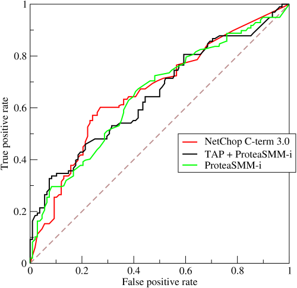

## Table of Contents

## What is a ROC curve and why is it used in machine learning?

A ROC curve, which stands for Receiver Operating Characteristic curve, is a graphical plot that shows the performance of a binary classifier system as its discrimination threshold is varied. It's a way to see how well a model can tell the difference between two classes, like telling apart spam from non-spam emails. The curve is created by plotting the true positive rate (TPR) against the false positive rate (FPR) at various threshold settings. The TPR is also known as sensitivity, and it measures the proportion of actual positives correctly identified. The FPR measures the proportion of actual negatives incorrectly identified as positive. The ideal point on the ROC curve would be at the top left corner, where the TPR is 1 and the FPR is 0, meaning the model perfectly separates the two classes.

ROC curves are used in machine learning because they help us understand the trade-offs between sensitivity and specificity, which is important for choosing the best model and threshold for a specific problem. For example, in medical diagnosis, you might want a test that catches as many true cases as possible (high sensitivity), even if it means more false alarms (higher FPR). The area under the ROC curve (AUC) is a common metric used to summarize the overall performance of the classifier. An AUC of 1 represents a perfect classifier, while an AUC of 0.5 suggests no discriminative power, equivalent to random guessing. By using ROC curves, we can compare different models and make informed decisions about which one to use based on the specific needs of our application.

## How is a ROC curve constructed from a classifier's output?

A ROC curve is made by looking at the scores a classifier gives to examples from two classes. Imagine you have a model that tells you how likely it thinks an example is to be in the positive class. You can set a cutoff point, or threshold, and say that any example with a score above this threshold is positive, and anything below is negative. By changing this threshold from the highest possible score down to the lowest, you can see how well the model does at different levels. At each threshold, you count how many true positives (correctly identified positives) and false positives (incorrectly identified positives) you get. The true positive rate (TPR) is the number of true positives divided by the total number of actual positives, and the false positive rate (FPR) is the number of false positives divided by the total number of actual negatives. You plot these rates on a graph, with FPR on the x-axis and TPR on the y-axis, to make the ROC curve.

To construct the ROC curve, you start with the highest possible threshold, where no examples are classified as positive, so both TPR and FPR are zero. As you lower the threshold, more examples are classified as positive. When you first start classifying examples as positive, they are usually the ones the model is most confident about, so you get true positives before false positives. As you keep lowering the threshold, you'll start to include more false positives, increasing the FPR. You keep doing this until the threshold is so low that all examples are classified as positive, giving you a TPR of 1 and an FPR of 1. Each point on the ROC curve represents a different threshold, showing how the model's performance changes as you adjust the cutoff for deciding what's positive and what's negative.

## What does the area under the ROC curve (AUC) represent?

The area under the ROC curve, or AUC, is a number that tells you how good a classifier is at telling the difference between two classes. It's like a score that goes from 0 to 1, where 1 means the classifier is perfect and can tell the classes apart perfectly, and 0.5 means it's no better than guessing randomly. The AUC is the whole area under the ROC curve, and a bigger area means the classifier is doing a better job.

You can think of the AUC as the chance that the classifier will rank a randomly chosen positive example higher than a randomly chosen negative example. If you pick one example from each class, the AUC is the probability that the classifier will give a higher score to the positive example. This makes the AUC a useful way to compare different classifiers, because it gives you a single number that shows how well they work overall, without needing to pick a specific threshold.

## How can you interpret the shape of a ROC curve?

The shape of a ROC curve can tell you a lot about how well a classifier works. If the curve is closer to the top left corner of the graph, it means the classifier is doing a great job at telling the difference between the two classes. A perfect classifier would have a curve that goes straight up the left side and then straight across the top, making a perfect L shape. The more the curve looks like this L shape, the better the classifier is. If the curve is more like a diagonal line from the bottom left to the top right, it means the classifier is not much better than guessing randomly. This is because a random guess would give you a true positive rate (TPR) and false positive rate (FPR) that increase together in a straight line.

You can also learn about the classifier's performance by looking at how the curve changes. If the curve starts off going up quickly and then levels off, it means the classifier is really good at catching the most obvious positive examples but struggles with the harder ones. On the other hand, if the curve starts off going to the right quickly and then goes up slowly, it means the classifier is making a lot of false positives before it starts correctly identifying the true positives. By studying the shape of the ROC curve, you can understand how the classifier's performance changes as you adjust the threshold for deciding what's positive and what's negative, helping you choose the best way to use the classifier for your specific needs.

## What is the difference between ROC curve and precision-recall curve?

A ROC curve and a precision-recall curve are both used to see how well a classifier works, but they show different things. A ROC curve plots the true positive rate (TPR) against the false positive rate (FPR) at different thresholds. The TPR is how many of the positive examples the classifier correctly finds, and the FPR is how many of the negative examples the classifier wrongly says are positive. The area under the ROC curve (AUC) tells you how good the classifier is overall, with a bigger area meaning it's better. ROC curves are good when you have balanced classes, meaning you have about the same number of positive and negative examples.

A precision-recall curve, on the other hand, plots precision against recall at different thresholds. Precision is how many of the examples the classifier says are positive that are actually positive, and recall is the same as TPR, how many of the positive examples the classifier finds. Precision-recall curves are really useful when you have imbalanced classes, where one class has a lot more examples than the other. They help you see how well the classifier can find the positive examples without getting too many false positives. The area under the precision-recall curve also tells you how good the classifier is, but it focuses more on the positive class.

Both curves help you understand how the classifier's performance changes as you adjust the threshold for deciding what's positive and what's negative. But they give you different views on the classifier's strengths and weaknesses. ROC curves are better for seeing how the classifier balances true positives and false positives, while precision-recall curves are better for understanding how well the classifier finds the positive examples, especially when those examples are rare.

## How do you calculate the True Positive Rate and False Positive Rate for a ROC curve?

To calculate the True Positive Rate (TPR) for a ROC curve, you need to know how many of the positive examples your classifier correctly identifies. The TPR is also called sensitivity or recall. You find it by dividing the number of true positives (TP) by the total number of actual positives. So, if your classifier says 80 out of 100 positive examples are positive, the TPR would be $$ \frac{80}{100} = 0.8 $$ or 80%. This number tells you how good your classifier is at finding the positive examples.

To calculate the False Positive Rate (FPR) for a ROC curve, you need to know how many of the negative examples your classifier wrongly says are positive. The FPR is found by dividing the number of false positives (FP) by the total number of actual negatives. So, if your classifier says 20 out of 200 negative examples are positive, the FPR would be $$ \frac{20}{200} = 0.1 $$ or 10%. This number tells you how often your classifier makes mistakes by calling negative examples positive.

## What are some common thresholds used when analyzing a ROC curve?

When you look at a ROC curve, you often choose a threshold that balances the true positive rate and the false positive rate in a way that works best for your situation. One common threshold is where the true positive rate equals the false positive rate, which happens when the curve crosses the diagonal line from the bottom left to the top right of the graph. This point is called the equal error rate because the rates of correctly identifying positives and wrongly identifying negatives are the same. It's a simple way to pick a threshold when you want to balance the two rates equally.

Another common threshold is chosen based on the specific needs of your problem. For example, if you're trying to detect a rare disease, you might want a high true positive rate even if it means a higher false positive rate. In this case, you would pick a threshold that gives you a high true positive rate, like 90% or more. On the other hand, if false positives are very costly, you might choose a threshold that keeps the false positive rate low, even if it means a lower true positive rate. By looking at the ROC curve, you can see how changing the threshold affects these rates and pick the one that best fits your goals.

## How does class imbalance affect the ROC curve and its interpretation?

Class imbalance, where one class has a lot more examples than the other, can make it harder to understand a ROC curve. When you have a lot more examples of one class, the false positive rate (FPR) can be small even if your classifier is not very good. This is because the FPR is calculated as the number of false positives divided by the total number of actual negatives. If there are many more negatives, a few false positives won't make the FPR go up much. So, the ROC curve might look better than it really is, making it seem like the classifier is doing a good job when it's not.

To deal with class imbalance, you can use a different kind of curve called a precision-recall curve. This curve shows how well the classifier finds the positive examples without getting too many false positives. The precision is the number of true positives divided by the total number of examples the classifier says are positive, and the recall is the same as the true positive rate (TPR). When you have imbalanced classes, the precision-recall curve gives you a better idea of how well the classifier is doing, especially at finding the rarer class. By looking at both the ROC curve and the precision-recall curve, you can get a fuller picture of how your classifier works with imbalanced data.

## Can you explain how to compare the performance of two classifiers using ROC curves?

To compare the performance of two classifiers using ROC curves, you can look at the shape of their curves and the area under the curve (AUC). The AUC is a number between 0 and 1 that tells you how good a classifier is at telling the difference between two classes. A bigger AUC means the classifier is better. If you plot the ROC curves of two classifiers on the same graph, the one with the curve that is closer to the top left corner and has a bigger AUC is the better classifier. For example, if Classifier A has an AUC of 0.85 and Classifier B has an AUC of 0.75, Classifier A is better because its AUC is higher.

You can also compare the classifiers by looking at specific points on their ROC curves. For example, you might want to see which classifier does better at a certain false positive rate (FPR). If you need to keep the FPR below a certain level, like 10%, you can find the true positive rate (TPR) for both classifiers at that FPR and see which one has a higher TPR. The classifier with the higher TPR at that FPR is better for your needs. By looking at the ROC curves and the AUC, you can decide which classifier works best for your specific situation.

## What are some advanced techniques for optimizing the ROC curve in multi-class classification problems?

In multi-class classification problems, optimizing the ROC curve can be tricky because you have more than two classes to think about. One way to handle this is by using the one-vs-rest (OvR) or one-vs-all approach. In this method, you make a separate ROC curve for each class by treating it as the positive class and all the other classes as the negative class. Then, you can look at the area under the curve (AUC) for each class to see how well the classifier does at telling it apart from the others. To get an overall measure of how good the classifier is, you can average the AUCs across all the classes. This gives you a single number that shows how well the classifier works for all the classes together.

Another advanced technique is to use the one-vs-one (OvO) approach. Here, you make a ROC curve for each pair of classes, treating one class as positive and the other as negative. This means you'll have a lot of ROC curves if you have many classes, but it can give you a detailed look at how well the classifier tells each pair of classes apart. You can then combine these curves in different ways to get an overall measure of performance. For example, you might use the average AUC across all the pairs of classes. Both OvR and OvO approaches help you understand and optimize the ROC curve in multi-class problems by breaking them down into simpler binary classification tasks.

## How do confidence intervals apply to ROC curves and what do they indicate?

Confidence intervals help us understand how sure we can be about the performance of a classifier based on its ROC curve. When we make a ROC curve, we're looking at how well the classifier does on the data we have. But we want to know if it will do about the same on new data, too. A confidence interval gives us a range of values that we think the true performance might fall into. For example, if the area under the ROC curve (AUC) is 0.85 with a 95% confidence interval of 0.80 to 0.90, it means we're pretty sure (95% sure) that if we used the classifier on new data, the AUC would be between 0.80 and 0.90.

To find the confidence interval for the AUC, we can use a method called bootstrapping. This means we take our data, mix it up, and make new sets of data from it many times. We then make a ROC curve and find the AUC for each of these new sets. By looking at all these AUCs, we can see how much they change and use that to figure out the confidence interval. If the confidence interval is small, it means we're pretty sure about the classifier's performance. If it's big, it means the performance might be different on new data, so we're less sure. Using confidence intervals helps us make better decisions about whether to use a classifier or not.

## What are the limitations and criticisms of using ROC curves for model evaluation?

Using ROC curves for model evaluation has some limitations and criticisms. One big problem is that ROC curves can make a classifier look better than it really is when the classes are imbalanced. If you have a lot more examples of one class than the other, the false positive rate can stay low even if the classifier is not very good. This is because the false positive rate is calculated as the number of false positives divided by the total number of actual negatives. If there are many more negatives, a few false positives won't make the false positive rate go up much. So, the ROC curve might look good, but it might not show how well the classifier finds the rarer class.

Another criticism is that ROC curves don't always tell you what you need to know for your specific problem. The area under the ROC curve (AUC) is a single number that shows how good the classifier is overall, but it doesn't tell you how well it does at the thresholds you care about. For example, if you're trying to detect a rare disease, you might want a high true positive rate even if it means a higher false positive rate. But the ROC curve doesn't tell you how to choose the best threshold for your needs. Instead, you might need to look at other measures, like precision and recall, to understand how the classifier works in a way that matters for your situation.

## References & Further Reading

[1]: Fawcett, T. (2006). ["An introduction to ROC analysis."](https://www.sciencedirect.com/science/article/pii/S016786550500303X) Pattern Recognition Letters, 27(8), 861-874.

[2]: Bradley, A. P. (1997). ["The use of the area under the ROC curve in the evaluation of machine learning algorithms."](https://www.sciencedirect.com/science/article/abs/pii/S0031320396001422) Pattern Recognition, 30(7), 1145-1159.

[3]: Davis, J., & Goadrich, M. (2006). ["The relationship between Precision-Recall and ROC curves."](https://dl.acm.org/doi/10.1145/1143844.1143874) Proceedings of the 23rd international conference on Machine learning.

[4]: Fawcett, T., & Provost, F. (1997). ["Adaptive fraud detection."](https://link.springer.com/article/10.1023/A:1009700419189) Data Mining and Knowledge Discovery, 1(3), 291-316.

[5]: Krzanowski, W.J., & Hand, D.J. (2009). ["ROC Curves for Continuous Data."](https://www.taylorfrancis.com/books/mono/10.1201/9781439800225/roc-curves-continuous-data-wojtek-krzanowski-david-hand) CRC Press.