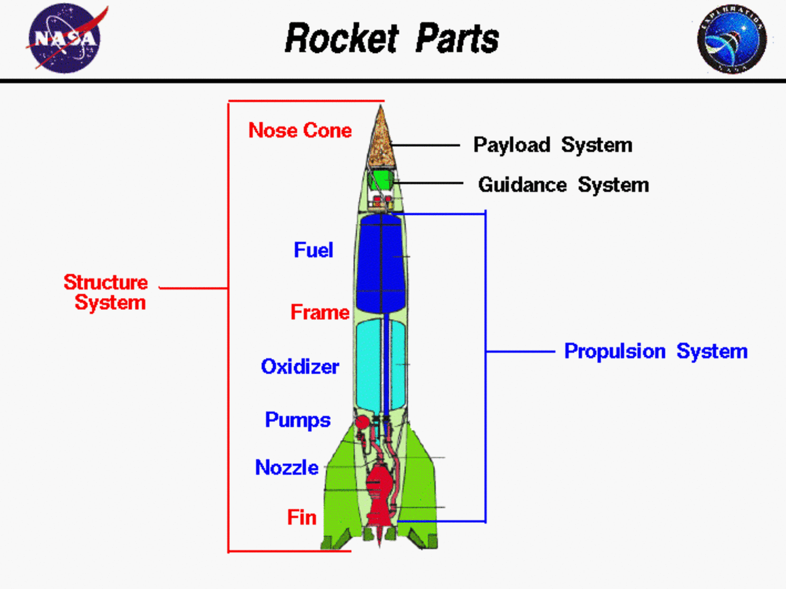

## Table of Contents

## What is a rocket scientist?

A rocket scientist is a person who studies and works on rockets and spacecraft. They use science and math to design, build, and launch rockets into space. Rocket scientists work on making rockets go faster, carry more weight, and reach far away places like other planets.

Rocket scientists often work for space agencies like NASA or private companies like SpaceX. They might work on different parts of a rocket, like the engines or the guidance systems. They need to know a lot about physics, engineering, and sometimes even computer programming to do their job well.

## What educational background is required to become a rocket scientist?

To become a rocket scientist, you need to go to college and study a lot. Usually, you start by getting a bachelor's degree in something like aerospace engineering, mechanical engineering, or physics. These degrees help you learn about the science and math you need to understand rockets. After your bachelor's degree, many rocket scientists go on to get a master's degree or even a Ph.D. These higher degrees let you learn even more and do research that can help improve rocket technology.

Besides school, you might also need to get some experience. This could mean working as an intern at a space company or doing research projects in college. Experience helps you learn how to solve real problems that come up when building and launching rockets. Some rocket scientists also need to learn about computer programming because they use computers to design and test rockets. So, school and experience together help you become a good rocket scientist.

## What are the primary roles of a rocket scientist?

A rocket scientist's main job is to design and build rockets that can fly into space. They use their knowledge of science and math to make sure the rockets work well. They might work on different parts of the rocket, like the engines that make it go, the fuel that powers it, or the guidance systems that help it stay on track. Rocket scientists also use computers to create models and run tests to see how the rocket will perform before it's built.

Another important part of a rocket scientist's job is to solve problems. Sometimes things don't go as planned, and they need to figure out why and how to fix it. They might work with other engineers and scientists to come up with new ideas and improve the rockets. This could mean making the rockets faster, able to carry more weight, or able to reach new places in space. Their work helps make space travel safer and more efficient.

## What are the key responsibilities of a rocket scientist in a project?

A rocket scientist's main job in a project is to design and build rockets that can fly into space. They use their knowledge of science and math to make sure the rockets work well. They might work on different parts of the rocket, like the engines that make it go, the fuel that powers it, or the guidance systems that help it stay on track. Rocket scientists also use computers to create models and run tests to see how the rocket will perform before it's built.

Another important part of a rocket scientist's job is to solve problems. Sometimes things don't go as planned, and they need to figure out why and how to fix it. They might work with other engineers and scientists to come up with new ideas and improve the rockets. This could mean making the rockets faster, able to carry more weight, or able to reach new places in space. Their work helps make space travel safer and more efficient.

In a project, a rocket scientist also has to communicate well with their team. They need to explain their ideas and plans clearly so everyone can work together. They might also need to write reports and give presentations about their work. This helps everyone understand what they are doing and why it's important.

## How does a rocket scientist contribute to the design of a rocket?

A rocket scientist plays a big role in designing a rocket. They use their knowledge of science and math to figure out how to make the rocket work well. They might focus on different parts of the rocket, like the engines that make it go, the fuel that powers it, or the guidance systems that help it stay on track. They use computers to create models and run tests to see how the rocket will perform before it's built. This helps them make sure the design is good and will work in space.

Another important job of a rocket scientist is to solve problems that come up during the design process. Sometimes things don't go as planned, and they need to figure out why and how to fix it. They work with other engineers and scientists to come up with new ideas and improve the design. This could mean making the rocket faster, able to carry more weight, or able to reach new places in space. Their work helps make the rocket better and more reliable for space travel.

## What role does a rocket scientist play in rocket propulsion systems?

A rocket scientist plays a very important role in designing rocket propulsion systems. These systems are what make the rocket go. The rocket scientist uses their knowledge of science and math to figure out how to make the engines work well. They might work on the design of the engines, the type of fuel to use, and how to control the thrust. They use computers to create models and run tests to see how the propulsion system will work before it's built. This helps them make sure the rocket can fly into space safely and efficiently.

Another big part of a rocket scientist's job is to solve problems that come up with the propulsion system. Sometimes things don't go as planned, and they need to figure out why and how to fix it. They work with other engineers and scientists to come up with new ideas and improve the propulsion system. This could mean making the engines more powerful, using different fuels, or finding ways to make the rocket go faster. Their work helps make the rocket's propulsion system better and more reliable for space travel.

## How do rocket scientists ensure the safety and reliability of rocket launches?

Rocket scientists work hard to make sure rockets are safe and reliable before they launch. They use computers to create models and run lots of tests. These tests help them see how the rocket will work before it's built. They check everything from the engines to the fuel to the guidance systems. If they find any problems, they fix them. This way, they make sure the rocket can fly into space without any issues.

Another way rocket scientists ensure safety is by working with a team. They talk to other engineers and scientists to share ideas and solve problems. If something goes wrong during a test, they figure out why and how to fix it. They might change the design or use different materials to make the rocket stronger and safer. By working together, they make sure the rocket is ready for a successful launch.

## What are the challenges faced by rocket scientists in developing new rocket technologies?

Rocket scientists face many challenges when they try to develop new rocket technologies. One big challenge is making the rockets more powerful while keeping them light. They need to find new materials and fuels that can do this. It's hard because if the rocket is too heavy, it won't be able to reach space. If the rocket is too weak, it might break during the launch. Rocket scientists have to test a lot to find the right balance.

Another challenge is making the rockets safer and more reliable. Rockets are very complex, and many things can go wrong. Rocket scientists need to think about every part of the rocket and how it might fail. They use computers to run tests and simulations to find problems before they happen. But even with all this testing, sometimes new issues come up during real launches. Rocket scientists have to be ready to solve these problems quickly to keep everyone safe and make sure the mission succeeds.

Working together with other scientists and engineers is also a challenge. Rocket scientists need to communicate well and share ideas. They have to work as a team to come up with new solutions and improve the rockets. This can be hard because everyone has different ideas and opinions. But by working together, they can make the rockets better and more successful.

## How do rocket scientists collaborate with other professionals in the aerospace industry?

Rocket scientists work closely with other professionals in the aerospace industry to make rockets better. They often team up with engineers who specialize in different parts of the rocket, like the engines or the guidance systems. By sharing their knowledge and ideas, they can solve problems and come up with new ways to improve the rocket's design. For example, a rocket scientist might work with a materials engineer to find stronger, lighter materials for the rocket's body. This teamwork helps make the rocket safer and more efficient.

They also collaborate with computer programmers and software developers. These professionals help create the software that controls the rocket's systems and runs the simulations that rocket scientists use to test their designs. Rocket scientists need to explain their needs clearly so the programmers can build the right tools. Good communication is important because it helps everyone understand the goals and work together smoothly. This collaboration is key to making sure the rocket performs well during its mission.

In addition to engineers and programmers, rocket scientists work with other scientists, like physicists and chemists. These experts help with understanding the science behind rocket propulsion and materials. For instance, a chemist might help develop new fuels that burn more efficiently. By working together, rocket scientists and these other professionals can push the boundaries of what's possible in space travel. This teamwork is essential for developing new technologies and achieving successful rocket launches.

## What advanced skills and knowledge are essential for a rocket scientist at an expert level?

An expert rocket scientist needs to know a lot about many different things. They need to understand advanced physics, especially the parts that deal with how rockets move and work. They also need to know a lot about engineering, like how to design strong and light structures, and how to make engines that are powerful but safe. Computer skills are also very important. They use computers to make models of rockets and run tests to see how they will work in space. They also need to know how to program computers because the software they use is very complex. 

Besides all this, an expert rocket scientist needs to be good at solving problems. They have to think of new ways to make rockets better and fix any issues that come up. This means they need to be creative and good at working with others. They work with other engineers and scientists to share ideas and come up with solutions. They also need to be good at explaining their ideas clearly so everyone understands. This helps the whole team work together to make the rocket safe and successful.

## How do rocket scientists stay updated with the latest advancements in rocket science?

Rocket scientists stay updated with the latest advancements in rocket science by reading a lot. They read scientific papers, journals, and books that talk about new ideas and discoveries. They also go to conferences where other scientists share their work. At these conferences, they can learn about new technologies and meet other people who are working on similar projects. This helps them stay on top of what's happening in the field.

Another way rocket scientists keep up with new advancements is by working with others. They often work in teams with other engineers and scientists. By talking to their colleagues, they can learn about new methods and tools that are being used. They also join professional groups and online communities where they can ask questions and share information. This teamwork and communication help them stay informed about the latest developments in rocket science.

## What are the future prospects and emerging trends in rocket science that experts should be aware of?

Rocket scientists should keep an eye on reusable rocket technology, which is becoming more important. Companies like SpaceX are working on rockets that can fly into space and then come back to Earth to be used again. This can save a lot of money and make space travel more common. Another trend is the use of new fuels, like liquid methane, which can be more efficient and easier to handle than traditional fuels. Rocket scientists need to learn about these new fuels and how to use them safely.

Another big trend is the development of smaller, cheaper rockets. These "small-sat" launchers can put small satellites into space for less money. This is important because more and more people and companies want to use satellites for things like internet, weather, and communication. Rocket scientists should also know about new materials that are lighter and stronger, which can help make rockets better. By staying updated on these trends, rocket scientists can help make space travel safer, cheaper, and more common.

## What does Aerospace Engineering encompass beyond just rocket science?

Aerospace engineering is a broad discipline that encompasses the design, development, and production of both aircraft and spacecraft, extending far beyond merely rocket science. The field encompasses several specialized areas that together make up the foundation of modern aerospace engineering. These include aerodynamics, materials science, avionics, and control systems.

Aerodynamics is the study of the behavior of air as it interacts with solid objects, such as an aircraft. It plays a critical role in the design of both aircraft and spacecraft by influencing factors like lift, drag, and stability. Lift can be calculated using the formula:

$$
L = \frac{1}{2} \cdot \rho \cdot V^2 \cdot A \cdot C_L
$$

where $L$ is lift, $\rho$ is air density, $V$ is velocity, $A$ is the wing area, and $C_L$ is the lift coefficient. The minimization of drag ensures the aerodynamic efficiency of flight, which is essential for fuel economy and overall performance.

Materials science in aerospace engineering involves the study of various materials to determine their suitability for different components of the aircraft or spacecraft. Engineers focus on materials that can withstand high stresses, extreme temperatures, and corrosive environments. Composite materials, such as carbon fiber-reinforced polymers, offer strength and light weight, which are crucial for improving the fuel efficiency and performance of aerospace vehicles.

Avionics, or aviation electronics, encompass the electronic systems used in aircraft, artificial satellites, and spacecraft. These systems play a vital role in navigation, communication, and control of the vehicle. Advanced avionics systems integrate sensors, processors, and communication modules, enabling timely and precise responses to various flight conditions and objectives.

Control systems in aerospace engineering are critical for maintaining the desired trajectory and stability of an aircraft or spacecraft. These systems use a combination of sensors, actuators, and control algorithms to regulate parameters like speed, altitude, and orientation. Advanced control systems often utilize feedback loops and adaptive control laws to handle dynamic and unpredictable changes in the environment.

Aerospace projects demand a strong foundation in physics, engineering, and computational methods to confront and solve complex challenges. Engineers must consider various aspects, such as lift, drag, stability, and propulsion, at every stage of design and development. Computational tools, like computational fluid dynamics (CFD), allow engineers to simulate the behavior of aircraft and spacecraft under different conditions, optimizing their designs for better efficiency and performance.

Through its reliance on interdisciplinary knowledge and cutting-edge technologies, aerospace engineering continues to advance the exploration and utilization of airspace and outer space, pushing the boundaries of what is humanly possible.

## What is the modern role of 'rocket scientists' in quantitative finance?

Financial quants, often colloquially referred to as 'rocket scientists' due to their rigorous analytical backgrounds, play a pivotal role in modern finance. Their work is deeply rooted in the application of complex mathematical models and advanced simulations, similar to those employed in aerospace engineering.

These quants predominantly focus on managing financial risks and developing precise pricing strategies for derivatives. Derivatives, such as options and futures, require sophisticated models to accurately determine their value over time under varying market conditions. Models like the Black-Scholes equation are a testament to the mathematical depth needed in this domain. The Black-Scholes model, for instance, is expressed as:

$$
C(S, t) = N(d_1)S - N(d_2)Ke^{-r(T-t)}
$$

where:
- $C$ is the call option price,
- $S$ is the current stock price,
- $K$ is the strike price,
- $T$ is the time to expiration,
- $r$ is the risk-free interest rate,
- $N$ is the cumulative distribution function of the standard normal distribution,
- $d_1$ and $d_2$ are intermediary calculations involving $\ln{\left(\frac{S}{K}\right)}$, $r$, $\sigma$ (volatility), and $T$.

A significant portion of quantitative finance is dedicated to [algorithmic trading](/wiki/algorithmic-trading). This involves creating strategies that automate trading processes based on intricate mathematical instructions and data analytics. Algorithmic trading systems are designed to analyze vast data sets and execute trades at speeds that far surpass human capabilities. This relies on models that not only forecast market trends but also adapt to fuel dynamic decision-making.

The integration of big data and computer technologies propels algorithmic trading. Techniques such as [machine learning](/wiki/machine-learning) allow for pattern recognition in historical data, enhancing predictive accuracy. Consider a simple linear regression model used for predicting stock prices. In Python, this could be implemented using:

```python
import numpy as np
from sklearn.linear_model import LinearRegression

# Sample data
X = np.array([[1], [2], [3], [4], [5]])
y = np.array([2, 4, 5, 4, 6])

# Linear regression model
model = LinearRegression().fit(X, y)

# Predicting future stock prices
future_values = np.array([[6], [7]])
predictions = model.predict(future_values)
```

Here, the model fits a line to historical price data, which can then be used to predict future price movements.

Quantitative finance also benefits from high-frequency trading ([HFT](/wiki/high-frequency-trading-strategies)), which defines the cutting edge of the confluence between computer science and finance. HFT algorithms are designed to capitalize on minute market inefficiencies within fractions of a second. Such operations demand immense computing power and accuracy, paralleling the challenges of synchronizing complex systems seen in aerospace engineering.

Overall, financial quants leverage their expertise to push the boundaries of what's possible in finance, employing their scientific background to solve complex financial challenges, manage risks, and ensure precise execution of automated trading strategies.

## References & Further Reading

[1]: Prigent, J. L. (2007). ["Portfolio Optimization and Performance Analysis"](https://www.taylorfrancis.com/books/mono/10.1201/9781420010930/portfolio-optimization-performance-analysis-jean-luc-prigent). Springer.

[2]: Hull, J. C. (2012). ["Options, Futures, and Other Derivatives"](https://www.semanticscholar.org/paper/Options%2C-Futures%2C-and-Other-Derivatives-Hull/89bdee500c8623864fc9eb7a471546aa713acc44). Pearson.

[3]: Lewis, R. W., Nithiarasu, P., & Seetharamu, K. N. (2004). ["Fundamentals of the Finite Element Method for Heat and Fluid Flow"](https://onlinelibrary.wiley.com/doi/pdf/10.1002/0470014164.fmatter). Wiley.

[4]: Hochkirchen, T. (1999). ["Validation of Aerodynamic Models"](https://informs-sim.org/wsc99papers/092.PDF). AIAA.

[5]: Oberlechner, T. (2005). ["The Psychology of the Foreign Exchange Market"](https://www.wiley.com/en-us/The+Psychology+of+the+Foreign+Exchange+Market-p-9780470012017). Wiley.

[6]: Manolakis, D. G., & Ingle, V. K. (2007). ["Applied Digital Signal Processing: Theory and Practice"](https://assets.cambridge.org/97805211/10020/frontmatter/9780521110020_frontmatter.pdf). Cambridge University Press.

[7]: Black, F., & Scholes, M. (1973). ["The Pricing of Options and Corporate Liabilities"](https://www.cs.princeton.edu/courses/archive/fall09/cos323/papers/black_scholes73.pdf). Journal of Political Economy, 81(3), 637-654.

[8]: Cavers, J. K. (2003). ["Mobile Channel Characteristics"](https://link.springer.com/book/10.1007/b117786). Springer.