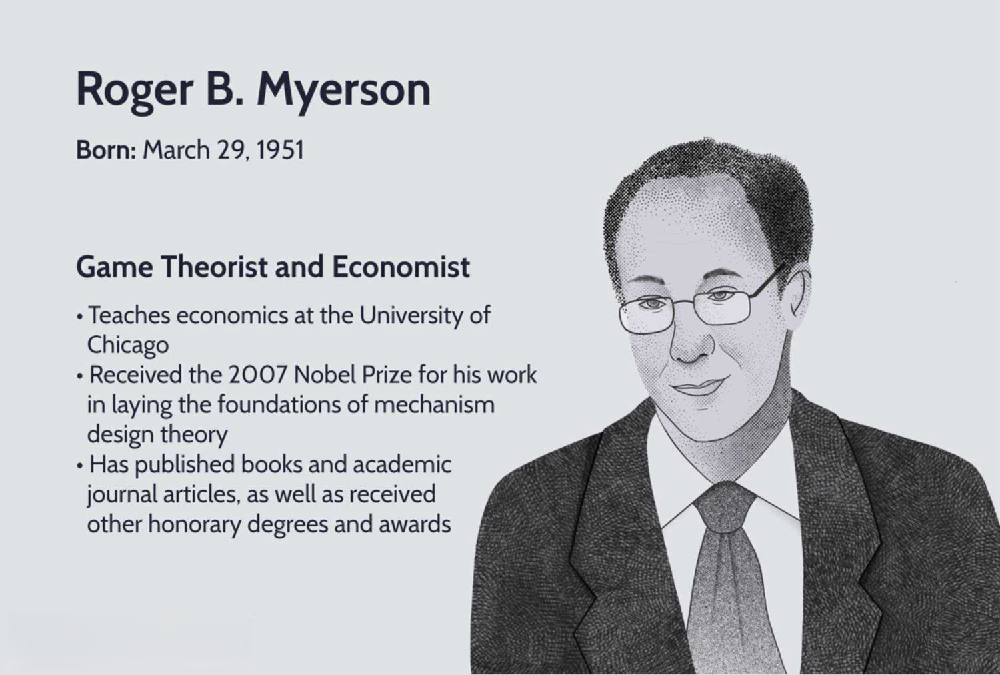

## Table of Contents

## Who is Roger B. Myerson?

Roger B. Myerson is an American economist and a professor at the University of Chicago. He was born on March 29, 1951, in Boston, Massachusetts. Myerson is well-known for his work in game theory and mechanism design, which are important parts of economics. He won the Nobel Prize in Economic Sciences in 2007 for his contributions to these fields. He shared the prize with Leonid Hurwicz and Eric Maskin.

Myerson's work helps explain how people make decisions when they are affected by others' choices. His research has been used in many areas, like designing auctions and voting systems. One of his famous ideas is the "revelation principle," which helps design systems where people tell the truth. His work has had a big impact on how economists think about markets and how to make them work better.

## What is Roger B. Myerson's educational background?

Roger B. Myerson went to school at Harvard University. He started there in 1969 and finished his bachelor's degree in applied mathematics in 1973. He liked math and wanted to use it to understand how people make choices.

After Harvard, Myerson went to the Massachusetts Institute of Technology, or MIT. He studied economics there and got his Ph.D. in 1976. His time at MIT helped him learn a lot about game theory and mechanism design, which he later used in his important work.

## What are some of Roger B. Myerson's major contributions to economics?

Roger B. Myerson made big contributions to economics by working on game theory and mechanism design. Game theory helps us understand how people make choices when they affect each other. Myerson's work showed how to design rules so that people would make good choices. One of his famous ideas is the "revelation principle," which helps create systems where people tell the truth. This is useful for making auctions and voting systems that work well.

Myerson's ideas have been used in many places. For example, they help design auctions where companies bid to build things like roads or bridges. His work also helps make voting systems that are fair and honest. Because of his important work, Myerson won the Nobel Prize in Economic Sciences in 2007, along with Leonid Hurwicz and Eric Maskin. His work has changed how economists think about markets and how to make them work better.

## What is the significance of Roger B. Myerson's work on mechanism design?

Roger B. Myerson's work on mechanism design is very important because it helps create systems where people make good choices. Mechanism design is about setting up rules so that people will do what is best for everyone. Myerson's big idea, called the "revelation principle," helps make systems where people tell the truth. This is useful for things like auctions and voting. In auctions, his ideas help make sure that the best company wins the bid to build something like a road or a bridge. In voting, his work helps make sure that the system is fair and honest.

Myerson's work has changed how economists think about markets and how to make them work better. By understanding how people make choices, we can design rules that help everyone. His ideas have been used in many places, like in government and business. Because his work is so important, he won the Nobel Prize in Economic Sciences in 2007. Myerson's ideas help us build a world where people can make choices that are good for everyone.

## Can you explain Roger B. Myerson's role in the development of auction theory?

Roger B. Myerson played a big part in developing auction theory. Auctions are when people bid to buy something, like a house or a contract to build a road. Myerson's work helped make auctions better by showing how to set up rules so that the best person wins. He used game theory to understand how people bid in auctions and how to make sure they tell the truth about what they want.

One of Myerson's big ideas is the "revelation principle." This idea helps design auctions where people say what they really want, which makes the auction fair and honest. His work has been used to design auctions for things like radio frequencies and public projects. By making auctions better, Myerson's ideas help make sure that the best company gets the job, which is good for everyone.

## What awards has Roger B. Myerson received for his work?

Roger B. Myerson has received many important awards for his work in economics. The biggest one is the Nobel Prize in Economic Sciences, which he won in 2007. He shared this prize with Leonid Hurwicz and Eric Maskin. They got it for their work on mechanism design, which is about making rules so that people make good choices.

Myerson has also won other awards. In 1986, he got thelan Prize from the American Economic Association for his work on game theory. This award is given to young economists who have done great work. These awards show how important Myerson's ideas are for understanding how people make choices and how to make markets work better.

## How has Roger B. Myerson influenced the field of political economy?

Roger B. Myerson has made a big impact on political economy by using his ideas from game theory and mechanism design. He has shown how to design voting systems that are fair and honest. His work helps us understand how people make choices in elections and how to make sure that the system works well for everyone. Myerson's ideas have been used to improve how governments make decisions and how they can be more open and fair.

One of Myerson's important contributions to political economy is his work on how to design systems where people tell the truth. This is called the "revelation principle." It helps make voting systems where people say what they really want, which makes the system more honest. His ideas have been used to think about how to make elections better and how to make sure that the government listens to what people want. Myerson's work has changed how we think about politics and how to make it work better for everyone.

## What is Roger B. Myerson's approach to game theory?

Roger B. Myerson's approach to game theory focuses on how people make choices when they are affected by others' decisions. He uses math to understand these choices and how they lead to different outcomes. Myerson's work shows that by designing the right rules, people can be encouraged to make choices that are good for everyone. This is important in many areas, like auctions and voting systems, where people need to make decisions together.

One of Myerson's big ideas in game theory is the "revelation principle." This idea helps design systems where people tell the truth about what they want. By using this principle, Myerson showed how to make auctions and voting systems that are fair and honest. His work has changed how economists think about how people make choices and how to make markets and political systems work better for everyone.

## Can you describe Roger B. Myerson's impact on the study of voting systems?

Roger B. Myerson has made a big impact on the study of voting systems by using game theory and mechanism design. He has shown how to design voting systems that are fair and honest. Myerson's work helps us understand how people make choices in elections and how to make sure that the system works well for everyone. He uses math to figure out how people vote and how to make the voting process better.

One of Myerson's important ideas is the "revelation principle." This idea helps make voting systems where people tell the truth about what they want. By using this principle, Myerson showed how to design elections that are more honest and fair. His work has been used to think about how to make elections better and how to make sure that the government listens to what people want. Myerson's ideas have changed how we think about voting and how to make it work better for everyone.

## What are some of the practical applications of Roger B. Myerson's theories?

Roger B. Myerson's theories have been used in many practical ways. One big use is in auctions. His ideas help make auctions where companies bid to build things like roads or bridges. By using Myerson's "revelation principle," these auctions can be designed so that companies tell the truth about what they can do. This makes sure that the best company wins the bid, which is good for everyone. Governments and businesses use these ideas to make sure they get the best deals.

Another practical use of Myerson's work is in voting systems. His theories help design elections that are fair and honest. By using the "revelation principle," voting systems can be made so that people tell the truth about what they want. This makes the election process more honest and helps make sure that the government listens to what people really want. Myerson's ideas have helped make voting better in many places around the world.

## How does Roger B. Myerson's work relate to the concept of incentive compatibility?

Roger B. Myerson's work is very important for understanding incentive compatibility. Incentive compatibility means setting up rules so that people want to tell the truth and make good choices. Myerson's "revelation principle" is a big part of this. It helps design systems where people are better off if they are honest about what they want. This idea is used in auctions and voting systems to make sure that people do what is best for everyone.

Myerson's ideas help make sure that the rules of a game or system encourage people to act in ways that are good for the group. In auctions, his work helps make sure that companies bid honestly, so the best company wins the job. In voting, his theories help make elections where people vote for what they really want, making the results more fair. By using incentive compatibility, Myerson's work has made markets and political systems work better for everyone.

## What current research or projects is Roger B. Myerson involved in?

Roger B. Myerson is still working on important projects at the University of Chicago. He is thinking about how to make voting systems better. He wants to find new ways to make sure that elections are fair and that people can trust the results. Myerson is also looking at how to use game theory to help solve problems in politics and government. He is trying to figure out how to make rules that help everyone make good choices.

Another area Myerson is working on is how to make markets work better. He is using his ideas about auctions to help governments and businesses make good deals. Myerson wants to find new ways to use his "revelation principle" to make sure that people tell the truth in auctions. This can help make sure that the best company wins the job, which is good for everyone. His work is still very important for making the world a better place.

## References & Further Reading

[1]: Myerson, R. B. (1991). ["Game Theory: Analysis of Conflict."](https://www.jstor.org/stable/j.ctvjsf522) Harvard University Press.

[2]: Myerson, R. B. (1981). "Optimal Auction Design." *Mathematics of Operations Research*, 6(1), 58-73. [JSTOR](https://www.cs.princeton.edu/courses/archive/spr09/cos444/papers/myerson81.pdf).

[3]: Nisan, N., Roughgarden, T., Tardos, É., & Vazirani, V. V. (2007). ["Algorithmic Game Theory."](https://www.cs.cmu.edu/~sandholm/cs15-892F13/algorithmic-game-theory.pdf) Cambridge University Press.

[4]: Maskin, E., & Myerson, R. (2003). "Mechanism Design: How to Implement Social Goals." In *Proceedings of the National Academy of Sciences*, 100(19), 10532-10537. [PNAS](https://www.jstor.org/stable/29730086).

[5]: "Roger Myerson - Facts." NobelPrize.org. Nobel Media AB 2021. [Nobel Prize: Roger Myerson](https://www.nobelprize.org/prizes/economic-sciences/2007/myerson/facts/).

[6]: Myerson, R. B. (1999). ["Nash Equilibrium and the History of Economic Theory."](https://www.jstor.org/stable/2564872) *Journal of Economic Literature*, 37(3), 1067-1082.

[7]: "Stanford Encyclopedia of Philosophy: Game Theory." [Stanford Encyclopedia of Philosophy](https://plato.stanford.edu/entries/game-theory/).

[8]: Kissell, R. (2013). ["The Science of Algorithmic Trading and Portfolio Management."](https://www.sciencedirect.com/book/9780124016897/the-science-of-algorithmic-trading-and-portfolio-management) Academic Press.