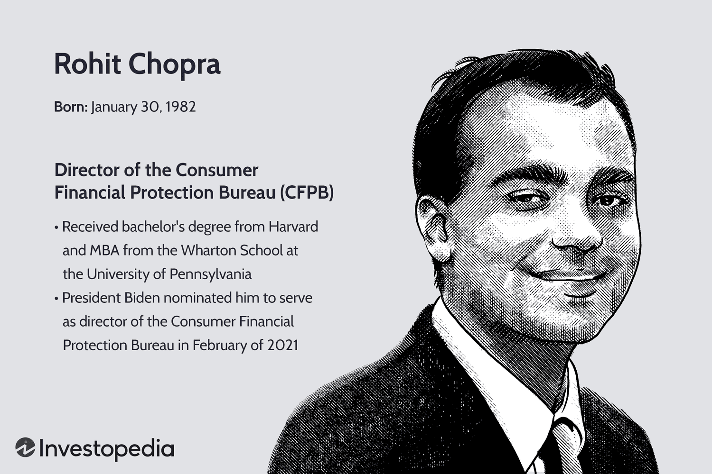

Rohit Chopra is a distinguished figure in the realms of consumer finance and regulation, holding the position of Director at the Consumer Financial Protection Bureau (CFPB). His leadership has been pivotal in driving robust regulatory measures in financial markets, thereby strengthening protections for American consumers. Chopra's trajectory from an academically accomplished individual to a vital component of financial regulation underscores his influential early life and career development. This article explores Chopra's origins, including his significant roles at CFPB and his influential contributions to the regulation of algorithmic trading. His work reflects a clear commitment to ensuring equitable practices within evolving financial landscapes, safeguarding consumer interests amidst the complexities of modern financial systems.

## Table of Contents

## Early Life and Education

Born on January 30, 1982, in Plainsfield, New Jersey, Rohit Chopra grew up in an Indian-American family. Throughout his formative years, his cultural background and family values influenced his perspectives and ambitions. Chopra's academic journey began at Harvard University, where he pursued a Bachelor's degree. During his tenure at Harvard, he stood out for his strong advocacy skills, eventually becoming the student body president. This role provided him with an early platform to hone leadership qualities that would be instrumental in his professional life. His leadership at Harvard was characterized by initiatives aimed at enhancing student experiences and promoting inclusivity within the university community.

After completing his undergraduate education, Chopra continued to build on his academic prowess by obtaining an MBA from the Wharton School of the University of Pennsylvania. Wharton, known for its robust focus on finance and management, offered Chopra a comprehensive education that blended theoretical knowledge with practical insights. This advanced education in business administration served as a pivotal stepping stone, equipping him with the strategic and analytical skills necessary for his future endeavors in financial regulation and advocacy. His time at Wharton not only expanded his understanding of complex financial systems but also solidified his commitment to fostering equitable financial practices.

## Career Beginnings and McKinsey & Company

Rohit Chopra's early professional journey began with a significant tenure at McKinsey & Company. During his time there, he was involved in diverse sectors, including financial services, healthcare, and consumer technology. These were not arbitrary choices but sectors undergoing rapid evolution, demanding fresh perspectives and innovative solutions.

At McKinsey, Chopra honed his analytical skills, which are crucial for navigating the complexities inherent in modern financial systems. The firm's rigorous analytical approach and emphasis on strategic problem-solving equipped him with a robust toolkit for addressing multifaceted challenges. This experience was instrumental in preparing Chopra for his future roles in public service, which required a deep understanding of financial dynamics and consumer protection mechanisms.

His projects at McKinsey showcased his ability to dissect complex issues and provide actionable recommendations—a skill he would later utilize in regulatory frameworks. The exposure to a wide range of industries enabled him to appreciate how interconnected and nuanced the financial world is, underscoring the importance of comprehensive regulatory measures. These insights laid a strong foundation for his impactful work in government positions, particularly at the Consumer Financial Protection Bureau (CFPB), where his efforts focused on optimizing consumer financial markets and advocating for consumer rights.

## Role at the Consumer Financial Protection Bureau (CFPB)

Rohit Chopra's tenure at the Consumer Financial Protection Bureau (CFPB) began in 2010, marking the start of a significant period in his career dedicated to addressing student loan issues. As the first-ever student loan ombudsman, Chopra was appointed at a time when student loan debt was burgeoning into a critical national issue. His mandate was to oversee the student lending market and advocate for borrowers' rights, a role he fulfilled with a focus on transparency and borrower protection.

Chopra's impact at the CFPB was profound, as he became well-known for actively working to secure financial redress for borrowers who were victims of deceptive lending practices. This included negotiating settlements that returned millions of dollars to students who had been misled or unfairly charged by lenders. His advocacy efforts extended to promoting competitive markets for student loans, seeking to ensure that borrowers had access to fair lending terms and conditions.

Under his guidance, the CFPB developed and implemented new policies aimed at increasing accountability among student loan servicers and lenders. This included enhancing the oversight of loan servicing companies and ensuring compliance with consumer protection laws. By pushing for better disclosure of loan terms and strengthening consumer education, Chopra helped the agency build a framework that sought to keep the student loan industry in check and safeguard the financial interests of millions of American students.

## Contribution to Algorithmic Trading Regulations

Rohit Chopra has played a significant role in advancing regulations on financial technologies, particularly in [algorithmic trading](/wiki/algorithmic-trading). As the director of the Consumer Financial Protection Bureau (CFPB), Chopra has emphasized the need for transparency and fairness in automated trading systems and algorithms. Algorithmic trading, which involves the use of computer algorithms to execute trades at high speeds, has transformed financial markets, but it poses risks such as market manipulation and unfair advantages for well-resourced entities.

The CFPB, under Chopra's leadership, has been active in addressing these challenges by implementing regulations designed to make algorithmic trading systems more transparent and equitable. One of the central concerns is ensuring these systems do not exploit or discriminate against consumers. The regulations focus on preventing unfair practices, such as algorithmic bias and fraudulent schemes that could undermine consumer trust and distort market operations.

Chopra's initiatives include advocating for more stringent disclosure requirements for algorithmic models used in trading. By mandating that firms provide detailed information about their algorithms, the CFPB aims to promote transparency. The agency also pursues measures to ensure these algorithms are tested for biases and audited regularly to maintain integrity and fairness.

The efforts to regulate algorithmic trading under Chopra are part of a broader initiative to create a level playing field in financial markets. By enforcing regulations that demand fairness and accountability from financial firms using these technologies, the CFPB underlines its commitment to protecting consumers while fostering a competitive market environment. These actions help mitigate risks associated with high-frequency trading and automated decision-making, ensuring that advancements in financial technologies work for the benefit of all market participants rather than a privileged few.

## Challenges and Controversies

Rohit Chopra's tenure as director of the Consumer Financial Protection Bureau (CFPB) has not been without its challenges and controversies. A principal challenge has been navigating the fine line between robust consumer protection and regulatory overreach, as perceived by industry groups. His regulatory efforts, particularly concerning financial technologies, have often been met with resistance by industry stakeholders concerned about the potential stifling impact of stringent regulations on innovation and market dynamics.

One of the main criticisms from these groups centers on the regulatory framework poised to address the burgeoning growth of technologies such as algorithmic trading and fintech. Industry leaders argue that excessive regulation could hinder technological advancements and business efficiency. According to these critics, the implementation of too many controls without considering flexibility and scalability may deter companies from innovating, subsequently impacting the competitive landscape of U.S. financial markets.

Despite this resistance, Chopra maintains a strong focus on consumer protection amidst these evolving financial technologies. He emphasizes that automated financial systems and algorithms must operate transparently and equitably to prevent what he views as unfair market practices. This stance is driven by a mandate to protect consumers from being disadvantaged by opaque financial systems powered by sophisticated technologies they may not fully understand.

Chopra's commitment to consumer rights amidst these challenges reflects a broader strategy to ensure that technological growth does not come at the cost of consumer welfare. Organizations like the Financial Services Roundtable have expressed concern about diminished consumer choice and increased costs, yet Chopra argues these potential downsides are outweighed by the necessity of safeguarding consumer interests in dynamically evolving financial ecosystems.

While navigating these controversies, Chopra continues to advocate for measures that balance consumer protection with promoting innovation and efficiency in financial markets. His goal remains to ensure fairness and transparency are embedded within the fabric of new financial technologies, maintaining a regulatory structure that protects consumers while fostering an environment conducive to technological progress.

## Conclusion

Rohit Chopra's impact on the regulatory framework governing consumer finance in the United States underscores his unwavering commitment to protecting consumer rights. As the director of the Consumer Financial Protection Bureau (CFPB), Chopra has advocated for transparency and fairness in financial transactions, particularly in the context of algorithmic trading. By prioritizing these principles, he has facilitated significant advancements in the adaptation of regulations to accommodate modern financial technologies. 

Chopra's leadership has focused on ensuring that the intricate systems governing algorithmic trading are comprehensible and just for all stakeholders. This approach not only protects consumers but also fosters a competitive and equitable financial market. His regulatory strategies are crafted to prevent predatory practices and ensure that automated systems serve the interests of the broader public, aligning with the evolving landscape of digital finance.

Furthermore, Chopra’s journey signifies a profound dedication to safeguarding consumer interests amidst an increasingly sophisticated financial environment. His efforts represent a strategic response to the challenges posed by rapid technological advancements, reflecting a foresight that is critical for maintaining a balanced and fair financial ecosystem. By continually adapting regulatory measures, Chopra aims to uphold consumer protection as a cornerstone of the financial sector's evolution.

## References & Further Reading

[1]: ["Rohit Chopra Appointed CFPB Director"](https://en.wikipedia.org/wiki/Rohit_Chopra) - Consumer Finance Monitor

[2]: ["Consumer Financial Protection Bureau and Advocate Rohit Chopra"](https://www.consumerfinance.gov/about-us/newsroom/prepared-remarks-of-cfpb-director-rohit-chopra-on-protecting-americans-from-harmful-data-broker-practices/) - The New York Times

[3]: Gomber, P., Arndt, B., Lutat, M., & Uhle, T. (2011). ["High-Frequency Trading."](https://papers.ssrn.com/sol3/papers.cfm?abstract_id=1858626) Business & Information Systems Engineering, 3(2), 67-76.

[4]: ["The Rise of Robo-Advisors and Their Impact"](https://medium.com/@johnmattera/the-rise-of-robo-advisors-fintechs-impact-on-investment-management-bc7705e9bc99) - Journal of Applied Corporate Finance (2019)

[5]: ["Algorithmic Trading and Regulation"](https://papers.ssrn.com/sol3/papers.cfm?abstract_id=3765882) - CFA Institute

[6]: ["High-Frequency Trading: New Realities for Traders, Markets, and Regulators"](https://books.google.com/books/about/High_frequency_Trading.html?id=pli5oAEACAAJ) by Irene Aldridge