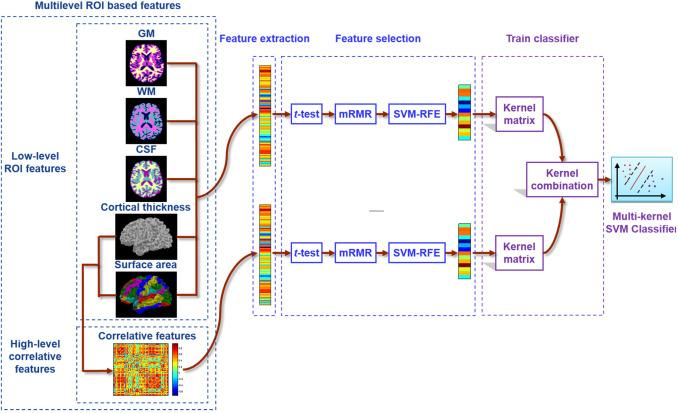

## Table of Contents

## What is an RoI Feature Extractor in the context of machine learning?

In machine learning, an RoI (Region of Interest) Feature Extractor is a tool used in object detection and image recognition tasks. It works by focusing on specific parts of an image, called regions of interest, where objects might be located. The extractor then pulls out important details from these regions, which are used to understand what the objects are. This process helps computers identify and classify objects more accurately by concentrating on relevant parts of the image instead of the whole thing.

A common use of RoI Feature Extractors is in systems like Faster R-CNN (Region-based Convolutional Neural Networks). Here, the extractor takes the regions proposed by a Region Proposal Network and processes them to generate fixed-size feature maps. These maps are then used for classification and bounding box regression. By using RoI Feature Extractors, the system can efficiently handle varying sizes and shapes of objects in an image, making the detection process both faster and more precise.

## How does RoIPool work and what are its main applications?

RoIPool, or Region of Interest Pooling, is a technique used in object detection to handle different sizes and shapes of objects in an image. It works by taking a region of interest (RoI) from the feature map of an image and dividing it into a fixed number of sections, usually a grid like 7x7 or 14x14. For each section, RoIPool finds the highest value, which is called max pooling. This way, no matter the size or shape of the original RoI, it gets turned into a fixed-size feature map. This makes it easier for the next steps in the object detection process, like classifying what the object is and figuring out where it is in the image.

The main applications of RoIPool are in systems like Faster R-CNN, which is a popular method for object detection. In Faster R-CNN, RoIPool helps by taking the regions proposed by the Region Proposal Network and turning them into a consistent format that can be used for further processing. This is important because it allows the system to work with different objects in an image more efficiently. By using RoIPool, the system can handle many objects at once, making it faster and more accurate at detecting and classifying them.

## What are the limitations of RoIPool and how does RoIAlign address them?

RoIPool has some limitations that can affect how well it works in object detection. One big problem is that it uses a method called quantization, which means it rounds the coordinates of the region of interest to whole numbers. This can cause a small misalignment between the region and the feature map, which might lead to losing some important details about the object. Another issue is that RoIPool uses max pooling, which only takes the highest value in each section. This can also lead to losing some details because it doesn't consider the whole area of the section.

RoIAlign is a newer method that was created to solve these problems. It doesn't use quantization, so it keeps the exact coordinates of the region of interest. This means it can look at the feature map more accurately and not lose details because of misalignment. Instead of max pooling, RoIAlign uses bilinear interpolation, which is a way of looking at all the values in a section and figuring out a more accurate value. This helps keep more details about the object, making the detection more precise. By using these techniques, RoIAlign can improve the performance of object detection systems like Mask R-CNN, which is used for both detecting and segmenting objects in images.

## Can you explain the concept of Position-Sensitive RoI Pooling?

Position-Sensitive RoI Pooling is a technique used in object detection that helps the computer understand where different parts of an object are in an image. Imagine you want to find a cat in a picture. Instead of looking at the whole cat at once, position-sensitive RoI pooling breaks the cat into smaller parts like the head, body, and tail. It then looks at each part separately to figure out where they are and how they fit together. This method is useful because it can handle objects that might be partially hidden or in different positions.

In technical terms, position-sensitive RoI pooling works by dividing the feature map into a grid, where each cell in the grid is responsible for a specific part of the object. For example, if you have a 7x7 grid, each cell might be responsible for detecting the top-left corner of the object. When an RoI is selected, it is divided into the same number of sections as the grid, and each section is pooled separately. The final feature map is created by combining the pooled values from each section according to their positions. This approach helps improve the accuracy of object detection by considering the spatial arrangement of the object's parts.

## How does Voxel RoI Pooling differ from traditional RoI Pooling methods?

Voxel RoI Pooling is used in 3D object detection, which is different from traditional RoI Pooling that works with 2D images. In 3D, objects are represented as voxels, which are like tiny 3D cubes. Voxel RoI Pooling takes a 3D region of interest and divides it into smaller 3D sections, called voxels. It then processes these voxels to create a fixed-size feature map, just like traditional RoI Pooling does with 2D images. The main difference is that Voxel RoI Pooling deals with depth as well as height and width, making it useful for detecting objects in 3D space.

Traditional RoI Pooling, on the other hand, works with 2D images and focuses on regions of interest within these images. It divides the 2D region into a grid and uses max pooling to extract the highest value from each section of the grid. This creates a fixed-size feature map that can be used for further processing in object detection tasks. While traditional RoI Pooling is great for 2D images, it can't handle the depth information that Voxel RoI Pooling can, which is why Voxel RoI Pooling is essential for tasks like autonomous driving where understanding the 3D environment is crucial.

## What improvements does Deformable RoI Pooling offer over standard RoI Pooling?

Deformable RoI Pooling improves on standard RoI Pooling by making the regions of interest more flexible. In standard RoI Pooling, the regions are fixed and can't change shape, which can cause problems if the object in the image is not in a perfect rectangle or if it's partially hidden. Deformable RoI Pooling solves this by allowing the regions to change shape and move around a bit. This means it can better fit the actual shape of the object, making the detection more accurate.

The way Deformable RoI Pooling works is by adding small adjustments to the grid used in standard RoI Pooling. These adjustments are learned by the network, so they can adapt to different objects and situations. By doing this, Deformable RoI Pooling can capture more details about the object, even if it's in a tricky position or partially hidden. This makes it a big improvement over standard RoI Pooling, especially in real-world scenarios where objects are often not perfectly aligned or fully visible.

## How does Precise RoI Pooling enhance the accuracy of feature extraction?

Precise RoI Pooling improves the accuracy of feature extraction by making sure that the regions of interest (RoIs) are handled more carefully. In standard RoI Pooling, the RoIs are often rounded to whole numbers, which can cause small misalignments. These misalignments might make the computer miss important details about the object. Precise RoI Pooling fixes this by not rounding the RoIs, so the computer can look at the exact areas it needs to, without losing any details.

By using Precise RoI Pooling, the feature maps that the computer creates are more accurate. This means the computer can better understand what the object is and where it is in the image. Precise RoI Pooling is especially helpful in tasks like object detection, where every little detail can make a big difference in how well the computer can identify and locate objects.

## What is Position-Sensitive RoIAlign and how does it improve upon earlier methods?

Position-Sensitive RoIAlign is a technique that helps computers understand where different parts of an object are in a picture. It's like looking at a puzzle and figuring out where each piece goes. Instead of looking at the whole object at once, Position-Sensitive RoIAlign breaks it into smaller parts, like the head, body, and tail of an animal. By doing this, it can tell exactly where each part is, even if the object is turned or partly hidden. This method uses a grid where each cell in the grid is responsible for a specific part of the object, and it looks at the exact areas without rounding, which helps keep all the important details.

This technique improves on earlier methods like standard RoI Pooling and Position-Sensitive RoI Pooling. Standard RoI Pooling can miss details because it rounds the regions of interest to whole numbers, which can cause small misalignments. Position-Sensitive RoI Pooling helps by focusing on different parts of the object but still uses a fixed grid, which might not fit the object perfectly if it's in a tricky position. Position-Sensitive RoIAlign solves these problems by not rounding the regions and using a more flexible way to look at the object's parts. This makes the computer's understanding of the object more accurate, especially in real-world situations where objects are often not perfectly aligned or fully visible.

## Can you describe the functionality and benefits of BezierAlign in RoI feature extraction?

BezierAlign is a method used to make object detection more accurate by better handling the regions of interest in an image. It uses something called a Bezier curve, which is a smooth curve that can be shaped to fit the outline of an object more closely than a straight line or a fixed grid. By using this curve, BezierAlign can look at the exact areas where the object is, even if it's in a weird position or partly hidden. This helps the computer understand the object's shape and position more accurately, which is important for tasks like self-driving cars or security cameras.

The main benefit of BezierAlign is that it can capture more details about the object. Unlike older methods that might miss important parts because they use fixed grids or straight lines, BezierAlign can adapt to the object's shape. This means the computer can better tell what the object is and where it is in the picture. By being more precise, BezierAlign helps make object detection systems work better in real-life situations where objects are often not perfectly lined up or fully visible.

## What is GRoIE and how does it contribute to more effective feature extraction?

GRoIE stands for Global Reasoning over Region of Interest Extraction. It's a way to make computers better at understanding objects in pictures by looking at the whole image and how different parts connect. Instead of just focusing on small areas, GRoIE thinks about the bigger picture. This helps the computer see how objects relate to each other and their surroundings, which can make it easier to figure out what's in the picture.

By using GRoIE, the computer can pull out more useful details from the image. It does this by considering not just the object itself, but also how it fits into the whole scene. This can lead to more accurate object detection and recognition, especially in busy or complex images where understanding the context is important. So, GRoIE helps the computer make smarter guesses about what it's seeing, making feature extraction more effective.

## How does RoIWarp adapt to different spatial transformations in feature extraction?

RoIWarp is a method used in computer vision to help machines understand objects in pictures even when the objects are turned, stretched, or squished. It does this by changing the shape of the region of interest (RoI) to match how the object looks in the image. Imagine you're trying to fit a piece of paper around a ball. RoIWarp is like figuring out how to bend the paper so it fits perfectly around the ball, no matter how the ball is turned or squeezed.

This flexibility makes RoIWarp really useful for tasks like self-driving cars or security cameras, where objects can be seen from different angles or distances. By adapting the RoI to fit the object's shape and position, RoIWarp helps the computer get a better look at what's important in the image. This leads to more accurate object detection and recognition, making it easier for the computer to understand what it's seeing, even in tricky situations.

## What advancements does Deformable Position-Sensitive RoI Pooling bring to the field of RoI feature extraction?

Deformable Position-Sensitive RoI Pooling is a way to help computers see objects in pictures better, even if the objects are turned or partly hidden. It's like looking at a puzzle and figuring out where each piece goes, but with the added ability to move the pieces around a bit to fit better. This method breaks the object into smaller parts, like the head, body, and tail of an animal, and looks at each part carefully. By doing this, it can tell exactly where each part is, even if the object is in a tricky position. It uses a grid where each cell in the grid is responsible for a specific part of the object, and it can move these cells around to fit the object more closely.

This technique is a big step forward from earlier methods because it can adapt to the shape and position of the object more flexibly. Earlier methods, like standard RoI Pooling, might miss important details because they use fixed grids or straight lines. Deformable Position-Sensitive RoI Pooling solves this by allowing the grid to change shape and move around, which helps the computer understand the object's shape and position more accurately. This makes object detection more precise, especially in real-world situations where objects are often not perfectly aligned or fully visible.